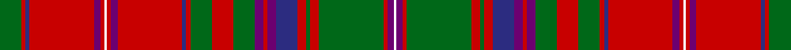

This page is one **sett** — a single exact thread-count. It belongs to the [tartan](/tartans/g10r2db2r30p3r2w1r2p3r30db2r2g10r10g10p4r2p4db10r4g2r4g30r2p3w1/)
(the same proportion at any scale), whose colour order is pattern [GRBRBRWRBRBRGRGBRBBRGRGRBW](/stripes/grbrbrwrbrbrgrgbrbbrgrgrbw/).

Sourced from register-of-tartans.  It is a [26 stripe tartan](/stripes/stripes26/).

Original link https://www.tartanregister.gov.uk/tartanDetails.aspx?ref=2390

## Register references

External register numbers recorded for this tartan.

- Scottish Register of Tartans: [2390](https://www.tartanregister.gov.uk/tartanDetails.aspx?ref=2390)
- Scottish Tartans Authority (ITI): 1519
- Scottish Tartans World Register: 1519

## Thread count
G/20 R4 DB4 R60 P6 R4 W2 R4 P6 R60 DB4 R4 G20 R20 G20 P8 R4 P8 DB20 R8 G4 R8 G60 R4 P6 W/2

## Palette
Each colour and the base-6 reference it is a variant of.

| Colour | Shade | Base |
|---|---|---|
| DB | <code style="background-color:#2C2C80;">#2C2C80</code> `oklch(35.0% 0.138 276.6)` <small>#2C2C80</small> | B <code style="background-color:#2A418A;">#2A418A</code> |
| G | <code style="background-color:#006818;">#006818</code> `oklch(45.0% 0.142 145.0)` <small>#006818</small> | G <code style="background-color:#006100;">#006100</code> |
| P | <code style="background-color:#6C0070;">#6C0070</code> `oklch(37.6% 0.174 326.5)` <small>#6C0070</small> | B <code style="background-color:#2A418A;">#2A418A</code> |
| R | <code style="background-color:#C80000;">#C80000</code> `oklch(52.3% 0.215 29.2)` <small>#C80000</small> | R <code style="background-color:#CC0000;">#CC0000</code> |
| W | <code style="background-color:#FCFCFC;">#FCFCFC</code> `oklch(99.1% 0.000 89.9)` <small>#FCFCFC</small> | W <code style="background-color:#F7F7F7;">#F7F7F7</code> |

## Nearest tartans

The nearest existing variants by ΔTartan distance, with this tartan at the top so the swatches line up against it.

ΔTartan

Tartan

Sett

—

<a href="/ttd/edit/#slug=g10r2db2r30dp3r2w1r2dp3r30db2r2g10r10g10dp4r2dp4db10r4g2r4g30r2dp3w1~x2">MacDougal</a> <a class="nn-out" href="/setts/s26/g10r2db2r30dp3r2w1r2dp3r30db2r2g10r10g10dp4r2dp4db10r4g2r4g30r2dp3w1~x2/" title="open its dictionary page">↗</a>

0.16

<a href="/ttd/edit/#slug=r5g10r2db2r30dp3r2w1r2dp3r30db2r2g10r10g10dp4r2dp4db10r4g2r4g30r2dp3w1~x2">MacDougall - 1970 (H of E)</a> <a class="nn-out" href="/setts/s27/r5g10r2db2r30dp3r2w1r2dp3r30db2r2g10r10g10dp4r2dp4db10r4g2r4g30r2dp3w1~x2/" title="open its dictionary page">↗</a>

0.35

<a href="/ttd/edit/#slug=r5g10r2db2r30p3r2w1r2p3r30db2r2g10r10g10p4r2p4db10r4g2r4g30r2p3w1~x2">MacDougall 9</a> <a class="nn-out" href="/setts/s27/r5g10r2db2r30p3r2w1r2p3r30db2r2g10r10g10p4r2p4db10r4g2r4g30r2p3w1~x2/" title="open its dictionary page">↗</a>

0.37

<a href="/ttd/edit/#slug=r5g10r2db2r30lr3r2w1r2lr3r30db2r2g10r10g10lr4r2lr4db10r4g2r4g30r2lr3w1~x2">MacDougall Clan Tartan Tartan Number: 1519. Earliest known date: 1815-16 The earliest reference to the MacDougall tartan is in the collection of the Highland Society of London where a sample exists, signed and sealed by the Clan Chief around 1815. The sett is a complex one and the nearest count to the present day day tartan comes from a sample in Paton's collection housed at the Scottish Tartans Museum, and dating to about 1830. The Highland Society also have a sample certified by the Chief MacDougall of MacDougall dated 1906, in their archives store at the Royal Caledonian School near London. See products available Copyright © Blair Urquhart, Comrie, 2015</a> <a class="nn-out" href="/setts/s27/r5g10r2db2r30lr3r2w1r2lr3r30db2r2g10r10g10lr4r2lr4db10r4g2r4g30r2lr3w1~x2/" title="open its dictionary page">↗</a>

0.73

<a href="/ttd/edit/#slug=db3p12w6r6g46r14g6r14db14p8w6r6w6p8g12r16g12r6db6r86p10w6r10db3">MacDougall, Plaid</a> <a class="nn-out" href="/setts/s24/db3p12w6r6g46r14g6r14db14p8w6r6w6p8g12r16g12r6db6r86p10w6r10db3/" title="open its dictionary page">↗</a>

0.75

<a href="/ttd/edit/#slug=r16w1db6w1r6w1db32w1r24g1g16g1r4g1g6g1r4w1db6w1r16~x2">MacDonald of Boisdale</a> <a class="nn-out" href="/setts/s21/r16w1db6w1r6w1db32w1r24g1g16g1r4g1g6g1r4w1db6w1r16~x2/" title="open its dictionary page">↗</a>

0.94

<a href="/setts/s28/r6y2db2r30g2r2g4r2g2r1g20r1y2db2r4~x2/">All Irish Red Irish District Tartan Tartan Number: 4067. Earliest known date: 1997 Part of a collection produced by Lochcarron in 1997 to acknowledge the early historical and cultural links between the Scots and Irish. Lochcarron sample. See products available Copyright © Blair Urquhart, Comrie, 2015</a>

0.98

<a href="/ttd/edit/#slug=r16lb1db7lb1r6lb1db34lb1r26g1g16g1r4g1g7g1r4lb1db7lb1r16~x2">MacDonald of Boisdale</a> <a class="nn-out" href="/setts/s21/r16lb1db7lb1r6lb1db34lb1r26g1g16g1r4g1g7g1r4lb1db7lb1r16~x2/" title="open its dictionary page">↗</a>

0.99

<a href="/setts/s32/dg3lr3dg3r24dp1w1r3dp6r3w1dp1r3dg24r3dp1w1r24w1dp1r3dg24r3dp1w1r3dp6r3w1dp1r24dg3lr3~x4/">King George IV</a>

1.02

<a href="/ttd/edit/#slug=r5dg10r2db2r30n3r2lr1r2n3r30db2r2dg10r10dg10n4r2n4db10r4dg2r4dg30r2n3lr1~x2">MacDougall D</a> <a class="nn-out" href="/setts/s27/r5dg10r2db2r30n3r2lr1r2n3r30db2r2dg10r10dg10n4r2n4db10r4dg2r4dg30r2n3lr1~x2/" title="open its dictionary page">↗</a>

1.04

<a href="/setts/s26/db30r14db2r14g20w1g2w1g20r44db4r10t1r4~x2/">Unnamed C18th - Duke of Perth</a>

## Neighbour map

Every grey dot is one of 14299 variants placed by the first two principal components of the ΔTartan feature space (44% of its variance). Red is this tartan; blue dots are its nearest — click one to open its page.

<svg viewBox="0 0 640 380" role="img" style="max-width:100%;height:auto;border:1px solid #e0e0e0;border-radius:4px;display:block" xmlns="http://www.w3.org/2000/svg"><image href="/nn/cloud.v1.png" width="640" height="380"/><a href="/setts/s27/r5g10r2db2r30dp3r2w1r2dp3r30db2r2g10r10g10dp4r2dp4db10r4g2r4g30r2dp3w1~x2/"><circle cx="307.8" cy="62.4" r="4" fill="#3465a4"><title>MacDougall - 1970 (H of E)</title></circle></a><a href="/setts/s27/r5g10r2db2r30p3r2w1r2p3r30db2r2g10r10g10p4r2p4db10r4g2r4g30r2p3w1~x2/"><circle cx="306.3" cy="62.2" r="4" fill="#3465a4"><title>MacDougall 9</title></circle></a><a href="/setts/s27/r5g10r2db2r30lr3r2w1r2lr3r30db2r2g10r10g10lr4r2lr4db10r4g2r4g30r2lr3w1~x2/"><circle cx="306.5" cy="61.5" r="4" fill="#3465a4"><title>MacDougall Clan Tartan Tartan Number: 1519. Earliest known date: 1815-16 The earliest reference to the MacDougall tartan is in the collection of the Highland Society of London where a sample exists, signed and sealed by the Clan Chief around 1815. The sett is a complex one and the nearest count to the present day day tartan comes from a sample in Paton's collection housed at the Scottish Tartans Museum, and dating to about 1830. The Highland Society also have a sample certified by the Chief MacDougall of MacDougall dated 1906, in their archives store at the Royal Caledonian School near London. See products available Copyright © Blair Urquhart, Comrie, 2015</title></circle></a><a href="/setts/s24/db3p12w6r6g46r14g6r14db14p8w6r6w6p8g12r16g12r6db6r86p10w6r10db3/"><circle cx="276.7" cy="54.4" r="4" fill="#3465a4"><title>MacDougall, Plaid</title></circle></a><a href="/setts/s21/r16w1db6w1r6w1db32w1r24g1g16g1r4g1g6g1r4w1db6w1r16~x2/"><circle cx="289.3" cy="66.3" r="4" fill="#3465a4"><title>MacDonald of Boisdale</title></circle></a><a href="/setts/s28/r6y2db2r30g2r2g4r2g2r1g20r1y2db2r4~x2/"><circle cx="341.2" cy="50.4" r="4" fill="#3465a4"><title>All Irish Red Irish District Tartan Tartan Number: 4067. Earliest known date: 1997 Part of a collection produced by Lochcarron in 1997 to acknowledge the early historical and cultural links between the Scots and Irish. Lochcarron sample. See products available Copyright © Blair Urquhart, Comrie, 2015</title></circle></a><a href="/setts/s21/r16lb1db7lb1r6lb1db34lb1r26g1g16g1r4g1g7g1r4lb1db7lb1r16~x2/"><circle cx="283.5" cy="61.3" r="4" fill="#3465a4"><title>MacDonald of Boisdale</title></circle></a><a href="/setts/s32/dg3lr3dg3r24dp1w1r3dp6r3w1dp1r3dg24r3dp1w1r24w1dp1r3dg24r3dp1w1r3dp6r3w1dp1r24dg3lr3~x4/"><circle cx="305.7" cy="45.4" r="4" fill="#3465a4"><title>King George IV</title></circle></a><a href="/setts/s27/r5dg10r2db2r30n3r2lr1r2n3r30db2r2dg10r10dg10n4r2n4db10r4dg2r4dg30r2n3lr1~x2/"><circle cx="330.9" cy="80.1" r="4" fill="#3465a4"><title>MacDougall D</title></circle></a><a href="/setts/s26/db30r14db2r14g20w1g2w1g20r44db4r10t1r4~x2/"><circle cx="347.9" cy="60.1" r="4" fill="#3465a4"><title>Unnamed C18th - Duke of Perth</title></circle></a><circle cx="301.3" cy="63.5" r="5" fill="#c00000"/></svg>

ID: /setts/s26/g10r2db2r30dp3r2w1r2dp3r30db2r2g10r10g10dp4r2dp4db10r4g2r4g30r2dp3w1~x2/
