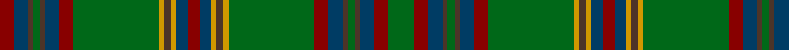

In pattern [GRBBGBBRGYBYBRBYBYGRBBGBBR](/patterns/grbbgbbrgybybrbybygrbbgbbr/).

This was sourced from register-of-tartans.  It is a [26 stripes tartan](/stripes/stripes26/).

Original link https://www.tartanregister.gov.uk/tartanDetails.aspx?ref=4608

## Thread count
DR/12 DB12 T4 G6 T4 DB12 DR12 G72 DY4 T6 DY4 DB10 DR10 DB10 DY4 T6 DY4 G72 DR12 DB12 T4 G6 T4 DB12 DR12 G/22

## Palette
Each colour and its ΔE from the base-6 reference it is a variant of.

| Colour | Shade | Base | ΔE (OKLab) |
|---|---|---|---|
| DB | <code style="background-color:#003C64;">#003C64</code> `#003C64` | B <code style="background-color:#2A418A;">#2A418A</code> | 0.08 |
| DR | <code style="background-color:#880000;">#880000</code> `#880000` | R <code style="background-color:#CC0000;">#CC0000</code> | 0.15 |
| DY | <code style="background-color:#D09800;">#D09800</code> `#D09800` | Y <code style="background-color:#F2BF00;">#F2BF00</code> | 0.12 |
| G | <code style="background-color:#006818;">#006818</code> `#006818` | G <code style="background-color:#006100;">#006100</code> | 0.02 |
| T | <code style="background-color:#4C3428;">#4C3428</code> `#4C3428` | B <code style="background-color:#2A418A;">#2A418A</code> | 0.17 |

## Nearest tartans

The nearest existing variants by ΔTartan distance.

1. [Westmeath (District)](/setts/s14/g11r6b6ba2g3ba2b6r6g36y2ba3y2b5r5~b003c64-ba4c3428-g006818-r880000-yd09800~x2/) — ΔT 1.28
1. [Ettrick (Green) District Tartan Tartan Number: 2300. Earliest known date: 1971 Ettrick District is in the Borders of Scotland. See products available Copyright © Blair Urquhart, Comrie, 2015](/setts/s24/b2g2r1g5r1b6r2g1y1g1r1g1r1g1ba1g1r2b6g20r1g1r1g1b2~b003c64-ba5c8ca8-g003820-rc80000-ye8c000~x2/) — ΔT 1.38
1. [Westmeath Irish County Tartan Tartan Number: 2278. Earliest known date: 1996 One of a series of Irish District tartans designed by Polly Wittering of the House of Edgar, with colours reminiscent of the Country with soft warm colours dominating. See products available Copyright © Blair Urquhart, Comrie, 2015](/setts/s14/g11r6b6ga2g3ga2b6r6g36y2ga3y2b5r5~b004874-g3c6838-ga28200c-r8c0020-ycc9c10~x2/) — ΔT 1.44
1. [Brewer](/setts/s19/g3r2b1r19g1r1g1r8g1b8r1g8r1g1r1g28y1g2ra2~b1870a4-g00643c-r880000-rab468ac-ye8c000~x2/) — ΔT 1.47
1. [Manitoba Province](/setts/s14/r12g1ga3g20b1g1b3g1b1g20ga3g1r12y3~b5c8ca8-g006818-ga285800-r901c38-ybc8c00~x4/) — ΔT 1.48
1. [Hanly](/setts/s16/g2ga2g3ga2g2ga2g2ga3g2y2k9ga26k5g7k2ya2~g006818-ga003820-k101010-ya0a0a0-yae8c000~x2/) — ΔT 1.49
1. [Manitoba Province (District)](/setts/s14/r12g1ga3g20b1g1b3g1b1g20ga3g1r12y3~b5c8ca8-g006818-ga003820-r901c38-ybc8c00~x4/) — ΔT 1.50
1. [Kennedy #3](/setts/s32/g24b4k3b3k3b3k3b4g12ba2g2ba2g3y2g2k2g2y2g3ba2g2ba2g12b4k3b3k3b3k3b4g24r3~b3c3c60-ba840068-g006818-k101010-rc80000-yd09800~x2/) — ΔT 1.56
1. [Gray Hunting](/setts/s20/k3w1g29r8ra2r2ra2r2ra8g7k2g7ra8r2ra2r2ra2r8g29w1~g006818-k101010-r888888-ra981c70-we0e0e0~x2/) — ΔT 1.66
1. [Kennedy (Clan)](/setts/s17/r3g24b4k3b3k3b3k3b4g12ba2g2ba2g3y2g2k2~b3c3c60-ba840068-g006818-k101010-rc80000-yd09800~x2/) — ΔT 1.69

## Neighbour map

Every grey dot is one of 15726 variants placed by the first two principal components of the ΔTartan feature space (44% of its variance). Red is this tartan; blue dots are its nearest — click one to open its page.

<svg viewBox="0 0 640 380" role="img" style="max-width:100%;height:auto;border:1px solid #e0e0e0;border-radius:4px;display:block" xmlns="http://www.w3.org/2000/svg"><image href="/nn/cloud.v1.png" width="640" height="380"/><a href="/setts/s14/g11r6b6ba2g3ba2b6r6g36y2ba3y2b5r5~b003c64-ba4c3428-g006818-r880000-yd09800~x2/"><circle cx="329.5" cy="136.6" r="4" fill="#3465a4"><title>Westmeath (District)</title></circle></a><a href="/setts/s24/b2g2r1g5r1b6r2g1y1g1r1g1r1g1ba1g1r2b6g20r1g1r1g1b2~b003c64-ba5c8ca8-g003820-rc80000-ye8c000~x2/"><circle cx="352.0" cy="95.6" r="4" fill="#3465a4"><title>Ettrick (Green) District Tartan Tartan Number: 2300. Earliest known date: 1971 Ettrick District is in the Borders of Scotland. See products available Copyright © Blair Urquhart, Comrie, 2015</title></circle></a><a href="/setts/s14/g11r6b6ga2g3ga2b6r6g36y2ga3y2b5r5~b004874-g3c6838-ga28200c-r8c0020-ycc9c10~x2/"><circle cx="339.4" cy="137.3" r="4" fill="#3465a4"><title>Westmeath Irish County Tartan Tartan Number: 2278. Earliest known date: 1996 One of a series of Irish District tartans designed by Polly Wittering of the House of Edgar, with colours reminiscent of the Country with soft warm colours dominating. See products available Copyright © Blair Urquhart, Comrie, 2015</title></circle></a><a href="/setts/s19/g3r2b1r19g1r1g1r8g1b8r1g8r1g1r1g28y1g2ra2~b1870a4-g00643c-r880000-rab468ac-ye8c000~x2/"><circle cx="362.4" cy="91.5" r="4" fill="#3465a4"><title>Brewer</title></circle></a><a href="/setts/s14/r12g1ga3g20b1g1b3g1b1g20ga3g1r12y3~b5c8ca8-g006818-ga285800-r901c38-ybc8c00~x4/"><circle cx="348.9" cy="136.9" r="4" fill="#3465a4"><title>Manitoba Province</title></circle></a><a href="/setts/s16/g2ga2g3ga2g2ga2g2ga3g2y2k9ga26k5g7k2ya2~g006818-ga003820-k101010-ya0a0a0-yae8c000~x2/"><circle cx="290.6" cy="144.3" r="4" fill="#3465a4"><title>Hanly</title></circle></a><a href="/setts/s14/r12g1ga3g20b1g1b3g1b1g20ga3g1r12y3~b5c8ca8-g006818-ga003820-r901c38-ybc8c00~x4/"><circle cx="340.1" cy="133.1" r="4" fill="#3465a4"><title>Manitoba Province (District)</title></circle></a><a href="/setts/s32/g24b4k3b3k3b3k3b4g12ba2g2ba2g3y2g2k2g2y2g3ba2g2ba2g12b4k3b3k3b3k3b4g24r3~b3c3c60-ba840068-g006818-k101010-rc80000-yd09800~x2/"><circle cx="290.9" cy="100.5" r="4" fill="#3465a4"><title>Kennedy #3</title></circle></a><a href="/setts/s20/k3w1g29r8ra2r2ra2r2ra8g7k2g7ra8r2ra2r2ra2r8g29w1~g006818-k101010-r888888-ra981c70-we0e0e0~x2/"><circle cx="341.3" cy="90.7" r="4" fill="#3465a4"><title>Gray Hunting</title></circle></a><a href="/setts/s17/r3g24b4k3b3k3b3k3b4g12ba2g2ba2g3y2g2k2~b3c3c60-ba840068-g006818-k101010-rc80000-yd09800~x2/"><circle cx="286.9" cy="124.3" r="4" fill="#3465a4"><title>Kennedy (Clan)</title></circle></a><circle cx="309.9" cy="106.2" r="5" fill="#c00000"/></svg>

ID: /setts/s26/g11r6b6ba2g3ba2b6r6g36y2ba3y2b5r5b5y2ba3y2g36r6b6ba2g3ba2b6r6~b003c64-ba4c3428-g006818-r880000-yd09800~x2/
