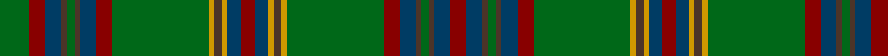

This page is one **sett** — a single exact thread-count. It belongs to the [tartan](/tartans/g11r6dt6do2g3do2dt6r6g36lo2do3lo2dt5r5/)
(the same proportion at any scale), whose colour order is pattern [GRBBGBBRGYBYBRBYBYGRBBGBBR](/stripes/grbbgbbrgybybrbybygrbbgbbr/).

Sourced from register-of-tartans.  It is a [26 stripe tartan](/stripes/stripes26/).

Original link https://www.tartanregister.gov.uk/tartanDetails.aspx?ref=4608

## Register references

External register numbers recorded for this tartan.

- Scottish Register of Tartans: [4608](https://www.tartanregister.gov.uk/tartanDetails.aspx?ref=4608)
- Scottish Tartans Authority (ITI): 2278
- Scottish Tartans World Register: 2278

## Thread count
G/22 DR12 DB12 T4 G6 T4 DB12 DR12 G72 DY4 T6 DY4 DB10 DR10 DB10 DY4 T6 DY4 G72 DR12 DB12 T4 G6 T4 DB12 DR/12

## Palette

Palette: <strong>Tartan Register</strong> <small style="color:#888">(4 of 5 colours)</small>
<table><thead><tr><th>Colour</th><th>Threads</th><th>Shade</th><th>Base</th><th>OKLCh</th></tr></thead><tbody><tr><td>G/</td><td style="text-align:right;font-variant-numeric:tabular-nums">22</td><td><code style="background-color:#006818;">#006818</code> <small style="color:#888">#006818</small></td><td>G <code style="background-color:#006100;">#006100</code></td><td><small style="color:#888">oklch(45.0% 0.142 145.0)</small></td></tr><tr><td>DR</td><td style="text-align:right;font-variant-numeric:tabular-nums">12</td><td><code style="background-color:#880000;">#880000</code> <small style="color:#888">#880000</small></td><td>R <code style="background-color:#CC0000;">#CC0000</code></td><td><small style="color:#888">oklch(39.4% 0.162 29.2)</small></td></tr><tr><td>DB</td><td style="text-align:right;font-variant-numeric:tabular-nums">12</td><td><code style="background-color:#003C64;">#003C64</code> <small style="color:#888">#003C64</small></td><td>B <code style="background-color:#2A418A;">#2A418A</code></td><td><small style="color:#888">oklch(34.5% 0.089 246.0)</small></td></tr><tr><td>T</td><td style="text-align:right;font-variant-numeric:tabular-nums">4</td><td><code style="background-color:#4C3428;">#4C3428</code> <small style="color:#888">#4C3428</small></td><td>B <code style="background-color:#2A418A;">#2A418A</code></td><td><small style="color:#888">oklch(34.9% 0.040 47.5)</small></td></tr><tr><td>G</td><td style="text-align:right;font-variant-numeric:tabular-nums">6</td><td><code style="background-color:#006818;">#006818</code> <small style="color:#888">#006818</small></td><td>G <code style="background-color:#006100;">#006100</code></td><td><small style="color:#888">oklch(45.0% 0.142 145.0)</small></td></tr><tr><td>T</td><td style="text-align:right;font-variant-numeric:tabular-nums">4</td><td><code style="background-color:#4C3428;">#4C3428</code> <small style="color:#888">#4C3428</small></td><td>B <code style="background-color:#2A418A;">#2A418A</code></td><td><small style="color:#888">oklch(34.9% 0.040 47.5)</small></td></tr><tr><td>DB</td><td style="text-align:right;font-variant-numeric:tabular-nums">12</td><td><code style="background-color:#003C64;">#003C64</code> <small style="color:#888">#003C64</small></td><td>B <code style="background-color:#2A418A;">#2A418A</code></td><td><small style="color:#888">oklch(34.5% 0.089 246.0)</small></td></tr><tr><td>DR</td><td style="text-align:right;font-variant-numeric:tabular-nums">12</td><td><code style="background-color:#880000;">#880000</code> <small style="color:#888">#880000</small></td><td>R <code style="background-color:#CC0000;">#CC0000</code></td><td><small style="color:#888">oklch(39.4% 0.162 29.2)</small></td></tr><tr><td>G</td><td style="text-align:right;font-variant-numeric:tabular-nums">72</td><td><code style="background-color:#006818;">#006818</code> <small style="color:#888">#006818</small></td><td>G <code style="background-color:#006100;">#006100</code></td><td><small style="color:#888">oklch(45.0% 0.142 145.0)</small></td></tr><tr><td>DY</td><td style="text-align:right;font-variant-numeric:tabular-nums">4</td><td><code style="background-color:#D09800;">#D09800</code> <small style="color:#888">#D09800</small></td><td>Y <code style="background-color:#F2BF00;">#F2BF00</code></td><td><small style="color:#888">oklch(71.4% 0.147 82.1)</small></td></tr><tr><td>T</td><td style="text-align:right;font-variant-numeric:tabular-nums">6</td><td><code style="background-color:#4C3428;">#4C3428</code> <small style="color:#888">#4C3428</small></td><td>B <code style="background-color:#2A418A;">#2A418A</code></td><td><small style="color:#888">oklch(34.9% 0.040 47.5)</small></td></tr><tr><td>DY</td><td style="text-align:right;font-variant-numeric:tabular-nums">4</td><td><code style="background-color:#D09800;">#D09800</code> <small style="color:#888">#D09800</small></td><td>Y <code style="background-color:#F2BF00;">#F2BF00</code></td><td><small style="color:#888">oklch(71.4% 0.147 82.1)</small></td></tr><tr><td>DB</td><td style="text-align:right;font-variant-numeric:tabular-nums">10</td><td><code style="background-color:#003C64;">#003C64</code> <small style="color:#888">#003C64</small></td><td>B <code style="background-color:#2A418A;">#2A418A</code></td><td><small style="color:#888">oklch(34.5% 0.089 246.0)</small></td></tr><tr><td>DR</td><td style="text-align:right;font-variant-numeric:tabular-nums">10</td><td><code style="background-color:#880000;">#880000</code> <small style="color:#888">#880000</small></td><td>R <code style="background-color:#CC0000;">#CC0000</code></td><td><small style="color:#888">oklch(39.4% 0.162 29.2)</small></td></tr><tr><td>DB</td><td style="text-align:right;font-variant-numeric:tabular-nums">10</td><td><code style="background-color:#003C64;">#003C64</code> <small style="color:#888">#003C64</small></td><td>B <code style="background-color:#2A418A;">#2A418A</code></td><td><small style="color:#888">oklch(34.5% 0.089 246.0)</small></td></tr><tr><td>DY</td><td style="text-align:right;font-variant-numeric:tabular-nums">4</td><td><code style="background-color:#D09800;">#D09800</code> <small style="color:#888">#D09800</small></td><td>Y <code style="background-color:#F2BF00;">#F2BF00</code></td><td><small style="color:#888">oklch(71.4% 0.147 82.1)</small></td></tr><tr><td>T</td><td style="text-align:right;font-variant-numeric:tabular-nums">6</td><td><code style="background-color:#4C3428;">#4C3428</code> <small style="color:#888">#4C3428</small></td><td>B <code style="background-color:#2A418A;">#2A418A</code></td><td><small style="color:#888">oklch(34.9% 0.040 47.5)</small></td></tr><tr><td>DY</td><td style="text-align:right;font-variant-numeric:tabular-nums">4</td><td><code style="background-color:#D09800;">#D09800</code> <small style="color:#888">#D09800</small></td><td>Y <code style="background-color:#F2BF00;">#F2BF00</code></td><td><small style="color:#888">oklch(71.4% 0.147 82.1)</small></td></tr><tr><td>G</td><td style="text-align:right;font-variant-numeric:tabular-nums">72</td><td><code style="background-color:#006818;">#006818</code> <small style="color:#888">#006818</small></td><td>G <code style="background-color:#006100;">#006100</code></td><td><small style="color:#888">oklch(45.0% 0.142 145.0)</small></td></tr><tr><td>DR</td><td style="text-align:right;font-variant-numeric:tabular-nums">12</td><td><code style="background-color:#880000;">#880000</code> <small style="color:#888">#880000</small></td><td>R <code style="background-color:#CC0000;">#CC0000</code></td><td><small style="color:#888">oklch(39.4% 0.162 29.2)</small></td></tr><tr><td>DB</td><td style="text-align:right;font-variant-numeric:tabular-nums">12</td><td><code style="background-color:#003C64;">#003C64</code> <small style="color:#888">#003C64</small></td><td>B <code style="background-color:#2A418A;">#2A418A</code></td><td><small style="color:#888">oklch(34.5% 0.089 246.0)</small></td></tr><tr><td>T</td><td style="text-align:right;font-variant-numeric:tabular-nums">4</td><td><code style="background-color:#4C3428;">#4C3428</code> <small style="color:#888">#4C3428</small></td><td>B <code style="background-color:#2A418A;">#2A418A</code></td><td><small style="color:#888">oklch(34.9% 0.040 47.5)</small></td></tr><tr><td>G</td><td style="text-align:right;font-variant-numeric:tabular-nums">6</td><td><code style="background-color:#006818;">#006818</code> <small style="color:#888">#006818</small></td><td>G <code style="background-color:#006100;">#006100</code></td><td><small style="color:#888">oklch(45.0% 0.142 145.0)</small></td></tr><tr><td>T</td><td style="text-align:right;font-variant-numeric:tabular-nums">4</td><td><code style="background-color:#4C3428;">#4C3428</code> <small style="color:#888">#4C3428</small></td><td>B <code style="background-color:#2A418A;">#2A418A</code></td><td><small style="color:#888">oklch(34.9% 0.040 47.5)</small></td></tr><tr><td>DB</td><td style="text-align:right;font-variant-numeric:tabular-nums">12</td><td><code style="background-color:#003C64;">#003C64</code> <small style="color:#888">#003C64</small></td><td>B <code style="background-color:#2A418A;">#2A418A</code></td><td><small style="color:#888">oklch(34.5% 0.089 246.0)</small></td></tr><tr><td>DR/</td><td style="text-align:right;font-variant-numeric:tabular-nums">12</td><td><code style="background-color:#880000;">#880000</code> <small style="color:#888">#880000</small></td><td>R <code style="background-color:#CC0000;">#CC0000</code></td><td><small style="color:#888">oklch(39.4% 0.162 29.2)</small></td></tr></tbody></table>

## Nearest tartans

The nearest existing variants by ΔTartan distance, with this tartan at the top so the swatches line up against it.

ΔTartan

Tartan

Sett

—

<a href="/ttd/edit/#slug=g11r6dt6do2g3do2dt6r6g36lo2do3lo2dt5r5~x2">Westmeath</a> <a class="nn-out" href="/setts/s26/g11r6dt6do2g3do2dt6r6g36lo2do3lo2dt5r5~x2/" title="open its dictionary page">↗</a>

1.27

<a href="/ttd/edit/#slug=g11r6dt6do2g3do2dt6r6g36lo2do3lo2dt5r5~x2">Westmeath (District)</a> <a class="nn-out" href="/setts/s14/g11r6dt6do2g3do2dt6r6g36lo2do3lo2dt5r5~x2/" title="open its dictionary page">↗</a>

1.38

<a href="/ttd/edit/#slug=dt2dg2r1dg5r1dt6r2dg1ly1dg1r1dg1r1dg1t1dg1r2dt6dg20r1dg1r1dg1dt2~x2">Ettrick (Green) District Tartan Tartan Number: 2300. Earliest known date: 1971 Ettrick District is in the Borders of Scotland. See products available Copyright © Blair Urquhart, Comrie, 2015</a> <a class="nn-out" href="/setts/s24/dt2dg2r1dg5r1dt6r2dg1ly1dg1r1dg1r1dg1t1dg1r2dt6dg20r1dg1r1dg1dt2~x2/" title="open its dictionary page">↗</a>

1.44

<a href="/ttd/edit/#slug=g11r6db6dy2g3dy2db6r6g36ly2dy3ly2db5r5~x2">Westmeath Irish County Tartan Tartan Number: 2278. Earliest known date: 1996 One of a series of Irish District tartans designed by Polly Wittering of the House of Edgar, with colours reminiscent of the Country with soft warm colours dominating. See products available Copyright © Blair Urquhart, Comrie, 2015</a> <a class="nn-out" href="/setts/s14/g11r6db6dy2g3dy2db6r6g36ly2dy3ly2db5r5~x2/" title="open its dictionary page">↗</a>

1.47

<a href="/ttd/edit/#slug=g3r2b1r19g1r1g1r8g1b8r1g8r1g1r1g28ly1g2m2~x2">Brewer</a> <a class="nn-out" href="/setts/s19/g3r2b1r19g1r1g1r8g1b8r1g8r1g1r1g28ly1g2m2~x2/" title="open its dictionary page">↗</a>

1.48

<a href="/ttd/edit/#slug=r12g1dg3g20t1g1t3g1t1g20dg3g1r12lo3~x4">Manitoba Province</a> <a class="nn-out" href="/setts/s14/r12g1dg3g20t1g1t3g1t1g20dg3g1r12lo3~x4/" title="open its dictionary page">↗</a>

1.49

<a href="/ttd/edit/#slug=g2dg2g3dg2g2dg2g2dg3g2lr2k9dg26k5g7k2ly2~x2">Hanly</a> <a class="nn-out" href="/setts/s16/g2dg2g3dg2g2dg2g2dg3g2lr2k9dg26k5g7k2ly2~x2/" title="open its dictionary page">↗</a>

1.56

<a href="/ttd/edit/#slug=g24dt4k3dt3k3dt3k3dt4g12dp2g2dp2g3lo2g2k2g2lo2g3dp2g2dp2g12dt4k3dt3k3dt3k3dt4g24r3~x2">Kennedy #3</a> <a class="nn-out" href="/setts/s32/g24dt4k3dt3k3dt3k3dt4g12dp2g2dp2g3lo2g2k2g2lo2g3dp2g2dp2g12dt4k3dt3k3dt3k3dt4g24r3~x2/" title="open its dictionary page">↗</a>

1.66

<a href="/setts/s20/k3w1g29o8m2o2m2o2m8g7k2~x2/">Gray Hunting</a>

1.69

<a href="/ttd/edit/#slug=r3g24dt4k3dt3k3dt3k3dt4g12dp2g2dp2g3lo2g2k2~x2">Kennedy (Clan)</a> <a class="nn-out" href="/setts/s17/r3g24dt4k3dt3k3dt3k3dt4g12dp2g2dp2g3lo2g2k2~x2/" title="open its dictionary page">↗</a>

1.70

<a href="/ttd/edit/#slug=dg39k2dg2k2dg2k3dt13k2lb4k2dt13k3dg24lo3~x2">Proctor (Name)</a> <a class="nn-out" href="/setts/s14/dg39k2dg2k2dg2k3dt13k2lb4k2dt13k3dg24lo3~x2/" title="open its dictionary page">↗</a>

## Neighbour map

Every grey dot is one of 14299 variants placed by the first two principal components of the ΔTartan feature space (44% of its variance). Red is this tartan; blue dots are its nearest — click one to open its page.

<svg viewBox="0 0 640 380" role="img" style="max-width:100%;height:auto;border:1px solid #e0e0e0;border-radius:4px;display:block" xmlns="http://www.w3.org/2000/svg"><image href="/nn/cloud.v1.png" width="640" height="380"/><a href="/setts/s14/g11r6dt6do2g3do2dt6r6g36lo2do3lo2dt5r5~x2/"><circle cx="331.4" cy="145.3" r="4" fill="#3465a4"><title>Westmeath (District)</title></circle></a><a href="/setts/s24/dt2dg2r1dg5r1dt6r2dg1ly1dg1r1dg1r1dg1t1dg1r2dt6dg20r1dg1r1dg1dt2~x2/"><circle cx="354.2" cy="103.3" r="4" fill="#3465a4"><title>Ettrick (Green) District Tartan Tartan Number: 2300. Earliest known date: 1971 Ettrick District is in the Borders of Scotland. See products available Copyright © Blair Urquhart, Comrie, 2015</title></circle></a><a href="/setts/s14/g11r6db6dy2g3dy2db6r6g36ly2dy3ly2db5r5~x2/"><circle cx="341.0" cy="146.5" r="4" fill="#3465a4"><title>Westmeath Irish County Tartan Tartan Number: 2278. Earliest known date: 1996 One of a series of Irish District tartans designed by Polly Wittering of the House of Edgar, with colours reminiscent of the Country with soft warm colours dominating. See products available Copyright © Blair Urquhart, Comrie, 2015</title></circle></a><a href="/setts/s19/g3r2b1r19g1r1g1r8g1b8r1g8r1g1r1g28ly1g2m2~x2/"><circle cx="363.9" cy="98.9" r="4" fill="#3465a4"><title>Brewer</title></circle></a><a href="/setts/s14/r12g1dg3g20t1g1t3g1t1g20dg3g1r12lo3~x4/"><circle cx="350.3" cy="144.8" r="4" fill="#3465a4"><title>Manitoba Province</title></circle></a><a href="/setts/s16/g2dg2g3dg2g2dg2g2dg3g2lr2k9dg26k5g7k2ly2~x2/"><circle cx="293.5" cy="153.9" r="4" fill="#3465a4"><title>Hanly</title></circle></a><a href="/setts/s32/g24dt4k3dt3k3dt3k3dt4g12dp2g2dp2g3lo2g2k2g2lo2g3dp2g2dp2g12dt4k3dt3k3dt3k3dt4g24r3~x2/"><circle cx="293.4" cy="108.4" r="4" fill="#3465a4"><title>Kennedy #3</title></circle></a><a href="/setts/s20/k3w1g29o8m2o2m2o2m8g7k2~x2/"><circle cx="343.3" cy="95.4" r="4" fill="#3465a4"><title>Gray Hunting</title></circle></a><a href="/setts/s17/r3g24dt4k3dt3k3dt3k3dt4g12dp2g2dp2g3lo2g2k2~x2/"><circle cx="289.3" cy="131.1" r="4" fill="#3465a4"><title>Kennedy (Clan)</title></circle></a><a href="/setts/s14/dg39k2dg2k2dg2k3dt13k2lb4k2dt13k3dg24lo3~x2/"><circle cx="386.4" cy="149.0" r="4" fill="#3465a4"><title>Proctor (Name)</title></circle></a><circle cx="312.0" cy="116.0" r="5" fill="#c00000"/></svg>

ID: /setts/s26/g11r6dt6do2g3do2dt6r6g36lo2do3lo2dt5r5~x2/
