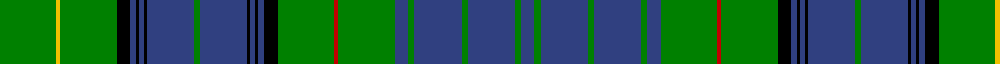

This page is one **sett** — a single exact thread-count. It belongs to the [tartan](/tartans/g37y3g37k9b4k2b3k2b31g4b31k2b3k2b4k9g37r3g37b9g4b31g4b31g4b9/)
(the same proportion at any scale), whose colour order is pattern [BGBGBGBGRGKBKBKBGBKBKBKGYG](/stripes/bgbgbgbgrgkbkbkbgbkbkbkgyg/).

Sourced from weddslist.  It is a [26 stripe tartan](/stripes/stripes26/).

Original link http://www.weddslist.com/cgi-bin/tartans/pg.pl?source=sts

## Also known as

This cloth is also recorded under:

- Stuart/Stewart Hunting

## Thread count
G/37 Y3 G37 K9 B4 K2 B3 K2 B31 G4 B31 K2 B3 K2 B4 K9 G37 R3 G37 B9 G4 B31 G4 B31 G4 B/9

## Palette
Each colour and the base-6 reference it is a variant of.

| Colour | Shade | Base |
|---|---|---|
| B | <code style="background-color:#304080;">#304080</code> `oklch(39.4% 0.109 270.2)` <small>#304080</small> | B <code style="background-color:#2A418A;">#2A418A</code> |
| G | <code style="background-color:#008000;">#008000</code> `oklch(52.0% 0.177 142.5)` <small>#008000</small> | G <code style="background-color:#006100;">#006100</code> |
| K | <code style="background-color:#000000;">#000000</code> `oklch(0.0% 0.000 0.0)` <small>#000000</small> | K <code style="background-color:#000000;">#000000</code> |
| R | <code style="background-color:#C00000;">#C00000</code> `oklch(50.7% 0.208 29.2)` <small>#C00000</small> | R <code style="background-color:#CC0000;">#CC0000</code> |
| Y | <code style="background-color:#F0C000;">#F0C000</code> `oklch(82.7% 0.169 90.5)` <small>#F0C000</small> | Y <code style="background-color:#F2BF00;">#F2BF00</code> |

## Nearest tartans

The nearest existing variants by ΔTartan distance, with this tartan at the top so the swatches line up against it.

ΔTartan

Tartan

Sett

—

<a href="/ttd/edit/#slug=g37ly3g37k9db4k2db3k2db31g4db31k2db3k2db4k9g37r3g37db9g4db31g4db31g4db9">Stewart Hunting</a> <a class="nn-out" href="/setts/s26/g37ly3g37k9db4k2db3k2db31g4db31k2db3k2db4k9g37r3g37db9g4db31g4db31g4db9/" title="open its dictionary page">↗</a>

1.22

<a href="/ttd/edit/#slug=k6g18w2g18k6db18k1db4k1db18k6g18r2g18k6db2k2db2k2db18k2db2k2db2~x2">MacKenzie, Bailey</a> <a class="nn-out" href="/setts/s24/k6g18w2g18k6db18k1db4k1db18k6g18r2g18k6db2k2db2k2db18k2db2k2db2~x2/" title="open its dictionary page">↗</a>

1.29

<a href="/ttd/edit/#slug=db21k1db1k1db1k10g22r2g22k10db16k1db2k1db16k10g22ly2g22k10db1k1db1k1db7~x2">Farquharson</a> <a class="nn-out" href="/setts/s25/db21k1db1k1db1k10g22r2g22k10db16k1db2k1db16k10g22ly2g22k10db1k1db1k1db7~x2/" title="open its dictionary page">↗</a>

1.35

<a href="/ttd/edit/#slug=k20y3db10g3db5g25k1g1w3g1k1g25db5g3db10y1db2~x4">Blairgowrie</a> <a class="nn-out" href="/setts/s17/k20y3db10g3db5g25k1g1w3g1k1g25db5g3db10y1db2~x4/" title="open its dictionary page">↗</a>

1.45

<a href="/ttd/edit/#slug=k4r2k10g3k10g30k8g3r4lo2r4lb2r4g3k8g30k10g3k10r2k4~x2">Pilette of Kinnear (Personal)</a> <a class="nn-out" href="/setts/s21/k4r2k10g3k10g30k8g3r4lo2r4lb2r4g3k8g30k10g3k10r2k4~x2/" title="open its dictionary page">↗</a>

1.46

<a href="/ttd/edit/#slug=k6g2k2g14k1ly2k1b5r1b5k1w2k1g14k1b2k1g14k1w2k1b5r1b5k1ly2k1g14k2g2k6r2~x2">Duncan of Sketraw Clan Tartan Tartan Number: 6497. Earliest known date: 2005 January A modified version of an unidentified tartan No. 331 from the 1930s. This new version is for John Duncan of Sketraw, and is approved by the Clan Duncan Society See products available Copyright © Blair Urquhart, Comrie, 2015</a> <a class="nn-out" href="/setts/s32/k6g2k2g14k1ly2k1b5r1b5k1w2k1g14k1b2k1g14k1w2k1b5r1b5k1ly2k1g14k2g2k6r2~x2/" title="open its dictionary page">↗</a>

1.46

<a href="/ttd/edit/#slug=b11k3b3k3b4k15g36w3g36k15b4k3b3k3b11r4~x2">Semple</a> <a class="nn-out" href="/setts/s16/b11k3b3k3b4k15g36w3g36k15b4k3b3k3b11r4~x2/" title="open its dictionary page">↗</a>

1.51

<a href="/setts/s22/g6w2g24k12db3k2db2k2db12r1db1r3~x2/">Sutherland</a>

1.52

<a href="/ttd/edit/#slug=dg18k5w3dg1dg3dg1w3k5w8dg1dg18dg18k5dg1dg1dg1k3dg1w3dg1k3dg1dg1dg1k5dg18w8dg1~x2">MacPerl (Personal)</a> <a class="nn-out" href="/setts/s28/dg18k5w3dg1dg3dg1w3k5w8dg1dg18dg18k5dg1dg1dg1k3dg1w3dg1k3dg1dg1dg1k5dg18w8dg1~x2/" title="open its dictionary page">↗</a>

1.56

<a href="/ttd/edit/#slug=db15k18g3k2g2k2g44ly4g44k2g2k2g3k18db15r4~x2">Sarafilovic</a> <a class="nn-out" href="/setts/s16/db15k18g3k2g2k2g44ly4g44k2g2k2g3k18db15r4~x2/" title="open its dictionary page">↗</a>

1.56

<a href="/ttd/edit/#slug=g2db1b6db10g4db1g1r1g1db1g18r1g4db6b6db1~x4">Tiger</a> <a class="nn-out" href="/setts/s16/g2db1b6db10g4db1g1r1g1db1g18r1g4db6b6db1~x4/" title="open its dictionary page">↗</a>

## Neighbour map

Every grey dot is one of 14299 variants placed by the first two principal components of the ΔTartan feature space (44% of its variance). Red is this tartan; blue dots are its nearest — click one to open its page.

<svg viewBox="0 0 640 380" role="img" style="max-width:100%;height:auto;border:1px solid #e0e0e0;border-radius:4px;display:block" xmlns="http://www.w3.org/2000/svg"><image href="/nn/cloud.v1.png" width="640" height="380"/><a href="/setts/s24/k6g18w2g18k6db18k1db4k1db18k6g18r2g18k6db2k2db2k2db18k2db2k2db2~x2/"><circle cx="191.6" cy="110.4" r="4" fill="#3465a4"><title>MacKenzie, Bailey</title></circle></a><a href="/setts/s25/db21k1db1k1db1k10g22r2g22k10db16k1db2k1db16k10g22ly2g22k10db1k1db1k1db7~x2/"><circle cx="204.9" cy="97.1" r="4" fill="#3465a4"><title>Farquharson</title></circle></a><a href="/setts/s17/k20y3db10g3db5g25k1g1w3g1k1g25db5g3db10y1db2~x4/"><circle cx="276.0" cy="113.2" r="4" fill="#3465a4"><title>Blairgowrie</title></circle></a><a href="/setts/s21/k4r2k10g3k10g30k8g3r4lo2r4lb2r4g3k8g30k10g3k10r2k4~x2/"><circle cx="255.9" cy="124.8" r="4" fill="#3465a4"><title>Pilette of Kinnear (Personal)</title></circle></a><a href="/setts/s32/k6g2k2g14k1ly2k1b5r1b5k1w2k1g14k1b2k1g14k1w2k1b5r1b5k1ly2k1g14k2g2k6r2~x2/"><circle cx="207.6" cy="85.2" r="4" fill="#3465a4"><title>Duncan of Sketraw Clan Tartan Tartan Number: 6497. Earliest known date: 2005 January A modified version of an unidentified tartan No. 331 from the 1930s. This new version is for John Duncan of Sketraw, and is approved by the Clan Duncan Society See products available Copyright © Blair Urquhart, Comrie, 2015</title></circle></a><a href="/setts/s16/b11k3b3k3b4k15g36w3g36k15b4k3b3k3b11r4~x2/"><circle cx="226.3" cy="141.0" r="4" fill="#3465a4"><title>Semple</title></circle></a><a href="/setts/s22/g6w2g24k12db3k2db2k2db12r1db1r3~x2/"><circle cx="226.1" cy="97.7" r="4" fill="#3465a4"><title>Sutherland</title></circle></a><a href="/setts/s28/dg18k5w3dg1dg3dg1w3k5w8dg1dg18dg18k5dg1dg1dg1k3dg1w3dg1k3dg1dg1dg1k5dg18w8dg1~x2/"><circle cx="256.3" cy="86.7" r="4" fill="#3465a4"><title>MacPerl (Personal)</title></circle></a><a href="/setts/s16/db15k18g3k2g2k2g44ly4g44k2g2k2g3k18db15r4~x2/"><circle cx="316.4" cy="121.1" r="4" fill="#3465a4"><title>Sarafilovic</title></circle></a><a href="/setts/s16/g2db1b6db10g4db1g1r1g1db1g18r1g4db6b6db1~x4/"><circle cx="265.5" cy="138.4" r="4" fill="#3465a4"><title>Tiger</title></circle></a><circle cx="259.7" cy="112.0" r="5" fill="#c00000"/></svg>

ID: /setts/s26/g37ly3g37k9db4k2db3k2db31g4db31k2db3k2db4k9g37r3g37db9g4db31g4db31g4db9/
