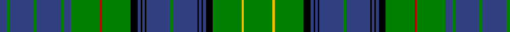

In pattern [BGBGBGBGRGKBKBKBGBKBKBKGYG](/patterns/bgbgbgbgrgkbkbkbgbkbkbkgyg/).

This was sourced from weddslist.  It is a [26 stripes tartan](/stripes/stripes26/).

Original link http://www.weddslist.com/cgi-bin/tartans/pg.pl?source=sts

## Thread count
B/9 G4 B31 G4 B31 G4 B9 G37 R3 G37 K9 B4 K2 B3 K2 B31 G4 B31 K2 B3 K2 B4 K9 G37 Y3 G/37

## Palette
Each colour and its ΔE from the base-6 reference it is a variant of.

| Colour | Shade | Base | ΔE (OKLab) |
|---|---|---|---|
| B | <code style="background-color:#304080;">#304080</code> `#304080` | B <code style="background-color:#2A418A;">#2A418A</code> | 0.02 |
| G | <code style="background-color:#008000;">#008000</code> `#008000` | G <code style="background-color:#006100;">#006100</code> | 0.10 |
| K | <code style="background-color:#000000;">#000000</code> `#000000` | K <code style="background-color:#000000;">#000000</code> | 0.00 |
| R | <code style="background-color:#C00000;">#C00000</code> `#C00000` | R <code style="background-color:#CC0000;">#CC0000</code> | 0.03 |
| Y | <code style="background-color:#F0C000;">#F0C000</code> `#F0C000` | Y <code style="background-color:#F2BF00;">#F2BF00</code> | 0.00 |

## Nearest tartans

The nearest existing variants by ΔTartan distance.

1. [MacKenzie, Bailey](/setts/s24/k12g36w4g36k12b36k2b8k2b36k12g36r4g36k12b4k4b4k4b36k4b4k4b4-b304080-g008000-k000000-rc00000-we0e0e0/) — ΔT 1.21
1. [Farquharson](/setts/s25/b42k2b2k2b2k20g44r4g44k20b32k2b4k2b32k20g44y4g44k20b2k2b2k2b14-b304080-g008000-k000000-rc00000-yf0c000/) — ΔT 1.29
1. [Blairgowrie](/setts/s17/k80g12b40ga12b20ga100k4ga4w12ga4k4ga100b20ga12b40g4b8-b2c2c80-g808080-ga006818-k101010-wffffff/) — ΔT 1.35
1. [Blairlogie or Blair Athol District Tartan Tartan Number: 443. Earliest known date: 1882 Discovered by a STS member in 1967 in the records of D C Dalgleish (Weavers) of Selkirk. Three counts are given in varying widths. See products available Copyright © Blair Urquhart, Comrie, 2015](/setts/s17/k40r6b20g6b10g50k2g2w6g2k2g50b10g6b20r2b4-b2c2c80-g006818-k101010-rc80000-we0e0e0/) — ΔT 1.40
1. [Pilette of Kinnear (Personal)](/setts/s21/k8r4k20g6k20g60k16g6r8w4r8y4r8g6k16g60k20g6k20r4k8-g006818-k101010-rc80000-wc0c0c0-yd09800/) — ΔT 1.44
1. [Duncan of Sketraw Clan Tartan Tartan Number: 6497. Earliest known date: 2005 January A modified version of an unidentified tartan No. 331 from the 1930s. This new version is for John Duncan of Sketraw, and is approved by the Clan Duncan Society See products available Copyright © Blair Urquhart, Comrie, 2015](/setts/s32/k12g4k4g28k2y4k2b10r2b10k2w4k2g28k2b4k2g28k2w4k2b10r2b10k2y4k2g28k4g4k12r4-b1474b4-g006818-k101010-rc80000-we0e0e0-ye8c000/) — ΔT 1.45
1. [Semple](/setts/s16/b22k6b6k6b8k30g72w6g72k30b8k6b6k6b22r8-b1474b4-g006818-k101010-rc80000-wfcfcfc/) — ΔT 1.46
1. [Sutherland](/setts/s22/g12w4g48k24b6k4b4k4b24r2b2r6b2r2b24k4b4k4b6k24g48w4-b2c2c80-g006818-k101010-rc80000-wfcfcfc/) — ΔT 1.51
1. [MacPerl (Personal)](/setts/s28/g36k10w6g2g6g2w6k10w16g2g36g36k10g2g2g2k6g2w6g2k6g2g2g2k10g36w16g2-g003820-k00002c-we0e0e0/) — ΔT 1.51
1. [Cockburn #2](/setts/s27/r6k4g18b24w6b24g4k4g4k4g72k4g4k4g4b24w6b24k6y6k4g24k4r6k4g12w6-b2c4084-g005020-k101010-rdc0000-we0e0e0-ye8c000/) — ΔT 1.55

## Neighbour map

Every grey dot is one of 15726 variants placed by the first two principal components of the ΔTartan feature space (44% of its variance). Red is this tartan; blue dots are its nearest — click one to open its page.

<svg viewBox="0 0 640 380" role="img" style="max-width:100%;height:auto;border:1px solid #e0e0e0;border-radius:4px;display:block" xmlns="http://www.w3.org/2000/svg"><image href="/nn/cloud.v1.png" width="640" height="380"/><a href="/setts/s24/k12g36w4g36k12b36k2b8k2b36k12g36r4g36k12b4k4b4k4b36k4b4k4b4-b304080-g008000-k000000-rc00000-we0e0e0/"><circle cx="185.3" cy="107.6" r="4" fill="#3465a4"><title>MacKenzie, Bailey</title></circle></a><a href="/setts/s25/b42k2b2k2b2k20g44r4g44k20b32k2b4k2b32k20g44y4g44k20b2k2b2k2b14-b304080-g008000-k000000-rc00000-yf0c000/"><circle cx="198.5" cy="94.3" r="4" fill="#3465a4"><title>Farquharson</title></circle></a><a href="/setts/s17/k80g12b40ga12b20ga100k4ga4w12ga4k4ga100b20ga12b40g4b8-b2c2c80-g808080-ga006818-k101010-wffffff/"><circle cx="269.9" cy="108.3" r="4" fill="#3465a4"><title>Blairgowrie</title></circle></a><a href="/setts/s17/k40r6b20g6b10g50k2g2w6g2k2g50b10g6b20r2b4-b2c2c80-g006818-k101010-rc80000-we0e0e0/"><circle cx="273.2" cy="108.5" r="4" fill="#3465a4"><title>Blairlogie or Blair Athol District Tartan Tartan Number: 443. Earliest known date: 1882 Discovered by a STS member in 1967 in the records of D C Dalgleish (Weavers) of Selkirk. Three counts are given in varying widths. See products available Copyright © Blair Urquhart, Comrie, 2015</title></circle></a><a href="/setts/s21/k8r4k20g6k20g60k16g6r8w4r8y4r8g6k16g60k20g6k20r4k8-g006818-k101010-rc80000-wc0c0c0-yd09800/"><circle cx="251.0" cy="121.4" r="4" fill="#3465a4"><title>Pilette of Kinnear (Personal)</title></circle></a><a href="/setts/s32/k12g4k4g28k2y4k2b10r2b10k2w4k2g28k2b4k2g28k2w4k2b10r2b10k2y4k2g28k4g4k12r4-b1474b4-g006818-k101010-rc80000-we0e0e0-ye8c000/"><circle cx="201.1" cy="81.3" r="4" fill="#3465a4"><title>Duncan of Sketraw Clan Tartan Tartan Number: 6497. Earliest known date: 2005 January A modified version of an unidentified tartan No. 331 from the 1930s. This new version is for John Duncan of Sketraw, and is approved by the Clan Duncan Society See products available Copyright © Blair Urquhart, Comrie, 2015</title></circle></a><a href="/setts/s16/b22k6b6k6b8k30g72w6g72k30b8k6b6k6b22r8-b1474b4-g006818-k101010-rc80000-wfcfcfc/"><circle cx="220.7" cy="136.9" r="4" fill="#3465a4"><title>Semple</title></circle></a><a href="/setts/s22/g12w4g48k24b6k4b4k4b24r2b2r6b2r2b24k4b4k4b6k24g48w4-b2c2c80-g006818-k101010-rc80000-wfcfcfc/"><circle cx="219.4" cy="93.2" r="4" fill="#3465a4"><title>Sutherland</title></circle></a><a href="/setts/s28/g36k10w6g2g6g2w6k10w16g2g36g36k10g2g2g2k6g2w6g2k6g2g2g2k10g36w16g2-g003820-k00002c-we0e0e0/"><circle cx="250.5" cy="84.6" r="4" fill="#3465a4"><title>MacPerl (Personal)</title></circle></a><a href="/setts/s27/r6k4g18b24w6b24g4k4g4k4g72k4g4k4g4b24w6b24k6y6k4g24k4r6k4g12w6-b2c4084-g005020-k101010-rdc0000-we0e0e0-ye8c000/"><circle cx="214.8" cy="77.5" r="4" fill="#3465a4"><title>Cockburn #2</title></circle></a><circle cx="253.8" cy="108.0" r="5" fill="#c00000"/></svg>

ID: /setts/s26/g37y3g37k9b4k2b3k2b31g4b31k2b3k2b4k9g37r3g37b9g4b31g4b31g4b9-b304080-g008000-k000000-rc00000-yf0c000/
