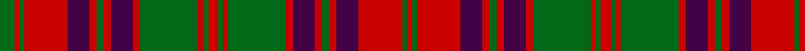

In pattern [GRGRBRGRBRGRGRGRGRBRGRBRGR](/patterns/grgrbrgrbrgrgrgrgrbrgrbrgr/).

This was sourced from register-of-tartans.  It is a [26 stripes tartan](/stripes/stripes26/).

Original link https://www.tartanregister.gov.uk/tartanDetails.aspx?ref=4984

## Register references

External register numbers recorded for this tartan.

- Scottish Register of Tartans: [4984](https://www.tartanregister.gov.uk/tartanDetails.aspx?ref=4984)
- Scottish Tartans Authority (ITI): 3249

## Thread count
G/12 R4 G4 R36 DP18 R6 G6 R6 DP18 R6 G48 R4 G4 R8 G4 R4 G48 R6 DP18 R6 G6 R6 DP18 R36 G4 R/4

## Palette
Each colour and its ΔE from the base-6 reference it is a variant of.

| Colour | Shade | Base | ΔE (OKLab) |
|---|---|---|---|
| DG | <code style="background-color:#003820;">#003820</code> `#003820` | G <code style="background-color:#006100;">#006100</code> | 0.15 |
| DP | <code style="background-color:#440044;">#440044</code> `#440044` | B <code style="background-color:#2A418A;">#2A418A</code> | 0.18 |
| G | <code style="background-color:#006818;">#006818</code> `#006818` | G <code style="background-color:#006100;">#006100</code> | 0.02 |
| R | <code style="background-color:#C80000;">#C80000</code> `#C80000` | R <code style="background-color:#CC0000;">#CC0000</code> | 0.01 |

## Nearest tartans

The nearest existing variants by ΔTartan distance.

1. [Ross (Clan)](/setts/s27/g18r2g18r18g2r4g2r18b18r2b18r18b1r1b2r1b1r18b1r1g2r1b1r18g18r2g18~b2c2c80-g006818-rc80000~x2/) — ΔT 0.87
1. [Ross Clan Tartan Tartan Number: 864. Earliest known date: 1810-15 D.C.Stewart says, "The version here given may be taken to be correct." Later versions, including Logans, are known to have omissions. The Clan Ross is descended from Fearcher MacinTagart, Earl of Ross in the 13th century. The chiefship has passed to the Rosses of Shandwick. The tartan is also worn by the MacTiers. Also worn by the Metro Toronto Police pipe band. (Strathallan 1994) See products available Copyright © Blair Urquhart, Comrie, 2015](/setts/s27/g18r2g18r18g2r4g2r18b18r2b18r18b1r1b2r1b1r18b1r1b2r1b1r18g18r2g18~b2c2c80-g006818-rc80000~x2/) — ΔT 0.87
1. [Inverness Fencibles](/setts/s22/b1r1b10g10r13g2r13g10r1b1r1b10r1b1r1g10r13g2r13g10b10r1~b2c2c80-g006818-rc80000~x2/) — ΔT 0.88
1. [Ross #4](/setts/s27/g18r2g18r18g2r4g2r18b18r2b18r18b1r1b2r1b1r18b1r1b2r1b1r18g18r2g18~b2c4084-g005020-rdc0000~x2/) — ΔT 0.93
1. [Ross](/setts/s27/g18r2g18r18g2r4g2r18b18r2b18r18b1r1b2r1b1r18b1r1b2r1b1r18g18r2g18~b000052-g11450d-raa0000~x2/) — ΔT 1.11
1. [Ross 3](/setts/s20/b18r2b18r18g2r4g2r18g18r2g18r2g18r18b1r1b2r1b1r18~b304080-g008000-rc00000~x2/) — ΔT 1.13
1. [Ross](/setts/s20/b18r2b18r18g2r4g2r18g18r2g18r2g18r18b1r1b2r1b1r18~b2c4084-g005020-rdc0000~x2/) — ΔT 1.15
1. [Matheson (Clan)](/setts/s21/g8r4g1r1g1r14b8g4r1g1r1g4r8g1r1g1r1b8g8r2g4~b1c1c50-g005010-rac2418~x4/) — ΔT 1.21
1. [Ross](/setts/s27/g8r1g8r8b1r1b2r1b1r8b1r1b2r1b1r8b8r1b8r8g1r2g1r8g8r1g8~b00004c-g004c00-rc80000~x2/) — ΔT 1.23
1. [Stewart of Urrard (Clan?)](/setts/s14/g6r2g2r18b9r3g3r3b9r3g24r2g2r4~b440044-g006818-rc80000~x2/) — ΔT 1.26

## Neighbour map

Every grey dot is one of 15726 variants placed by the first two principal components of the ΔTartan feature space (44% of its variance). Red is this tartan; blue dots are its nearest — click one to open its page.

<svg viewBox="0 0 640 380" role="img" style="max-width:100%;height:auto;border:1px solid #e0e0e0;border-radius:4px;display:block" xmlns="http://www.w3.org/2000/svg"><image href="/nn/cloud.v1.png" width="640" height="380"/><a href="/setts/s27/g18r2g18r18g2r4g2r18b18r2b18r18b1r1b2r1b1r18b1r1g2r1b1r18g18r2g18~b2c2c80-g006818-rc80000~x2/"><circle cx="293.0" cy="129.5" r="4" fill="#3465a4"><title>Ross (Clan)</title></circle></a><a href="/setts/s27/g18r2g18r18g2r4g2r18b18r2b18r18b1r1b2r1b1r18b1r1b2r1b1r18g18r2g18~b2c2c80-g006818-rc80000~x2/"><circle cx="291.8" cy="129.3" r="4" fill="#3465a4"><title>Ross Clan Tartan Tartan Number: 864. Earliest known date: 1810-15 D.C.Stewart says, &quot;The version here given may be taken to be correct.&quot; Later versions, including Logans, are known to have omissions. The Clan Ross is descended from Fearcher MacinTagart, Earl of Ross in the 13th century. The chiefship has passed to the Rosses of Shandwick. The tartan is also worn by the MacTiers. Also worn by the Metro Toronto Police pipe band. (Strathallan 1994) See products available Copyright © Blair Urquhart, Comrie, 2015</title></circle></a><a href="/setts/s22/b1r1b10g10r13g2r13g10r1b1r1b10r1b1r1g10r13g2r13g10b10r1~b2c2c80-g006818-rc80000~x2/"><circle cx="252.4" cy="160.6" r="4" fill="#3465a4"><title>Inverness Fencibles</title></circle></a><a href="/setts/s27/g18r2g18r18g2r4g2r18b18r2b18r18b1r1b2r1b1r18b1r1b2r1b1r18g18r2g18~b2c4084-g005020-rdc0000~x2/"><circle cx="290.1" cy="126.9" r="4" fill="#3465a4"><title>Ross #4</title></circle></a><a href="/setts/s27/g18r2g18r18g2r4g2r18b18r2b18r18b1r1b2r1b1r18b1r1b2r1b1r18g18r2g18~b000052-g11450d-raa0000~x2/"><circle cx="296.8" cy="136.5" r="4" fill="#3465a4"><title>Ross</title></circle></a><a href="/setts/s20/b18r2b18r18g2r4g2r18g18r2g18r2g18r18b1r1b2r1b1r18~b304080-g008000-rc00000~x2/"><circle cx="288.1" cy="148.8" r="4" fill="#3465a4"><title>Ross 3</title></circle></a><a href="/setts/s20/b18r2b18r18g2r4g2r18g18r2g18r2g18r18b1r1b2r1b1r18~b2c4084-g005020-rdc0000~x2/"><circle cx="286.7" cy="146.0" r="4" fill="#3465a4"><title>Ross</title></circle></a><a href="/setts/s21/g8r4g1r1g1r14b8g4r1g1r1g4r8g1r1g1r1b8g8r2g4~b1c1c50-g005010-rac2418~x4/"><circle cx="280.6" cy="167.0" r="4" fill="#3465a4"><title>Matheson (Clan)</title></circle></a><a href="/setts/s27/g8r1g8r8b1r1b2r1b1r8b1r1b2r1b1r8b8r1b8r8g1r2g1r8g8r1g8~b00004c-g004c00-rc80000~x2/"><circle cx="230.6" cy="163.3" r="4" fill="#3465a4"><title>Ross</title></circle></a><a href="/setts/s14/g6r2g2r18b9r3g3r3b9r3g24r2g2r4~b440044-g006818-rc80000~x2/"><circle cx="271.6" cy="169.4" r="4" fill="#3465a4"><title>Stewart of Urrard (Clan?)</title></circle></a><circle cx="254.9" cy="141.1" r="5" fill="#c00000"/></svg>

ID: /setts/s26/g6r2g2r18b9r3g3r3b9r3g24r2g2r4g2r2g24r3b9r3g3r3b9r18g2r2~b440044-g006818-rc80000~x2/
