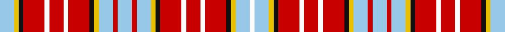

**Bands:** [WYKRWRWRKYWRWRWYKRWRWRKYWW](/stripes/wykrwrwrkywrwrwykrwrwrkyww/) · **Stripes:** [LB LY K R W R W R K LY LB R LB R LB LY K R W R W R K LY LB W](/stripes/stripes26/) LB LY K R W R W R K LY LB R LB R LB LY K R W R W R K LY LB W

This was sourced from register-of-tartans.  It is a [26 band tartan](/bands/bands26/).

Original link https://www.tartanregister.gov.uk/tartanDetails.aspx?ref=3227

## Register references

External register numbers recorded for this tartan.

- Scottish Register of Tartans: [3227](https://www.tartanregister.gov.uk/tartanDetails.aspx?ref=3227)
- Scottish Tartans Authority (ITI): 6093

## Thread count
LB/12 Y4 K4 R18 W4 R12 W4 R18 K4 Y4 LB12 R4 LB12 R4 LB12 Y4 K4 R18 W4 R12 W4 R18 K4 Y4 LB12 W/4

## Palette
Each colour and its ΔE from the base-6 reference it is a variant of.

| Colour | Shade | Base | ΔE (OKLab) |
|---|---|---|---|
| K | <code style="background-color:#101010;">#101010</code> `#101010` | K <code style="background-color:#000000;">#000000</code> | 0.17 |
| LB | <code style="background-color:#98C8E8;">#98C8E8</code> `#98C8E8` | W <code style="background-color:#F7F7F7;">#F7F7F7</code> | 0.18 |
| R | <code style="background-color:#C80000;">#C80000</code> `#C80000` | R <code style="background-color:#CC0000;">#CC0000</code> | 0.01 |
| W | <code style="background-color:#FCFCFC;">#FCFCFC</code> `#FCFCFC` | W <code style="background-color:#F7F7F7;">#F7F7F7</code> | 0.01 |
| Y | <code style="background-color:#E8C000;">#E8C000</code> `#E8C000` | Y <code style="background-color:#F2BF00;">#F2BF00</code> | 0.02 |

## Nearest tartans

The nearest existing variants by ΔTartan distance.

1. [Ogilvy D](/setts/s14/lb4r1lb4ly1k1r6lb1r4lb1r6k1ly1lb4lr1~x2/) — ΔT 1.50
1. [MacDougal (Dress)](/setts/s22/w2r2r2r16k2r2w6r7dg6r2r2r2k6r3w2r3w2r3w16r2r2w2~x2/) — ΔT 1.58
1. [Ogilvy](/setts/s14/lb10r3lb10ly5k2r6lb2r6lb2r6db2ly2lb5lr2/) — ΔT 1.67
1. [Bradwell, Carl (Personal)](/setts/s16/r4lr3m2w4m2w3m4w3m6w2m8w2m6w2t4lo3~x2/) — ΔT 1.75
1. [Ogilvie (D.C. Stewart)](/setts/s14/y4r1y4ly1k1r6w1r4w1r6k1ly1y4w1~x8/) — ΔT 1.78
1. [Jacobite Old Sett](/setts/s18/r9k1r3w5r6k5r4lo8ly4w1k1w1ly4r6k1w2t1w2~x2/) — ΔT 1.88
1. [MacRae (Red)](/setts/s31/g4r1g4r4db1r1db1r1db1r4db1r1db1r1db1r4w1r1db4r1db4r1w1r4g1r1g1r4g4r1g4~x4/) — ΔT 1.92
1. [MacDougall #6](/setts/s19/k1r4dg8r2dg1r2db4r2w1r1w1r2dg4r3dg4r1k1r8w1~x2/) — ΔT 1.93
1. [MacRae Dress Red Fancy Tartan Tartan Number: 6529. Earliest known date: 2000 A dance version of MacRae Dress. From a sample provided by Tartantown. See products available Copyright © Blair Urquhart, Comrie, 2015](/setts/s20/r3k2w1r8w1k2w9k1w3t1w3k1w9k2w1r8w1k2r3t1~x6/) — ΔT 1.93
1. [Ogilvie #2](/setts/s14/db13r5db12ly4k5r20w4r10w4r20db5ly4db13r4~x2/) — ΔT 1.95

## Neighbour map

Every grey dot is one of 14299 variants placed by the first two principal components of the ΔTartan feature space (44% of its variance). Red is this tartan; blue dots are its nearest — click one to open its page.

<svg viewBox="0 0 640 380" role="img" style="max-width:100%;height:auto;border:1px solid #e0e0e0;border-radius:4px;display:block" xmlns="http://www.w3.org/2000/svg"><image href="/nn/cloud.v1.png" width="640" height="380"/><a href="/setts/s14/lb4r1lb4ly1k1r6lb1r4lb1r6k1ly1lb4lr1~x2/"><circle cx="181.2" cy="150.0" r="4" fill="#3465a4"><title>Ogilvy D</title></circle></a><a href="/setts/s22/w2r2r2r16k2r2w6r7dg6r2r2r2k6r3w2r3w2r3w16r2r2w2~x2/"><circle cx="153.9" cy="95.2" r="4" fill="#3465a4"><title>MacDougal (Dress)</title></circle></a><a href="/setts/s14/lb10r3lb10ly5k2r6lb2r6lb2r6db2ly2lb5lr2/"><circle cx="121.0" cy="155.1" r="4" fill="#3465a4"><title>Ogilvy</title></circle></a><a href="/setts/s16/r4lr3m2w4m2w3m4w3m6w2m8w2m6w2t4lo3~x2/"><circle cx="108.6" cy="182.1" r="4" fill="#3465a4"><title>Bradwell, Carl (Personal)</title></circle></a><a href="/setts/s14/y4r1y4ly1k1r6w1r4w1r6k1ly1y4w1~x8/"><circle cx="197.3" cy="167.6" r="4" fill="#3465a4"><title>Ogilvie (D.C. Stewart)</title></circle></a><a href="/setts/s18/r9k1r3w5r6k5r4lo8ly4w1k1w1ly4r6k1w2t1w2~x2/"><circle cx="120.0" cy="114.4" r="4" fill="#3465a4"><title>Jacobite Old Sett</title></circle></a><a href="/setts/s31/g4r1g4r4db1r1db1r1db1r4db1r1db1r1db1r4w1r1db4r1db4r1w1r4g1r1g1r4g4r1g4~x4/"><circle cx="174.8" cy="176.0" r="4" fill="#3465a4"><title>MacRae (Red)</title></circle></a><a href="/setts/s19/k1r4dg8r2dg1r2db4r2w1r1w1r2dg4r3dg4r1k1r8w1~x2/"><circle cx="210.1" cy="141.4" r="4" fill="#3465a4"><title>MacDougall #6</title></circle></a><a href="/setts/s20/r3k2w1r8w1k2w9k1w3t1w3k1w9k2w1r8w1k2r3t1~x6/"><circle cx="181.7" cy="114.9" r="4" fill="#3465a4"><title>MacRae Dress Red Fancy Tartan Tartan Number: 6529. Earliest known date: 2000 A dance version of MacRae Dress. From a sample provided by Tartantown. See products available Copyright © Blair Urquhart, Comrie, 2015</title></circle></a><a href="/setts/s14/db13r5db12ly4k5r20w4r10w4r20db5ly4db13r4~x2/"><circle cx="147.1" cy="160.6" r="4" fill="#3465a4"><title>Ogilvie #2</title></circle></a><circle cx="130.8" cy="143.5" r="5" fill="#c00000"/></svg>

ID: /setts/s26/lb6ly2k2r9w2r6w2r9k2ly2lb6r2lb6r2lb6ly2k2r9w2r6w2r9k2ly2lb6w2~x2/
