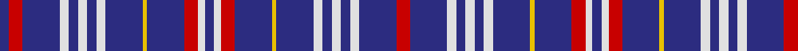

In pattern [BRBWBWBWBYBRWBWRBYBWBWBWBR](/patterns/brbwbwbwbybrwbwrbybwbwbwbr/).

This was sourced from house-of-tartan.  It is a [26 stripes tartan](/stripes/stripes26/).

Original link http://www.house-of-tartan.scotland.net/house/TartanViewjs.asp?colr=Def&tnam=6485

## Thread count
DB/8 R12 DB32 LN8 DB8 LN8 DB8 LN8 DB32 Y4 DB32 R12 LN6 DB8 LN6 R12 DB32 Y4 DB32 LN8 DB8 LN8 DB8 LN8 DB32 R/12

## Palette
Each colour and its ΔE from the base-6 reference it is a variant of.

| Colour | Shade | Base | ΔE (OKLab) |
|---|---|---|---|
| DB | <code style="background-color:#2C2C80;">#2C2C80</code> `#2C2C80` | B <code style="background-color:#2C4084;">#2C4084</code> | 0.05 |
| LN | <code style="background-color:#E0E0E0;">#E0E0E0</code> `#E0E0E0` | W <code style="background-color:#F4F4F0;">#F4F4F0</code> | 0.06 |
| R | <code style="background-color:#C80000;">#C80000</code> `#C80000` | R <code style="background-color:#C80000;">#C80000</code> | 0.00 |
| Y | <code style="background-color:#E8C000;">#E8C000</code> `#E8C000` | Y <code style="background-color:#E8C000;">#E8C000</code> | 0.00 |

## Nearest tartans

The nearest existing variants by ΔTartan distance.

1. [Clackson Personal Weavers Tartan Tartan Number: 5831. Earliest known date: June 2003 Designed by Dr. Stephen Gregory Clackson of Orkney for all bearers of any version of his armorial bearings, for all descendants of such persons and for all persons granted written permission by him or his heirs. Inspired by the armorial bearings of Dr Clackson (which are matriculated in the Public Register of all Arms and Bearings in Scotland) to commemorate the birth in Aberdeen of his daughter Frideswide Joyce Charlotte on the 13th February 2003. See products available Copyright © Blair Urquhart, Comrie, 2015](/setts/s24/b48r4b16w10b8y10b8w10b8y10b16r4b48r4b16y10b8w10b8y10b8w10b16r4-b2c2c80-rc80000-we0e0e0-ye8c000/) — ΔT 0.91
1. [Parker (USA)](/setts/s14/b8r12b32w8b8w8b8w8b32y4b32r12w6b8-b2c2c80-rc80000-we0e0e0-ybc8c00/) — ΔT 1.28
1. [Parker Dress (USA)](/setts/s12/b8w8b8w8b8w8b32y4b32r12w6b8-b2c2c80-rc80000-we0e0e0-ybc8c00/) — ΔT 1.60
1. [Bermuda, Blue](/setts/s13/b12r4ba4b42r6b6ba11b6g19b8r4b6ba6-b8080d0-ba000050-g003000-rc00000/) — ΔT 2.03
1. [Round Table](/setts/s26/b22ba4b22k4ba4b10w4b10w4b10ba20b2bb4b2ba20k8b10k4b10k8ba4b4ba4b22bb4b2-b5480b0-ba000050-bb304080-k000000-we0e0e0/) — ΔT 2.05
1. [Clackson (Personal)](/setts/s13/b48r4b16w10b8y10b8w10b8y10b16r4b48-b2c2c80-rc80000-we0e0e0-ye8c000/) — ΔT 2.06
1. [Scottish Qualifications Authority](/setts/s12/b72y10b16w6b16w20b6w20b16w6b16y10-b202060-wc0c0c0-yd87c00/) — ΔT 2.09
1. [Round Table Corporate Tartan Tartan Number: 26. Earliest known date: 1983 Previously marked 'Unidentified' in Sindex. See products available Copyright © Blair Urquhart, Comrie, 2015](/setts/s26/b22ba4b22k4ba4b10w4b10w4b10ba20b2bb4b2ba20k8b10k4b10k8ba4b4ba4b22bb4b2-b5c8ca8-ba202060-bb2c2c80-k101010-we0e0e0/) — ΔT 2.13
1. [Freger (Corporate)](/setts/s22/w4y4w30b20k46w4k4y4k46b20k30y4w4y4k30b20k46y4k46b20w30y4-b780078-k101010-we0e0e0-ye8c000/) — ΔT 2.13
1. [Racing Wanless Australian Corporate Tartan Tartan Number: 3913. Earliest known date: 2002 Mrs Judi Wanless of Calamvale, Queensland, Australia.Originally woven in silk for jockeys tunic. Wanless Stables. See products available Copyright © Blair Urquhart, Comrie, 2015](/setts/s36/b50y10b24y6r2w2b24y6w2b24y6w2b24y10r2w2b24y8w4y8b24w2r2y10b24w2y6b24w2y6b24w2r2y6b24y10-b2c2c80-rc80000-we0e0e0-ye8c000/) — ΔT 2.15

## Neighbour map

Every grey dot is one of 15726 variants placed by the first two principal components of the ΔTartan feature space (44% of its variance). Red is this tartan; blue dots are its nearest — click one to open its page.

<svg viewBox="0 0 640 380" role="img" style="max-width:100%;height:auto;border:1px solid #e0e0e0;border-radius:4px;display:block" xmlns="http://www.w3.org/2000/svg"><image href="/nn/cloud.v1.png" width="640" height="380"/><a href="/setts/s24/b48r4b16w10b8y10b8w10b8y10b16r4b48r4b16y10b8w10b8y10b8w10b16r4-b2c2c80-rc80000-we0e0e0-ye8c000/"><circle cx="327.0" cy="131.6" r="4" fill="#3465a4"><title>Clackson Personal Weavers Tartan Tartan Number: 5831. Earliest known date: June 2003 Designed by Dr. Stephen Gregory Clackson of Orkney for all bearers of any version of his armorial bearings, for all descendants of such persons and for all persons granted written permission by him or his heirs. Inspired by the armorial bearings of Dr Clackson (which are matriculated in the Public Register of all Arms and Bearings in Scotland) to commemorate the birth in Aberdeen of his daughter Frideswide Joyce Charlotte on the 13th February 2003. See products available Copyright © Blair Urquhart, Comrie, 2015</title></circle></a><a href="/setts/s14/b8r12b32w8b8w8b8w8b32y4b32r12w6b8-b2c2c80-rc80000-we0e0e0-ybc8c00/"><circle cx="328.6" cy="183.9" r="4" fill="#3465a4"><title>Parker (USA)</title></circle></a><a href="/setts/s12/b8w8b8w8b8w8b32y4b32r12w6b8-b2c2c80-rc80000-we0e0e0-ybc8c00/"><circle cx="320.2" cy="185.3" r="4" fill="#3465a4"><title>Parker Dress (USA)</title></circle></a><a href="/setts/s13/b12r4ba4b42r6b6ba11b6g19b8r4b6ba6-b8080d0-ba000050-g003000-rc00000/"><circle cx="295.3" cy="159.2" r="4" fill="#3465a4"><title>Bermuda, Blue</title></circle></a><a href="/setts/s26/b22ba4b22k4ba4b10w4b10w4b10ba20b2bb4b2ba20k8b10k4b10k8ba4b4ba4b22bb4b2-b5480b0-ba000050-bb304080-k000000-we0e0e0/"><circle cx="220.5" cy="131.2" r="4" fill="#3465a4"><title>Round Table</title></circle></a><a href="/setts/s13/b48r4b16w10b8y10b8w10b8y10b16r4b48-b2c2c80-rc80000-we0e0e0-ye8c000/"><circle cx="410.8" cy="162.8" r="4" fill="#3465a4"><title>Clackson (Personal)</title></circle></a><a href="/setts/s12/b72y10b16w6b16w20b6w20b16w6b16y10-b202060-wc0c0c0-yd87c00/"><circle cx="363.2" cy="174.8" r="4" fill="#3465a4"><title>Scottish Qualifications Authority</title></circle></a><a href="/setts/s26/b22ba4b22k4ba4b10w4b10w4b10ba20b2bb4b2ba20k8b10k4b10k8ba4b4ba4b22bb4b2-b5c8ca8-ba202060-bb2c2c80-k101010-we0e0e0/"><circle cx="239.9" cy="136.0" r="4" fill="#3465a4"><title>Round Table Corporate Tartan Tartan Number: 26. Earliest known date: 1983 Previously marked 'Unidentified' in Sindex. See products available Copyright © Blair Urquhart, Comrie, 2015</title></circle></a><a href="/setts/s22/w4y4w30b20k46w4k4y4k46b20k30y4w4y4k30b20k46y4k46b20w30y4-b780078-k101010-we0e0e0-ye8c000/"><circle cx="252.8" cy="137.9" r="4" fill="#3465a4"><title>Freger (Corporate)</title></circle></a><a href="/setts/s36/b50y10b24y6r2w2b24y6w2b24y6w2b24y10r2w2b24y8w4y8b24w2r2y10b24w2y6b24w2y6b24w2r2y6b24y10-b2c2c80-rc80000-we0e0e0-ye8c000/"><circle cx="376.7" cy="85.3" r="4" fill="#3465a4"><title>Racing Wanless Australian Corporate Tartan Tartan Number: 3913. Earliest known date: 2002 Mrs Judi Wanless of Calamvale, Queensland, Australia.Originally woven in silk for jockeys tunic. Wanless Stables. See products available Copyright © Blair Urquhart, Comrie, 2015</title></circle></a><circle cx="301.9" cy="155.8" r="5" fill="#c00000"/></svg>

ID: /setts/s26/r12b32w8b8w8b8w8b32y4b32r12w6b8w6r12b32y4b32w8b8w8b8w8b32r12b8-b2c2c80-rc80000-we0e0e0-ye8c000/
