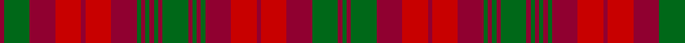

In pattern [GRGRRRRRGRGRGRGRGRGRRRRRGR](/stripes/grgrrrrrgrgrgrgrgrgrrrrrgr/).

This was sourced from logan-1831.  It is a [26 stripe tartan](/stripes/stripes26/).

Original link /posts/logans-scottish-gael/

## Provenance

James Logan recorded the **MacNab** sett in 1831, on page 406 of the *Table of Clan Tartans* in *The Scottish Gaël* — the earliest systematic published collection of clan setts. Logan gives the stripe widths in eighths of an inch, measured across the cloth and reflected about each end (a half-sett):

> 1 green · 1 crimson · 6 green · 6 crimson · 6 red · 1 crimson · 6 red · 6 crimson · 1 green · 1 crimson · 1 green · 1 crimson · 6 green · 1 crimson · 1 green · 1 crimson · 1 green · 1 crimson · 1 green · 6 crimson · 6 red · 1 crimson · 6 red · 6 crimson · 6 green · 1 crimson

In threads (at 8 to the eighth-inch) that is `G/8 C8 G48 C48 R48 C8 R48 C48 G8 C8 G8 C8 G48 C8 G8 C8 G8 C8 G8 C48 R48 C8 R48 C48 G48 C/8`. Logan named his colours rather than dyeing to a standard, so the palette here is the Dictionary's modern reading of his names.

See [Logan's Scottish Gaël](/posts/logans-scottish-gael/) for the full table and method.

## Related setts

Later records of the **MacNab** name adjusted Logan's counts: [MacNab](/setts/s4/g15r3b11ba2~b141e46-ba3c82af-g005020-rdc0000~x2/); [MacNab #2](/setts/s6/g1r1g7r4ra7r1~g006818-ra00048-rac80000~x4/); [MacNab #3](/setts/s7/g6r2ra2g4ra2r12k1~g005020-k101010-rdc0000-ra960028~x2/); [MacNab #4](/setts/s5/r86g3ra3g6ra85~g005020-rc82828-radc0000~x2/). Compare their thread counts with Logan's above.

## Thread count
DR/8 G48 DR48 R48 DR8 R48 DR48 G8 DR8 G8 DR8 G8 DR8 G48 DR8 G8 DR8 G8 DR48 R48 DR8 R48 DR48 G48 DR8 G/8

## Palette
Each colour and its ΔE from the base-6 reference it is a variant of.

| Colour | Shade | Base | ΔE (OKLab) |
|---|---|---|---|
| DR | <code style="background-color:#900030;">#900030</code> `#900030` | R <code style="background-color:#CC0000;">#CC0000</code> | 0.14 |
| G | <code style="background-color:#006818;">#006818</code> `#006818` | G <code style="background-color:#006100;">#006100</code> | 0.02 |
| R | <code style="background-color:#C80000;">#C80000</code> `#C80000` | R <code style="background-color:#CC0000;">#CC0000</code> | 0.01 |

## Nearest tartans

The nearest existing variants by ΔTartan distance.

1. [MacIntosh Ancient](/setts/s20/r5o1r2dg4r3dg2r2o5r5dg1r1dg2r1dg1r1dg4r1dg1r1dg2~x2/) — ΔT 1.59
1. [MacNab (Logan)](/setts/s13/g8m1g1m1g1m6r8m1r8m6g7m1g1~x4/) — ΔT 1.60
1. [MacNab Clan Tartan Tartan Number: 857. Earliest known date: c.1816 The structure of the MacNab is identical with that of the Black Watch; but, by a translation of colours, the most subdued of tartans becomes one of the most striking. D.C.Stewart suggests looking at the pattern through a green filter to see the effect. James Logan recorded ths pattern in his book, 'The Scottish Gael' in 1831, despite receiving a different sett from the largest weaving company of the time, William Wilson and Company, Bannockburn. Wilson's MacNab survives as an alternative tartan for the clan. James Charles MacNab of MacNab, Wester Kilmany, Fife, was recognised as chief in 1970. See products available Copyright © Blair Urquhart, Comrie, 2015](/setts/s13/g8m1g1m1g1m6r8m1r8m6g7m1g1~x2/) — ΔT 1.60
1. [MacNab](/setts/s13/dg8r1dg1r1dg1r6r8r1r8r6dg7r1dg1/) — ΔT 1.60
1. [Mauthe Unidentified](/setts/s17/r2dy2r20dy2r2dy2r2dy15g13dy2w2dy2g13dy15r14dy2r2~x2/) — ΔT 1.74
1. [Buchanan Variation (Fashion)](/setts/s18/r7do1do3do1dg4do3dg4do1do4do1dg4do1dg4do1do4do1r7dg1~x4/) — ΔT 1.75
1. [MacIntosh Old Ancient Artifact Tartan Tartan Number: 966. Earliest known date: pre 2003 The name 'MacKintosh' is usually spelled with a 'K'. In this instance the tartan sample is labelled MacIntosh. See products available Copyright © Blair Urquhart, Comrie, 2015](/setts/s20/r5o1r2g4r3g2r2o5r5g1r1g2r1g1r1g4r1g1r1g2~x2/) — ΔT 1.77
1. [MacNab 3](/setts/s13/g8r1g1r1g1r6r8r1r8r6g7r1g1~x2/) — ΔT 1.80
1. [Poulter SG 101 (Fashion)](/setts/s13/lo25r8lo8r8lo8r46dy46r8dy46r46lo46r8lo8/) — ΔT 1.84
1. [Mauthe Unidentified (Name?)](/setts/s15/r20dy2r2dy2r2dy15g13dy2w2dy2g13dy15r14dy2r2~x2/) — ΔT 1.86

## Neighbour map

Every grey dot is one of 14299 variants placed by the first two principal components of the ΔTartan feature space (44% of its variance). Red is this tartan; blue dots are its nearest — click one to open its page.

<svg viewBox="0 0 640 380" role="img" style="max-width:100%;height:auto;border:1px solid #e0e0e0;border-radius:4px;display:block" xmlns="http://www.w3.org/2000/svg"><image href="/nn/cloud.v1.png" width="640" height="380"/><a href="/setts/s20/r5o1r2dg4r3dg2r2o5r5dg1r1dg2r1dg1r1dg4r1dg1r1dg2~x2/"><circle cx="266.0" cy="222.5" r="4" fill="#3465a4"><title>MacIntosh Ancient</title></circle></a><a href="/setts/s13/g8m1g1m1g1m6r8m1r8m6g7m1g1~x4/"><circle cx="249.7" cy="211.2" r="4" fill="#3465a4"><title>MacNab (Logan)</title></circle></a><a href="/setts/s13/g8m1g1m1g1m6r8m1r8m6g7m1g1~x2/"><circle cx="249.7" cy="211.2" r="4" fill="#3465a4"><title>MacNab Clan Tartan Tartan Number: 857. Earliest known date: c.1816 The structure of the MacNab is identical with that of the Black Watch; but, by a translation of colours, the most subdued of tartans becomes one of the most striking. D.C.Stewart suggests looking at the pattern through a green filter to see the effect. James Logan recorded ths pattern in his book, 'The Scottish Gael' in 1831, despite receiving a different sett from the largest weaving company of the time, William Wilson and Company, Bannockburn. Wilson's MacNab survives as an alternative tartan for the clan. James Charles MacNab of MacNab, Wester Kilmany, Fife, was recognised as chief in 1970. See products available Copyright © Blair Urquhart, Comrie, 2015</title></circle></a><a href="/setts/s13/dg8r1dg1r1dg1r6r8r1r8r6dg7r1dg1/"><circle cx="258.1" cy="215.9" r="4" fill="#3465a4"><title>MacNab</title></circle></a><a href="/setts/s17/r2dy2r20dy2r2dy2r2dy15g13dy2w2dy2g13dy15r14dy2r2~x2/"><circle cx="257.7" cy="171.5" r="4" fill="#3465a4"><title>Mauthe Unidentified</title></circle></a><a href="/setts/s18/r7do1do3do1dg4do3dg4do1do4do1dg4do1dg4do1do4do1r7dg1~x4/"><circle cx="211.7" cy="210.8" r="4" fill="#3465a4"><title>Buchanan Variation (Fashion)</title></circle></a><a href="/setts/s20/r5o1r2g4r3g2r2o5r5g1r1g2r1g1r1g4r1g1r1g2~x2/"><circle cx="260.1" cy="221.0" r="4" fill="#3465a4"><title>MacIntosh Old Ancient Artifact Tartan Tartan Number: 966. Earliest known date: pre 2003 The name 'MacKintosh' is usually spelled with a 'K'. In this instance the tartan sample is labelled MacIntosh. See products available Copyright © Blair Urquhart, Comrie, 2015</title></circle></a><a href="/setts/s13/g8r1g1r1g1r6r8r1r8r6g7r1g1~x2/"><circle cx="239.8" cy="208.0" r="4" fill="#3465a4"><title>MacNab 3</title></circle></a><a href="/setts/s13/lo25r8lo8r8lo8r46dy46r8dy46r46lo46r8lo8/"><circle cx="237.4" cy="227.3" r="4" fill="#3465a4"><title>Poulter SG 101 (Fashion)</title></circle></a><a href="/setts/s15/r20dy2r2dy2r2dy15g13dy2w2dy2g13dy15r14dy2r2~x2/"><circle cx="252.3" cy="180.8" r="4" fill="#3465a4"><title>Mauthe Unidentified (Name?)</title></circle></a><circle cx="254.4" cy="200.2" r="5" fill="#c00000"/></svg>

ID: /setts/s26/r1g6r6r6r1r6r6g1r1g1r1g1r1g6r1g1r1g1r6r6r1r6r6g6r1g1~x8/
