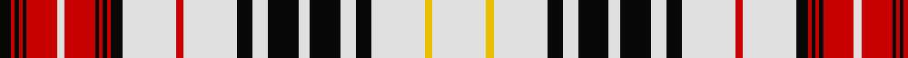

In pattern [KRKRKRWRKRKRKWRWKWKWKWKWYW](/patterns/krkrkrwrkrkrkwrwkwkwkwkwyw/).

This was sourced from house-of-tartan.  It is a [26 stripes tartan](/stripes/stripes26/).

Original link http://www.house-of-tartan.scotland.net/house/TartanViewjs.asp?colr=Def&tnam=6751

## Thread count
K/6 R2 K2 R2 K2 R16 LN4 R16 K2 R2 K2 R2 K6 LN28 R4 LN28 K8 LN8 K16 LN6 K16 LN8 K8 LN28 Y4 LN/28

## Palette
Each colour and its ΔE from the base-6 reference it is a variant of.

| Colour | Shade | Base | ΔE (OKLab) |
|---|---|---|---|
| K | <code style="background-color:#080808;">#080808</code> `#080808` | K <code style="background-color:#000000;">#000000</code> | 0.13 |
| LN | <code style="background-color:#E0E0E0;">#E0E0E0</code> `#E0E0E0` | W <code style="background-color:#F4F4F0;">#F4F4F0</code> | 0.06 |
| R | <code style="background-color:#C80000;">#C80000</code> `#C80000` | R <code style="background-color:#C80000;">#C80000</code> | 0.00 |
| Y | <code style="background-color:#E8C000;">#E8C000</code> `#E8C000` | Y <code style="background-color:#E8C000;">#E8C000</code> | 0.00 |

ID: /setts/s26/w28y4w28k8w8k16w6k16w8k8w28r4w28k6r2k2r2k2r16w4r16k2r2k2r2k6-k080808-rc80000-we0e0e0-ye8c000/
