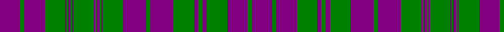

In pattern [BGBGBGBGBGBGBGBGBGBGBGBGBGB](/patterns/bgbgbgbgbgbgbgbgbgbgbgbgbgb/).

This was sourced from weddslist.  It is a [27 stripes tartan](/stripes/stripes27/).

Original link http://www.weddslist.com/cgi-bin/tartans/pg.pl?source=sts

## Thread count
P/28 G6 P28 G28 P2 G2 P4 G2 P2 G28 P2 G2 P4 G2 P2 G28 P32 G6 P32 G28 P6 G6 P6 G28 P28 G6 P/28

## Palette
Each colour and its ΔE from the base-6 reference it is a variant of.

| Colour | Shade | Base | ΔE (OKLab) |
|---|---|---|---|
| G | <code style="background-color:#008000;">#008000</code> `#008000` | G <code style="background-color:#006100;">#006100</code> | 0.10 |
| P | <code style="background-color:#800080;">#800080</code> `#800080` | B <code style="background-color:#2A418A;">#2A418A</code> | 0.17 |

## Nearest tartans

The nearest existing variants by ΔTartan distance.

1. [MacRae, Rae](/setts/s27/b27g6b27g28b5g7b5g28b31g6b31g28b2g2b4g2b2g28b2g2b4g2b2g28b27g6b27~b800080-g008000~x2/) — ΔT 0.14
1. [MacRae, (MacCrae)](/setts/s31/b25g6b25g26b5g7b5g26w3g7b29g6b29g7w3g26b2g2b4g2b2g26b2g2b4g2b2g26b25g6b25~b800080-g008000-we0e0e0~x2/) — ΔT 1.02
1. [MacRae (MacCrae)](/setts/s31/b25g6b25g26b5g7b5g26w3g7b29g6b29g7w3g26b2g2b4g2b2g26b2g2b4g2b2g26b25g6b25~b5a008c-g005020-we0e0e0~x2/) — ΔT 1.79
1. [MacTier of Durris](/setts/s18/r18b1r1b2r1b1r18b18r2b18r18g2r4g2r18g18r2g9~b00008c-g007800-r8c0000~x2/) — ΔT 1.80
1. [Amstartan](/setts/s25/k6r5k5r5k5r5k12w2k2w2k12r5k38r21k6r21w2k12w2k12r3w2r3w2k6~k18161b-rab1a22-wffffff/) — ΔT 1.84
1. [MacRae/Rae](/setts/s27/b27g6b27g28b5g7b5g28b31g6b31g28b2g2b4g2b2g28b2g2b4g2b2g28b27g6b27~b5a008c-g005020~x2/) — ΔT 1.87
1. [MacRae (Rae)](/setts/s27/b14g3b14g14b3g3b3g14b16g3b16g14b1g1b2g1b1g14b1g1b2g1b1g14b14g3b14~b5a008c-g005020~x2/) — ΔT 1.89
1. [Rae (Wilsons) (Clan)](/setts/s27/b27g12b54g56b10g14b10g56b62g12b62g56b4g4b8g4b4g56b4g4b8g4b4g56b54g12b27~b440044-g285800/) — ΔT 1.90
1. [Watertown Library Assoc.](/setts/s14/g4k2g31k8g2k27g2k4g2k27g2k8g31k2~g789484-k101010~x2/) — ΔT 1.97
1. [Westwood MacRock (Fashion)](/setts/s13/k11r2k11r20w2r20k7r1k7r1k7r11w1~k101010-r888888-we0e0e0~x2/) — ΔT 2.00

## Neighbour map

Every grey dot is one of 15726 variants placed by the first two principal components of the ΔTartan feature space (44% of its variance). Red is this tartan; blue dots are its nearest — click one to open its page.

<svg viewBox="0 0 640 380" role="img" style="max-width:100%;height:auto;border:1px solid #e0e0e0;border-radius:4px;display:block" xmlns="http://www.w3.org/2000/svg"><image href="/nn/cloud.v1.png" width="640" height="380"/><a href="/setts/s27/b27g6b27g28b5g7b5g28b31g6b31g28b2g2b4g2b2g28b2g2b4g2b2g28b27g6b27~b800080-g008000~x2/"><circle cx="348.9" cy="161.4" r="4" fill="#3465a4"><title>MacRae, Rae</title></circle></a><a href="/setts/s31/b25g6b25g26b5g7b5g26w3g7b29g6b29g7w3g26b2g2b4g2b2g26b2g2b4g2b2g26b25g6b25~b800080-g008000-we0e0e0~x2/"><circle cx="307.4" cy="138.1" r="4" fill="#3465a4"><title>MacRae, (MacCrae)</title></circle></a><a href="/setts/s31/b25g6b25g26b5g7b5g26w3g7b29g6b29g7w3g26b2g2b4g2b2g26b2g2b4g2b2g26b25g6b25~b5a008c-g005020-we0e0e0~x2/"><circle cx="338.1" cy="156.8" r="4" fill="#3465a4"><title>MacRae (MacCrae)</title></circle></a><a href="/setts/s18/r18b1r1b2r1b1r18b18r2b18r18g2r4g2r18g18r2g9~b00008c-g007800-r8c0000~x2/"><circle cx="323.6" cy="155.9" r="4" fill="#3465a4"><title>MacTier of Durris</title></circle></a><a href="/setts/s25/k6r5k5r5k5r5k12w2k2w2k12r5k38r21k6r21w2k12w2k12r3w2r3w2k6~k18161b-rab1a22-wffffff/"><circle cx="356.3" cy="126.5" r="4" fill="#3465a4"><title>Amstartan</title></circle></a><a href="/setts/s27/b27g6b27g28b5g7b5g28b31g6b31g28b2g2b4g2b2g28b2g2b4g2b2g28b27g6b27~b5a008c-g005020~x2/"><circle cx="388.4" cy="184.0" r="4" fill="#3465a4"><title>MacRae/Rae</title></circle></a><a href="/setts/s27/b14g3b14g14b3g3b3g14b16g3b16g14b1g1b2g1b1g14b1g1b2g1b1g14b14g3b14~b5a008c-g005020~x2/"><circle cx="394.4" cy="182.9" r="4" fill="#3465a4"><title>MacRae (Rae)</title></circle></a><a href="/setts/s27/b27g12b54g56b10g14b10g56b62g12b62g56b4g4b8g4b4g56b4g4b8g4b4g56b54g12b27~b440044-g285800/"><circle cx="388.3" cy="185.0" r="4" fill="#3465a4"><title>Rae (Wilsons) (Clan)</title></circle></a><a href="/setts/s14/g4k2g31k8g2k27g2k4g2k27g2k8g31k2~g789484-k101010~x2/"><circle cx="345.5" cy="175.9" r="4" fill="#3465a4"><title>Watertown Library Assoc.</title></circle></a><a href="/setts/s13/k11r2k11r20w2r20k7r1k7r1k7r11w1~k101010-r888888-we0e0e0~x2/"><circle cx="323.7" cy="167.9" r="4" fill="#3465a4"><title>Westwood MacRock (Fashion)</title></circle></a><circle cx="355.1" cy="160.2" r="5" fill="#c00000"/></svg>

ID: /setts/s27/b14g3b14g14b3g3b3g14b16g3b16g14b1g1b2g1b1g14b1g1b2g1b1g14b14g3b14~b800080-g008000~x2/
