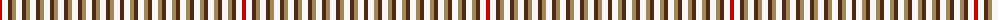

In pattern [BWYBWYBWYBWYBWYBWYBWYBWYBWR](/patterns/bwybwybwybwybwybwybwybwybwr/).

This was sourced from register-of-tartans.  It is a [27 stripes tartan](/stripes/stripes27/).

Original link https://www.tartanregister.gov.uk/tartanDetails.aspx?ref=1425

## Attestations

This cloth appears in 2 source records; the oldest owns this page.

- 01/01/2002 — Glenmoidart (register-of-tartans, [record](https://www.tartanregister.gov.uk/tartanDetails.aspx?ref=1425))
- pre 2002 — Glenmoidart (Estate Check) (tartans-authority, [record](http://www.tartansauthority.com/tartan-ferret/display/5039/))

## Thread count
R/4 W6 T4 LT4 W6 T4 LT4 W6 T4 LT4 W6 T4 LT4 W6 T4 LT4 W6 T4 LT4 W6 T4 LT4 W6 T4 LT4 W6 T/4

## Palette
Each colour and its ΔE from the base-6 reference it is a variant of.

| Colour | Shade | Base | ΔE (OKLab) |
|---|---|---|---|
| LT | <code style="background-color:#A08858;">#A08858</code> `#A08858` | Y <code style="background-color:#E8C000;">#E8C000</code> | 0.21 |
| R | <code style="background-color:#C80000;">#C80000</code> `#C80000` | R <code style="background-color:#C80000;">#C80000</code> | 0.00 |
| T | <code style="background-color:#502814;">#502814</code> `#502814` | B <code style="background-color:#2C4084;">#2C4084</code> | 0.19 |
| W | <code style="background-color:#F8F8F8;">#F8F8F8</code> `#F8F8F8` | W <code style="background-color:#F4F4F0;">#F4F4F0</code> | 0.01 |

ID: /setts/s27/b4w6y4b4w6y4b4w6y4b4w6y4b4w6y4b4w6y4b4w6y4b4w6y4b4w6r4-b502814-rc80000-wf8f8f8-ya08858/
