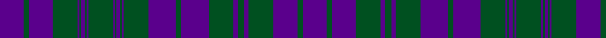

In pattern [BGBGBGBGBGBGBGBGBGBGBGBGBGB](/patterns/bgbgbgbgbgbgbgbgbgbgbgbgbgb/).

This was sourced from register-of-tartans.  It is a [27 stripes tartan](/stripes/stripes27/).

Original link https://www.tartanregister.gov.uk/tartanDetails.aspx?ref=2757

## Attestations

This cloth appears in 2 source records; the oldest owns this page.

- undated — MacRae/Rae (register-of-tartans, [record](https://www.tartanregister.gov.uk/tartanDetails.aspx?ref=2757))
- undated — Auld Lang Syne (Viking Technology) (register-of-tartans, [record](https://www.tartanregister.gov.uk/tartanDetails.aspx?ref=5335))

## Thread count
P/54 G12 P54 G56 P4 G4 P8 G4 P4 G56 P4 G4 P8 G4 P4 G56 P62 G12 P62 G56 P10 G14 P10 G56 P54 G12 P/54

## Palette
Each colour and its ΔE from the base-6 reference it is a variant of.

| Colour | Shade | Base | ΔE (OKLab) |
|---|---|---|---|
| G | <code style="background-color:#005020;">#005020</code> `#005020` | G <code style="background-color:#006400;">#006400</code> | 0.08 |
| P | <code style="background-color:#5A008C;">#5A008C</code> `#5A008C` | B <code style="background-color:#2C4084;">#2C4084</code> | 0.12 |

ID: /setts/s27/b54g12b54g56b10g14b10g56b62g12b62g56b4g4b8g4b4g56b4g4b8g4b4g56b54g12b54-b5a008c-g005020/
