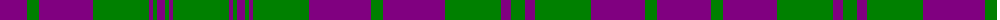

In pattern [BGBGBGBGBGBGBGBGBGBGBGBGBGB](/patterns/bgbgbgbgbgbgbgbgbgbgbgbgbgb/).

This was sourced from weddslist.  It is a [27 stripes tartan](/stripes/stripes27/).

Original link http://www.weddslist.com/cgi-bin/tartans/pg.pl?source=sts

## Thread count
P/54 G12 P54 G56 P4 G4 P8 G4 P4 G56 P4 G4 P8 G4 P4 G56 P62 G12 P62 G56 P10 G14 P10 G56 P54 G12 P/54

## Palette
Each colour and its ΔE from the base-6 reference it is a variant of.

| Colour | Shade | Base | ΔE (OKLab) |
|---|---|---|---|
| G | <code style="background-color:#008000;">#008000</code> `#008000` | G <code style="background-color:#006400;">#006400</code> | 0.09 |
| P | <code style="background-color:#800080;">#800080</code> `#800080` | B <code style="background-color:#2C4084;">#2C4084</code> | 0.17 |

ID: /setts/s27/b54g12b54g56b10g14b10g56b62g12b62g56b4g4b8g4b4g56b4g4b8g4b4g56b54g12b54-b800080-g008000/
