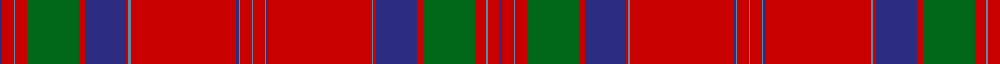

**Bands:** [BRBRGRBRBRBBRBRBBRBRBRGRBRB](/stripes/brbrgrbrbrbbrbrbbrbrbrgrbrb/) · **Stripes:** [DB R T R G R DB R T R DB T R T R T DB R T R DB R G R T R DB](/stripes/stripes27/) DB R T R G R DB R T R DB T R T R T DB R T R DB R G R T R DB

This was sourced from logan-1831.  It is a [27 band tartan](/bands/bands27/).

Original link /posts/logans-scottish-gael/

## Provenance

James Logan recorded the **MacGillivray** sett in 1831, on page 405 of the *Table of Clan Tartans* in *The Scottish Gaël* — the earliest systematic published collection of clan setts. Logan gives the stripe widths in eighths of an inch, measured across the cloth and reflected about each end (a half-sett):

> ½ blue · 2 red · ¼ azure · 2 red · 9 green · 1 red · 7 blue · ½ red · ¼ azure · 18 red · ¼ blue · ¼ azure · 2 red · ¼ azure · 2 red · ¼ azure · ½ blue · 18 red · ½ azure · ½ red · 7 blue · 1 red · 9 green · 2 red · ¼ azure · 2 red · ½ blue

In threads (at 8 to the eighth-inch) that is `B/4 R16 A2 R16 G72 R8 B56 R4 A2 R144 B2 A2 R16 A2 R16 A2 B4 R144 A4 R4 B56 R8 G72 R16 A2 R16 B/4`. Logan named his colours rather than dyeing to a standard, so the palette here is the Dictionary's modern reading of his names.

See [Logan's Scottish Gaël](/posts/logans-scottish-gael/) for the full table and method.

## Related setts

Later records of the **MacGillivray** name adjusted Logan's counts: [MacGillivray](/setts/s13/r6b1ba1r57b2r2ba23r4g30r6b1r6ba2~b5c8ca8-ba0000cd-g006818-rc80000~x2/); [MacGillivray #2](/setts/s13/k6b1ba1r57b2r2ba23r4g30r6b1r6ba2~b3c82af-ba5a008c-g005020-k101010-rdc0000~x2/); [MacGillivray #3](/setts/s14/g19r7g7r7g7r14b3r3g19r3b3r66b7r14~b2c4084-g005020-rdc0000~x2/); [MacGillivray Hunting](/setts/s14/g8r5g5r5g5r6b1r2g8r2b1r24b4r6~b1c0070-g006818-r98481c~x2/). Compare their thread counts with Logan's above.

## Thread count
DB/4 R16 B2 R16 G72 R8 DB56 R4 B4 R144 DB4 B2 R16 B2 R16 B2 DB2 R144 B2 R4 DB56 R8 G72 R16 B2 R16 DB/4

## Palette
Each colour and its ΔE from the base-6 reference it is a variant of.

| Colour | Shade | Base | ΔE (OKLab) |
|---|---|---|---|
| B | <code style="background-color:#5C8CA8;">#5C8CA8</code> `#5C8CA8` | B <code style="background-color:#2A418A;">#2A418A</code> | 0.23 |
| DB | <code style="background-color:#2C2C80;">#2C2C80</code> `#2C2C80` | B <code style="background-color:#2A418A;">#2A418A</code> | 0.06 |
| G | <code style="background-color:#006818;">#006818</code> `#006818` | G <code style="background-color:#006100;">#006100</code> | 0.02 |
| R | <code style="background-color:#C80000;">#C80000</code> `#C80000` | R <code style="background-color:#CC0000;">#CC0000</code> | 0.01 |

## Nearest tartans

The nearest existing variants by ΔTartan distance.

1. [MacAlister (Cockburn Collection 1810-20)](/setts/s23/r32dg8r4dg8r8db8r12t1r1dg18r1t1r32t1r1dg18r1t1r12dg6r1t1r4~x2/) — ΔT 1.32
1. [Dalziel #1](/setts/s17/r40w2db1r3dg31r3db1w2r3db8r3w2db1r34dg4r4dg4~x2/) — ΔT 1.33
1. [Dalziel](/setts/s17/r40w2db1r3g31r3db1w2r3db8r3w2db1r34g4r4g4~x2/) — ΔT 1.35
1. [MacAlister CC](/setts/s23/r32dg8r4dg8r8db8r12lb1r1dg18r1lb1r32lb1r1dg18r1lb1r12dg6r1lb1r4~x2/) — ΔT 1.38
1. [Ramada Corporate Tartan Tartan Number: 6374. Earliest known date: 2004 Re-created from an artifact in the Telfer Dunbar collection at the Scottish Tartans Museum. The unusual bleaching effect that has occurred either by design or by age, has been enhanced in this new design. It is a feature often seen in silk fabrics over 200 years old. See products available Copyright © Blair Urquhart, Comrie, 2015](/setts/s34/r66n1db1r6dg30r6db1n1r3db16r3n1db1r54dg3o1r6dg6~x2/) — ΔT 1.41
1. [Unnamed C18th - Duke of Perth](/setts/s26/db30r14db2r14g20w1g2w1g20r44db4r10t1r4~x2/) — ΔT 1.41
1. [Grant or Drummond Clan Tartan Tartan Number: 1384. Earliest known date: 1831 The usual design is sometimes called Drummond. It is recorded by Logan (1831), Smibert (1850), and Smith (1850). McIan's drawing of the Grant tartan is too roughly done to make out the pattern details. A certain difficulty arises in establishing a single Grant tartan to represent the clan, illustrated by the existance of ten Grant portraits at Cullen House in which each brother is wearing a different tartan, and where a coat or plaid is worn, these also differ. The chief of the Grants is Lord Strathspey. See products available Copyright © Blair Urquhart, Comrie, 2015](/setts/s15/r6db2r2g24r2g2r2db8r2t2r32db2r2db1r6~x2/) — ΔT 1.44
1. [Murray of Tullibardine #2](/setts/s21/db2r1db1r2db4r2db1r1k2r1db1r24db12r2dg2r8dg12r4db2r2k1~x2/) — ΔT 1.44
1. [Dalzell](/setts/s17/r24lb1db2r4dg32r4db2lb1r4db6r4lb1db2r32dg2r3dg6~x2/) — ΔT 1.45
1. [Murray of Tullibardine 1](/setts/s21/db2r1db1r2db4r2db1r1k2r1db1r24db12r2g2r8g12r4db2r2k1~x2/) — ΔT 1.45

## Neighbour map

Every grey dot is one of 14299 variants placed by the first two principal components of the ΔTartan feature space (44% of its variance). Red is this tartan; blue dots are its nearest — click one to open its page.

<svg viewBox="0 0 640 380" role="img" style="max-width:100%;height:auto;border:1px solid #e0e0e0;border-radius:4px;display:block" xmlns="http://www.w3.org/2000/svg"><image href="/nn/cloud.v1.png" width="640" height="380"/><a href="/setts/s23/r32dg8r4dg8r8db8r12t1r1dg18r1t1r32t1r1dg18r1t1r12dg6r1t1r4~x2/"><circle cx="401.2" cy="84.0" r="4" fill="#3465a4"><title>MacAlister (Cockburn Collection 1810-20)</title></circle></a><a href="/setts/s17/r40w2db1r3dg31r3db1w2r3db8r3w2db1r34dg4r4dg4~x2/"><circle cx="419.4" cy="66.5" r="4" fill="#3465a4"><title>Dalziel #1</title></circle></a><a href="/setts/s17/r40w2db1r3g31r3db1w2r3db8r3w2db1r34g4r4g4~x2/"><circle cx="423.8" cy="72.9" r="4" fill="#3465a4"><title>Dalziel</title></circle></a><a href="/setts/s23/r32dg8r4dg8r8db8r12lb1r1dg18r1lb1r32lb1r1dg18r1lb1r12dg6r1lb1r4~x2/"><circle cx="395.3" cy="83.9" r="4" fill="#3465a4"><title>MacAlister CC</title></circle></a><a href="/setts/s34/r66n1db1r6dg30r6db1n1r3db16r3n1db1r54dg3o1r6dg6~x2/"><circle cx="455.9" cy="25.6" r="4" fill="#3465a4"><title>Ramada Corporate Tartan Tartan Number: 6374. Earliest known date: 2004 Re-created from an artifact in the Telfer Dunbar collection at the Scottish Tartans Museum. The unusual bleaching effect that has occurred either by design or by age, has been enhanced in this new design. It is a feature often seen in silk fabrics over 200 years old. See products available Copyright © Blair Urquhart, Comrie, 2015</title></circle></a><a href="/setts/s26/db30r14db2r14g20w1g2w1g20r44db4r10t1r4~x2/"><circle cx="347.9" cy="60.1" r="4" fill="#3465a4"><title>Unnamed C18th - Duke of Perth</title></circle></a><a href="/setts/s15/r6db2r2g24r2g2r2db8r2t2r32db2r2db1r6~x2/"><circle cx="391.0" cy="92.9" r="4" fill="#3465a4"><title>Grant or Drummond Clan Tartan Tartan Number: 1384. Earliest known date: 1831 The usual design is sometimes called Drummond. It is recorded by Logan (1831), Smibert (1850), and Smith (1850). McIan's drawing of the Grant tartan is too roughly done to make out the pattern details. A certain difficulty arises in establishing a single Grant tartan to represent the clan, illustrated by the existance of ten Grant portraits at Cullen House in which each brother is wearing a different tartan, and where a coat or plaid is worn, these also differ. The chief of the Grants is Lord Strathspey. See products available Copyright © Blair Urquhart, Comrie, 2015</title></circle></a><a href="/setts/s21/db2r1db1r2db4r2db1r1k2r1db1r24db12r2dg2r8dg12r4db2r2k1~x2/"><circle cx="343.0" cy="85.4" r="4" fill="#3465a4"><title>Murray of Tullibardine #2</title></circle></a><a href="/setts/s17/r24lb1db2r4dg32r4db2lb1r4db6r4lb1db2r32dg2r3dg6~x2/"><circle cx="381.4" cy="84.0" r="4" fill="#3465a4"><title>Dalzell</title></circle></a><a href="/setts/s21/db2r1db1r2db4r2db1r1k2r1db1r24db12r2g2r8g12r4db2r2k1~x2/"><circle cx="341.6" cy="88.4" r="4" fill="#3465a4"><title>Murray of Tullibardine 1</title></circle></a><circle cx="411.4" cy="45.5" r="5" fill="#c00000"/></svg>

ID: /setts/s27/db2r8t1r8g36r4db28r2t2r72db2t1r8t1r8t1db1r72t1r2db28r4g36r8t1r8db2~x2/
