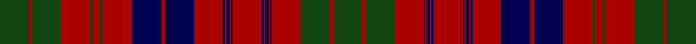

This page is one **sett** — a single exact thread-count. It belongs to the [tartan](/tartans/dg18dr2dg18dr18dg2dr4dg2dr18db18dr2db18dr18db1dr1db2dr1db1dr18db1dr1db2dr1db1dr18dg18dr2dg18/)
(the same proportion at any scale), whose colour order is pattern [GRGRBRBRBRBRBRBRBRBRGRGRGRG](/stripes/grgrbrbrbrbrbrbrbrbrgrgrgrg/).

Sourced from weddslist.  It is a [27 stripe tartan](/stripes/stripes27/).

Original link http://www.weddslist.com/cgi-bin/tartans/pg.pl?source=x

## Thread count
DG/18 DR2 DG18 DR18 DG2 DR4 DG2 DR18 DB18 DR2 DB18 DR18 DB1 DR1 DB2 DR1 DB1 DR18 DB1 DR1 DB2 DR1 DB1 DR18 DG18 DR2 DG/18

## Palette
Each colour and the base-6 reference it is a variant of.

| Colour | Shade | Base |
|---|---|---|
| DB | <code style="background-color:#000052;">#000052</code> `oklch(19.8% 0.137 264.1)` <small>#000052</small> | B <code style="background-color:#2A418A;">#2A418A</code> |
| DG | <code style="background-color:#11450D;">#11450D</code> `oklch(34.4% 0.101 142.1)` <small>#11450D</small> | G <code style="background-color:#006100;">#006100</code> |
| DR | <code style="background-color:#AA0000;">#AA0000</code> `oklch(46.3% 0.190 29.2)` <small>#AA0000</small> | R <code style="background-color:#CC0000;">#CC0000</code> |

## Nearest tartans

The nearest existing variants by ΔTartan distance, with this tartan at the top so the swatches line up against it.

ΔTartan

Tartan

Sett

—

<a href="/ttd/edit/#slug=dg18r2dg18r18dg2r4dg2r18db18r2db18r18db1r1db2r1db1r18db1r1db2r1db1r18dg18r2dg18">Ross</a> <a class="nn-out" href="/setts/s27/dg18r2dg18r18dg2r4dg2r18db18r2db18r18db1r1db2r1db1r18db1r1db2r1db1r18dg18r2dg18/" title="open its dictionary page">↗</a>

0.84

<a href="/ttd/edit/#slug=g18r2g18r18g2r4g2r18db18r2db18r18db1r1db2r1db1r18db1r1db2r1db1r18g18r2g18~x2">Ross Clan Tartan Tartan Number: 864. Earliest known date: 1810-15 D.C.Stewart says, &quot;The version here given may be taken to be correct.&quot; Later versions, including Logans, are known to have omissions. The Clan Ross is descended from Fearcher MacinTagart, Earl of Ross in the 13th century. The chiefship has passed to the Rosses of Shandwick. The tartan is also worn by the MacTiers. Also worn by the Metro Toronto Police pipe band. (Strathallan 1994) See products available Copyright © Blair Urquhart, Comrie, 2015</a> <a class="nn-out" href="/setts/s27/g18r2g18r18g2r4g2r18db18r2db18r18db1r1db2r1db1r18db1r1db2r1db1r18g18r2g18~x2/" title="open its dictionary page">↗</a>

0.85

<a href="/ttd/edit/#slug=g18r2g18r18g2r4g2r18db18r2db18r18db1r1db2r1db1r18db1r1g2r1db1r18g18r2g18~x2">Ross (Clan)</a> <a class="nn-out" href="/setts/s27/g18r2g18r18g2r4g2r18db18r2db18r18db1r1db2r1db1r18db1r1g2r1db1r18g18r2g18~x2/" title="open its dictionary page">↗</a>

0.90

<a href="/ttd/edit/#slug=dg8r4dg1r1dg1r24db8dg4r1dg1r1dg4r8dg1r1dg1r1db8dg8r2dg4~x2">Matheson</a> <a class="nn-out" href="/setts/s21/dg8r4dg1r1dg1r24db8dg4r1dg1r1dg4r8dg1r1dg1r1db8dg8r2dg4~x2/" title="open its dictionary page">↗</a>

0.91

<a href="/ttd/edit/#slug=dg18r2dg18r18dg2r4dg2r18db18r2db18r18db1r1db2r1db1r18db1r1db2r1db1r18dg18r2dg18~x2">Ross #4</a> <a class="nn-out" href="/setts/s27/dg18r2dg18r18dg2r4dg2r18db18r2db18r18db1r1db2r1db1r18db1r1db2r1db1r18dg18r2dg18~x2/" title="open its dictionary page">↗</a>

1.01

<a href="/ttd/edit/#slug=g7r2g2r2g2r27db9g2r2g2r2g2r6g2r2g2r2db10g6r2db5~x2">Matheson (Lochcarron)</a> <a class="nn-out" href="/setts/s21/g7r2g2r2g2r27db9g2r2g2r2g2r6g2r2g2r2db10g6r2db5~x2/" title="open its dictionary page">↗</a>

1.11

<a href="/setts/s26/g6r2g2r18dp9r3g3r3dp9r3g24r2g2r4~x2/">Stewart of Killiecrankie</a>

1.12

<a href="/ttd/edit/#slug=db18r2db18r18dg2r4dg2r18dg18r2dg18r2dg18r18db1r1db2r1db1r18~x2">Ross</a> <a class="nn-out" href="/setts/s20/db18r2db18r18dg2r4dg2r18dg18r2dg18r2dg18r18db1r1db2r1db1r18~x2/" title="open its dictionary page">↗</a>

1.13

<a href="/setts/s22/db10r1db1r1g10r13g2r13g10db10r1db1~x2/">Inverness Fencibles</a>

1.15

<a href="/ttd/edit/#slug=db10r1db1r1g10r13g2r13g10db10r1db1r1db10g10r13g2r13g10r1db1r1db5~x4">Fraser</a> <a class="nn-out" href="/setts/s23/db10r1db1r1g10r13g2r13g10db10r1db1r1db10g10r13g2r13g10r1db1r1db5~x4/" title="open its dictionary page">↗</a>

1.18

<a href="/ttd/edit/#slug=dg8r4dg1r1dg1r24db8dg4r1dg1r1dg4r8dg1r1dg1r1db8dg8r2dg4">Matheson</a> <a class="nn-out" href="/setts/s21/dg8r4dg1r1dg1r24db8dg4r1dg1r1dg4r8dg1r1dg1r1db8dg8r2dg4/" title="open its dictionary page">↗</a>

## Neighbour map

Every grey dot is one of 14299 variants placed by the first two principal components of the ΔTartan feature space (44% of its variance). Red is this tartan; blue dots are its nearest — click one to open its page.

<svg viewBox="0 0 640 380" role="img" style="max-width:100%;height:auto;border:1px solid #e0e0e0;border-radius:4px;display:block" xmlns="http://www.w3.org/2000/svg"><image href="/nn/cloud.v1.png" width="640" height="380"/><a href="/setts/s27/g18r2g18r18g2r4g2r18db18r2db18r18db1r1db2r1db1r18db1r1db2r1db1r18g18r2g18~x2/"><circle cx="292.8" cy="130.4" r="4" fill="#3465a4"><title>Ross Clan Tartan Tartan Number: 864. Earliest known date: 1810-15 D.C.Stewart says, &quot;The version here given may be taken to be correct.&quot; Later versions, including Logans, are known to have omissions. The Clan Ross is descended from Fearcher MacinTagart, Earl of Ross in the 13th century. The chiefship has passed to the Rosses of Shandwick. The tartan is also worn by the MacTiers. Also worn by the Metro Toronto Police pipe band. (Strathallan 1994) See products available Copyright © Blair Urquhart, Comrie, 2015</title></circle></a><a href="/setts/s27/g18r2g18r18g2r4g2r18db18r2db18r18db1r1db2r1db1r18db1r1g2r1db1r18g18r2g18~x2/"><circle cx="294.0" cy="130.7" r="4" fill="#3465a4"><title>Ross (Clan)</title></circle></a><a href="/setts/s21/dg8r4dg1r1dg1r24db8dg4r1dg1r1dg4r8dg1r1dg1r1db8dg8r2dg4~x2/"><circle cx="333.9" cy="125.9" r="4" fill="#3465a4"><title>Matheson</title></circle></a><a href="/setts/s27/dg18r2dg18r18dg2r4dg2r18db18r2db18r18db1r1db2r1db1r18db1r1db2r1db1r18dg18r2dg18~x2/"><circle cx="291.0" cy="127.5" r="4" fill="#3465a4"><title>Ross #4</title></circle></a><a href="/setts/s21/g7r2g2r2g2r27db9g2r2g2r2g2r6g2r2g2r2db10g6r2db5~x2/"><circle cx="316.5" cy="149.3" r="4" fill="#3465a4"><title>Matheson (Lochcarron)</title></circle></a><a href="/setts/s26/g6r2g2r18dp9r3g3r3dp9r3g24r2g2r4~x2/"><circle cx="256.1" cy="142.5" r="4" fill="#3465a4"><title>Stewart of Killiecrankie</title></circle></a><a href="/setts/s20/db18r2db18r18dg2r4dg2r18dg18r2dg18r2dg18r18db1r1db2r1db1r18~x2/"><circle cx="287.6" cy="146.2" r="4" fill="#3465a4"><title>Ross</title></circle></a><a href="/setts/s22/db10r1db1r1g10r13g2r13g10db10r1db1~x2/"><circle cx="253.7" cy="161.9" r="4" fill="#3465a4"><title>Inverness Fencibles</title></circle></a><a href="/setts/s23/db10r1db1r1g10r13g2r13g10db10r1db1r1db10g10r13g2r13g10r1db1r1db5~x4/"><circle cx="243.9" cy="161.1" r="4" fill="#3465a4"><title>Fraser</title></circle></a><a href="/setts/s21/dg8r4dg1r1dg1r24db8dg4r1dg1r1dg4r8dg1r1dg1r1db8dg8r2dg4/"><circle cx="313.4" cy="112.5" r="4" fill="#3465a4"><title>Matheson</title></circle></a><circle cx="298.2" cy="138.6" r="5" fill="#c00000"/></svg>

ID: /setts/s27/dg18r2dg18r18dg2r4dg2r18db18r2db18r18db1r1db2r1db1r18db1r1db2r1db1r18dg18r2dg18/
