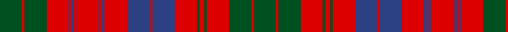

**Bands:** [GRGRBRBRBRBRBRBRBRBRGRGRGRG](/stripes/grgrbrbrbrbrbrbrbrbrgrgrgrg/) · **Stripes:** [DG R DG R DB R DB R DB R DB R DB R DB R DB R DB R DG R DG R DG R DG](/stripes/stripes27/) DG R DG R DB R DB R DB R DB R DB R DB R DB R DB R DG R DG R DG R DG

This was sourced from register-of-tartans.  It is a [27 band tartan](/bands/bands27/).

Original link https://www.tartanregister.gov.uk/tartanDetails.aspx?ref=3555

## Attestations

This cloth appears in 3 source records; the oldest owns this page.

- undated — Ross #4 (register-of-tartans, [record](https://www.tartanregister.gov.uk/tartanDetails.aspx?ref=3555))
- undated — Ross (weddslist, [record](http://www.weddslist.com/cgi-bin/tartans/pg.pl?source=tinsel))
- undated — Ross (weddslist, [record](http://www.weddslist.com/cgi-bin/tartans/pg.pl?source=x))

## Register references

External register numbers recorded for this tartan.

- Scottish Register of Tartans: [1166](https://www.tartanregister.gov.uk/tartanDetails.aspx?ref=1166)
- Scottish Register of Tartans: [1510](https://www.tartanregister.gov.uk/tartanDetails.aspx?ref=1510)
- Scottish Register of Tartans: [1758](https://www.tartanregister.gov.uk/tartanDetails.aspx?ref=1758)
- Scottish Register of Tartans: [2307](https://www.tartanregister.gov.uk/tartanDetails.aspx?ref=2307)
- Scottish Register of Tartans: [2349](https://www.tartanregister.gov.uk/tartanDetails.aspx?ref=2349)
- Scottish Register of Tartans: [2540](https://www.tartanregister.gov.uk/tartanDetails.aspx?ref=2540)
- Scottish Register of Tartans: [2582](https://www.tartanregister.gov.uk/tartanDetails.aspx?ref=2582)
- Scottish Register of Tartans: [2585](https://www.tartanregister.gov.uk/tartanDetails.aspx?ref=2585)
- Scottish Register of Tartans: [2625](https://www.tartanregister.gov.uk/tartanDetails.aspx?ref=2625)
- Scottish Register of Tartans: [2730](https://www.tartanregister.gov.uk/tartanDetails.aspx?ref=2730)
- Scottish Register of Tartans: [2862](https://www.tartanregister.gov.uk/tartanDetails.aspx?ref=2862)
- Scottish Register of Tartans: [3072](https://www.tartanregister.gov.uk/tartanDetails.aspx?ref=3072)
- Scottish Register of Tartans: [3555](https://www.tartanregister.gov.uk/tartanDetails.aspx?ref=3555)
- Scottish Register of Tartans: [4925](https://www.tartanregister.gov.uk/tartanDetails.aspx?ref=4925)
- Scottish Register of Tartans: [696](https://www.tartanregister.gov.uk/tartanDetails.aspx?ref=696)
- Scottish Register of Tartans: [697](https://www.tartanregister.gov.uk/tartanDetails.aspx?ref=697)
- Scottish Register of Tartans: [982](https://www.tartanregister.gov.uk/tartanDetails.aspx?ref=982)
- Scottish Tartans Authority (ITI): 1277
- Scottish Tartans Authority (ITI): 1429
- Scottish Tartans Authority (ITI): 218
- Scottish Tartans Authority (ITI): 977
- Scottish Tartans World Register: 1042
- Scottish Tartans World Register: 127
- Scottish Tartans World Register: 1277
- Scottish Tartans World Register: 1399
- Scottish Tartans World Register: 1429
- Scottish Tartans World Register: 1593
- Scottish Tartans World Register: 218
- Scottish Tartans World Register: 2218
- Scottish Tartans World Register: 3061
- Scottish Tartans World Register: 441
- Scottish Tartans World Register: 737
- Scottish Tartans World Register: 858
- Scottish Tartans World Register: 864
- Scottish Tartans World Register: 873
- Scottish Tartans World Register: 897
- Scottish Tartans World Register: 977
- Scottish Tartans World Register: 978

## Variants

Other setts woven to the same stripe pattern.

- [Ross](/setts/s27/dg8r1dg8r8db1r1db2r1db1r8db1r1db2r1db1r8db8r1db8r8dg1r2dg1r8dg8r1dg8~x2/)

## Thread count
G/36 R4 G36 R36 B2 R2 B4 R2 B2 R36 B2 R2 B4 R2 B2 R36 B36 R4 B36 R36 G4 R8 G4 R36 G36 R4 G/36

## Palette
Each colour and its ΔE from the base-6 reference it is a variant of.

| Colour | Shade | Base | ΔE (OKLab) |
|---|---|---|---|
| B | <code style="background-color:#2C4084;">#2C4084</code> `#2C4084` | B <code style="background-color:#2A418A;">#2A418A</code> | 0.01 |
| G | <code style="background-color:#005020;">#005020</code> `#005020` | G <code style="background-color:#006100;">#006100</code> | 0.07 |
| R | <code style="background-color:#DC0000;">#DC0000</code> `#DC0000` | R <code style="background-color:#CC0000;">#CC0000</code> | 0.03 |

## Nearest tartans

The nearest existing variants by ΔTartan distance.

1. [Ross Clan Tartan Tartan Number: 864. Earliest known date: 1810-15 D.C.Stewart says, "The version here given may be taken to be correct." Later versions, including Logans, are known to have omissions. The Clan Ross is descended from Fearcher MacinTagart, Earl of Ross in the 13th century. The chiefship has passed to the Rosses of Shandwick. The tartan is also worn by the MacTiers. Also worn by the Metro Toronto Police pipe band. (Strathallan 1994) See products available Copyright © Blair Urquhart, Comrie, 2015](/setts/s27/g18r2g18r18g2r4g2r18db18r2db18r18db1r1db2r1db1r18db1r1db2r1db1r18g18r2g18~x2/) — ΔT 0.27
1. [Ross (Clan)](/setts/s27/g18r2g18r18g2r4g2r18db18r2db18r18db1r1db2r1db1r18db1r1g2r1db1r18g18r2g18~x2/) — ΔT 0.31
1. [Ross](/setts/s20/db18r2db18r18dg2r4dg2r18dg18r2dg18r2dg18r18db1r1db2r1db1r18~x2/) — ΔT 0.67
1. [Robertson](/setts/s31/r1g17r2db2r17g2r2g2r17db2r2g17r2db17r2g2r17g2r2g2r17g2r2g17r2g17r2db2r17g2r1~x4/) — ΔT 0.85
1. [Ross 3](/setts/s20/db18r2db18r18g2r4g2r18g18r2g18r2g18r18db1r1db2r1db1r18~x2/) — ΔT 0.89
1. [Stewart of Killiecrankie](/setts/s26/g6r2g2r18dp9r3g3r3dp9r3g24r2g2r4g2r2g24r3dp9r3g3r3dp9r18g2r2~x2/) — ΔT 0.93
1. [Inverness Fencibles](/setts/s22/db1r1db10g10r13g2r13g10r1db1r1db10r1db1r1g10r13g2r13g10db10r1~x2/) — ΔT 0.94
1. [Ross 6](/setts/s18/g18r2g18r18g2r4g2r18db18r2db18r18db1r1db2r1db1r18~x2/) — ΔT 0.97
1. [Matheson Dress](/setts/s21/g8r4g1r1g1r24dp8g4r1g1r1g4r8g1r1g1r1dp8g8r2g4~x2/) — ΔT 0.99
1. [Ross #5](/setts/s18/dg18r2dg18r18dg2r4dg2r18db18r2db18r18db1r1db2r1db1r18~x2/) — ΔT 1.00

## Neighbour map

Every grey dot is one of 14313 variants placed by the first two principal components of the ΔTartan feature space (44% of its variance). Red is this tartan; blue dots are its nearest — click one to open its page.

<svg viewBox="0 0 640 380" role="img" style="max-width:100%;height:auto;border:1px solid #e0e0e0;border-radius:4px;display:block" xmlns="http://www.w3.org/2000/svg"><image href="/nn/cloud.v1.png" width="640" height="380"/><a href="/setts/s27/g18r2g18r18g2r4g2r18db18r2db18r18db1r1db2r1db1r18db1r1db2r1db1r18g18r2g18~x2/"><circle cx="293.1" cy="130.4" r="4" fill="#3465a4"><title>Ross Clan Tartan Tartan Number: 864. Earliest known date: 1810-15 D.C.Stewart says, &quot;The version here given may be taken to be correct.&quot; Later versions, including Logans, are known to have omissions. The Clan Ross is descended from Fearcher MacinTagart, Earl of Ross in the 13th century. The chiefship has passed to the Rosses of Shandwick. The tartan is also worn by the MacTiers. Also worn by the Metro Toronto Police pipe band. (Strathallan 1994) See products available Copyright © Blair Urquhart, Comrie, 2015</title></circle></a><a href="/setts/s27/g18r2g18r18g2r4g2r18db18r2db18r18db1r1db2r1db1r18db1r1g2r1db1r18g18r2g18~x2/"><circle cx="294.4" cy="130.7" r="4" fill="#3465a4"><title>Ross (Clan)</title></circle></a><a href="/setts/s20/db18r2db18r18dg2r4dg2r18dg18r2dg18r2dg18r18db1r1db2r1db1r18~x2/"><circle cx="287.9" cy="146.3" r="4" fill="#3465a4"><title>Ross</title></circle></a><a href="/setts/s31/r1g17r2db2r17g2r2g2r17db2r2g17r2db17r2g2r17g2r2g2r17g2r2g17r2g17r2db2r17g2r1~x4/"><circle cx="325.7" cy="124.0" r="4" fill="#3465a4"><title>Robertson</title></circle></a><a href="/setts/s20/db18r2db18r18g2r4g2r18g18r2g18r2g18r18db1r1db2r1db1r18~x2/"><circle cx="289.4" cy="150.0" r="4" fill="#3465a4"><title>Ross 3</title></circle></a><a href="/setts/s26/g6r2g2r18dp9r3g3r3dp9r3g24r2g2r4g2r2g24r3dp9r3g3r3dp9r18g2r2~x2/"><circle cx="256.4" cy="142.5" r="4" fill="#3465a4"><title>Stewart of Killiecrankie</title></circle></a><a href="/setts/s22/db1r1db10g10r13g2r13g10r1db1r1db10r1db1r1g10r13g2r13g10db10r1~x2/"><circle cx="254.0" cy="161.9" r="4" fill="#3465a4"><title>Inverness Fencibles</title></circle></a><a href="/setts/s18/g18r2g18r18g2r4g2r18db18r2db18r18db1r1db2r1db1r18~x2/"><circle cx="316.4" cy="153.1" r="4" fill="#3465a4"><title>Ross 6</title></circle></a><a href="/setts/s21/g8r4g1r1g1r24dp8g4r1g1r1g4r8g1r1g1r1dp8g8r2g4~x2/"><circle cx="329.9" cy="115.4" r="4" fill="#3465a4"><title>Matheson Dress</title></circle></a><a href="/setts/s18/dg18r2dg18r18dg2r4dg2r18db18r2db18r18db1r1db2r1db1r18~x2/"><circle cx="312.2" cy="147.8" r="4" fill="#3465a4"><title>Ross #5</title></circle></a><circle cx="291.4" cy="127.5" r="5" fill="#c00000"/></svg>

ID: /setts/s27/dg18r2dg18r18dg2r4dg2r18db18r2db18r18db1r1db2r1db1r18db1r1db2r1db1r18dg18r2dg18~x2/
