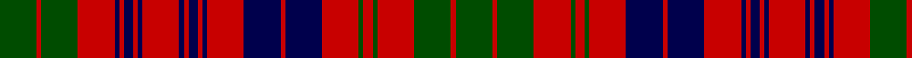

**Bands:** [GRGRGRGRBRBRBRBRBRBRBRBRGRG](/stripes/grgrgrgrbrbrbrbrbrbrbrbrgrg/) · **Stripes:** [DG R DG R DG R DG R DB R DB R DB R DB R DB R DB R DB R DB R DG R DG](/stripes/stripes27/) DG R DG R DG R DG R DB R DB R DB R DB R DB R DB R DB R DB R DG R DG

This was sourced from weddslist.  It is a [27 band tartan](/bands/bands27/).

Original link http://www.weddslist.com/cgi-bin/tartans/pg.pl?source=rb

## Register references

External register numbers recorded for this tartan.

- Scottish Register of Tartans: [1166](https://www.tartanregister.gov.uk/tartanDetails.aspx?ref=1166)
- Scottish Register of Tartans: [1758](https://www.tartanregister.gov.uk/tartanDetails.aspx?ref=1758)
- Scottish Register of Tartans: [2307](https://www.tartanregister.gov.uk/tartanDetails.aspx?ref=2307)
- Scottish Register of Tartans: [2540](https://www.tartanregister.gov.uk/tartanDetails.aspx?ref=2540)
- Scottish Register of Tartans: [2666](https://www.tartanregister.gov.uk/tartanDetails.aspx?ref=2666)
- Scottish Register of Tartans: [2862](https://www.tartanregister.gov.uk/tartanDetails.aspx?ref=2862)
- Scottish Register of Tartans: [3808](https://www.tartanregister.gov.uk/tartanDetails.aspx?ref=3808)
- Scottish Register of Tartans: [982](https://www.tartanregister.gov.uk/tartanDetails.aspx?ref=982)
- Scottish Tartans Authority (ITI): 218
- Scottish Tartans World Register: 1010
- Scottish Tartans World Register: 1042
- Scottish Tartans World Register: 127
- Scottish Tartans World Register: 1585
- Scottish Tartans World Register: 218
- Scottish Tartans World Register: 2218
- Scottish Tartans World Register: 737
- Scottish Tartans World Register: 897

## Variants

Other setts woven to the same stripe pattern.

- [Ross](/setts/s27/dg18r2dg18r18dg2r4dg2r18db18r2db18r18db1r1db2r1db1r18db1r1db2r1db1r18dg18r2dg18/)
- [Ross #4](/setts/s27/dg18r2dg18r18dg2r4dg2r18db18r2db18r18db1r1db2r1db1r18db1r1db2r1db1r18dg18r2dg18~x2/)

## Thread count
G/16 R2 G16 R16 DB2 R2 DB4 R2 DB2 R16 DB2 R2 DB4 R2 DB2 R16 DB16 R2 DB16 R16 G2 R4 G2 R16 G16 R2 G/16

## Palette
Each colour and its ΔE from the base-6 reference it is a variant of.

| Colour | Shade | Base | ΔE (OKLab) |
|---|---|---|---|
| DB | <code style="background-color:#00004C;">#00004C</code> `#00004C` | B <code style="background-color:#2A418A;">#2A418A</code> | 0.21 |
| G | <code style="background-color:#004C00;">#004C00</code> `#004C00` | G <code style="background-color:#006100;">#006100</code> | 0.07 |
| R | <code style="background-color:#C80000;">#C80000</code> `#C80000` | R <code style="background-color:#CC0000;">#CC0000</code> | 0.01 |

## Nearest tartans

The nearest existing variants by ΔTartan distance.

1. [MacInroy #2](/setts/s28/r18k3r3k11dg9k2dg9k11r2k11r3k3r9dg2k3dg2r9k3r3k11r2k11r3k3r18db2r3db2~x2/) — ΔT 1.12
1. [Inverness Fencibles](/setts/s22/db10r1db1r1g10r13g2r13g10db10r1db1~x2/) — ΔT 1.20
1. [Fraser](/setts/s23/db10r1db1r1g10r13g2r13g10db10r1db1r1db10g10r13g2r13g10r1db1r1db5~x4/) — ΔT 1.20
1. [Stewart of Killiecrankie](/setts/s26/g6r2g2r18dp9r3g3r3dp9r3g24r2g2r4~x2/) — ΔT 1.23
1. [Murray of Tullibardine 5](/setts/s25/db6r5db4r3db6r4db4r5db9r5db4r3k8r3db4r36db27r4g4r14g27r9db6r6k3/) — ΔT 1.39
1. [MacRae of Conchra](/setts/s20/dg20r3dg20r20db3r3db6r3db3r20db3r3db6r3db3r20w3r4db20r4/) — ΔT 1.42
1. [Lumsden, of Clova](/setts/s31/db9r2db9r9g1r1g2r1g1r9g1r1g2r1g1r9w1r4db11r2db11r4w1r9g2r4g2r9g9r2g9~x2/) — ΔT 1.42
1. [Murray of Tullibardine 2](/setts/s21/db4r2db2r3db12r3db2r2k5r2db2r22db26r6g6r22g23r14db8r7k3~x2/) — ΔT 1.43
1. [Murray of Tullibardine #4](/setts/s25/db6r5db4r3db6r4db4r5db9r5db4r3k8r3db4r36db27r4dg4r14dg27r9db6r6k3/) — ΔT 1.43
1. [Summerville Presbyterian Church (Cor](/setts/s29/db3r15g2r2g12w2db12r2db4r2db12w2r8db2r2db2r2db2r8db2r2db2r2db2r8g10db1g2r2~x2/) — ΔT 1.45

## Neighbour map

Every grey dot is one of 14299 variants placed by the first two principal components of the ΔTartan feature space (44% of its variance). Red is this tartan; blue dots are its nearest — click one to open its page.

<svg viewBox="0 0 640 380" role="img" style="max-width:100%;height:auto;border:1px solid #e0e0e0;border-radius:4px;display:block" xmlns="http://www.w3.org/2000/svg"><image href="/nn/cloud.v1.png" width="640" height="380"/><a href="/setts/s28/r18k3r3k11dg9k2dg9k11r2k11r3k3r9dg2k3dg2r9k3r3k11r2k11r3k3r18db2r3db2~x2/"><circle cx="207.9" cy="142.8" r="4" fill="#3465a4"><title>MacInroy #2</title></circle></a><a href="/setts/s22/db10r1db1r1g10r13g2r13g10db10r1db1~x2/"><circle cx="253.7" cy="161.9" r="4" fill="#3465a4"><title>Inverness Fencibles</title></circle></a><a href="/setts/s23/db10r1db1r1g10r13g2r13g10db10r1db1r1db10g10r13g2r13g10r1db1r1db5~x4/"><circle cx="243.9" cy="161.1" r="4" fill="#3465a4"><title>Fraser</title></circle></a><a href="/setts/s26/g6r2g2r18dp9r3g3r3dp9r3g24r2g2r4~x2/"><circle cx="256.1" cy="142.5" r="4" fill="#3465a4"><title>Stewart of Killiecrankie</title></circle></a><a href="/setts/s25/db6r5db4r3db6r4db4r5db9r5db4r3k8r3db4r36db27r4g4r14g27r9db6r6k3/"><circle cx="229.6" cy="117.8" r="4" fill="#3465a4"><title>Murray of Tullibardine 5</title></circle></a><a href="/setts/s20/dg20r3dg20r20db3r3db6r3db3r20db3r3db6r3db3r20w3r4db20r4/"><circle cx="219.5" cy="152.8" r="4" fill="#3465a4"><title>MacRae of Conchra</title></circle></a><a href="/setts/s31/db9r2db9r9g1r1g2r1g1r9g1r1g2r1g1r9w1r4db11r2db11r4w1r9g2r4g2r9g9r2g9~x2/"><circle cx="246.5" cy="135.1" r="4" fill="#3465a4"><title>Lumsden, of Clova</title></circle></a><a href="/setts/s21/db4r2db2r3db12r3db2r2k5r2db2r22db26r6g6r22g23r14db8r7k3~x2/"><circle cx="254.5" cy="133.5" r="4" fill="#3465a4"><title>Murray of Tullibardine 2</title></circle></a><a href="/setts/s25/db6r5db4r3db6r4db4r5db9r5db4r3k8r3db4r36db27r4dg4r14dg27r9db6r6k3/"><circle cx="236.7" cy="116.5" r="4" fill="#3465a4"><title>Murray of Tullibardine #4</title></circle></a><a href="/setts/s29/db3r15g2r2g12w2db12r2db4r2db12w2r8db2r2db2r2db2r8db2r2db2r2db2r8g10db1g2r2~x2/"><circle cx="221.7" cy="113.5" r="4" fill="#3465a4"><title>Summerville Presbyterian Church (Cor</title></circle></a><circle cx="232.2" cy="162.7" r="5" fill="#c00000"/></svg>

ID: /setts/s27/dg8r1dg8r8dg1r2dg1r8db8r1db8r8db1r1db2r1db1r8db1r1db2r1db1r8dg8r1dg8~x2/
