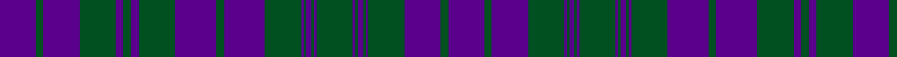

This page is one **sett** — a single exact thread-count. It belongs to the [tartan](/tartans/p14g3p14g14p3g3p3g14p16g3p16g14p1g1p2g1p1g14p1g1p2g1p1g14p14g3p14/)
(the same proportion at any scale), whose colour order is pattern [BGBGBGBGBGBGBGBGBGBGBGBGBGB](/stripes/bgbgbgbgbgbgbgbgbgbgbgbgbgb/).

Sourced from register-of-tartans.  It is a [27 stripe tartan](/stripes/stripes27/).

Original link https://www.tartanregister.gov.uk/tartanDetails.aspx?ref=2741

## Also known as

This cloth is also recorded under:

- MacRae,

## Register references

External register numbers recorded for this tartan.

- Scottish Register of Tartans: [2741](https://www.tartanregister.gov.uk/tartanDetails.aspx?ref=2741)
- Scottish Tartans World Register: 100

## Thread count
P/28 G6 P28 G28 P6 G6 P6 G28 P32 G6 P32 G28 P2 G2 P4 G2 P2 G28 P2 G2 P4 G2 P2 G28 P28 G6 P/28

## Palette
Each colour and the base-6 reference it is a variant of.

| Colour | Shade | Base |
|---|---|---|
| G | <code style="background-color:#005020;">#005020</code> `oklch(37.7% 0.105 149.6)` <small>#005020</small> | G <code style="background-color:#006100;">#006100</code> |
| P | <code style="background-color:#5A008C;">#5A008C</code> `oklch(37.0% 0.191 306.3)` <small>#5A008C</small> | B <code style="background-color:#2A418A;">#2A418A</code> |

## Nearest tartans

The nearest existing variants by ΔTartan distance, with this tartan at the top so the swatches line up against it.

ΔTartan

Tartan

Sett

—

<a href="/ttd/edit/#slug=dp14dg3dp14dg14dp3dg3dp3dg14dp16dg3dp16dg14dp1dg1dp2dg1dp1dg14dp1dg1dp2dg1dp1dg14dp14dg3dp14~x2">MacRae (Rae)</a> <a class="nn-out" href="/setts/s27/dp14dg3dp14dg14dp3dg3dp3dg14dp16dg3dp16dg14dp1dg1dp2dg1dp1dg14dp1dg1dp2dg1dp1dg14dp14dg3dp14~x2/" title="open its dictionary page">↗</a>

0.12

<a href="/ttd/edit/#slug=dp27dg6dp27dg28dp5dg7dp5dg28dp31dg6dp31dg28dp2dg2dp4dg2dp2dg28dp2dg2dp4dg2dp2dg28dp27dg6dp27~x2">MacRae/Rae</a> <a class="nn-out" href="/setts/s27/dp27dg6dp27dg28dp5dg7dp5dg28dp31dg6dp31dg28dp2dg2dp4dg2dp2dg28dp2dg2dp4dg2dp2dg28dp27dg6dp27~x2/" title="open its dictionary page">↗</a>

1.09

<a href="/ttd/edit/#slug=dp25dg6dp25dg26dp5dg7dp5dg26w3dg7dp29dg6dp29dg7w3dg26dp2dg2dp4dg2dp2dg26dp2dg2dp4dg2dp2dg26dp25dg6dp25~x2">MacRae (MacCrae)</a> <a class="nn-out" href="/setts/s31/dp25dg6dp25dg26dp5dg7dp5dg26w3dg7dp29dg6dp29dg7w3dg26dp2dg2dp4dg2dp2dg26dp2dg2dp4dg2dp2dg26dp25dg6dp25~x2/" title="open its dictionary page">↗</a>

1.52

<a href="/ttd/edit/#slug=dp27dg12dp54dg56dp10dg14dp10dg56dp62dg12dp62dg56dp4dg4dp8dg4dp4dg56dp4dg4dp8dg4dp4dg56dp54dg12dp27">Rae (Wilsons) (Clan)</a> <a class="nn-out" href="/setts/s27/dp27dg12dp54dg56dp10dg14dp10dg56dp62dg12dp62dg56dp4dg4dp8dg4dp4dg56dp4dg4dp8dg4dp4dg56dp54dg12dp27/" title="open its dictionary page">↗</a>

1.89

<a href="/ttd/edit/#slug=p14g3p14g14p3g3p3g14p16g3p16g14p1g1p2g1p1g14p1g1p2g1p1g14p14g3p14~x2">MacRae, (Rae)</a> <a class="nn-out" href="/setts/s27/p14g3p14g14p3g3p3g14p16g3p16g14p1g1p2g1p1g14p1g1p2g1p1g14p14g3p14~x2/" title="open its dictionary page">↗</a>

1.92

<a href="/ttd/edit/#slug=p27g6p27g28p5g7p5g28p31g6p31g28p2g2p4g2p2g28p2g2p4g2p2g28p27g6p27~x2">MacRae, Rae</a> <a class="nn-out" href="/setts/s27/p27g6p27g28p5g7p5g28p31g6p31g28p2g2p4g2p2g28p2g2p4g2p2g28p27g6p27~x2/" title="open its dictionary page">↗</a>

2.16

<a href="/setts/s16/db12ly1t16db1t1db14t3db14ly1~x4/">Orlando Police Department</a>

2.21

<a href="/setts/s28/db16k3db3k3db3k16db17k2ly4k2db17k16db17k2w4~x2/">Fleming Commemorative Tartan Tartan Number: 2531. Earliest known date: 1997 Kilt was created for Scotland Flanders 2002 as a cultural exchange product. See products available Copyright © Blair Urquhart, Comrie, 2015</a>

2.21

<a href="/setts/s28/db11k1r3db6k1db6r3db4r7db11lo1db11r7lo2k4/">James of Wales</a>

2.25

<a href="/setts/s16/db12ly1r16db1r1db14r3db14ly1~x4/">Orlando Fire Department</a>

2.27

<a href="/ttd/edit/#slug=k4n1k1n1k1n1k1n1k1n1k1n1k1n1k1n1k1n1k1n1k1n1k1n1k1n1k1n1k1n1k1n1k12n4k12n4">MacKay, Marled</a> <a class="nn-out" href="/setts/s36/k4n1k1n1k1n1k1n1k1n1k1n1k1n1k1n1k1n1k1n1k1n1k1n1k1n1k1n1k1n1k1n1k12n4k12n4/" title="open its dictionary page">↗</a>

## Neighbour map

Every grey dot is one of 14299 variants placed by the first two principal components of the ΔTartan feature space (44% of its variance). Red is this tartan; blue dots are its nearest — click one to open its page.

<svg viewBox="0 0 640 380" role="img" style="max-width:100%;height:auto;border:1px solid #e0e0e0;border-radius:4px;display:block" xmlns="http://www.w3.org/2000/svg"><image href="/nn/cloud.v1.png" width="640" height="380"/><a href="/setts/s27/dp27dg6dp27dg28dp5dg7dp5dg28dp31dg6dp31dg28dp2dg2dp4dg2dp2dg28dp2dg2dp4dg2dp2dg28dp27dg6dp27~x2/"><circle cx="390.6" cy="187.6" r="4" fill="#3465a4"><title>MacRae/Rae</title></circle></a><a href="/setts/s31/dp25dg6dp25dg26dp5dg7dp5dg26w3dg7dp29dg6dp29dg7w3dg26dp2dg2dp4dg2dp2dg26dp2dg2dp4dg2dp2dg26dp25dg6dp25~x2/"><circle cx="340.5" cy="160.3" r="4" fill="#3465a4"><title>MacRae (MacCrae)</title></circle></a><a href="/setts/s27/dp27dg12dp54dg56dp10dg14dp10dg56dp62dg12dp62dg56dp4dg4dp8dg4dp4dg56dp4dg4dp8dg4dp4dg56dp54dg12dp27/"><circle cx="390.1" cy="189.0" r="4" fill="#3465a4"><title>Rae (Wilsons) (Clan)</title></circle></a><a href="/setts/s27/p14g3p14g14p3g3p3g14p16g3p16g14p1g1p2g1p1g14p1g1p2g1p1g14p14g3p14~x2/"><circle cx="356.8" cy="158.3" r="4" fill="#3465a4"><title>MacRae, (Rae)</title></circle></a><a href="/setts/s27/p27g6p27g28p5g7p5g28p31g6p31g28p2g2p4g2p2g28p2g2p4g2p2g28p27g6p27~x2/"><circle cx="350.7" cy="159.7" r="4" fill="#3465a4"><title>MacRae, Rae</title></circle></a><a href="/setts/s16/db12ly1t16db1t1db14t3db14ly1~x4/"><circle cx="408.6" cy="192.1" r="4" fill="#3465a4"><title>Orlando Police Department</title></circle></a><a href="/setts/s28/db16k3db3k3db3k16db17k2ly4k2db17k16db17k2w4~x2/"><circle cx="307.6" cy="178.2" r="4" fill="#3465a4"><title>Fleming Commemorative Tartan Tartan Number: 2531. Earliest known date: 1997 Kilt was created for Scotland Flanders 2002 as a cultural exchange product. See products available Copyright © Blair Urquhart, Comrie, 2015</title></circle></a><a href="/setts/s28/db11k1r3db6k1db6r3db4r7db11lo1db11r7lo2k4/"><circle cx="354.1" cy="188.0" r="4" fill="#3465a4"><title>James of Wales</title></circle></a><a href="/setts/s16/db12ly1r16db1r1db14r3db14ly1~x4/"><circle cx="394.2" cy="164.8" r="4" fill="#3465a4"><title>Orlando Fire Department</title></circle></a><a href="/setts/s36/k4n1k1n1k1n1k1n1k1n1k1n1k1n1k1n1k1n1k1n1k1n1k1n1k1n1k1n1k1n1k1n1k12n4k12n4/"><circle cx="457.1" cy="159.2" r="4" fill="#3465a4"><title>MacKay, Marled</title></circle></a><circle cx="396.5" cy="186.4" r="5" fill="#c00000"/></svg>

ID: /setts/s27/dp14dg3dp14dg14dp3dg3dp3dg14dp16dg3dp16dg14dp1dg1dp2dg1dp1dg14dp1dg1dp2dg1dp1dg14dp14dg3dp14~x2/
