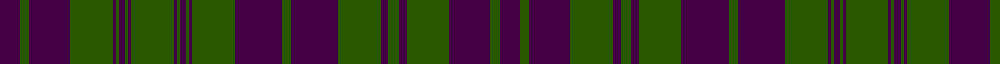

In pattern [BGBGBGBGBGBGBGBGBGBGBGBGBGB](/stripes/bgbgbgbgbgbgbgbgbgbgbgbgbgb/).

This was sourced from tartans-authority.  It is a [27 stripe tartan](/stripes/stripes27/).

Original link http://www.tartansauthority.com/tartan-ferret/display/100/

## Thread count
DP/27 G12 DP54 G56 DP10 G14 DP10 G56 DP62 G12 DP62 G56 DP4 G4 DP8 G4 DP4 G56 DP4 G4 DP8 G4 DP4 G56 DP54 G12 DP/27

## Palette
Each colour and the base-6 reference it is a variant of.

| Colour | Shade | Base |
|---|---|---|
| DP | <code style="background-color:#440044;">#440044</code> `oklch(27.1% 0.125 328.4)` <small>#440044</small> | B <code style="background-color:#2A418A;">#2A418A</code> |
| G | <code style="background-color:#285800;">#285800</code> `oklch(41.0% 0.122 135.8)` <small>#285800</small> | G <code style="background-color:#006100;">#006100</code> |

## Nearest tartans

The nearest existing variants by ΔTartan distance, with this tartan at the top so the swatches line up against it.

ΔTartan

Tartan

Sett

—

<a href="/ttd/edit/#slug=dp27dg12dp54dg56dp10dg14dp10dg56dp62dg12dp62dg56dp4dg4dp8dg4dp4dg56dp4dg4dp8dg4dp4dg56dp54dg12dp27">Rae (Wilsons) (Clan)</a> <a class="nn-out" href="/setts/s27/dp27dg12dp54dg56dp10dg14dp10dg56dp62dg12dp62dg56dp4dg4dp8dg4dp4dg56dp4dg4dp8dg4dp4dg56dp54dg12dp27/" title="open its dictionary page">↗</a>

1.45

<a href="/ttd/edit/#slug=dp27dg6dp27dg28dp5dg7dp5dg28dp31dg6dp31dg28dp2dg2dp4dg2dp2dg28dp2dg2dp4dg2dp2dg28dp27dg6dp27~x2">MacRae/Rae</a> <a class="nn-out" href="/setts/s27/dp27dg6dp27dg28dp5dg7dp5dg28dp31dg6dp31dg28dp2dg2dp4dg2dp2dg28dp2dg2dp4dg2dp2dg28dp27dg6dp27~x2/" title="open its dictionary page">↗</a>

1.52

<a href="/ttd/edit/#slug=dp14dg3dp14dg14dp3dg3dp3dg14dp16dg3dp16dg14dp1dg1dp2dg1dp1dg14dp1dg1dp2dg1dp1dg14dp14dg3dp14~x2">MacRae (Rae)</a> <a class="nn-out" href="/setts/s27/dp14dg3dp14dg14dp3dg3dp3dg14dp16dg3dp16dg14dp1dg1dp2dg1dp1dg14dp1dg1dp2dg1dp1dg14dp14dg3dp14~x2/" title="open its dictionary page">↗</a>

1.71

<a href="/ttd/edit/#slug=dp25dg6dp25dg26dp5dg7dp5dg26w3dg7dp29dg6dp29dg7w3dg26dp2dg2dp4dg2dp2dg26dp2dg2dp4dg2dp2dg26dp25dg6dp25~x2">MacRae (MacCrae)</a> <a class="nn-out" href="/setts/s31/dp25dg6dp25dg26dp5dg7dp5dg26w3dg7dp29dg6dp29dg7w3dg26dp2dg2dp4dg2dp2dg26dp2dg2dp4dg2dp2dg26dp25dg6dp25~x2/" title="open its dictionary page">↗</a>

1.77

<a href="/ttd/edit/#slug=dg4r4dg4r6dg15r11dg2r2dg16r21dg2r2dg4r2dg2r3dg5r3dg2r2dg4~x2">Murray of Dunmore (Clan)</a> <a class="nn-out" href="/setts/s21/dg4r4dg4r6dg15r11dg2r2dg16r21dg2r2dg4r2dg2r3dg5r3dg2r2dg4~x2/" title="open its dictionary page">↗</a>

1.87

<a href="/ttd/edit/#slug=p27g6p27g28p5g7p5g28p31g6p31g28p2g2p4g2p2g28p2g2p4g2p2g28p27g6p27~x2">MacRae, Rae</a> <a class="nn-out" href="/setts/s27/p27g6p27g28p5g7p5g28p31g6p31g28p2g2p4g2p2g28p2g2p4g2p2g28p27g6p27~x2/" title="open its dictionary page">↗</a>

1.90

<a href="/ttd/edit/#slug=g4r4g2r2g2r18db4g4r2g2r2g3r4g2r2g2r2db4g4r2g4~x2">Matheson (WCWM)</a> <a class="nn-out" href="/setts/s21/g4r4g2r2g2r18db4g4r2g2r2g3r4g2r2g2r2db4g4r2g4~x2/" title="open its dictionary page">↗</a>

1.90

<a href="/ttd/edit/#slug=p14g3p14g14p3g3p3g14p16g3p16g14p1g1p2g1p1g14p1g1p2g1p1g14p14g3p14~x2">MacRae, (Rae)</a> <a class="nn-out" href="/setts/s27/p14g3p14g14p3g3p3g14p16g3p16g14p1g1p2g1p1g14p1g1p2g1p1g14p14g3p14~x2/" title="open its dictionary page">↗</a>

1.90

<a href="/ttd/edit/#slug=k4n1k1n1k1n1k1n1k1n1k1n1k1n1k1n1k1n1k1n1k1n1k1n1k1n1k1n1k1n1k1n1k12n4k12n4">MacKay, Marled</a> <a class="nn-out" href="/setts/s36/k4n1k1n1k1n1k1n1k1n1k1n1k1n1k1n1k1n1k1n1k1n1k1n1k1n1k1n1k1n1k1n1k12n4k12n4/" title="open its dictionary page">↗</a>

2.07

<a href="/ttd/edit/#slug=g7r2g2r2g2r27db9g2r2g2r2g2r6g2r2g2r2db10g6r2db5~x2">Matheson (Lochcarron)</a> <a class="nn-out" href="/setts/s21/g7r2g2r2g2r27db9g2r2g2r2g2r6g2r2g2r2db10g6r2db5~x2/" title="open its dictionary page">↗</a>

2.07

<a href="/ttd/edit/#slug=dg18r2dg18r18dg2r4dg2r18db18r2db18r18db1r1db2r1db1r18db1r1db2r1db1r18dg18r2dg18">Ross</a> <a class="nn-out" href="/setts/s27/dg18r2dg18r18dg2r4dg2r18db18r2db18r18db1r1db2r1db1r18db1r1db2r1db1r18dg18r2dg18/" title="open its dictionary page">↗</a>

## Neighbour map

Every grey dot is one of 14299 variants placed by the first two principal components of the ΔTartan feature space (44% of its variance). Red is this tartan; blue dots are its nearest — click one to open its page.

<svg viewBox="0 0 640 380" role="img" style="max-width:100%;height:auto;border:1px solid #e0e0e0;border-radius:4px;display:block" xmlns="http://www.w3.org/2000/svg"><image href="/nn/cloud.v1.png" width="640" height="380"/><a href="/setts/s27/dp27dg6dp27dg28dp5dg7dp5dg28dp31dg6dp31dg28dp2dg2dp4dg2dp2dg28dp2dg2dp4dg2dp2dg28dp27dg6dp27~x2/"><circle cx="390.6" cy="187.6" r="4" fill="#3465a4"><title>MacRae/Rae</title></circle></a><a href="/setts/s27/dp14dg3dp14dg14dp3dg3dp3dg14dp16dg3dp16dg14dp1dg1dp2dg1dp1dg14dp1dg1dp2dg1dp1dg14dp14dg3dp14~x2/"><circle cx="396.5" cy="186.4" r="4" fill="#3465a4"><title>MacRae (Rae)</title></circle></a><a href="/setts/s31/dp25dg6dp25dg26dp5dg7dp5dg26w3dg7dp29dg6dp29dg7w3dg26dp2dg2dp4dg2dp2dg26dp2dg2dp4dg2dp2dg26dp25dg6dp25~x2/"><circle cx="340.5" cy="160.3" r="4" fill="#3465a4"><title>MacRae (MacCrae)</title></circle></a><a href="/setts/s21/dg4r4dg4r6dg15r11dg2r2dg16r21dg2r2dg4r2dg2r3dg5r3dg2r2dg4~x2/"><circle cx="426.1" cy="222.3" r="4" fill="#3465a4"><title>Murray of Dunmore (Clan)</title></circle></a><a href="/setts/s27/p27g6p27g28p5g7p5g28p31g6p31g28p2g2p4g2p2g28p2g2p4g2p2g28p27g6p27~x2/"><circle cx="350.7" cy="159.7" r="4" fill="#3465a4"><title>MacRae, Rae</title></circle></a><a href="/setts/s21/g4r4g2r2g2r18db4g4r2g2r2g3r4g2r2g2r2db4g4r2g4~x2/"><circle cx="322.5" cy="186.3" r="4" fill="#3465a4"><title>Matheson (WCWM)</title></circle></a><a href="/setts/s27/p14g3p14g14p3g3p3g14p16g3p16g14p1g1p2g1p1g14p1g1p2g1p1g14p14g3p14~x2/"><circle cx="356.8" cy="158.3" r="4" fill="#3465a4"><title>MacRae, (Rae)</title></circle></a><a href="/setts/s36/k4n1k1n1k1n1k1n1k1n1k1n1k1n1k1n1k1n1k1n1k1n1k1n1k1n1k1n1k1n1k1n1k12n4k12n4/"><circle cx="457.1" cy="159.2" r="4" fill="#3465a4"><title>MacKay, Marled</title></circle></a><a href="/setts/s21/g7r2g2r2g2r27db9g2r2g2r2g2r6g2r2g2r2db10g6r2db5~x2/"><circle cx="316.5" cy="149.3" r="4" fill="#3465a4"><title>Matheson (Lochcarron)</title></circle></a><a href="/setts/s27/dg18r2dg18r18dg2r4dg2r18db18r2db18r18db1r1db2r1db1r18db1r1db2r1db1r18dg18r2dg18/"><circle cx="298.2" cy="138.6" r="4" fill="#3465a4"><title>Ross</title></circle></a><circle cx="390.1" cy="189.0" r="5" fill="#c00000"/></svg>

ID: /setts/s27/dp27dg12dp54dg56dp10dg14dp10dg56dp62dg12dp62dg56dp4dg4dp8dg4dp4dg56dp4dg4dp8dg4dp4dg56dp54dg12dp27/
