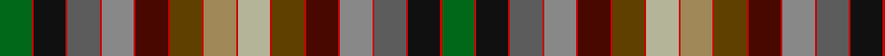

In pattern [GRKRBRRRBRGRYRYRGRBRRRBRKRG](/patterns/grkrbrrrbrgryryrgrbrrrbrkrg/).

This was sourced from house-of-tartan.  It is a [27 stripes tartan](/stripes/stripes27/).

Original link http://www.house-of-tartan.scotland.net/house/TartanViewjs.asp?colr=Def&tnam=2037

## Thread count
G/36 R2 K36 R2 N36 R2 Na36 R2 DR36 R2 T36 R2 LT36 R2 Nb36 R2 T36 R2 DR36 R2 Na36 R2 N36 R2 K36 R2 G/36

## Palette
Each colour and its ΔE from the base-6 reference it is a variant of.

| Colour | Shade | Base | ΔE (OKLab) |
|---|---|---|---|
| DR | <code style="background-color:#480800;">#480800</code> `#480800` | B <code style="background-color:#2A418A;">#2A418A</code> | 0.24 |
| G | <code style="background-color:#006818;">#006818</code> `#006818` | G <code style="background-color:#006100;">#006100</code> | 0.02 |
| K | <code style="background-color:#101010;">#101010</code> `#101010` | K <code style="background-color:#000000;">#000000</code> | 0.17 |
| LT | <code style="background-color:#A08858;">#A08858</code> `#A08858` | Y <code style="background-color:#F2BF00;">#F2BF00</code> | 0.21 |
| N | <code style="background-color:#5C5C5C;">#5C5C5C</code> `#5C5C5C` | B <code style="background-color:#2A418A;">#2A418A</code> | 0.15 |
| Na | <code style="background-color:#888888;">#888888</code> `#888888` | R <code style="background-color:#CC0000;">#CC0000</code> | 0.24 |
| Nb | <code style="background-color:#B4B498;">#B4B498</code> `#B4B498` | Y <code style="background-color:#F2BF00;">#F2BF00</code> | 0.15 |
| R | <code style="background-color:#C80000;">#C80000</code> `#C80000` | R <code style="background-color:#CC0000;">#CC0000</code> | 0.01 |
| T | <code style="background-color:#604000;">#604000</code> `#604000` | G <code style="background-color:#006100;">#006100</code> | 0.14 |

## Nearest tartans

The nearest existing variants by ΔTartan distance.

1. [MacKay of Strathnaver](/setts/s27/g18r1k18r1b18r1ra18r1ba18r1ga18r1y18r1ya18r1ga18r1ba18r1ra18r1b18r1k18r1g18x2~b5c5c5c-ba480800-g285800-ga604000-k101010-rc80000-ra888888-ya08858-yac4bc68/) — ΔT 0.13
1. [MacKay of Strathnaver](/setts/s27/g18r1k18r1b18r1ga18r1ra18r1rb18r1rc18r1y18r1rb18r1ra18r1ga18r1b18r1k18r1g18x2~b505050-g008000-ga808080-k000000-rc00000-ra703000-rb806050-rc906030-yb0b0b0/) — ΔT 0.55
1. [MacKay, of Strathnaver](/setts/s52/b18k1g18k1b18k1ba18k1y18k1ga18k1r18k1k18k1ga18k1y18k1ba18k1b18k1g18k1b18k1g18k1b18k1ba18k1y18k1ga18k1k18k1r18k1ga18k1y18k1ba18k1b18k1g18k1x2~b5c5c5c-ba480800-g285800-ga604000-k101010-r888888-ya08858/) — ΔT 1.72
1. [United Distillers, (Warp)](/setts/s19/b12ba1g12r2g12ga12ba1b12ba2bb12ra1ga12ra12y2ra12ga12ra1bb12ba2x2~b304080-ba8080d0-bb600030-g008000-ga003000-rc00000-ra806050-yf0c000/) — ΔT 1.92
1. [Unnamed C18th - Prince Charles Edward](/setts/s28/r16w4g100w4b34ga30y10w3ga16ba12w4b16bb64r26w4r26bb64b16w4ba12ga16w3y10ga30b34w4g100w4~b2c2c80-ba780078-bb441800-g604000-ga006818-rc80000-we0e0e0-ye8c000/) — ΔT 2.08
1. [Culloden Worn by Pr Charles](/setts/s15/b17g15y5w2g8ba6w2bb8ga32r18w2r8w2gb50w2x2~b0596fa-ba280032-bb2c4084-g005020-ga2a2303-gb503c14-rdc0000-we0e0e0-ye8c000/) — ΔT 2.09
1. [Unidentified Cant #01 (Cumming)](/setts/s30/g18y3b14ba6w3k2w3ba6k2r4ra3rb4k2rb4ra3r2k2ba6w3k2w3ba6b14y3g18r12w3r12w3r12x2~b2c2c80-ba2888c4-g285800-k101010-rc80000-ra9c68a4-rbe87878-we0e0e0-ye8c000/) — ΔT 2.10
1. [Culloden, Worn by Pr Charles](/setts/s15/b17g15y5w2g8ba6w2bb8bc32r18w2r8w2ra50w2x2~b8080d0-ba300030-bb304080-bc401000-g008000-rc00000-ra806050-we0e0e0-yf0c000/) — ΔT 2.13
1. [St. Columba (two greens)](/setts/s16/b20g1w1y3ga4gb10ba4g1bb4g1ba4gb10ga4y3w1g1x2~b202060-ba5c5c5c-bb780078-g789484-ga5c6428-gb006818-wfcfcfc-ya08858/) — ΔT 2.26
1. [Unidentified Cotton sample](/setts/s36/b4g6ga7gb1g6ga7gb1g6ga7gb1g6ga7gb1g6ga7gb1g6b4k8r1k1w1k1b8ra6k1ra4w1ra4k1ra6b8k1w1k1r1x2~b2c4084-g309c18-ga002814-gb503c14-k101010-rfa4b00-rac82828-we0e0e0/) — ΔT 2.40

## Neighbour map

Every grey dot is one of 15726 variants placed by the first two principal components of the ΔTartan feature space (44% of its variance). Red is this tartan; blue dots are its nearest — click one to open its page.

<svg viewBox="0 0 640 380" role="img" style="max-width:100%;height:auto;border:1px solid #e0e0e0;border-radius:4px;display:block" xmlns="http://www.w3.org/2000/svg"><image href="/nn/cloud.v1.png" width="640" height="380"/><a href="/setts/s27/g18r1k18r1b18r1ra18r1ba18r1ga18r1y18r1ya18r1ga18r1ba18r1ra18r1b18r1k18r1g18x2~b5c5c5c-ba480800-g285800-ga604000-k101010-rc80000-ra888888-ya08858-yac4bc68/"><circle cx="14.0" cy="37.7" r="4" fill="#3465a4"><title>MacKay of Strathnaver</title></circle></a><a href="/setts/s27/g18r1k18r1b18r1ga18r1ra18r1rb18r1rc18r1y18r1rb18r1ra18r1ga18r1b18r1k18r1g18x2~b505050-g008000-ga808080-k000000-rc00000-ra703000-rb806050-rc906030-yb0b0b0/"><circle cx="14.0" cy="31.8" r="4" fill="#3465a4"><title>MacKay of Strathnaver</title></circle></a><a href="/setts/s52/b18k1g18k1b18k1ba18k1y18k1ga18k1r18k1k18k1ga18k1y18k1ba18k1b18k1g18k1b18k1g18k1b18k1ba18k1y18k1ga18k1k18k1r18k1ga18k1y18k1ba18k1b18k1g18k1x2~b5c5c5c-ba480800-g285800-ga604000-k101010-r888888-ya08858/"><circle cx="14.0" cy="21.5" r="4" fill="#3465a4"><title>MacKay, of Strathnaver</title></circle></a><a href="/setts/s19/b12ba1g12r2g12ga12ba1b12ba2bb12ra1ga12ra12y2ra12ga12ra1bb12ba2x2~b304080-ba8080d0-bb600030-g008000-ga003000-rc00000-ra806050-yf0c000/"><circle cx="40.7" cy="110.7" r="4" fill="#3465a4"><title>United Distillers, (Warp)</title></circle></a><a href="/setts/s28/r16w4g100w4b34ga30y10w3ga16ba12w4b16bb64r26w4r26bb64b16w4ba12ga16w3y10ga30b34w4g100w4~b2c2c80-ba780078-bb441800-g604000-ga006818-rc80000-we0e0e0-ye8c000/"><circle cx="112.6" cy="14.2" r="4" fill="#3465a4"><title>Unnamed C18th - Prince Charles Edward</title></circle></a><a href="/setts/s15/b17g15y5w2g8ba6w2bb8ga32r18w2r8w2gb50w2x2~b0596fa-ba280032-bb2c4084-g005020-ga2a2303-gb503c14-rdc0000-we0e0e0-ye8c000/"><circle cx="64.9" cy="28.1" r="4" fill="#3465a4"><title>Culloden Worn by Pr Charles</title></circle></a><a href="/setts/s30/g18y3b14ba6w3k2w3ba6k2r4ra3rb4k2rb4ra3r2k2ba6w3k2w3ba6b14y3g18r12w3r12w3r12x2~b2c2c80-ba2888c4-g285800-k101010-rc80000-ra9c68a4-rbe87878-we0e0e0-ye8c000/"><circle cx="14.0" cy="43.4" r="4" fill="#3465a4"><title>Unidentified Cant #01 (Cumming)</title></circle></a><a href="/setts/s15/b17g15y5w2g8ba6w2bb8bc32r18w2r8w2ra50w2x2~b8080d0-ba300030-bb304080-bc401000-g008000-rc00000-ra806050-we0e0e0-yf0c000/"><circle cx="72.9" cy="25.7" r="4" fill="#3465a4"><title>Culloden, Worn by Pr Charles</title></circle></a><a href="/setts/s16/b20g1w1y3ga4gb10ba4g1bb4g1ba4gb10ga4y3w1g1x2~b202060-ba5c5c5c-bb780078-g789484-ga5c6428-gb006818-wfcfcfc-ya08858/"><circle cx="98.4" cy="67.0" r="4" fill="#3465a4"><title>St. Columba (two greens)</title></circle></a><a href="/setts/s36/b4g6ga7gb1g6ga7gb1g6ga7gb1g6ga7gb1g6ga7gb1g6b4k8r1k1w1k1b8ra6k1ra4w1ra4k1ra6b8k1w1k1r1x2~b2c4084-g309c18-ga002814-gb503c14-k101010-rfa4b00-rac82828-we0e0e0/"><circle cx="14.0" cy="81.3" r="4" fill="#3465a4"><title>Unidentified Cotton sample</title></circle></a><circle cx="14.0" cy="38.2" r="5" fill="#c00000"/></svg>

ID: /setts/s27/g18r1k18r1b18r1ra18r1ba18r1ga18r1y18r1ya18r1ga18r1ba18r1ra18r1b18r1k18r1g18x2~b5c5c5c-ba480800-g006818-ga604000-k101010-rc80000-ra888888-ya08858-yab4b498/
