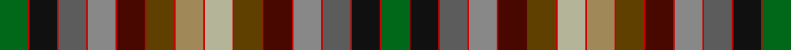

In pattern [GRKRBRRRBRGRYRYRGRBRRRBRKRG](/stripes/grkrbrrrbrgryryrgrbrrrbrkrg/).

This was sourced from house-of-tartan.  It is a [27 stripe tartan](/stripes/stripes27/).

Original link http://www.house-of-tartan.scotland.net/house/TartanViewjs.asp?colr=Def&tnam=2037

## Thread count
G/36 R2 K36 R2 N36 R2 Na36 R2 DR36 R2 T36 R2 LT36 R2 Nb36 R2 T36 R2 DR36 R2 Na36 R2 N36 R2 K36 R2 G/36

## Palette
Each colour and the base-6 reference it is a variant of.

| Colour | Shade | Base |
|---|---|---|
| DR | <code style="background-color:#480800;">#480800</code> `oklch(26.1% 0.096 33.1)` <small>#480800</small> | B <code style="background-color:#2A418A;">#2A418A</code> |
| G | <code style="background-color:#006818;">#006818</code> `oklch(45.0% 0.142 145.0)` <small>#006818</small> | G <code style="background-color:#006100;">#006100</code> |
| K | <code style="background-color:#101010;">#101010</code> `oklch(17.3% 0.000 89.9)` <small>#101010</small> | K <code style="background-color:#000000;">#000000</code> |
| LT | <code style="background-color:#A08858;">#A08858</code> `oklch(63.7% 0.071 84.0)` <small>#A08858</small> | Y <code style="background-color:#F2BF00;">#F2BF00</code> |
| N | <code style="background-color:#5C5C5C;">#5C5C5C</code> `oklch(47.5% 0.000 89.9)` <small>#5C5C5C</small> | B <code style="background-color:#2A418A;">#2A418A</code> |
| Na | <code style="background-color:#888888;">#888888</code> `oklch(62.7% 0.000 89.9)` <small>#888888</small> | R <code style="background-color:#CC0000;">#CC0000</code> |
| Nb | <code style="background-color:#B4B498;">#B4B498</code> `oklch(76.2% 0.039 107.3)` <small>#B4B498</small> | Y <code style="background-color:#F2BF00;">#F2BF00</code> |
| R | <code style="background-color:#C80000;">#C80000</code> `oklch(52.3% 0.215 29.2)` <small>#C80000</small> | R <code style="background-color:#CC0000;">#CC0000</code> |
| T | <code style="background-color:#604000;">#604000</code> `oklch(39.8% 0.083 76.8)` <small>#604000</small> | G <code style="background-color:#006100;">#006100</code> |

## Nearest tartans

The nearest existing variants by ΔTartan distance.

1. [MacKay of Strathnaver](/setts/s27/dg18r1k18r1n18r1o18r1dr18r1dy18r1lo18r1ly18r1dy18r1dr18r1o18r1n18r1k18r1dg18~x2/) — ΔT 0.13
1. [MacKay of Strathnaver](/setts/s27/g18r1k18r1n18r1y18r1o18r1o18r1o18r1lr18r1o18r1o18r1y18r1n18r1k18r1g18~x2/) — ΔT 0.55
1. [MacKay, of Strathnaver](/setts/s52/n18k1dg18k1n18k1dr18k1lo18k1dy18k1k18k1o18k1dy18k1lo18k1dr18k1n18k1dg18k1n18~x2/) — ΔT 1.71
1. [United Distillers, (Warp)](/setts/s19/db12b1g12r2g12dg12b1db12b2dr12o1dg12o12ly2o12dg12o1dr12b2~x2/) — ΔT 1.92
1. [Unnamed C18th - Prince Charles Edward](/setts/s28/r16w4dy100w4db34g30ly10w3g16dp12w4db16do64r26w4/) — ΔT 2.08
1. [Culloden Worn by Pr Charles](/setts/s15/b17dg15ly5w2dg8dp6w2db8dy32r18w2r8w2dy50w2~x2/) — ΔT 2.08
1. [Unidentified Cant #01 (Cumming)](/setts/s30/dg18ly3db14t6w3k2w3t6k2r4m3r4k2r4m3r2k2t6w3k2w3t6db14ly3dg18r12w3r12w3r12~x2/) — ΔT 2.10
1. [Culloden, Worn by Pr Charles](/setts/s15/b17g15ly5w2g8dp6w2db8dr32r18w2r8w2o50w2~x2/) — ΔT 2.13
1. [St. Columba (two greens)](/setts/s16/db20y1w1lo3y4g10n4y1dp4~x2/) — ΔT 2.26
1. [Unidentified Cotton sample](/setts/s36/db4g6dg7dy1g6dg7dy1g6dg7dy1g6dg7dy1g6dg7dy1g6db4k8r1k1w1k1db8r6k1r4w1r4k1r6db8k1w1k1r1~x2/) — ΔT 2.40

## Neighbour map

Every grey dot is one of 14299 variants placed by the first two principal components of the ΔTartan feature space (44% of its variance). Red is this tartan; blue dots are its nearest — click one to open its page.

<svg viewBox="0 0 640 380" role="img" style="max-width:100%;height:auto;border:1px solid #e0e0e0;border-radius:4px;display:block" xmlns="http://www.w3.org/2000/svg"><image href="/nn/cloud.v1.png" width="640" height="380"/><a href="/setts/s27/dg18r1k18r1n18r1o18r1dr18r1dy18r1lo18r1ly18r1dy18r1dr18r1o18r1n18r1k18r1dg18~x2/"><circle cx="14.0" cy="49.2" r="4" fill="#3465a4"><title>MacKay of Strathnaver</title></circle></a><a href="/setts/s27/g18r1k18r1n18r1y18r1o18r1o18r1o18r1lr18r1o18r1o18r1y18r1n18r1k18r1g18~x2/"><circle cx="14.0" cy="41.8" r="4" fill="#3465a4"><title>MacKay of Strathnaver</title></circle></a><a href="/setts/s52/n18k1dg18k1n18k1dr18k1lo18k1dy18k1k18k1o18k1dy18k1lo18k1dr18k1n18k1dg18k1n18~x2/"><circle cx="14.0" cy="37.8" r="4" fill="#3465a4"><title>MacKay, of Strathnaver</title></circle></a><a href="/setts/s19/db12b1g12r2g12dg12b1db12b2dr12o1dg12o12ly2o12dg12o1dr12b2~x2/"><circle cx="43.7" cy="121.7" r="4" fill="#3465a4"><title>United Distillers, (Warp)</title></circle></a><a href="/setts/s28/r16w4dy100w4db34g30ly10w3g16dp12w4db16do64r26w4/"><circle cx="114.9" cy="22.9" r="4" fill="#3465a4"><title>Unnamed C18th - Prince Charles Edward</title></circle></a><a href="/setts/s15/b17dg15ly5w2dg8dp6w2db8dy32r18w2r8w2dy50w2~x2/"><circle cx="67.7" cy="35.0" r="4" fill="#3465a4"><title>Culloden Worn by Pr Charles</title></circle></a><a href="/setts/s30/dg18ly3db14t6w3k2w3t6k2r4m3r4k2r4m3r2k2t6w3k2w3t6db14ly3dg18r12w3r12w3r12~x2/"><circle cx="14.0" cy="49.7" r="4" fill="#3465a4"><title>Unidentified Cant #01 (Cumming)</title></circle></a><a href="/setts/s15/b17g15ly5w2g8dp6w2db8dr32r18w2r8w2o50w2~x2/"><circle cx="75.2" cy="32.6" r="4" fill="#3465a4"><title>Culloden, Worn by Pr Charles</title></circle></a><a href="/setts/s16/db20y1w1lo3y4g10n4y1dp4~x2/"><circle cx="101.7" cy="77.5" r="4" fill="#3465a4"><title>St. Columba (two greens)</title></circle></a><a href="/setts/s36/db4g6dg7dy1g6dg7dy1g6dg7dy1g6dg7dy1g6dg7dy1g6db4k8r1k1w1k1db8r6k1r4w1r4k1r6db8k1w1k1r1~x2/"><circle cx="14.0" cy="88.9" r="4" fill="#3465a4"><title>Unidentified Cotton sample</title></circle></a><circle cx="14.0" cy="49.9" r="5" fill="#c00000"/></svg>

ID: /setts/s27/g18r1k18r1n18r1o18r1dr18r1dy18r1lo18r1ly18r1dy18r1dr18r1o18r1n18r1k18r1g18~x2/
