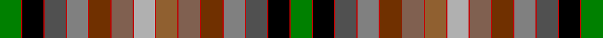

This page is one **sett** — a single exact thread-count. It belongs to the [tartan](/tartans/g18r1k18r1n18r1y18r1oii18r1oi18r1o18r1lr18r1oi18r1oii18r1y18r1n18r1k18r1g18/)
(the same proportion at any scale), whose colour order is pattern [GRKRBRGRRRRRRRYRRRRRGRBRKRG](/stripes/grkrbrgrrrrrrryrrrrrgrbrkrg/).

Sourced from weddslist.  It is a [27 stripe tartan](/stripes/stripes27/).

Original link http://www.weddslist.com/cgi-bin/tartans/pg.pl?source=sts

## Thread count
G/36 R2 K36 R2 Na36 R2 Nb36 R2 T36 R2 LTa36 R2 N36 R2 LT36 R2 LTa36 R2 T36 R2 Nb36 R2 Na36 R2 K36 R2 G/36

## Palette

Palette: <strong>Tartan Register</strong> <small style="color:#888">(4 of 9 colours)</small>
<table><thead><tr><th>Colour</th><th>Threads</th><th>Shade</th><th>Base</th><th>OKLCh</th></tr></thead><tbody><tr><td>G/</td><td style="text-align:right;font-variant-numeric:tabular-nums">36</td><td><code style="background-color:#008000;">#008000</code> <small style="color:#888">#008000</small></td><td>G <code style="background-color:#006100;">#006100</code></td><td><small style="color:#888">oklch(52.0% 0.177 142.5)</small></td></tr><tr><td>R</td><td style="text-align:right;font-variant-numeric:tabular-nums">2</td><td><code style="background-color:#C00000;">#C00000</code> <small style="color:#888">#C00000</small></td><td>R <code style="background-color:#CC0000;">#CC0000</code></td><td><small style="color:#888">oklch(50.7% 0.208 29.2)</small></td></tr><tr><td>K</td><td style="text-align:right;font-variant-numeric:tabular-nums">36</td><td><code style="background-color:#000000;">#000000</code> <small style="color:#888">#000000</small></td><td>K <code style="background-color:#000000;">#000000</code></td><td><small style="color:#888">oklch(0.0% 0.000 0.0)</small></td></tr><tr><td>R</td><td style="text-align:right;font-variant-numeric:tabular-nums">2</td><td><code style="background-color:#C00000;">#C00000</code> <small style="color:#888">#C00000</small></td><td>R <code style="background-color:#CC0000;">#CC0000</code></td><td><small style="color:#888">oklch(50.7% 0.208 29.2)</small></td></tr><tr><td>Na</td><td style="text-align:right;font-variant-numeric:tabular-nums">36</td><td><code style="background-color:#505050;">#505050</code> <small style="color:#888">#505050</small></td><td>B <code style="background-color:#2A418A;">#2A418A</code></td><td><small style="color:#888">oklch(43.1% 0.000 89.9)</small></td></tr><tr><td>R</td><td style="text-align:right;font-variant-numeric:tabular-nums">2</td><td><code style="background-color:#C00000;">#C00000</code> <small style="color:#888">#C00000</small></td><td>R <code style="background-color:#CC0000;">#CC0000</code></td><td><small style="color:#888">oklch(50.7% 0.208 29.2)</small></td></tr><tr><td>Nb</td><td style="text-align:right;font-variant-numeric:tabular-nums">36</td><td><code style="background-color:#808080;">#808080</code> <small style="color:#888">#808080</small></td><td>G <code style="background-color:#006100;">#006100</code></td><td><small style="color:#888">oklch(60.0% 0.000 89.9)</small></td></tr><tr><td>R</td><td style="text-align:right;font-variant-numeric:tabular-nums">2</td><td><code style="background-color:#C00000;">#C00000</code> <small style="color:#888">#C00000</small></td><td>R <code style="background-color:#CC0000;">#CC0000</code></td><td><small style="color:#888">oklch(50.7% 0.208 29.2)</small></td></tr><tr><td>T</td><td style="text-align:right;font-variant-numeric:tabular-nums">36</td><td><code style="background-color:#703000;">#703000</code> <small style="color:#888">#703000</small></td><td>R <code style="background-color:#CC0000;">#CC0000</code></td><td><small style="color:#888">oklch(39.1% 0.105 49.1)</small></td></tr><tr><td>R</td><td style="text-align:right;font-variant-numeric:tabular-nums">2</td><td><code style="background-color:#C00000;">#C00000</code> <small style="color:#888">#C00000</small></td><td>R <code style="background-color:#CC0000;">#CC0000</code></td><td><small style="color:#888">oklch(50.7% 0.208 29.2)</small></td></tr><tr><td>LTa</td><td style="text-align:right;font-variant-numeric:tabular-nums">36</td><td><code style="background-color:#806050;">#806050</code> <small style="color:#888">#806050</small></td><td>R <code style="background-color:#CC0000;">#CC0000</code></td><td><small style="color:#888">oklch(51.7% 0.049 47.8)</small></td></tr><tr><td>R</td><td style="text-align:right;font-variant-numeric:tabular-nums">2</td><td><code style="background-color:#C00000;">#C00000</code> <small style="color:#888">#C00000</small></td><td>R <code style="background-color:#CC0000;">#CC0000</code></td><td><small style="color:#888">oklch(50.7% 0.208 29.2)</small></td></tr><tr><td>N</td><td style="text-align:right;font-variant-numeric:tabular-nums">36</td><td><code style="background-color:#B0B0B0;">#B0B0B0</code> <small style="color:#888">#B0B0B0</small></td><td>Y <code style="background-color:#F2BF00;">#F2BF00</code></td><td><small style="color:#888">oklch(75.7% 0.000 89.9)</small></td></tr><tr><td>R</td><td style="text-align:right;font-variant-numeric:tabular-nums">2</td><td><code style="background-color:#C00000;">#C00000</code> <small style="color:#888">#C00000</small></td><td>R <code style="background-color:#CC0000;">#CC0000</code></td><td><small style="color:#888">oklch(50.7% 0.208 29.2)</small></td></tr><tr><td>LT</td><td style="text-align:right;font-variant-numeric:tabular-nums">36</td><td><code style="background-color:#906030;">#906030</code> <small style="color:#888">#906030</small></td><td>R <code style="background-color:#CC0000;">#CC0000</code></td><td><small style="color:#888">oklch(53.1% 0.089 63.7)</small></td></tr><tr><td>R</td><td style="text-align:right;font-variant-numeric:tabular-nums">2</td><td><code style="background-color:#C00000;">#C00000</code> <small style="color:#888">#C00000</small></td><td>R <code style="background-color:#CC0000;">#CC0000</code></td><td><small style="color:#888">oklch(50.7% 0.208 29.2)</small></td></tr><tr><td>LTa</td><td style="text-align:right;font-variant-numeric:tabular-nums">36</td><td><code style="background-color:#806050;">#806050</code> <small style="color:#888">#806050</small></td><td>R <code style="background-color:#CC0000;">#CC0000</code></td><td><small style="color:#888">oklch(51.7% 0.049 47.8)</small></td></tr><tr><td>R</td><td style="text-align:right;font-variant-numeric:tabular-nums">2</td><td><code style="background-color:#C00000;">#C00000</code> <small style="color:#888">#C00000</small></td><td>R <code style="background-color:#CC0000;">#CC0000</code></td><td><small style="color:#888">oklch(50.7% 0.208 29.2)</small></td></tr><tr><td>T</td><td style="text-align:right;font-variant-numeric:tabular-nums">36</td><td><code style="background-color:#703000;">#703000</code> <small style="color:#888">#703000</small></td><td>R <code style="background-color:#CC0000;">#CC0000</code></td><td><small style="color:#888">oklch(39.1% 0.105 49.1)</small></td></tr><tr><td>R</td><td style="text-align:right;font-variant-numeric:tabular-nums">2</td><td><code style="background-color:#C00000;">#C00000</code> <small style="color:#888">#C00000</small></td><td>R <code style="background-color:#CC0000;">#CC0000</code></td><td><small style="color:#888">oklch(50.7% 0.208 29.2)</small></td></tr><tr><td>Nb</td><td style="text-align:right;font-variant-numeric:tabular-nums">36</td><td><code style="background-color:#808080;">#808080</code> <small style="color:#888">#808080</small></td><td>G <code style="background-color:#006100;">#006100</code></td><td><small style="color:#888">oklch(60.0% 0.000 89.9)</small></td></tr><tr><td>R</td><td style="text-align:right;font-variant-numeric:tabular-nums">2</td><td><code style="background-color:#C00000;">#C00000</code> <small style="color:#888">#C00000</small></td><td>R <code style="background-color:#CC0000;">#CC0000</code></td><td><small style="color:#888">oklch(50.7% 0.208 29.2)</small></td></tr><tr><td>Na</td><td style="text-align:right;font-variant-numeric:tabular-nums">36</td><td><code style="background-color:#505050;">#505050</code> <small style="color:#888">#505050</small></td><td>B <code style="background-color:#2A418A;">#2A418A</code></td><td><small style="color:#888">oklch(43.1% 0.000 89.9)</small></td></tr><tr><td>R</td><td style="text-align:right;font-variant-numeric:tabular-nums">2</td><td><code style="background-color:#C00000;">#C00000</code> <small style="color:#888">#C00000</small></td><td>R <code style="background-color:#CC0000;">#CC0000</code></td><td><small style="color:#888">oklch(50.7% 0.208 29.2)</small></td></tr><tr><td>K</td><td style="text-align:right;font-variant-numeric:tabular-nums">36</td><td><code style="background-color:#000000;">#000000</code> <small style="color:#888">#000000</small></td><td>K <code style="background-color:#000000;">#000000</code></td><td><small style="color:#888">oklch(0.0% 0.000 0.0)</small></td></tr><tr><td>R</td><td style="text-align:right;font-variant-numeric:tabular-nums">2</td><td><code style="background-color:#C00000;">#C00000</code> <small style="color:#888">#C00000</small></td><td>R <code style="background-color:#CC0000;">#CC0000</code></td><td><small style="color:#888">oklch(50.7% 0.208 29.2)</small></td></tr><tr><td>G/</td><td style="text-align:right;font-variant-numeric:tabular-nums">36</td><td><code style="background-color:#008000;">#008000</code> <small style="color:#888">#008000</small></td><td>G <code style="background-color:#006100;">#006100</code></td><td><small style="color:#888">oklch(52.0% 0.177 142.5)</small></td></tr></tbody></table>

## Nearest tartans

The nearest existing variants by ΔTartan distance, with this tartan at the top so the swatches line up against it.

ΔTartan

Tartan

Sett

—

<a href="/ttd/edit/#slug=g18r1k18r1n18r1y18r1oii18r1oi18r1o18r1lr18r1oi18r1oii18r1y18r1n18r1k18r1g18~x2">MacKay of Strathnaver</a> <a class="nn-out" href="/setts/s27/g18r1k18r1n18r1y18r1oii18r1oi18r1o18r1lr18r1oi18r1oii18r1y18r1n18r1k18r1g18~x2/" title="open its dictionary page">↗</a>

0.54

<a href="/ttd/edit/#slug=dg18r1k18r1n18r1o18r1dr18r1dy18r1lo18r1ly18r1dy18r1dr18r1o18r1n18r1k18r1dg18~x2">MacKay of Strathnaver</a> <a class="nn-out" href="/setts/s27/dg18r1k18r1n18r1o18r1dr18r1dy18r1lo18r1ly18r1dy18r1dr18r1o18r1n18r1k18r1dg18~x2/" title="open its dictionary page">↗</a>

0.54

<a href="/ttd/edit/#slug=g18r1k18r1n18r1o18r1dr18r1dy18r1lo18r1ly18r1dy18r1dr18r1o18r1n18r1k18r1g18~x2">MacKay of Strathnaver Clan Tartan Tartan Number: 2037. Earliest known date: 1952 Designed circa 1952 for Wm Andersons of Edinburgh and Lord Reay. The tartan features the seasons of the year. See products available Copyright © Blair Urquhart, Comrie, 2015</a> <a class="nn-out" href="/setts/s27/g18r1k18r1n18r1o18r1dr18r1dy18r1lo18r1ly18r1dy18r1dr18r1o18r1n18r1k18r1g18~x2/" title="open its dictionary page">↗</a>

1.85

<a href="/ttd/edit/#slug=dg18ly3db14t6w3k2w3t6k2r4m3ri4k2ri4m3r2k2t6w3k2w3t6db14ly3dg18r12w3r12w3r12~x2">Unidentified Cant #01 (Cumming)</a> <a class="nn-out" href="/setts/s30/dg18ly3db14t6w3k2w3t6k2r4m3ri4k2ri4m3r2k2t6w3k2w3t6db14ly3dg18r12w3r12w3r12~x2/" title="open its dictionary page">↗</a>

1.95

<a href="/setts/s15/b17dg15ly5w2dg8dp6w2db8dy32r18w2r8w2dyi50w2~x2/">Culloden Worn by Pr Charles</a>

2.06

<a href="/ttd/edit/#slug=b17g15ly5w2g8dp6w2db8dr32r18w2r8w2o50w2~x2">Culloden, Worn by Pr Charles</a> <a class="nn-out" href="/setts/s15/b17g15ly5w2g8dp6w2db8dr32r18w2r8w2o50w2~x2/" title="open its dictionary page">↗</a>

2.07

<a href="/setts/s52/n18k1dg18k1n18k1dr18k1lo18k1dy18k1k18k1o18k1dy18k1lo18k1dr18k1n18k1dg18k1n18~x2/">MacKay, of Strathnaver</a>

2.08

<a href="/ttd/edit/#slug=db12b1g12r2g12dg12b1db12b2dr12o1dg12o12ly2o12dg12o1dr12b2~x2">United Distillers, (Warp)</a> <a class="nn-out" href="/setts/s19/db12b1g12r2g12dg12b1db12b2dr12o1dg12o12ly2o12dg12o1dr12b2~x2/" title="open its dictionary page">↗</a>

2.11

<a href="/setts/s28/r16w4dy100w4db34g30ly10w3g16dp12w4db16do64r26w4/">Unnamed C18th - Prince Charles Edward</a>

2.24

<a href="/ttd/edit/#slug=db4g6dg7dy1g6dg7dy1g6dg7dy1g6dg7dy1g6dg7dy1g6db4k8ri1k1w1k1db8r6k1r4w1r4k1r6db8k1w1k1ri1~x2">Unidentified Cotton sample</a> <a class="nn-out" href="/setts/s36/db4g6dg7dy1g6dg7dy1g6dg7dy1g6dg7dy1g6dg7dy1g6db4k8ri1k1w1k1db8r6k1r4w1r4k1r6db8k1w1k1ri1~x2/" title="open its dictionary page">↗</a>

2.26

<a href="/ttd/edit/#slug=ri4w1r11ri2w2dp11t4w2t4dp11w2g4ly4w1dp5w1ly4g4w2gi10g4w2g4gi10w2t2dp6w1dp6t2w2ri2r11w1ri4w1~x2">Waggrall Family Tartan Tartan Number: 1691. Earliest known date: 1819 Incomplete see Sindex. Update required if possible. See products available Copyright © Blair Urquhart, Comrie, 2015</a> <a class="nn-out" href="/setts/s36/ri4w1r11ri2w2dp11t4w2t4dp11w2g4ly4w1dp5w1ly4g4w2gi10g4w2g4gi10w2t2dp6w1dp6t2w2ri2r11w1ri4w1~x2/" title="open its dictionary page">↗</a>

## Neighbour map

Every grey dot is one of 14359 variants placed by the first two principal components of the ΔTartan feature space (44% of its variance). Red is this tartan; blue dots are its nearest — click one to open its page.

<svg viewBox="0 0 640 380" role="img" style="max-width:100%;height:auto;border:1px solid #e0e0e0;border-radius:4px;display:block" xmlns="http://www.w3.org/2000/svg"><image href="/nn/cloud.v1.png" width="640" height="380"/><a href="/setts/s27/dg18r1k18r1n18r1o18r1dr18r1dy18r1lo18r1ly18r1dy18r1dr18r1o18r1n18r1k18r1dg18~x2/"><circle cx="14.0" cy="49.6" r="4" fill="#3465a4"><title>MacKay of Strathnaver</title></circle></a><a href="/setts/s27/g18r1k18r1n18r1o18r1dr18r1dy18r1lo18r1ly18r1dy18r1dr18r1o18r1n18r1k18r1g18~x2/"><circle cx="14.0" cy="50.2" r="4" fill="#3465a4"><title>MacKay of Strathnaver Clan Tartan Tartan Number: 2037. Earliest known date: 1952 Designed circa 1952 for Wm Andersons of Edinburgh and Lord Reay. The tartan features the seasons of the year. See products available Copyright © Blair Urquhart, Comrie, 2015</title></circle></a><a href="/setts/s30/dg18ly3db14t6w3k2w3t6k2r4m3ri4k2ri4m3r2k2t6w3k2w3t6db14ly3dg18r12w3r12w3r12~x2/"><circle cx="14.0" cy="50.3" r="4" fill="#3465a4"><title>Unidentified Cant #01 (Cumming)</title></circle></a><a href="/setts/s15/b17dg15ly5w2dg8dp6w2db8dy32r18w2r8w2dyi50w2~x2/"><circle cx="67.3" cy="35.2" r="4" fill="#3465a4"><title>Culloden Worn by Pr Charles</title></circle></a><a href="/setts/s15/b17g15ly5w2g8dp6w2db8dr32r18w2r8w2o50w2~x2/"><circle cx="74.6" cy="32.8" r="4" fill="#3465a4"><title>Culloden, Worn by Pr Charles</title></circle></a><a href="/setts/s52/n18k1dg18k1n18k1dr18k1lo18k1dy18k1k18k1o18k1dy18k1lo18k1dr18k1n18k1dg18k1n18~x2/"><circle cx="14.0" cy="37.9" r="4" fill="#3465a4"><title>MacKay, of Strathnaver</title></circle></a><a href="/setts/s19/db12b1g12r2g12dg12b1db12b2dr12o1dg12o12ly2o12dg12o1dr12b2~x2/"><circle cx="43.8" cy="122.3" r="4" fill="#3465a4"><title>United Distillers, (Warp)</title></circle></a><a href="/setts/s28/r16w4dy100w4db34g30ly10w3g16dp12w4db16do64r26w4/"><circle cx="114.5" cy="23.0" r="4" fill="#3465a4"><title>Unnamed C18th - Prince Charles Edward</title></circle></a><a href="/setts/s36/db4g6dg7dy1g6dg7dy1g6dg7dy1g6dg7dy1g6dg7dy1g6db4k8ri1k1w1k1db8r6k1r4w1r4k1r6db8k1w1k1ri1~x2/"><circle cx="14.0" cy="89.6" r="4" fill="#3465a4"><title>Unidentified Cotton sample</title></circle></a><a href="/setts/s36/ri4w1r11ri2w2dp11t4w2t4dp11w2g4ly4w1dp5w1ly4g4w2gi10g4w2g4gi10w2t2dp6w1dp6t2w2ri2r11w1ri4w1~x2/"><circle cx="14.0" cy="50.5" r="4" fill="#3465a4"><title>Waggrall Family Tartan Tartan Number: 1691. Earliest known date: 1819 Incomplete see Sindex. Update required if possible. See products available Copyright © Blair Urquhart, Comrie, 2015</title></circle></a><circle cx="14.0" cy="42.2" r="5" fill="#c00000"/></svg>

ID: /setts/s27/g18r1k18r1n18r1y18r1oii18r1oi18r1o18r1lr18r1oi18r1oii18r1y18r1n18r1k18r1g18~x2/
