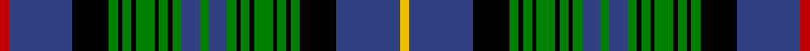

In pattern [RBKGKGKGKGKGBGBGKGKGKGKGKBY](/stripes/rbkgkgkgkgkgbgbgkgkgkgkgkby/).

This was sourced from weddslist.  It is a [27 stripe tartan](/stripes/stripes27/).

Original link http://www.weddslist.com/cgi-bin/tartans/pg.pl?source=sts

## Attestations

This cloth appears in 2 source records; the oldest owns this page.

- undated — Duchess of Albany (weddslist, [record](http://www.weddslist.com/cgi-bin/tartans/pg.pl?source=sts))
- undated — Duchess of Albany Family Tartan Tartan Number: 1378. Earliest known date: 1880 'Clan Originaux' was published in Paris in 1880 by J. Claude Fres Et Cie. It contains the earliest known record of a number of Irish tartans and many variations of Scottish Clan tartans. The only copy known to exist was discovered recently in America and is now in the possession of Pendleton Mills in Portland, Oregon. See products available Copyright © Blair Urquhart, Comrie, 2015 (house-of-tartan, [record](http://www.house-of-tartan.scotland.net/house/TartanViewjs.asp?colr=Def&tnam=1378))

## Thread count
R/4 B28 K16 G4 K2 G4 K2 G8 K2 G4 K2 G4 B8 G4 B8 G4 K2 G4 K2 G8 K2 G4 K2 G4 K16 B28 Y/4

## Palette
Each colour and the base-6 reference it is a variant of.

| Colour | Shade | Base |
|---|---|---|
| B | <code style="background-color:#304080;">#304080</code> `oklch(39.4% 0.109 270.2)` <small>#304080</small> | B <code style="background-color:#2A418A;">#2A418A</code> |
| G | <code style="background-color:#008000;">#008000</code> `oklch(52.0% 0.177 142.5)` <small>#008000</small> | G <code style="background-color:#006100;">#006100</code> |
| K | <code style="background-color:#000000;">#000000</code> `oklch(0.0% 0.000 0.0)` <small>#000000</small> | K <code style="background-color:#000000;">#000000</code> |
| R | <code style="background-color:#C00000;">#C00000</code> `oklch(50.7% 0.208 29.2)` <small>#C00000</small> | R <code style="background-color:#CC0000;">#CC0000</code> |
| Y | <code style="background-color:#F0C000;">#F0C000</code> `oklch(82.7% 0.169 90.5)` <small>#F0C000</small> | Y <code style="background-color:#F2BF00;">#F2BF00</code> |

## Nearest tartans

The nearest existing variants by ΔTartan distance.

1. [Campbell of Argyll (Clan)](/setts/s28/k13g13k1ly3k1g13k13b12k2b2k2b12k13g13k1w3k1g13k13b2k2b2k2b13k2b2k2b2~x4/) — ΔT 0.76
1. [Campbell of Argyll](/setts/s28/k16g8k1ly2k1g8k8db8k1db1k1db8k8g8k1w2k1g8k8db1k1db1k1db8k1db1k1db1~x2/) — ΔT 0.80
1. [Gordon 6](/setts/s32/db15k3db3k3db3k15g15r1g1r4g1r1g15k15db15k3db4k3db15k15g15ly1g1ly4g1ly1g15k15db3k3db3k3~x2/) — ΔT 0.81
1. [MacKenzie, Bailey](/setts/s24/k6g18w2g18k6db18k1db4k1db18k6g18r2g18k6db2k2db2k2db18k2db2k2db2~x2/) — ΔT 0.85
1. [Dorris](/setts/s21/g24k3g3k3g3k18k2t2k2t2k13w3k13t2k2t2k2k18g19k4g4~x2/) — ΔT 1.00
1. [Ochiltree](/setts/s19/db12k1g2k1g2k1db12r2k12ly1k12r2g12k1db2k1db2k1g12~x2/) — ΔT 1.01
1. [Genet of An Gwylvos (Montana)](/setts/s21/w6k20db2k2db29k2db2k3r2k2r4k2r2k3g2k2g29k2g2k20w6~x2/) — ΔT 1.02
1. [Farquharson](/setts/s25/db21k1db1k1db1k10g22r2g22k10db16k1db2k1db16k10g22ly2g22k10db1k1db1k1db7~x2/) — ΔT 1.05
1. [Dundee Discovery (Corporate)](/setts/s30/k14g12r2g12k14db20k2db4k2db20g12lo3g3lo1k3r2k3lo1g3lo3g12db4k2db4k2db22k2db4k2db4~x2/) — ΔT 1.05
1. [Campbell of Argyll](/setts/s29/db1k1db8k8g8k1w2k1g8k8db1k1db1k1db8k1db1k1db1k8g8k1ly2k1g8k8db8k1db1~x2/) — ΔT 1.10

## Neighbour map

Every grey dot is one of 14299 variants placed by the first two principal components of the ΔTartan feature space (44% of its variance). Red is this tartan; blue dots are its nearest — click one to open its page.

<svg viewBox="0 0 640 380" role="img" style="max-width:100%;height:auto;border:1px solid #e0e0e0;border-radius:4px;display:block" xmlns="http://www.w3.org/2000/svg"><image href="/nn/cloud.v1.png" width="640" height="380"/><a href="/setts/s28/k13g13k1ly3k1g13k13b12k2b2k2b12k13g13k1w3k1g13k13b2k2b2k2b13k2b2k2b2~x4/"><circle cx="143.0" cy="117.5" r="4" fill="#3465a4"><title>Campbell of Argyll (Clan)</title></circle></a><a href="/setts/s28/k16g8k1ly2k1g8k8db8k1db1k1db8k8g8k1w2k1g8k8db1k1db1k1db8k1db1k1db1~x2/"><circle cx="180.3" cy="103.8" r="4" fill="#3465a4"><title>Campbell of Argyll</title></circle></a><a href="/setts/s32/db15k3db3k3db3k15g15r1g1r4g1r1g15k15db15k3db4k3db15k15g15ly1g1ly4g1ly1g15k15db3k3db3k3~x2/"><circle cx="138.0" cy="103.7" r="4" fill="#3465a4"><title>Gordon 6</title></circle></a><a href="/setts/s24/k6g18w2g18k6db18k1db4k1db18k6g18r2g18k6db2k2db2k2db18k2db2k2db2~x2/"><circle cx="191.6" cy="110.4" r="4" fill="#3465a4"><title>MacKenzie, Bailey</title></circle></a><a href="/setts/s21/g24k3g3k3g3k18k2t2k2t2k13w3k13t2k2t2k2k18g19k4g4~x2/"><circle cx="152.8" cy="127.5" r="4" fill="#3465a4"><title>Dorris</title></circle></a><a href="/setts/s19/db12k1g2k1g2k1db12r2k12ly1k12r2g12k1db2k1db2k1g12~x2/"><circle cx="140.7" cy="124.9" r="4" fill="#3465a4"><title>Ochiltree</title></circle></a><a href="/setts/s21/w6k20db2k2db29k2db2k3r2k2r4k2r2k3g2k2g29k2g2k20w6~x2/"><circle cx="186.6" cy="98.8" r="4" fill="#3465a4"><title>Genet of An Gwylvos (Montana)</title></circle></a><a href="/setts/s25/db21k1db1k1db1k10g22r2g22k10db16k1db2k1db16k10g22ly2g22k10db1k1db1k1db7~x2/"><circle cx="204.9" cy="97.1" r="4" fill="#3465a4"><title>Farquharson</title></circle></a><a href="/setts/s30/k14g12r2g12k14db20k2db4k2db20g12lo3g3lo1k3r2k3lo1g3lo3g12db4k2db4k2db22k2db4k2db4~x2/"><circle cx="199.7" cy="96.6" r="4" fill="#3465a4"><title>Dundee Discovery (Corporate)</title></circle></a><a href="/setts/s29/db1k1db8k8g8k1w2k1g8k8db1k1db1k1db8k1db1k1db1k8g8k1ly2k1g8k8db8k1db1~x2/"><circle cx="128.3" cy="130.8" r="4" fill="#3465a4"><title>Campbell of Argyll</title></circle></a><circle cx="171.1" cy="103.9" r="5" fill="#c00000"/></svg>

ID: /setts/s27/r2db14k8g2k1g2k1g4k1g2k1g2db4g2db4g2k1g2k1g4k1g2k1g2k8db14ly2~x2/
