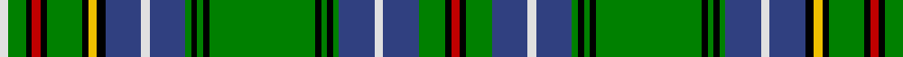

In pattern [RKGBWBGKGKGKGKGBWBKYKGKRKGW](/patterns/rkgbwbgkgkgkgkgbwbkykgkrkgw/).

This was sourced from weddslist.  It is a [27 stripes tartan](/stripes/stripes27/).

Original link http://www.weddslist.com/cgi-bin/tartans/pg.pl?source=sts

## Thread count
LN/6 G12 K4 R6 K4 G24 K4 Y6 K6 B24 LN6 B24 G4 K4 G4 K4 G72 K4 G4 K4 G4 B24 LN6 B24 G18 K4 R/6

## Palette
Each colour and its ΔE from the base-6 reference it is a variant of.

| Colour | Shade | Base | ΔE (OKLab) |
|---|---|---|---|
| B | <code style="background-color:#304080;">#304080</code> `#304080` | B <code style="background-color:#2A418A;">#2A418A</code> | 0.02 |
| G | <code style="background-color:#008000;">#008000</code> `#008000` | G <code style="background-color:#006100;">#006100</code> | 0.10 |
| K | <code style="background-color:#000000;">#000000</code> `#000000` | K <code style="background-color:#000000;">#000000</code> | 0.00 |
| LN | <code style="background-color:#E0E0E0;">#E0E0E0</code> `#E0E0E0` | W <code style="background-color:#F7F7F7;">#F7F7F7</code> | 0.07 |
| R | <code style="background-color:#C00000;">#C00000</code> `#C00000` | R <code style="background-color:#CC0000;">#CC0000</code> | 0.03 |
| Y | <code style="background-color:#F0C000;">#F0C000</code> `#F0C000` | Y <code style="background-color:#F2BF00;">#F2BF00</code> | 0.00 |

## Nearest tartans

The nearest existing variants by ΔTartan distance.

1. [Duncan of Sketraw Clan Tartan Tartan Number: 6497. Earliest known date: 2005 January A modified version of an unidentified tartan No. 331 from the 1930s. This new version is for John Duncan of Sketraw, and is approved by the Clan Duncan Society See products available Copyright © Blair Urquhart, Comrie, 2015](/setts/s32/k6g2k2g14k1y2k1b5r1b5k1w2k1g14k1b2k1g14k1w2k1b5r1b5k1y2k1g14k2g2k6r2x2~b1474b4-g006818-k101010-rc80000-we0e0e0-ye8c000/) — ΔT 0.98
1. [Unidentified (R.J.Forsyth)](/setts/s35/r2k6g2k2g14k1y1r1k1r1k3b9k1y2k1g11k1b2k1g11k1w2k1b9k1r1k1r1y1k1g14k2g2k6r2x2~b1474b4-g006818-k101010-rc80000-we0e0e0-ye8c000/) — ΔT 1.00
1. [Hawick](/setts/s33/b2k4y2k3w2k2g12r2g12b12r2b12k2w2k3y2k4b4k4y2k3w2k2g16r2g24r2g16k2w2k3y2k2x2~b1c0070-g006818-k101010-r880000-wf8f8f8-yd09800/) — ΔT 1.04
1. [Unidentified Plaid 14](/setts/s35/r8k31g8k8g56k3y3r3k3r3k12b36k3w8k3g44k2b6k2g44k3y8k3b36k12r3k3r3y3k3g56k8g8k31r8x2~b304080-g008000-k000000-rc00000-we0e0e0-yf0c000/) — ΔT 1.18
1. [King George VI (Green Stewart)](/setts/s22/g42b3k8y2k2w3k2g12r5k2r2w2r2k2r5g12k2w3k2y2k8b3x2~b1474b4-g006818-k101010-rc8002c-we0e0e0-ye8c000/) — ΔT 1.19
1. [Seller (Personal)](/setts/s22/g46k3b6y2b3y2b3g7r6b2r3w4r3b2r6g7b3y2b3y2b6k3x2~b1c0070-g006818-k101010-rc80000-wf8f8f8-ye8c000/) — ΔT 1.19
1. [Duncan of Sketraw](/setts/s17/b2k1g14k1w2k1b5r1b5k1y2k1g14k2g2k6r2x2~b1474b4-g006818-k101010-rc80000-we0e0e0-ye8c000/) — ΔT 1.27
1. [Farquharson](/setts/s25/b21k1b1k1b1k10g22r2g22k10b16k1b2k1b16k10g22y2g22k10b1k1b1k1b7x2~b304080-g008000-k000000-rc00000-yf0c000/) — ΔT 1.30
1. [Cockburn #2](/setts/s27/r3k2g9b12w3b12g2k2g2k2g36k2g2k2g2b12w3b12k3y3k2g12k2r3k2g6w3x2~b2c4084-g005020-k101010-rdc0000-we0e0e0-ye8c000/) — ΔT 1.34
1. [Henry (2016)](/setts/s32/g12y1b1w1r2w1ba1w1ba4w1ba1w1r2w1b1y1g12y1g1w1y3w1ba5w1y3w1g1y1g12y1g1y1x2~b788cb4-ba2c4084-g004c00-rc8002c-wffffff-yfccc00/) — ΔT 1.37

## Neighbour map

Every grey dot is one of 15726 variants placed by the first two principal components of the ΔTartan feature space (44% of its variance). Red is this tartan; blue dots are its nearest — click one to open its page.

<svg viewBox="0 0 640 380" role="img" style="max-width:100%;height:auto;border:1px solid #e0e0e0;border-radius:4px;display:block" xmlns="http://www.w3.org/2000/svg"><image href="/nn/cloud.v1.png" width="640" height="380"/><a href="/setts/s32/k6g2k2g14k1y2k1b5r1b5k1w2k1g14k1b2k1g14k1w2k1b5r1b5k1y2k1g14k2g2k6r2x2~b1474b4-g006818-k101010-rc80000-we0e0e0-ye8c000/"><circle cx="204.2" cy="80.3" r="4" fill="#3465a4"><title>Duncan of Sketraw Clan Tartan Tartan Number: 6497. Earliest known date: 2005 January A modified version of an unidentified tartan No. 331 from the 1930s. This new version is for John Duncan of Sketraw, and is approved by the Clan Duncan Society See products available Copyright © Blair Urquhart, Comrie, 2015</title></circle></a><a href="/setts/s35/r2k6g2k2g14k1y1r1k1r1k3b9k1y2k1g11k1b2k1g11k1w2k1b9k1r1k1r1y1k1g14k2g2k6r2x2~b1474b4-g006818-k101010-rc80000-we0e0e0-ye8c000/"><circle cx="183.8" cy="71.8" r="4" fill="#3465a4"><title>Unidentified (R.J.Forsyth)</title></circle></a><a href="/setts/s33/b2k4y2k3w2k2g12r2g12b12r2b12k2w2k3y2k4b4k4y2k3w2k2g16r2g24r2g16k2w2k3y2k2x2~b1c0070-g006818-k101010-r880000-wf8f8f8-yd09800/"><circle cx="170.6" cy="82.4" r="4" fill="#3465a4"><title>Hawick</title></circle></a><a href="/setts/s35/r8k31g8k8g56k3y3r3k3r3k12b36k3w8k3g44k2b6k2g44k3y8k3b36k12r3k3r3y3k3g56k8g8k31r8x2~b304080-g008000-k000000-rc00000-we0e0e0-yf0c000/"><circle cx="186.1" cy="36.8" r="4" fill="#3465a4"><title>Unidentified Plaid 14</title></circle></a><a href="/setts/s22/g42b3k8y2k2w3k2g12r5k2r2w2r2k2r5g12k2w3k2y2k8b3x2~b1474b4-g006818-k101010-rc8002c-we0e0e0-ye8c000/"><circle cx="250.5" cy="55.7" r="4" fill="#3465a4"><title>King George VI (Green Stewart)</title></circle></a><a href="/setts/s22/g46k3b6y2b3y2b3g7r6b2r3w4r3b2r6g7b3y2b3y2b6k3x2~b1c0070-g006818-k101010-rc80000-wf8f8f8-ye8c000/"><circle cx="231.7" cy="43.2" r="4" fill="#3465a4"><title>Seller (Personal)</title></circle></a><a href="/setts/s17/b2k1g14k1w2k1b5r1b5k1y2k1g14k2g2k6r2x2~b1474b4-g006818-k101010-rc80000-we0e0e0-ye8c000/"><circle cx="207.0" cy="105.9" r="4" fill="#3465a4"><title>Duncan of Sketraw</title></circle></a><a href="/setts/s25/b21k1b1k1b1k10g22r2g22k10b16k1b2k1b16k10g22y2g22k10b1k1b1k1b7x2~b304080-g008000-k000000-rc00000-yf0c000/"><circle cx="201.0" cy="94.6" r="4" fill="#3465a4"><title>Farquharson</title></circle></a><a href="/setts/s27/r3k2g9b12w3b12g2k2g2k2g36k2g2k2g2b12w3b12k3y3k2g12k2r3k2g6w3x2~b2c4084-g005020-k101010-rdc0000-we0e0e0-ye8c000/"><circle cx="218.5" cy="76.1" r="4" fill="#3465a4"><title>Cockburn #2</title></circle></a><a href="/setts/s32/g12y1b1w1r2w1ba1w1ba4w1ba1w1r2w1b1y1g12y1g1w1y3w1ba5w1y3w1g1y1g12y1g1y1x2~b788cb4-ba2c4084-g004c00-rc8002c-wffffff-yfccc00/"><circle cx="172.7" cy="52.2" r="4" fill="#3465a4"><title>Henry (2016)</title></circle></a><circle cx="184.6" cy="62.8" r="5" fill="#c00000"/></svg>

ID: /setts/s27/r3k2g9b12w3b12g2k2g2k2g36k2g2k2g2b12w3b12k3y3k2g12k2r3k2g6w3x2~b304080-g008000-k000000-rc00000-we0e0e0-yf0c000/
