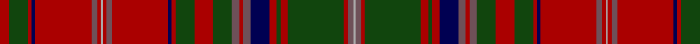

In pattern [RGRBRBRYRBRBRGRGBRBBRGRGRBY](/stripes/rgrbrbryrbrbrgrgbrbbrgrgrby/).

This was sourced from weddslist.  It is a [27 stripe tartan](/stripes/stripes27/).

Original link http://www.weddslist.com/cgi-bin/tartans/pg.pl?source=tinsel

## Attestations

This cloth appears in 2 source records; the oldest owns this page.

- undated — MacDougall D (weddslist, [record](http://www.weddslist.com/cgi-bin/tartans/pg.pl?source=tinsel))
- undated — MacDougall D (weddslist, [record](http://www.weddslist.com/cgi-bin/tartans/pg.pl?source=x))

## Register references

External register numbers recorded for this tartan.

- Scottish Register of Tartans: [1166](https://www.tartanregister.gov.uk/tartanDetails.aspx?ref=1166)
- Scottish Register of Tartans: [1510](https://www.tartanregister.gov.uk/tartanDetails.aspx?ref=1510)
- Scottish Register of Tartans: [1758](https://www.tartanregister.gov.uk/tartanDetails.aspx?ref=1758)
- Scottish Register of Tartans: [2307](https://www.tartanregister.gov.uk/tartanDetails.aspx?ref=2307)
- Scottish Register of Tartans: [2349](https://www.tartanregister.gov.uk/tartanDetails.aspx?ref=2349)
- Scottish Register of Tartans: [2540](https://www.tartanregister.gov.uk/tartanDetails.aspx?ref=2540)
- Scottish Register of Tartans: [2582](https://www.tartanregister.gov.uk/tartanDetails.aspx?ref=2582)
- Scottish Register of Tartans: [2585](https://www.tartanregister.gov.uk/tartanDetails.aspx?ref=2585)
- Scottish Register of Tartans: [2625](https://www.tartanregister.gov.uk/tartanDetails.aspx?ref=2625)
- Scottish Register of Tartans: [2730](https://www.tartanregister.gov.uk/tartanDetails.aspx?ref=2730)
- Scottish Register of Tartans: [2862](https://www.tartanregister.gov.uk/tartanDetails.aspx?ref=2862)
- Scottish Register of Tartans: [3072](https://www.tartanregister.gov.uk/tartanDetails.aspx?ref=3072)
- Scottish Register of Tartans: [3555](https://www.tartanregister.gov.uk/tartanDetails.aspx?ref=3555)
- Scottish Register of Tartans: [4925](https://www.tartanregister.gov.uk/tartanDetails.aspx?ref=4925)
- Scottish Register of Tartans: [696](https://www.tartanregister.gov.uk/tartanDetails.aspx?ref=696)
- Scottish Register of Tartans: [697](https://www.tartanregister.gov.uk/tartanDetails.aspx?ref=697)
- Scottish Register of Tartans: [982](https://www.tartanregister.gov.uk/tartanDetails.aspx?ref=982)
- Scottish Tartans Authority (ITI): 1277
- Scottish Tartans Authority (ITI): 1429
- Scottish Tartans Authority (ITI): 218
- Scottish Tartans Authority (ITI): 977
- Scottish Tartans World Register: 1042
- Scottish Tartans World Register: 127
- Scottish Tartans World Register: 1277
- Scottish Tartans World Register: 1399
- Scottish Tartans World Register: 1429
- Scottish Tartans World Register: 1593
- Scottish Tartans World Register: 218
- Scottish Tartans World Register: 2218
- Scottish Tartans World Register: 3061
- Scottish Tartans World Register: 441
- Scottish Tartans World Register: 737
- Scottish Tartans World Register: 858
- Scottish Tartans World Register: 864
- Scottish Tartans World Register: 873
- Scottish Tartans World Register: 897
- Scottish Tartans World Register: 977
- Scottish Tartans World Register: 978

## Thread count
DR/10 DG20 DR4 DB4 DR60 N6 DR4 Na2 DR4 N6 DR60 DB4 DR4 DG20 DR20 DG20 N8 DR4 N8 DB20 DR8 DG4 DR8 DG60 DR4 N6 Na/2

## Palette
Each colour and its ΔE from the base-6 reference it is a variant of.

| Colour | Shade | Base | ΔE (OKLab) |
|---|---|---|---|
| DB | <code style="background-color:#000052;">#000052</code> `#000052` | B <code style="background-color:#2A418A;">#2A418A</code> | 0.20 |
| DG | <code style="background-color:#11450D;">#11450D</code> `#11450D` | G <code style="background-color:#006100;">#006100</code> | 0.09 |
| DR | <code style="background-color:#AA0000;">#AA0000</code> `#AA0000` | R <code style="background-color:#CC0000;">#CC0000</code> | 0.07 |
| N | <code style="background-color:#6E5058;">#6E5058</code> `#6E5058` | B <code style="background-color:#2A418A;">#2A418A</code> | 0.15 |
| Na | <code style="background-color:#AAAAAA;">#AAAAAA</code> `#AAAAAA` | Y <code style="background-color:#F2BF00;">#F2BF00</code> | 0.19 |

## Nearest tartans

The nearest existing variants by ΔTartan distance.

1. [MacDougall - 1970 (H of E)](/setts/s27/r5g10r2db2r30dp3r2w1r2dp3r30db2r2g10r10g10dp4r2dp4db10r4g2r4g30r2dp3w1~x2/) — ΔT 1.01
1. [MacDougal](/setts/s26/g10r2db2r30dp3r2w1r2dp3r30db2r2g10r10g10dp4r2dp4db10r4g2r4g30r2dp3w1~x2/) — ΔT 1.02
1. [MacDougall 9](/setts/s27/r5g10r2db2r30p3r2w1r2p3r30db2r2g10r10g10p4r2p4db10r4g2r4g30r2p3w1~x2/) — ΔT 1.12
1. [MacDougall Clan Tartan Tartan Number: 1519. Earliest known date: 1815-16 The earliest reference to the MacDougall tartan is in the collection of the Highland Society of London where a sample exists, signed and sealed by the Clan Chief around 1815. The sett is a complex one and the nearest count to the present day day tartan comes from a sample in Paton's collection housed at the Scottish Tartans Museum, and dating to about 1830. The Highland Society also have a sample certified by the Chief MacDougall of MacDougall dated 1906, in their archives store at the Royal Caledonian School near London. See products available Copyright © Blair Urquhart, Comrie, 2015](/setts/s27/r5g10r2db2r30lr3r2w1r2lr3r30db2r2g10r10g10lr4r2lr4db10r4g2r4g30r2lr3w1~x2/) — ΔT 1.16
1. [Dalzell](/setts/s17/r24lr1db2r4dg32r4db2lr1r4db6r4lr1db2r32dg2dr3dg6~x2/) — ΔT 1.24
1. [MacDougall](/setts/s22/r6g12r2db1r36r4r36db1r2g12r12g12r6r2r6db12r4g2r4g36r2r2~x4/) — ΔT 1.27
1. [All Irish Red Irish District Tartan Tartan Number: 4067. Earliest known date: 1997 Part of a collection produced by Lochcarron in 1997 to acknowledge the early historical and cultural links between the Scots and Irish. Lochcarron sample. See products available Copyright © Blair Urquhart, Comrie, 2015](/setts/s28/r6y2db2r30g2r2g4r2g2r1g20r1y2db2r4~x2/) — ΔT 1.29
1. [MacDougall](/setts/s20/b2dr12r4dg72r8dg4r8db18dr12r4dr12dg18r18dg18r8db4r72dr6r4b1~x2/) — ΔT 1.32
1. [Stewart/Stuart of Appin #2](/setts/s30/r2t1db2r24g2r2db8r2g2r4g24r2t1db2r3db2t1r2g24r4g2r2db8r2g2r24db2t1r2g2~x2/) — ΔT 1.41
1. [MacDougall (Logan)](/setts/s20/t1r12r4dg72r8dg4r8db18r12r4r12dg18r18dg18r8db4r72r6r4t1~x2/) — ΔT 1.45

## Neighbour map

Every grey dot is one of 14299 variants placed by the first two principal components of the ΔTartan feature space (44% of its variance). Red is this tartan; blue dots are its nearest — click one to open its page.

<svg viewBox="0 0 640 380" role="img" style="max-width:100%;height:auto;border:1px solid #e0e0e0;border-radius:4px;display:block" xmlns="http://www.w3.org/2000/svg"><image href="/nn/cloud.v1.png" width="640" height="380"/><a href="/setts/s27/r5g10r2db2r30dp3r2w1r2dp3r30db2r2g10r10g10dp4r2dp4db10r4g2r4g30r2dp3w1~x2/"><circle cx="307.8" cy="62.4" r="4" fill="#3465a4"><title>MacDougall - 1970 (H of E)</title></circle></a><a href="/setts/s26/g10r2db2r30dp3r2w1r2dp3r30db2r2g10r10g10dp4r2dp4db10r4g2r4g30r2dp3w1~x2/"><circle cx="301.3" cy="63.5" r="4" fill="#3465a4"><title>MacDougal</title></circle></a><a href="/setts/s27/r5g10r2db2r30p3r2w1r2p3r30db2r2g10r10g10p4r2p4db10r4g2r4g30r2p3w1~x2/"><circle cx="306.3" cy="62.2" r="4" fill="#3465a4"><title>MacDougall 9</title></circle></a><a href="/setts/s27/r5g10r2db2r30lr3r2w1r2lr3r30db2r2g10r10g10lr4r2lr4db10r4g2r4g30r2lr3w1~x2/"><circle cx="306.5" cy="61.5" r="4" fill="#3465a4"><title>MacDougall Clan Tartan Tartan Number: 1519. Earliest known date: 1815-16 The earliest reference to the MacDougall tartan is in the collection of the Highland Society of London where a sample exists, signed and sealed by the Clan Chief around 1815. The sett is a complex one and the nearest count to the present day day tartan comes from a sample in Paton's collection housed at the Scottish Tartans Museum, and dating to about 1830. The Highland Society also have a sample certified by the Chief MacDougall of MacDougall dated 1906, in their archives store at the Royal Caledonian School near London. See products available Copyright © Blair Urquhart, Comrie, 2015</title></circle></a><a href="/setts/s17/r24lr1db2r4dg32r4db2lr1r4db6r4lr1db2r32dg2dr3dg6~x2/"><circle cx="371.3" cy="84.7" r="4" fill="#3465a4"><title>Dalzell</title></circle></a><a href="/setts/s22/r6g12r2db1r36r4r36db1r2g12r12g12r6r2r6db12r4g2r4g36r2r2~x4/"><circle cx="350.3" cy="91.1" r="4" fill="#3465a4"><title>MacDougall</title></circle></a><a href="/setts/s28/r6y2db2r30g2r2g4r2g2r1g20r1y2db2r4~x2/"><circle cx="341.2" cy="50.4" r="4" fill="#3465a4"><title>All Irish Red Irish District Tartan Tartan Number: 4067. Earliest known date: 1997 Part of a collection produced by Lochcarron in 1997 to acknowledge the early historical and cultural links between the Scots and Irish. Lochcarron sample. See products available Copyright © Blair Urquhart, Comrie, 2015</title></circle></a><a href="/setts/s20/b2dr12r4dg72r8dg4r8db18dr12r4dr12dg18r18dg18r8db4r72dr6r4b1~x2/"><circle cx="322.3" cy="76.2" r="4" fill="#3465a4"><title>MacDougall</title></circle></a><a href="/setts/s30/r2t1db2r24g2r2db8r2g2r4g24r2t1db2r3db2t1r2g24r4g2r2db8r2g2r24db2t1r2g2~x2/"><circle cx="310.7" cy="76.2" r="4" fill="#3465a4"><title>Stewart/Stuart of Appin #2</title></circle></a><a href="/setts/s20/t1r12r4dg72r8dg4r8db18r12r4r12dg18r18dg18r8db4r72r6r4t1~x2/"><circle cx="303.2" cy="56.8" r="4" fill="#3465a4"><title>MacDougall (Logan)</title></circle></a><circle cx="330.9" cy="80.1" r="5" fill="#c00000"/></svg>

ID: /setts/s27/r5dg10r2db2r30n3r2lr1r2n3r30db2r2dg10r10dg10n4r2n4db10r4dg2r4dg30r2n3lr1~x2/
