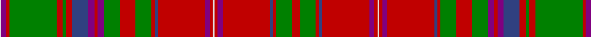

In pattern [RGRBRBRWRBRBRGRGBRBBRGRGRBW](/patterns/rgrbrbrwrbrbrgrgbrbbrgrgrbw/).

This was sourced from weddslist.  It is a [27 stripes tartan](/stripes/stripes27/).

Original link http://www.weddslist.com/cgi-bin/tartans/pg.pl?source=sts

## Thread count
LN/2 P6 R4 G60 R8 G4 R8 B20 P8 R4 P8 G20 R20 G20 R4 B4 R60 P6 R4 LN2 R4 P6 R60 B4 R4 G20 R/10

## Palette
Each colour and its ΔE from the base-6 reference it is a variant of.

| Colour | Shade | Base | ΔE (OKLab) |
|---|---|---|---|
| B | <code style="background-color:#304080;">#304080</code> `#304080` | B <code style="background-color:#2A418A;">#2A418A</code> | 0.02 |
| G | <code style="background-color:#008000;">#008000</code> `#008000` | G <code style="background-color:#006100;">#006100</code> | 0.10 |
| LN | <code style="background-color:#E0E0E0;">#E0E0E0</code> `#E0E0E0` | W <code style="background-color:#F7F7F7;">#F7F7F7</code> | 0.07 |
| P | <code style="background-color:#800080;">#800080</code> `#800080` | B <code style="background-color:#2A418A;">#2A418A</code> | 0.17 |
| R | <code style="background-color:#C00000;">#C00000</code> `#C00000` | R <code style="background-color:#CC0000;">#CC0000</code> | 0.03 |

## Nearest tartans

The nearest existing variants by ΔTartan distance.

1. [MacDougall Clan Tartan Tartan Number: 1519. Earliest known date: 1815-16 The earliest reference to the MacDougall tartan is in the collection of the Highland Society of London where a sample exists, signed and sealed by the Clan Chief around 1815. The sett is a complex one and the nearest count to the present day day tartan comes from a sample in Paton's collection housed at the Scottish Tartans Museum, and dating to about 1830. The Highland Society also have a sample certified by the Chief MacDougall of MacDougall dated 1906, in their archives store at the Royal Caledonian School near London. See products available Copyright © Blair Urquhart, Comrie, 2015](/setts/s27/r5g10r2b2r30y3r2w1r2y3r30b2r2g10r10g10y4r2y4b10r4g2r4g30r2y3w1~b2c2c80-g006818-rc80000-we0e0e0-yc090a0~x2/) — ΔT 0.08
1. [MacDougall - 1970 (H of E)](/setts/s27/r5g10r2b2r30ba3r2w1r2ba3r30b2r2g10r10g10ba4r2ba4b10r4g2r4g30r2ba3w1~b2c2c80-ba6c0070-g006818-rc80000-wfcfcfc~x2/) — ΔT 0.34
1. [MacDougal](/setts/s26/g10r2b2r30ba3r2w1r2ba3r30b2r2g10r10g10ba4r2ba4b10r4g2r4g30r2ba3w1~b2c2c80-ba6c0070-g006818-rc80000-wfcfcfc~x2/) — ΔT 0.35
1. [All Irish Red Irish District Tartan Tartan Number: 4067. Earliest known date: 1997 Part of a collection produced by Lochcarron in 1997 to acknowledge the early historical and cultural links between the Scots and Irish. Lochcarron sample. See products available Copyright © Blair Urquhart, Comrie, 2015](/setts/s28/r6g2b2r30ga2r2gb4r2ga2r1ga20r1g2b2r4b2g2r1ga20r1ga2r2gb4r2ga2r30b2g2~b202060-g789484-ga006818-gb289c18-rc80000~x2/) — ΔT 0.73
1. [MacDougall, Plaid](/setts/s24/b3ba12w6r6g46r14g6r14b14ba8w6r6w6ba8g12r16g12r6b6r86ba10w6r10b3~b304080-ba800080-g008000-rc00000-we0e0e0/) — ΔT 0.84
1. [MacDonald of Boisdale](/setts/s21/r16w1b6w1r6w1b32w1r24g1ga16g1r4g1ga6g1r4w1b6w1r16~b304080-g30a010-ga008000-rc00000-we0e0e0~x2/) — ΔT 0.95
1. [King George IV](/setts/s32/g3y3g3r24b1w1r3b6r3w1b1r3g24r3b1w1r24w1b1r3g24r3b1w1r3b6r3w1b1r24g3y3~b280034-g285800-rc80000-wf8f8f8-yfca098~x4/) — ΔT 0.97
1. [Unnamed C18th - Duke of Perth](/setts/s26/b30r14b2r14g20w1g2w1g20r44b4r10ba1r4ba1r10b4r44g20w1g2w1g20r14b2r14~b2c2c80-ba5c8ca8-g006818-rc80000-we0e0e0~x2/) — ΔT 1.01
1. [Stewart/Stuart of Appin #2](/setts/s30/g2r2b1ba2r24g2r2ba8r2g2r4g24r2b1ba2r3ba2b1r2g24r4g2r2ba8r2g2r24ba2b1r2~b5c8ca8-ba2c2c80-g006818-rc80000~x2/) — ΔT 1.12
1. [MacDougall D](/setts/s27/r5g10r2b2r30ba3r2y1r2ba3r30b2r2g10r10g10ba4r2ba4b10r4g2r4g30r2ba3y1~b000052-ba6e5058-g11450d-raa0000-yaaaaaa~x2/) — ΔT 1.12

## Neighbour map

Every grey dot is one of 15726 variants placed by the first two principal components of the ΔTartan feature space (44% of its variance). Red is this tartan; blue dots are its nearest — click one to open its page.

<svg viewBox="0 0 640 380" role="img" style="max-width:100%;height:auto;border:1px solid #e0e0e0;border-radius:4px;display:block" xmlns="http://www.w3.org/2000/svg"><image href="/nn/cloud.v1.png" width="640" height="380"/><a href="/setts/s27/r5g10r2b2r30y3r2w1r2y3r30b2r2g10r10g10y4r2y4b10r4g2r4g30r2y3w1~b2c2c80-g006818-rc80000-we0e0e0-yc090a0~x2/"><circle cx="306.0" cy="59.8" r="4" fill="#3465a4"><title>MacDougall Clan Tartan Tartan Number: 1519. Earliest known date: 1815-16 The earliest reference to the MacDougall tartan is in the collection of the Highland Society of London where a sample exists, signed and sealed by the Clan Chief around 1815. The sett is a complex one and the nearest count to the present day day tartan comes from a sample in Paton's collection housed at the Scottish Tartans Museum, and dating to about 1830. The Highland Society also have a sample certified by the Chief MacDougall of MacDougall dated 1906, in their archives store at the Royal Caledonian School near London. See products available Copyright © Blair Urquhart, Comrie, 2015</title></circle></a><a href="/setts/s27/r5g10r2b2r30ba3r2w1r2ba3r30b2r2g10r10g10ba4r2ba4b10r4g2r4g30r2ba3w1~b2c2c80-ba6c0070-g006818-rc80000-wfcfcfc~x2/"><circle cx="307.3" cy="60.7" r="4" fill="#3465a4"><title>MacDougall - 1970 (H of E)</title></circle></a><a href="/setts/s26/g10r2b2r30ba3r2w1r2ba3r30b2r2g10r10g10ba4r2ba4b10r4g2r4g30r2ba3w1~b2c2c80-ba6c0070-g006818-rc80000-wfcfcfc~x2/"><circle cx="300.6" cy="61.7" r="4" fill="#3465a4"><title>MacDougal</title></circle></a><a href="/setts/s28/r6g2b2r30ga2r2gb4r2ga2r1ga20r1g2b2r4b2g2r1ga20r1ga2r2gb4r2ga2r30b2g2~b202060-g789484-ga006818-gb289c18-rc80000~x2/"><circle cx="340.8" cy="48.4" r="4" fill="#3465a4"><title>All Irish Red Irish District Tartan Tartan Number: 4067. Earliest known date: 1997 Part of a collection produced by Lochcarron in 1997 to acknowledge the early historical and cultural links between the Scots and Irish. Lochcarron sample. See products available Copyright © Blair Urquhart, Comrie, 2015</title></circle></a><a href="/setts/s24/b3ba12w6r6g46r14g6r14b14ba8w6r6w6ba8g12r16g12r6b6r86ba10w6r10b3~b304080-ba800080-g008000-rc00000-we0e0e0/"><circle cx="276.1" cy="54.0" r="4" fill="#3465a4"><title>MacDougall, Plaid</title></circle></a><a href="/setts/s21/r16w1b6w1r6w1b32w1r24g1ga16g1r4g1ga6g1r4w1b6w1r16~b304080-g30a010-ga008000-rc00000-we0e0e0~x2/"><circle cx="288.3" cy="65.1" r="4" fill="#3465a4"><title>MacDonald of Boisdale</title></circle></a><a href="/setts/s32/g3y3g3r24b1w1r3b6r3w1b1r3g24r3b1w1r24w1b1r3g24r3b1w1r3b6r3w1b1r24g3y3~b280034-g285800-rc80000-wf8f8f8-yfca098~x4/"><circle cx="305.3" cy="45.8" r="4" fill="#3465a4"><title>King George IV</title></circle></a><a href="/setts/s26/b30r14b2r14g20w1g2w1g20r44b4r10ba1r4ba1r10b4r44g20w1g2w1g20r14b2r14~b2c2c80-ba5c8ca8-g006818-rc80000-we0e0e0~x2/"><circle cx="347.7" cy="59.5" r="4" fill="#3465a4"><title>Unnamed C18th - Duke of Perth</title></circle></a><a href="/setts/s30/g2r2b1ba2r24g2r2ba8r2g2r4g24r2b1ba2r3ba2b1r2g24r4g2r2ba8r2g2r24ba2b1r2~b5c8ca8-ba2c2c80-g006818-rc80000~x2/"><circle cx="309.6" cy="74.1" r="4" fill="#3465a4"><title>Stewart/Stuart of Appin #2</title></circle></a><a href="/setts/s27/r5g10r2b2r30ba3r2y1r2ba3r30b2r2g10r10g10ba4r2ba4b10r4g2r4g30r2ba3y1~b000052-ba6e5058-g11450d-raa0000-yaaaaaa~x2/"><circle cx="330.3" cy="75.1" r="4" fill="#3465a4"><title>MacDougall D</title></circle></a><circle cx="305.7" cy="60.4" r="5" fill="#c00000"/></svg>

ID: /setts/s27/r5g10r2b2r30ba3r2w1r2ba3r30b2r2g10r10g10ba4r2ba4b10r4g2r4g30r2ba3w1~b304080-ba800080-g008000-rc00000-we0e0e0~x2/
