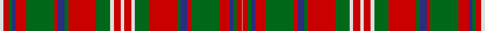

In pattern [WRGBRGRBGRGWRWRWGRGBRGRBGRW](/stripes/wrgbrgrbgrgwrwrwgrgbrgrbgrw/).

This was sourced from logan-1831.  It is a [27 stripe tartan](/stripes/stripes27/).

Original link /posts/logans-scottish-gael/

## Provenance

James Logan recorded the **MacKinnon** sett in 1831, on page 406 of the *Table of Clan Tartans* in *The Scottish Gaël* — the earliest systematic published collection of clan setts. Logan gives the stripe widths in eighths of an inch, measured across the cloth and reflected about each end (a half-sett):

> ¼ white · 1½ red · 1 green · 1 blue · 3 red · 8 green · 1 red · 2 blue · 1 green · 8 red · 4 green · 1 white · 2 red · 1 white · 2 red · 1 white · 4 green · 8 red · 1 green · 2 blue · 1 red · 8 green · 3 red · 1 blue · 1 green · 1½ red · 1 white

In threads (at 8 to the eighth-inch) that is `W/2 R12 G8 B8 R24 G64 R8 B16 G8 R64 G32 W8 R16 W8 R16 W8 G32 R64 G8 B16 R8 G64 R24 B8 G8 R12 W/8`. Logan named his colours rather than dyeing to a standard, so the palette here is the Dictionary's modern reading of his names.

See [Logan's Scottish Gaël](/posts/logans-scottish-gael/) for the full table and method.

## Related setts

Later records of the **MacKinnon** name adjusted Logan's counts: [MacKinnon](/setts/s14/b2r3g2ba2r6g16r2ba4g2r16g8b2r4w2~b780078-ba2c2c80-g006818-rc80000-we0e0e0~x2/); [MacKinnon #10](/setts/s11/w2r4g8r16b2r3g16r4b2r4w2~b3c82af-g005020-rdc0000-we0e0e0~x2/); [MacKinnon #11](/setts/s14/w3r5g3b3r14g36r3b8g3r36g14ra3r5w3~b5a008c-g005020-rdc0000-rac82828-we0e0e0~x2/); [MacKinnon #12](/setts/s14/w2r4g2b2r6g4r2b5g2r20g7w2r4w2~b2c4084-g005020-rdc0000-we0e0e0~x2/). Compare their thread counts with Logan's above.

## Thread count
LN/8 R12 G8 DB8 R24 G64 R8 DB16 G8 R64 G32 LN8 R16 LN8 R16 LN8 G32 R64 G8 DB16 R8 G64 R24 DB8 G8 R12 LN/2

## Palette
Each colour and the base-6 reference it is a variant of.

| Colour | Shade | Base |
|---|---|---|
| DB | <code style="background-color:#2C2C80;">#2C2C80</code> `oklch(35.0% 0.138 276.6)` <small>#2C2C80</small> | B <code style="background-color:#2A418A;">#2A418A</code> |
| G | <code style="background-color:#006818;">#006818</code> `oklch(45.0% 0.142 145.0)` <small>#006818</small> | G <code style="background-color:#006100;">#006100</code> |
| LN | <code style="background-color:#E0E0E0;">#E0E0E0</code> `oklch(90.7% 0.000 89.9)` <small>#E0E0E0</small> | W <code style="background-color:#F7F7F7;">#F7F7F7</code> |
| R | <code style="background-color:#C80000;">#C80000</code> `oklch(52.3% 0.215 29.2)` <small>#C80000</small> | R <code style="background-color:#CC0000;">#CC0000</code> |

## Nearest tartans

The nearest existing variants by ΔTartan distance.

1. [Unidentified](/setts/s22/ly3g30r7g2r1g8r1g2r7g16k18t8r14g8r1g1r7g1r1g8r27ly3~x2/) — ΔT 1.15
1. [Oriel #1](/setts/s16/r12db2r3g20k4g20r30k2r1~x2/) — ΔT 1.30
1. [Unnamed C18/19th - Antigonish (A) #2](/setts/s29/dt13r6dt2r6w1y26r2dt26w1r26w1dt6r2y2r2dt13r2y2r2dt6w1r26w1dt26y26w1r6dt2r6~x2/) — ΔT 1.32
1. [Stewart/Stuart of Appin #2](/setts/s30/r2t1db2r24g2r2db8r2g2r4g24r2t1db2r3db2t1r2g24r4g2r2db8r2g2r24db2t1r2g2~x2/) — ΔT 1.35
1. [MacDougall 9](/setts/s27/r5g10r2db2r30p3r2w1r2p3r30db2r2g10r10g10p4r2p4db10r4g2r4g30r2p3w1~x2/) — ΔT 1.35
1. [Matheson](/setts/s21/g8r4g1r1g1r24db8g4r1g1r1g4r8g1r1g1r1db8g8r2g4~x2/) — ΔT 1.36
1. [MacDougall Clan Tartan Tartan Number: 1519. Earliest known date: 1815-16 The earliest reference to the MacDougall tartan is in the collection of the Highland Society of London where a sample exists, signed and sealed by the Clan Chief around 1815. The sett is a complex one and the nearest count to the present day day tartan comes from a sample in Paton's collection housed at the Scottish Tartans Museum, and dating to about 1830. The Highland Society also have a sample certified by the Chief MacDougall of MacDougall dated 1906, in their archives store at the Royal Caledonian School near London. See products available Copyright © Blair Urquhart, Comrie, 2015](/setts/s27/r5g10r2db2r30lr3r2w1r2lr3r30db2r2g10r10g10lr4r2lr4db10r4g2r4g30r2lr3w1~x2/) — ΔT 1.38
1. [Ross (Clan)](/setts/s27/g18r2g18r18g2r4g2r18db18r2db18r18db1r1db2r1db1r18db1r1g2r1db1r18g18r2g18~x2/) — ΔT 1.39
1. [MacNaughton](/setts/s17/k2t2r32g32k24t18r32t2k2t2r32t18k24g32r32t2k1~x2/) — ΔT 1.39
1. [Ross Clan Tartan Tartan Number: 864. Earliest known date: 1810-15 D.C.Stewart says, "The version here given may be taken to be correct." Later versions, including Logans, are known to have omissions. The Clan Ross is descended from Fearcher MacinTagart, Earl of Ross in the 13th century. The chiefship has passed to the Rosses of Shandwick. The tartan is also worn by the MacTiers. Also worn by the Metro Toronto Police pipe band. (Strathallan 1994) See products available Copyright © Blair Urquhart, Comrie, 2015](/setts/s27/g18r2g18r18g2r4g2r18db18r2db18r18db1r1db2r1db1r18db1r1db2r1db1r18g18r2g18~x2/) — ΔT 1.41

## Neighbour map

Every grey dot is one of 14299 variants placed by the first two principal components of the ΔTartan feature space (44% of its variance). Red is this tartan; blue dots are its nearest — click one to open its page.

<svg viewBox="0 0 640 380" role="img" style="max-width:100%;height:auto;border:1px solid #e0e0e0;border-radius:4px;display:block" xmlns="http://www.w3.org/2000/svg"><image href="/nn/cloud.v1.png" width="640" height="380"/><a href="/setts/s22/ly3g30r7g2r1g8r1g2r7g16k18t8r14g8r1g1r7g1r1g8r27ly3~x2/"><circle cx="254.4" cy="82.7" r="4" fill="#3465a4"><title>Unidentified</title></circle></a><a href="/setts/s16/r12db2r3g20k4g20r30k2r1~x2/"><circle cx="317.9" cy="124.4" r="4" fill="#3465a4"><title>Oriel #1</title></circle></a><a href="/setts/s29/dt13r6dt2r6w1y26r2dt26w1r26w1dt6r2y2r2dt13r2y2r2dt6w1r26w1dt26y26w1r6dt2r6~x2/"><circle cx="257.5" cy="86.9" r="4" fill="#3465a4"><title>Unnamed C18/19th - Antigonish (A) #2</title></circle></a><a href="/setts/s30/r2t1db2r24g2r2db8r2g2r4g24r2t1db2r3db2t1r2g24r4g2r2db8r2g2r24db2t1r2g2~x2/"><circle cx="310.7" cy="76.2" r="4" fill="#3465a4"><title>Stewart/Stuart of Appin #2</title></circle></a><a href="/setts/s27/r5g10r2db2r30p3r2w1r2p3r30db2r2g10r10g10p4r2p4db10r4g2r4g30r2p3w1~x2/"><circle cx="306.3" cy="62.2" r="4" fill="#3465a4"><title>MacDougall 9</title></circle></a><a href="/setts/s21/g8r4g1r1g1r24db8g4r1g1r1g4r8g1r1g1r1db8g8r2g4~x2/"><circle cx="326.0" cy="117.7" r="4" fill="#3465a4"><title>Matheson</title></circle></a><a href="/setts/s27/r5g10r2db2r30lr3r2w1r2lr3r30db2r2g10r10g10lr4r2lr4db10r4g2r4g30r2lr3w1~x2/"><circle cx="306.5" cy="61.5" r="4" fill="#3465a4"><title>MacDougall Clan Tartan Tartan Number: 1519. Earliest known date: 1815-16 The earliest reference to the MacDougall tartan is in the collection of the Highland Society of London where a sample exists, signed and sealed by the Clan Chief around 1815. The sett is a complex one and the nearest count to the present day day tartan comes from a sample in Paton's collection housed at the Scottish Tartans Museum, and dating to about 1830. The Highland Society also have a sample certified by the Chief MacDougall of MacDougall dated 1906, in their archives store at the Royal Caledonian School near London. See products available Copyright © Blair Urquhart, Comrie, 2015</title></circle></a><a href="/setts/s27/g18r2g18r18g2r4g2r18db18r2db18r18db1r1db2r1db1r18db1r1g2r1db1r18g18r2g18~x2/"><circle cx="294.0" cy="130.7" r="4" fill="#3465a4"><title>Ross (Clan)</title></circle></a><a href="/setts/s17/k2t2r32g32k24t18r32t2k2t2r32t18k24g32r32t2k1~x2/"><circle cx="245.7" cy="119.6" r="4" fill="#3465a4"><title>MacNaughton</title></circle></a><a href="/setts/s27/g18r2g18r18g2r4g2r18db18r2db18r18db1r1db2r1db1r18db1r1db2r1db1r18g18r2g18~x2/"><circle cx="292.8" cy="130.4" r="4" fill="#3465a4"><title>Ross Clan Tartan Tartan Number: 864. Earliest known date: 1810-15 D.C.Stewart says, &quot;The version here given may be taken to be correct.&quot; Later versions, including Logans, are known to have omissions. The Clan Ross is descended from Fearcher MacinTagart, Earl of Ross in the 13th century. The chiefship has passed to the Rosses of Shandwick. The tartan is also worn by the MacTiers. Also worn by the Metro Toronto Police pipe band. (Strathallan 1994) See products available Copyright © Blair Urquhart, Comrie, 2015</title></circle></a><circle cx="277.9" cy="89.2" r="5" fill="#c00000"/></svg>

ID: /setts/s27/w4r6g4db4r12g32r4db8g4r32g16w4r8w4r8w4g16r32g4db8r4g32r12db4g4r6w1~x2/
