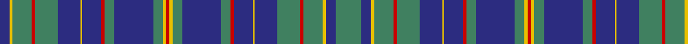

In pattern [BYGRGBYBRGBGYRYGBGRBYBGRGYBG](/patterns/bygrgbybrgbgyrygbgrbybgrgybg/).

This was sourced from tartans-authority.  It is a [28 stripes tartan](/stripes/stripes28/).

Original link http://www.tartansauthority.com/tartan-ferret/display/749/

## Thread count
DB/12 Y4 G24 R4 G28 DB28 Y2 DB24 R4 G12 DB48 G12 Y4 R4 Y4 G12 DB48 G12 R4 DB24 Y2 DB28 G28 R4 G24 Y4 DB12 G/32

## Palette
Each colour and its ΔE from the base-6 reference it is a variant of.

| Colour | Shade | Base | ΔE (OKLab) |
|---|---|---|---|
| DB | <code style="background-color:#2C2C80;">#2C2C80</code> `#2C2C80` | B <code style="background-color:#2C4084;">#2C4084</code> | 0.05 |
| G | <code style="background-color:#408060;">#408060</code> `#408060` | G <code style="background-color:#006400;">#006400</code> | 0.13 |
| R | <code style="background-color:#C80000;">#C80000</code> `#C80000` | R <code style="background-color:#C80000;">#C80000</code> | 0.00 |
| Y | <code style="background-color:#E8C000;">#E8C000</code> `#E8C000` | Y <code style="background-color:#E8C000;">#E8C000</code> | 0.00 |

## Nearest tartans

The nearest existing variants by ΔTartan distance.

1. [Platt](/setts/s15/g32b12y4g24r4g28b28y2b24r4g12b48g12y4r4-b2c2c80-g408060-rc80000-ye8c000/) — ΔT 1.31
1. [Illinois St.Andrews Society](/setts/s24/b12r6ba48b24y12ba12r4ba12y12ba24b4r4b12r4b4ba24y12ba12r4ba12y12b24ba48r6-b202060-ba5c8ca8-r880000-yb8b8b8/) — ΔT 1.46
1. [Hannay Blue](/setts/s18/k18b8k4b8k4b60k18b8ba28y4ba28b8k18b60k4b8k4b8-b5c8ca8-ba2c2c80-k101010-ye8c000/) — ΔT 1.60
1. [MacRae (MacCrae)](/setts/s31/b50g12b50g52b10g14b10g52w6g14b58g12b58g14w6g52b4g4b8g4b4g52b4g4b8g4b4g52b50g12b50-b5a008c-g005020-we0e0e0/) — ΔT 1.62
1. [Cumming Glenorchy (Htg) Clan Tartan Tartan Number: 507. Earliest known date: 1810-15 John, Lord of Badenoch - the Red Comyn, fought Robert the Bruce for the Scottish throne, and died in the attempt. The Comyns of Altyre became Chiefs of the Clan. The true origins of the tartan are unknown as the claims of antiquity made in the Vestiarium Scoticum, where this version of the tartan was first recorded, are unreliable. Ref: The Setts No 32. See products available Copyright © Blair Urquhart, Comrie, 2015](/setts/s22/g68r6b24ba2r16g24r6b40r6b6ba2r6b40r6g24r16ba2b24r6g44r6b6-b2c2c80-ba5c8ca8-g006818-rc80000/) — ΔT 1.63
1. [Cumming and Glenorchy](/setts/s22/r6b40r6g24r16ba2b24r6g44r6b6g66r6b24ba2r16g24r6b40r6b6ba2-b2c4084-ba3c82af-g005020-rdc0000/) — ΔT 1.68
1. [Katsushika](/setts/s14/b44y4b2y4b20g4ga22g12ga22g4b20y4b2y4-b2c2c80-g808080-ga006818-ye8c000/) — ΔT 1.69
1. [Cumming of Glenorchy](/setts/s22/g68r6b24ba2r16g24r6b40r6b6ba2r6b40r6g24r16ba2b24r6g44r6b6-b2c4084-ba3c82af-g005020-rdc0000/) — ΔT 1.70
1. [Cumming](/setts/s22/g20r6b24ba2r20g24r6b40r6b6ba2r6b40r6g24r24ba2b24r6g40r6b6-b2c4084-ba3c82af-g005020-rdc0000/) — ΔT 1.70
1. [Coopers & Lybrand Corporate Commem. Tartan Tartan Number: 2303. Earliest known date: 1996 Designed by Deirdre Nicholls of Celtic Silks. May 1996. Swatch in STA's Johnston Collection. Dark green, red and blue called for but lighter shades used here to display sett. See products available Copyright © Blair Urquhart, Comrie, 2015](/setts/s20/b8g8r2ba48b8k4g48r2ba20b8ba4b8ba20r2g48k4b8ba48r2g8-b2888c4-ba2c2c80-g006818-k101010-rc80000/) — ΔT 1.71

## Neighbour map

Every grey dot is one of 15726 variants placed by the first two principal components of the ΔTartan feature space (44% of its variance). Red is this tartan; blue dots are its nearest — click one to open its page.

<svg viewBox="0 0 640 380" role="img" style="max-width:100%;height:auto;border:1px solid #e0e0e0;border-radius:4px;display:block" xmlns="http://www.w3.org/2000/svg"><image href="/nn/cloud.v1.png" width="640" height="380"/><a href="/setts/s15/g32b12y4g24r4g28b28y2b24r4g12b48g12y4r4-b2c2c80-g408060-rc80000-ye8c000/"><circle cx="295.9" cy="154.0" r="4" fill="#3465a4"><title>Platt</title></circle></a><a href="/setts/s24/b12r6ba48b24y12ba12r4ba12y12ba24b4r4b12r4b4ba24y12ba12r4ba12y12b24ba48r6-b202060-ba5c8ca8-r880000-yb8b8b8/"><circle cx="265.8" cy="147.6" r="4" fill="#3465a4"><title>Illinois St.Andrews Society</title></circle></a><a href="/setts/s18/k18b8k4b8k4b60k18b8ba28y4ba28b8k18b60k4b8k4b8-b5c8ca8-ba2c2c80-k101010-ye8c000/"><circle cx="295.2" cy="136.8" r="4" fill="#3465a4"><title>Hannay Blue</title></circle></a><a href="/setts/s31/b50g12b50g52b10g14b10g52w6g14b58g12b58g14w6g52b4g4b8g4b4g52b4g4b8g4b4g52b50g12b50-b5a008c-g005020-we0e0e0/"><circle cx="336.5" cy="155.8" r="4" fill="#3465a4"><title>MacRae (MacCrae)</title></circle></a><a href="/setts/s22/g68r6b24ba2r16g24r6b40r6b6ba2r6b40r6g24r16ba2b24r6g44r6b6-b2c2c80-ba5c8ca8-g006818-rc80000/"><circle cx="276.2" cy="109.7" r="4" fill="#3465a4"><title>Cumming Glenorchy (Htg) Clan Tartan Tartan Number: 507. Earliest known date: 1810-15 John, Lord of Badenoch - the Red Comyn, fought Robert the Bruce for the Scottish throne, and died in the attempt. The Comyns of Altyre became Chiefs of the Clan. The true origins of the tartan are unknown as the claims of antiquity made in the Vestiarium Scoticum, where this version of the tartan was first recorded, are unreliable. Ref: The Setts No 32. See products available Copyright © Blair Urquhart, Comrie, 2015</title></circle></a><a href="/setts/s22/r6b40r6g24r16ba2b24r6g44r6b6g66r6b24ba2r16g24r6b40r6b6ba2-b2c4084-ba3c82af-g005020-rdc0000/"><circle cx="286.0" cy="117.0" r="4" fill="#3465a4"><title>Cumming and Glenorchy</title></circle></a><a href="/setts/s14/b44y4b2y4b20g4ga22g12ga22g4b20y4b2y4-b2c2c80-g808080-ga006818-ye8c000/"><circle cx="289.3" cy="140.1" r="4" fill="#3465a4"><title>Katsushika</title></circle></a><a href="/setts/s22/g68r6b24ba2r16g24r6b40r6b6ba2r6b40r6g24r16ba2b24r6g44r6b6-b2c4084-ba3c82af-g005020-rdc0000/"><circle cx="289.2" cy="115.4" r="4" fill="#3465a4"><title>Cumming of Glenorchy</title></circle></a><a href="/setts/s22/g20r6b24ba2r20g24r6b40r6b6ba2r6b40r6g24r24ba2b24r6g40r6b6-b2c4084-ba3c82af-g005020-rdc0000/"><circle cx="243.2" cy="139.5" r="4" fill="#3465a4"><title>Cumming</title></circle></a><a href="/setts/s20/b8g8r2ba48b8k4g48r2ba20b8ba4b8ba20r2g48k4b8ba48r2g8-b2888c4-ba2c2c80-g006818-k101010-rc80000/"><circle cx="276.2" cy="113.8" r="4" fill="#3465a4"><title>Coopers &amp; Lybrand Corporate Commem. Tartan Tartan Number: 2303. Earliest known date: 1996 Designed by Deirdre Nicholls of Celtic Silks. May 1996. Swatch in STA's Johnston Collection. Dark green, red and blue called for but lighter shades used here to display sett. See products available Copyright © Blair Urquhart, Comrie, 2015</title></circle></a><circle cx="295.7" cy="127.3" r="5" fill="#c00000"/></svg>

ID: /setts/s28/g32b12y4g24r4g28b28y2b24r4g12b48g12y4r4y4g12b48g12r4b24y2b28g28r4g24y4b12-b2c2c80-g408060-rc80000-ye8c000/
