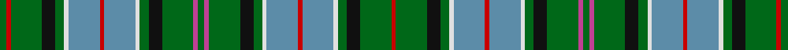

This page is one **sett** — a single exact thread-count. It belongs to the [tartan](/tartans/g3r2g14k6g4ln2b14r2b14ln2g4k6g14p2g3/)
(the same proportion at any scale), whose colour order is pattern [GRGKGWBRBWGKGRGRGKGWBRBWGKGR](/stripes/grgkgwbrbwgkgrgrgkgwbrbwgkgr/).

Sourced from register-of-tartans.  It is a [28 stripe tartan](/stripes/stripes28/).

Original link https://www.tartanregister.gov.uk/tartanDetails.aspx?ref=3722

## Register references

External register numbers recorded for this tartan.

- Scottish Register of Tartans: [3722](https://www.tartanregister.gov.uk/tartanDetails.aspx?ref=3722)
- Scottish Tartans Authority (ITI): 4106

## Thread count
G/6 R4 G28 K12 G8 LN4 B28 R4 B28 LN4 G8 K12 G28 P4 G6 P4 G28 K12 G8 LN4 B28 R4 B28 LN4 G8 K12 G28 R/4

## Palette
Each colour and the base-6 reference it is a variant of.

| Colour | Shade | Base |
|---|---|---|
| B | <code style="background-color:#5C8CA8;">#5C8CA8</code> `oklch(61.7% 0.067 235.0)` <small>#5C8CA8</small> | B <code style="background-color:#2A418A;">#2A418A</code> |
| G | <code style="background-color:#006818;">#006818</code> `oklch(45.0% 0.142 145.0)` <small>#006818</small> | G <code style="background-color:#006100;">#006100</code> |
| K | <code style="background-color:#101010;">#101010</code> `oklch(17.3% 0.000 89.9)` <small>#101010</small> | K <code style="background-color:#000000;">#000000</code> |
| LN | <code style="background-color:#E0E0E0;">#E0E0E0</code> `oklch(90.7% 0.000 89.9)` <small>#E0E0E0</small> | W <code style="background-color:#F7F7F7;">#F7F7F7</code> |
| P | <code style="background-color:#C04094;">#C04094</code> `oklch(57.9% 0.185 344.2)` <small>#C04094</small> | R <code style="background-color:#CC0000;">#CC0000</code> |
| R | <code style="background-color:#C80000;">#C80000</code> `oklch(52.3% 0.215 29.2)` <small>#C80000</small> | R <code style="background-color:#CC0000;">#CC0000</code> |

## Nearest tartans

The nearest existing variants by ΔTartan distance, with this tartan at the top so the swatches line up against it.

ΔTartan

Tartan

Sett

—

<a href="/ttd/edit/#slug=g3r2g14k6g4w2t14r2t14w2g4k6g14m2g3~x2">Scottish Heritage USA (SHUSA)</a> <a class="nn-out" href="/setts/s28/g3r2g14k6g4w2t14r2t14w2g4k6g14m2g3~x2/" title="open its dictionary page">↗</a>

0.96

<a href="/ttd/edit/#slug=r4b2dt5g2dt2g2dt2g13dt2g2dt2g2dt5ly2dt3w2g6r5b3dt4w2~x2">Lundie (Personal)</a> <a class="nn-out" href="/setts/s21/r4b2dt5g2dt2g2dt2g13dt2g2dt2g2dt5ly2dt3w2g6r5b3dt4w2~x2/" title="open its dictionary page">↗</a>

1.04

<a href="/ttd/edit/#slug=g3r3g3t3g13t5g3t5k9g3t3g3g6t3k3t16ly3t3g3t3r3t16k3t3g6g3t3g3k9t5g3t5g13t3~x2">Shipley, Ian (Personal)</a> <a class="nn-out" href="/setts/s34/g3r3g3t3g13t5g3t5k9g3t3g3g6t3k3t16ly3t3g3t3r3t16k3t3g6g3t3g3k9t5g3t5g13t3~x2/" title="open its dictionary page">↗</a>

1.13

<a href="/ttd/edit/#slug=dy3b12g6ly3g6b12dy3b12g6ly3g6ly3g6b12dy6b12dy3w1dy3r3dy3w1dy3r3dy3w1~x2">Sprouston</a> <a class="nn-out" href="/setts/s26/dy3b12g6ly3g6b12dy3b12g6ly3g6ly3g6b12dy6b12dy3w1dy3r3dy3w1dy3r3dy3w1~x2/" title="open its dictionary page">↗</a>

1.28

<a href="/ttd/edit/#slug=g3r2g14k6g4w2t14r2t14w2g4k6g14m2g3~x2">Scottish Heritage USA (SHUSA) (Corp)</a> <a class="nn-out" href="/setts/s15/g3r2g14k6g4w2t14r2t14w2g4k6g14m2g3~x2/" title="open its dictionary page">↗</a>

1.37

<a href="/ttd/edit/#slug=r4b2dt5y2dt2y2dt2y13dt2y2dt2y2dt5lo2dt3w2y6r5b3dt4w2~x2">Lundie</a> <a class="nn-out" href="/setts/s21/r4b2dt5y2dt2y2dt2y13dt2y2dt2y2dt5lo2dt3w2y6r5b3dt4w2~x2/" title="open its dictionary page">↗</a>

1.40

<a href="/ttd/edit/#slug=g14t2r3t2k16ly2t16g16r3g16t16ly2k16t2r3t2g14k6~x2">Norwich No.038</a> <a class="nn-out" href="/setts/s18/g14t2r3t2k16ly2t16g16r3g16t16ly2k16t2r3t2g14k6~x2/" title="open its dictionary page">↗</a>

1.44

<a href="/ttd/edit/#slug=t3g13t5g3t5k9lg3t3lg3g6t3k3t16r3t3lg3t3ly3t16k3t3g6lg3t3lg3k9t5g3t5g13t3lg3r3lg3~x2">Shipley, Ian (Personal)</a> <a class="nn-out" href="/setts/s34/t3g13t5g3t5k9lg3t3lg3g6t3k3t16r3t3lg3t3ly3t16k3t3g6lg3t3lg3k9t5g3t5g13t3lg3r3lg3~x2/" title="open its dictionary page">↗</a>

1.51

<a href="/ttd/edit/#slug=k1b8k8g8k1w2k1g8k8b1k1b1k1b8k1b1k1b1k8g8k1ly2k1g8k8b8k1b1~x2">Campbell of Argyll #2</a> <a class="nn-out" href="/setts/s28/k1b8k8g8k1w2k1g8k8b1k1b1k1b8k1b1k1b1k8g8k1ly2k1g8k8b8k1b1~x2/" title="open its dictionary page">↗</a>

1.52

<a href="/ttd/edit/#slug=k1b8k8g8w2g8k8b1k1b1k1b8k1b1k1b1k8g8ly2g8k8b8k1b1~x2">Campbell of Argyll (no guards)</a> <a class="nn-out" href="/setts/s24/k1b8k8g8w2g8k8b1k1b1k1b8k1b1k1b1k8g8ly2g8k8b8k1b1~x2/" title="open its dictionary page">↗</a>

1.52

<a href="/ttd/edit/#slug=y16r2y4lo2y4r2y16db2y3db2y3db10w2o12k2o5k2o12w2db10y3db2y3db2~x2">O'Sullivan McCragh (Personal)</a> <a class="nn-out" href="/setts/s24/y16r2y4lo2y4r2y16db2y3db2y3db10w2o12k2o5k2o12w2db10y3db2y3db2~x2/" title="open its dictionary page">↗</a>

## Neighbour map

Every grey dot is one of 14299 variants placed by the first two principal components of the ΔTartan feature space (44% of its variance). Red is this tartan; blue dots are its nearest — click one to open its page.

<svg viewBox="0 0 640 380" role="img" style="max-width:100%;height:auto;border:1px solid #e0e0e0;border-radius:4px;display:block" xmlns="http://www.w3.org/2000/svg"><image href="/nn/cloud.v1.png" width="640" height="380"/><a href="/setts/s21/r4b2dt5g2dt2g2dt2g13dt2g2dt2g2dt5ly2dt3w2g6r5b3dt4w2~x2/"><circle cx="111.0" cy="157.9" r="4" fill="#3465a4"><title>Lundie (Personal)</title></circle></a><a href="/setts/s34/g3r3g3t3g13t5g3t5k9g3t3g3g6t3k3t16ly3t3g3t3r3t16k3t3g6g3t3g3k9t5g3t5g13t3~x2/"><circle cx="119.5" cy="143.5" r="4" fill="#3465a4"><title>Shipley, Ian (Personal)</title></circle></a><a href="/setts/s26/dy3b12g6ly3g6b12dy3b12g6ly3g6ly3g6b12dy6b12dy3w1dy3r3dy3w1dy3r3dy3w1~x2/"><circle cx="151.6" cy="128.1" r="4" fill="#3465a4"><title>Sprouston</title></circle></a><a href="/setts/s15/g3r2g14k6g4w2t14r2t14w2g4k6g14m2g3~x2/"><circle cx="162.5" cy="162.9" r="4" fill="#3465a4"><title>Scottish Heritage USA (SHUSA) (Corp)</title></circle></a><a href="/setts/s21/r4b2dt5y2dt2y2dt2y13dt2y2dt2y2dt5lo2dt3w2y6r5b3dt4w2~x2/"><circle cx="125.5" cy="161.5" r="4" fill="#3465a4"><title>Lundie</title></circle></a><a href="/setts/s18/g14t2r3t2k16ly2t16g16r3g16t16ly2k16t2r3t2g14k6~x2/"><circle cx="146.2" cy="166.8" r="4" fill="#3465a4"><title>Norwich No.038</title></circle></a><a href="/setts/s34/t3g13t5g3t5k9lg3t3lg3g6t3k3t16r3t3lg3t3ly3t16k3t3g6lg3t3lg3k9t5g3t5g13t3lg3r3lg3~x2/"><circle cx="111.0" cy="144.7" r="4" fill="#3465a4"><title>Shipley, Ian (Personal)</title></circle></a><a href="/setts/s28/k1b8k8g8k1w2k1g8k8b1k1b1k1b8k1b1k1b1k8g8k1ly2k1g8k8b8k1b1~x2/"><circle cx="148.6" cy="142.0" r="4" fill="#3465a4"><title>Campbell of Argyll #2</title></circle></a><a href="/setts/s24/k1b8k8g8w2g8k8b1k1b1k1b8k1b1k1b1k8g8ly2g8k8b8k1b1~x2/"><circle cx="135.2" cy="155.2" r="4" fill="#3465a4"><title>Campbell of Argyll (no guards)</title></circle></a><a href="/setts/s24/y16r2y4lo2y4r2y16db2y3db2y3db10w2o12k2o5k2o12w2db10y3db2y3db2~x2/"><circle cx="134.4" cy="111.9" r="4" fill="#3465a4"><title>O'Sullivan McCragh (Personal)</title></circle></a><circle cx="138.5" cy="136.8" r="5" fill="#c00000"/></svg>

ID: /setts/s28/g3r2g14k6g4w2t14r2t14w2g4k6g14m2g3~x2/
