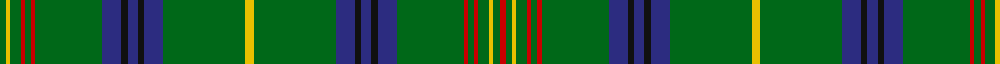

In pattern [GYGRGRGBKBKBGYGBKBKBGRGRGYGR](/patterns/gygrgrgbkbkbgygbkbkbgrgrgygr/).

This was sourced from register-of-tartans.  It is a [28 stripes tartan](/stripes/stripes28/).

Original link https://www.tartanregister.gov.uk/tartanDetails.aspx?ref=1752

## Thread count
G/6 Y4 G10 R4 G6 R4 G64 DB18 K6 DB10 K6 DB18 G78 Y8 G78 DB18 K6 DB10 K6 DB18 G64 R4 G6 R4 G10 Y4 G6 R/6

## Palette
Each colour and its ΔE from the base-6 reference it is a variant of.

| Colour | Shade | Base | ΔE (OKLab) |
|---|---|---|---|
| DB | <code style="background-color:#2C2C80;">#2C2C80</code> `#2C2C80` | B <code style="background-color:#2A418A;">#2A418A</code> | 0.06 |
| G | <code style="background-color:#006818;">#006818</code> `#006818` | G <code style="background-color:#006100;">#006100</code> | 0.02 |
| K | <code style="background-color:#101010;">#101010</code> `#101010` | K <code style="background-color:#000000;">#000000</code> | 0.17 |
| R | <code style="background-color:#C80000;">#C80000</code> `#C80000` | R <code style="background-color:#CC0000;">#CC0000</code> | 0.01 |
| Y | <code style="background-color:#E8C000;">#E8C000</code> `#E8C000` | Y <code style="background-color:#F2BF00;">#F2BF00</code> | 0.02 |

## Nearest tartans

The nearest existing variants by ΔTartan distance.

1. [Sea Bees Regimental Tartan Tartan Number: 2197. Earliest known date: 1986 US military unit. See products available Copyright © Blair Urquhart, Comrie, 2015](/setts/s24/b6g3w6g7y2g36y2g7w6g3b6g3ga6g3r6g7y2g36y2g7r6g3ga6g3x2~b202060-g006818-ga604000-rc8002c-wa8ace8-ye8c000/) — ΔT 1.14
1. [King Edward VII](/setts/s32/r6g5y3g10r3g6r3g62b21k10b10k10b10k10b21g84y8g84b21k10b10k10b10k10b21g62r3g6r3g10y3g5~b1474b4-g006818-k101010-rc80000-ye8c000/) — ΔT 1.14
1. [Holmes (Clan)](/setts/s15/y4g39b9k3b5k3b9g32r2g3r2g5y2g3r3x2~b2c2c80-g006818-k101010-rc80000-ye8c000/) — ΔT 1.33
1. [Ross Hunting #2](/setts/s25/g4ga2g3ga3g4k5g3k5g28r2g4r2g4r2g28k5g3k5g4ga2g2ga2g3ga4g3x2~g005020-ga309c18-k101010-rdc0000/) — ΔT 1.35
1. [College of William & Mary Schools Tartan Tartan Number: 6522. Earliest known date: 2004 Designed by Carol Worthley of South Hiram, Maine for the Alma Mater of Stephen H Snell of Alexandria, Virginia - the College of William & Mary in VA. Stephen Snell has donated the tartan to the Earl Gregg Swem Library in that College to be sold as a fundraiser. See products available Copyright © Blair Urquhart, Comrie, 2015](/setts/s20/b10g25y2g2y3g2y2g25b10w3b10g25y2g2y3g2y2g25b10k3x2~b2c2c80-g285800-k101010-wf8f8f8-ye8c000/) — ΔT 1.41
1. [Seattle](/setts/s18/g14w1b2r1g1r1b2w1g4w1b2r1g1r1b2w1g14y1x4~b1c0070-g006818-re87878-wc0c0c0-yd09800/) — ΔT 1.42
1. [Kennedy #2](/setts/s15/y8g77b18k7b9k6b18g64r4g5r4g9y4g5r6~b2c4084-g005020-k101010-rdc0000-ye8c000/) — ΔT 1.46
1. [Bartlett from Winnetka, Illinois](/setts/s13/r4g40b12y2b12g30k2g4k2g4y2g3k3x2~b1c0070-g006818-k101010-r880000-yd09800/) — ΔT 1.61
1. [Ettrick Forest](/setts/s24/b2g2r1g4r1b6r2g1y1g1r1g1r1g1ba1g1r2b6g26r1g1r1g1b1x2~b2c2c80-ba788cb4-g006818-r8c0000-ydcbc00/) — ΔT 1.63
1. [King Edward VII (Royal)](/setts/s17/y8g84b21k10b10k10b10k10b21g62r3g6r3g10y3g5r6~b1474b4-g006818-k101010-rc80000-ye8c000/) — ΔT 1.64

## Neighbour map

Every grey dot is one of 15726 variants placed by the first two principal components of the ΔTartan feature space (44% of its variance). Red is this tartan; blue dots are its nearest — click one to open its page.

<svg viewBox="0 0 640 380" role="img" style="max-width:100%;height:auto;border:1px solid #e0e0e0;border-radius:4px;display:block" xmlns="http://www.w3.org/2000/svg"><image href="/nn/cloud.v1.png" width="640" height="380"/><a href="/setts/s24/b6g3w6g7y2g36y2g7w6g3b6g3ga6g3r6g7y2g36y2g7r6g3ga6g3x2~b202060-g006818-ga604000-rc8002c-wa8ace8-ye8c000/"><circle cx="361.3" cy="90.5" r="4" fill="#3465a4"><title>Sea Bees Regimental Tartan Tartan Number: 2197. Earliest known date: 1986 US military unit. See products available Copyright © Blair Urquhart, Comrie, 2015</title></circle></a><a href="/setts/s32/r6g5y3g10r3g6r3g62b21k10b10k10b10k10b21g84y8g84b21k10b10k10b10k10b21g62r3g6r3g10y3g5~b1474b4-g006818-k101010-rc80000-ye8c000/"><circle cx="355.1" cy="79.0" r="4" fill="#3465a4"><title>King Edward VII</title></circle></a><a href="/setts/s15/y4g39b9k3b5k3b9g32r2g3r2g5y2g3r3x2~b2c2c80-g006818-k101010-rc80000-ye8c000/"><circle cx="389.3" cy="120.0" r="4" fill="#3465a4"><title>Holmes (Clan)</title></circle></a><a href="/setts/s25/g4ga2g3ga3g4k5g3k5g28r2g4r2g4r2g28k5g3k5g4ga2g2ga2g3ga4g3x2~g005020-ga309c18-k101010-rdc0000/"><circle cx="442.7" cy="144.5" r="4" fill="#3465a4"><title>Ross Hunting #2</title></circle></a><a href="/setts/s20/b10g25y2g2y3g2y2g25b10w3b10g25y2g2y3g2y2g25b10k3x2~b2c2c80-g285800-k101010-wf8f8f8-ye8c000/"><circle cx="333.9" cy="134.1" r="4" fill="#3465a4"><title>College of William &amp; Mary Schools Tartan Tartan Number: 6522. Earliest known date: 2004 Designed by Carol Worthley of South Hiram, Maine for the Alma Mater of Stephen H Snell of Alexandria, Virginia - the College of William &amp; Mary in VA. Stephen Snell has donated the tartan to the Earl Gregg Swem Library in that College to be sold as a fundraiser. See products available Copyright © Blair Urquhart, Comrie, 2015</title></circle></a><a href="/setts/s18/g14w1b2r1g1r1b2w1g4w1b2r1g1r1b2w1g14y1x4~b1c0070-g006818-re87878-wc0c0c0-yd09800/"><circle cx="361.0" cy="110.4" r="4" fill="#3465a4"><title>Seattle</title></circle></a><a href="/setts/s15/y8g77b18k7b9k6b18g64r4g5r4g9y4g5r6~b2c4084-g005020-k101010-rdc0000-ye8c000/"><circle cx="399.8" cy="125.5" r="4" fill="#3465a4"><title>Kennedy #2</title></circle></a><a href="/setts/s13/r4g40b12y2b12g30k2g4k2g4y2g3k3x2~b1c0070-g006818-k101010-r880000-yd09800/"><circle cx="403.4" cy="133.0" r="4" fill="#3465a4"><title>Bartlett from Winnetka, Illinois</title></circle></a><a href="/setts/s24/b2g2r1g4r1b6r2g1y1g1r1g1r1g1ba1g1r2b6g26r1g1r1g1b1x2~b2c2c80-ba788cb4-g006818-r8c0000-ydcbc00/"><circle cx="387.3" cy="70.6" r="4" fill="#3465a4"><title>Ettrick Forest</title></circle></a><a href="/setts/s17/y8g84b21k10b10k10b10k10b21g62r3g6r3g10y3g5r6~b1474b4-g006818-k101010-rc80000-ye8c000/"><circle cx="350.8" cy="101.2" r="4" fill="#3465a4"><title>King Edward VII (Royal)</title></circle></a><circle cx="398.3" cy="99.0" r="5" fill="#c00000"/></svg>

ID: /setts/s28/g3y2g5r2g3r2g32b9k3b5k3b9g39y4g39b9k3b5k3b9g32r2g3r2g5y2g3r3x2~b2c2c80-g006818-k101010-rc80000-ye8c000/
