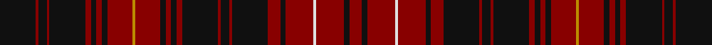

This page is one **sett** — a single exact thread-count. It belongs to the [tartan](/tartans/k26dr2k6dr2k26dr4k4dr4k4dr18dy2dr18k4dr4k4dr4k26dr2k6dr2k26dr9k4dr20ln2dr20k4dr9/)
(the same proportion at any scale), whose colour order is pattern [KRKRKRKRKRYRKRKRKRKRKRKRWRKR](/stripes/krkrkrkrkryrkrkrkrkrkrkrwrkr/).

Sourced from register-of-tartans.  It is a [28 stripe tartan](/stripes/stripes28/).

Original link https://www.tartanregister.gov.uk/tartanDetails.aspx?ref=1972

## Register references

External register numbers recorded for this tartan.

- Scottish Register of Tartans: [1972](https://www.tartanregister.gov.uk/tartanDetails.aspx?ref=1972)
- Scottish Tartans Authority (ITI): 4042
- Scottish Tartans World Register: 2739

## Thread count
K/52 DR4 K12 DR4 K52 DR8 K8 DR8 K8 DR36 DY4 DR36 K8 DR8 K8 DR8 K52 DR4 K12 DR4 K52 DR18 K8 DR40 LN4 DR40 K8 DR/18

## Palette
Each colour and the base-6 reference it is a variant of.

| Colour | Shade | Base |
|---|---|---|
| DR | <code style="background-color:#880000;">#880000</code> `oklch(39.4% 0.162 29.2)` <small>#880000</small> | R <code style="background-color:#CC0000;">#CC0000</code> |
| DY | <code style="background-color:#BC8C00;">#BC8C00</code> `oklch(66.8% 0.137 84.1)` <small>#BC8C00</small> | Y <code style="background-color:#F2BF00;">#F2BF00</code> |
| K | <code style="background-color:#101010;">#101010</code> `oklch(17.3% 0.000 89.9)` <small>#101010</small> | K <code style="background-color:#000000;">#000000</code> |
| LN | <code style="background-color:#E0E0E0;">#E0E0E0</code> `oklch(90.7% 0.000 89.9)` <small>#E0E0E0</small> | W <code style="background-color:#F7F7F7;">#F7F7F7</code> |
| R | <code style="background-color:#C80000;">#C80000</code> `oklch(52.3% 0.215 29.2)` <small>#C80000</small> | R <code style="background-color:#CC0000;">#CC0000</code> |
| Y | <code style="background-color:#E8C000;">#E8C000</code> `oklch(81.9% 0.168 93.7)` <small>#E8C000</small> | Y <code style="background-color:#F2BF00;">#F2BF00</code> |

## Nearest tartans

The nearest existing variants by ΔTartan distance, with this tartan at the top so the swatches line up against it.

ΔTartan

Tartan

Sett

—

<a href="/ttd/edit/#slug=k26r2k6r2k26r4k4r4k4r18lo2r18k4r4k4r4k26r2k6r2k26r9k4r20w2r20k4r9~x2">Killin</a> <a class="nn-out" href="/setts/s28/k26r2k6r2k26r4k4r4k4r18lo2r18k4r4k4r4k26r2k6r2k26r9k4r20w2r20k4r9~x2/" title="open its dictionary page">↗</a>

1.33

<a href="/ttd/edit/#slug=w2r20k4r9k26r2k6r2k26r4k4r4k4r18lo2~x2">Killin (Name)</a> <a class="nn-out" href="/setts/s15/w2r20k4r9k26r2k6r2k26r4k4r4k4r18lo2~x2/" title="open its dictionary page">↗</a>

1.62

<a href="/ttd/edit/#slug=dg5r5dg2r3dg2r3dg2r23dg23r5dg15r5dg23r23dg2r3dg2r3dg2r5dp5~x2">MacRae of Inverinate (Clan)</a> <a class="nn-out" href="/setts/s21/dg5r5dg2r3dg2r3dg2r23dg23r5dg15r5dg23r23dg2r3dg2r3dg2r5dp5~x2/" title="open its dictionary page">↗</a>

1.89

<a href="/ttd/edit/#slug=g4r4g2r2g2r18db4g4r2g2r2g3r4g2r2g2r2db4g4r2g4~x2">Matheson (WCWM)</a> <a class="nn-out" href="/setts/s21/g4r4g2r2g2r18db4g4r2g2r2g3r4g2r2g2r2db4g4r2g4~x2/" title="open its dictionary page">↗</a>

1.89

<a href="/ttd/edit/#slug=dg18r2dg18r18dg2r4dg2r18db18r2db18r18db1r1db2r1db1r18db1r1db2r1db1r18dg18r2dg18">Ross</a> <a class="nn-out" href="/setts/s27/dg18r2dg18r18dg2r4dg2r18db18r2db18r18db1r1db2r1db1r18db1r1db2r1db1r18dg18r2dg18/" title="open its dictionary page">↗</a>

1.94

<a href="/ttd/edit/#slug=o8db3o3g20o3g3o3db6o3b3o20db3o3db2o6~x2">Glenfarclas Distillery</a> <a class="nn-out" href="/setts/s15/o8db3o3g20o3g3o3db6o3b3o20db3o3db2o6~x2/" title="open its dictionary page">↗</a>

1.96

<a href="/ttd/edit/#slug=k3r30k2r4k2r30k3db30k35w2k35db30k3r30k2r4k2r30k3w2">Gwyn of Wales</a> <a class="nn-out" href="/setts/s20/k3r30k2r4k2r30k3db30k35w2k35db30k3r30k2r4k2r30k3w2/" title="open its dictionary page">↗</a>

1.99

<a href="/setts/s20/db25db2r25g10r4db25r2g2r25g2r2~x2/">Hebrides #2</a>

2.00

<a href="/ttd/edit/#slug=r11k1k3r6k1r6k3r4k7r11db1r11k7db2k4~x2">James (Welsh Name)</a> <a class="nn-out" href="/setts/s15/r11k1k3r6k1r6k3r4k7r11db1r11k7db2k4~x2/" title="open its dictionary page">↗</a>

2.00

<a href="/ttd/edit/#slug=r8db10r30k8lo5k5lo5k36r11db4k6db4r11k36lo5k5lo5k8r30db10r8db4">Johnnie Walker (2003)</a> <a class="nn-out" href="/setts/s22/r8db10r30k8lo5k5lo5k36r11db4k6db4r11k36lo5k5lo5k8r30db10r8db4/" title="open its dictionary page">↗</a>

2.02

<a href="/ttd/edit/#slug=r3db1r1dg10r1dg1r1db3r1b1r12db1r1db1r3~x4">Grant D</a> <a class="nn-out" href="/setts/s15/r3db1r1dg10r1dg1r1db3r1b1r12db1r1db1r3~x4/" title="open its dictionary page">↗</a>

## Neighbour map

Every grey dot is one of 14299 variants placed by the first two principal components of the ΔTartan feature space (44% of its variance). Red is this tartan; blue dots are its nearest — click one to open its page.

<svg viewBox="0 0 640 380" role="img" style="max-width:100%;height:auto;border:1px solid #e0e0e0;border-radius:4px;display:block" xmlns="http://www.w3.org/2000/svg"><image href="/nn/cloud.v1.png" width="640" height="380"/><a href="/setts/s15/w2r20k4r9k26r2k6r2k26r4k4r4k4r18lo2~x2/"><circle cx="354.3" cy="170.4" r="4" fill="#3465a4"><title>Killin (Name)</title></circle></a><a href="/setts/s21/dg5r5dg2r3dg2r3dg2r23dg23r5dg15r5dg23r23dg2r3dg2r3dg2r5dp5~x2/"><circle cx="308.5" cy="142.0" r="4" fill="#3465a4"><title>MacRae of Inverinate (Clan)</title></circle></a><a href="/setts/s21/g4r4g2r2g2r18db4g4r2g2r2g3r4g2r2g2r2db4g4r2g4~x2/"><circle cx="322.5" cy="186.3" r="4" fill="#3465a4"><title>Matheson (WCWM)</title></circle></a><a href="/setts/s27/dg18r2dg18r18dg2r4dg2r18db18r2db18r18db1r1db2r1db1r18db1r1db2r1db1r18dg18r2dg18/"><circle cx="298.2" cy="138.6" r="4" fill="#3465a4"><title>Ross</title></circle></a><a href="/setts/s15/o8db3o3g20o3g3o3db6o3b3o20db3o3db2o6~x2/"><circle cx="333.7" cy="186.8" r="4" fill="#3465a4"><title>Glenfarclas Distillery</title></circle></a><a href="/setts/s20/k3r30k2r4k2r30k3db30k35w2k35db30k3r30k2r4k2r30k3w2/"><circle cx="297.8" cy="145.0" r="4" fill="#3465a4"><title>Gwyn of Wales</title></circle></a><a href="/setts/s20/db25db2r25g10r4db25r2g2r25g2r2~x2/"><circle cx="293.1" cy="138.2" r="4" fill="#3465a4"><title>Hebrides #2</title></circle></a><a href="/setts/s15/r11k1k3r6k1r6k3r4k7r11db1r11k7db2k4~x2/"><circle cx="374.0" cy="205.4" r="4" fill="#3465a4"><title>James (Welsh Name)</title></circle></a><a href="/setts/s22/r8db10r30k8lo5k5lo5k36r11db4k6db4r11k36lo5k5lo5k8r30db10r8db4/"><circle cx="230.3" cy="163.8" r="4" fill="#3465a4"><title>Johnnie Walker (2003)</title></circle></a><a href="/setts/s15/r3db1r1dg10r1dg1r1db3r1b1r12db1r1db1r3~x4/"><circle cx="345.1" cy="143.7" r="4" fill="#3465a4"><title>Grant D</title></circle></a><circle cx="357.4" cy="153.6" r="5" fill="#c00000"/></svg>

ID: /setts/s28/k26r2k6r2k26r4k4r4k4r18lo2r18k4r4k4r4k26r2k6r2k26r9k4r20w2r20k4r9~x2/
