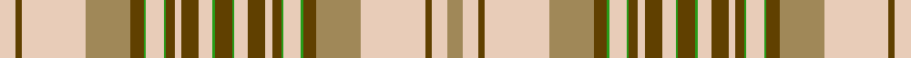

In pattern [WGWYGGWGGWGWGGGWGWGGWGGYWGWY](/stripes/wgwyggwggwgwgggwgwggwggywgwy/).

This was sourced from register-of-tartans.  It is a [28 stripe tartan](/stripes/stripes28/).

Original link https://www.tartanregister.gov.uk/tartanDetails.aspx?ref=1869

## Register references

External register numbers recorded for this tartan.

- Scottish Register of Tartans: [1869](https://www.tartanregister.gov.uk/tartanDetails.aspx?ref=1869)
- Scottish Tartans Authority (ITI): 6091

## Thread count
LR/14 T6 LR58 LT40 T12 Ga2 LR16 Ga2 T8 LR6 T16 LR12 Ga2 T16 Ga2 LR12 T16 LR6 T8 Ga2 LR16 Ga2 T12 LT40 LR58 T6 LR14 LT/14

## Palette
Each colour and the base-6 reference it is a variant of.

| Colour | Shade | Base |
|---|---|---|
| G | <code style="background-color:#408060;">#408060</code> `oklch(54.8% 0.084 160.1)` <small>#408060</small> | G <code style="background-color:#006100;">#006100</code> |
| Ga | <code style="background-color:#289C18;">#289C18</code> `oklch(60.6% 0.191 141.6)` <small>#289C18</small> | G <code style="background-color:#006100;">#006100</code> |
| LR | <code style="background-color:#E8CCB8;">#E8CCB8</code> `oklch(86.3% 0.042 57.7)` <small>#E8CCB8</small> | W <code style="background-color:#F7F7F7;">#F7F7F7</code> |
| LT | <code style="background-color:#A08858;">#A08858</code> `oklch(63.7% 0.071 84.0)` <small>#A08858</small> | Y <code style="background-color:#F2BF00;">#F2BF00</code> |
| O | <code style="background-color:#DC943C;">#DC943C</code> `oklch(72.3% 0.133 67.9)` <small>#DC943C</small> | Y <code style="background-color:#F2BF00;">#F2BF00</code> |
| T | <code style="background-color:#604000;">#604000</code> `oklch(39.8% 0.083 76.8)` <small>#604000</small> | G <code style="background-color:#006100;">#006100</code> |
| Y | <code style="background-color:#D8B000;">#D8B000</code> `oklch(77.1% 0.158 92.3)` <small>#D8B000</small> | Y <code style="background-color:#F2BF00;">#F2BF00</code> |

## Nearest tartans

The nearest existing variants by ΔTartan distance.

1. [Isle of Skye (Fashion)](/setts/s15/dy8g1lb6dy8lb3dy4g1lb8g1dy6lo20lb29dy3lb7lo7~x2/) — ΔT 1.31
1. [Stewart/Stuart Royal (VS)](/setts/s20/w28k2w2k2w2g12r8k1r1w1r1k1r8g12w2k2w2k2w28r3~x2/) — ΔT 1.67
1. [MacKinnon](/setts/s27/w4r6g4db4r12g32r4db8g4r32g16w4r8w4r8w4g16r32g4db8r4g32r12db4g4r6w1~x2/) — ΔT 1.81
1. [Nike Golf Light (Corporate)](/setts/s17/r5w20o1w2o1w2o2w2o5n2o2n2o2n3o2n10w3~x2/) — ΔT 1.90
1. [Miyuki #3 (Fashion)](/setts/s18/n12lb14k3r6lb10n28lb10r6k3lb8r10lb8k3r6lb40n6lb6n6/) — ΔT 1.93
1. [Scott Dress](/setts/s20/dg4r2k1w30r10dg14r4dg5w2dg5r4~x2/) — ΔT 1.96
1. [Miyuki, House Check Grey, 1003A](/setts/s18/n12lb14r3y6lb10n28lb10y6r3lb8y10lb8r3y6lb40n6lb6n6/) — ΔT 1.97
1. [Agincourt (Fashion)](/setts/s17/dt4lo1dt3lo1dt1lo1lo1lo6dt4lo2lo6dt7lo6lo1lo28dt1dt1~x4/) — ΔT 2.00
1. [Beck Dress (Personal)](/setts/s17/k4t2w15r6ly12r6w25t2k4t2w15t4k2t4k2t4k1~x2/) — ΔT 2.01
1. [Oriflame](/setts/s24/w4lb6w6lb21w9n27w10lb1n1lb5n1lb1w10r1r1r5r1r1w10n1r1n5r1n1~x2/) — ΔT 2.05

## Neighbour map

Every grey dot is one of 14299 variants placed by the first two principal components of the ΔTartan feature space (44% of its variance). Red is this tartan; blue dots are its nearest — click one to open its page.

<svg viewBox="0 0 640 380" role="img" style="max-width:100%;height:auto;border:1px solid #e0e0e0;border-radius:4px;display:block" xmlns="http://www.w3.org/2000/svg"><image href="/nn/cloud.v1.png" width="640" height="380"/><a href="/setts/s15/dy8g1lb6dy8lb3dy4g1lb8g1dy6lo20lb29dy3lb7lo7~x2/"><circle cx="276.0" cy="106.7" r="4" fill="#3465a4"><title>Isle of Skye (Fashion)</title></circle></a><a href="/setts/s20/w28k2w2k2w2g12r8k1r1w1r1k1r8g12w2k2w2k2w28r3~x2/"><circle cx="285.7" cy="58.1" r="4" fill="#3465a4"><title>Stewart/Stuart Royal (VS)</title></circle></a><a href="/setts/s27/w4r6g4db4r12g32r4db8g4r32g16w4r8w4r8w4g16r32g4db8r4g32r12db4g4r6w1~x2/"><circle cx="277.9" cy="89.2" r="4" fill="#3465a4"><title>MacKinnon</title></circle></a><a href="/setts/s17/r5w20o1w2o1w2o2w2o5n2o2n2o2n3o2n10w3~x2/"><circle cx="225.1" cy="88.7" r="4" fill="#3465a4"><title>Nike Golf Light (Corporate)</title></circle></a><a href="/setts/s18/n12lb14k3r6lb10n28lb10r6k3lb8r10lb8k3r6lb40n6lb6n6/"><circle cx="247.8" cy="129.0" r="4" fill="#3465a4"><title>Miyuki #3 (Fashion)</title></circle></a><a href="/setts/s20/dg4r2k1w30r10dg14r4dg5w2dg5r4~x2/"><circle cx="215.8" cy="67.1" r="4" fill="#3465a4"><title>Scott Dress</title></circle></a><a href="/setts/s18/n12lb14r3y6lb10n28lb10y6r3lb8y10lb8r3y6lb40n6lb6n6/"><circle cx="275.3" cy="146.5" r="4" fill="#3465a4"><title>Miyuki, House Check Grey, 1003A</title></circle></a><a href="/setts/s17/dt4lo1dt3lo1dt1lo1lo1lo6dt4lo2lo6dt7lo6lo1lo28dt1dt1~x4/"><circle cx="323.3" cy="101.5" r="4" fill="#3465a4"><title>Agincourt (Fashion)</title></circle></a><a href="/setts/s17/k4t2w15r6ly12r6w25t2k4t2w15t4k2t4k2t4k1~x2/"><circle cx="212.5" cy="74.8" r="4" fill="#3465a4"><title>Beck Dress (Personal)</title></circle></a><a href="/setts/s24/w4lb6w6lb21w9n27w10lb1n1lb5n1lb1w10r1r1r5r1r1w10n1r1n5r1n1~x2/"><circle cx="187.0" cy="46.3" r="4" fill="#3465a4"><title>Oriflame</title></circle></a><circle cx="282.5" cy="78.3" r="5" fill="#c00000"/></svg>

ID: /setts/s28/lo7lb7dy3lb29lo20dy6g1lb8g1dy4lb3dy8lb6g1dy8g1lb6dy8lb3dy4g1lb8g1dy6lo20lb29dy3lb7~x2/
