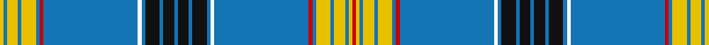

This page is one **sett** — a single exact thread-count. It belongs to the [tartan](/tartans/r1ly1b1ly3b1ly4b1r1b26k1b1ki4b1ki3b1ki3b1ki4b1k1b26r1b1ly4b1ly3b1ly1/)
(the same proportion at any scale), whose colour order is pattern [RYBYBYBRBKBKBKBKBKBKBRBYBYBY](/stripes/rybybybrbkbkbkbkbkbkbrbybyby/).

Sourced from house-of-tartan.  It is a [28 stripe tartan](/stripes/stripes28/).

Original link http://www.house-of-tartan.scotland.net/house/TartanViewjs.asp?colr=Def&tnam=6096

## Thread count
Y/4 B4 Y12 B4 Y16 B4 Ra4 B104 W4 B4 K16 B4 K12 B4 K12 B4 K16 B4 W4 B104 Ra4 B4 Y16 B4 Y12 B4 Y4 Ra/4

## Palette

Palette: <strong>Tartan Register</strong> <small style="color:#888">(6 of 7 colours)</small>
<table><thead><tr><th>Colour</th><th>Threads</th><th>Shade</th><th>Base</th><th>OKLCh</th></tr></thead><tbody><tr><td>Y/</td><td style="text-align:right;font-variant-numeric:tabular-nums">4</td><td><code style="background-color:#E8C000;">#E8C000</code> <small style="color:#888">#E8C000</small></td><td>Y <code style="background-color:#F2BF00;">#F2BF00</code></td><td><small style="color:#888">oklch(81.9% 0.168 93.7)</small></td></tr><tr><td>B</td><td style="text-align:right;font-variant-numeric:tabular-nums">4</td><td><code style="background-color:#1474B4;">#1474B4</code> <small style="color:#888">#1474B4</small></td><td>B <code style="background-color:#2A418A;">#2A418A</code></td><td><small style="color:#888">oklch(54.0% 0.129 245.1)</small></td></tr><tr><td>Y</td><td style="text-align:right;font-variant-numeric:tabular-nums">12</td><td><code style="background-color:#E8C000;">#E8C000</code> <small style="color:#888">#E8C000</small></td><td>Y <code style="background-color:#F2BF00;">#F2BF00</code></td><td><small style="color:#888">oklch(81.9% 0.168 93.7)</small></td></tr><tr><td>B</td><td style="text-align:right;font-variant-numeric:tabular-nums">4</td><td><code style="background-color:#1474B4;">#1474B4</code> <small style="color:#888">#1474B4</small></td><td>B <code style="background-color:#2A418A;">#2A418A</code></td><td><small style="color:#888">oklch(54.0% 0.129 245.1)</small></td></tr><tr><td>Y</td><td style="text-align:right;font-variant-numeric:tabular-nums">16</td><td><code style="background-color:#E8C000;">#E8C000</code> <small style="color:#888">#E8C000</small></td><td>Y <code style="background-color:#F2BF00;">#F2BF00</code></td><td><small style="color:#888">oklch(81.9% 0.168 93.7)</small></td></tr><tr><td>B</td><td style="text-align:right;font-variant-numeric:tabular-nums">4</td><td><code style="background-color:#1474B4;">#1474B4</code> <small style="color:#888">#1474B4</small></td><td>B <code style="background-color:#2A418A;">#2A418A</code></td><td><small style="color:#888">oklch(54.0% 0.129 245.1)</small></td></tr><tr><td>Ra</td><td style="text-align:right;font-variant-numeric:tabular-nums">4</td><td><code style="background-color:#C80000;">#C80000</code> <small style="color:#888">#C80000</small></td><td>R <code style="background-color:#CC0000;">#CC0000</code></td><td><small style="color:#888">oklch(52.3% 0.215 29.2)</small></td></tr><tr><td>B</td><td style="text-align:right;font-variant-numeric:tabular-nums">104</td><td><code style="background-color:#1474B4;">#1474B4</code> <small style="color:#888">#1474B4</small></td><td>B <code style="background-color:#2A418A;">#2A418A</code></td><td><small style="color:#888">oklch(54.0% 0.129 245.1)</small></td></tr><tr><td></td><td style="text-align:right;font-variant-numeric:tabular-nums">4</td><td><code style="background-color:;"></code> <small style="color:#888"></small></td><td> <code style="background-color:;"></code></td><td><small style="color:#888"></small></td></tr><tr><td>B</td><td style="text-align:right;font-variant-numeric:tabular-nums">4</td><td><code style="background-color:#1474B4;">#1474B4</code> <small style="color:#888">#1474B4</small></td><td>B <code style="background-color:#2A418A;">#2A418A</code></td><td><small style="color:#888">oklch(54.0% 0.129 245.1)</small></td></tr><tr><td>K</td><td style="text-align:right;font-variant-numeric:tabular-nums">16</td><td><code style="background-color:#101010;">#101010</code> <small style="color:#888">#101010</small></td><td>K <code style="background-color:#000000;">#000000</code></td><td><small style="color:#888">oklch(17.3% 0.000 89.9)</small></td></tr><tr><td>B</td><td style="text-align:right;font-variant-numeric:tabular-nums">4</td><td><code style="background-color:#1474B4;">#1474B4</code> <small style="color:#888">#1474B4</small></td><td>B <code style="background-color:#2A418A;">#2A418A</code></td><td><small style="color:#888">oklch(54.0% 0.129 245.1)</small></td></tr><tr><td>K</td><td style="text-align:right;font-variant-numeric:tabular-nums">12</td><td><code style="background-color:#101010;">#101010</code> <small style="color:#888">#101010</small></td><td>K <code style="background-color:#000000;">#000000</code></td><td><small style="color:#888">oklch(17.3% 0.000 89.9)</small></td></tr><tr><td>B</td><td style="text-align:right;font-variant-numeric:tabular-nums">4</td><td><code style="background-color:#1474B4;">#1474B4</code> <small style="color:#888">#1474B4</small></td><td>B <code style="background-color:#2A418A;">#2A418A</code></td><td><small style="color:#888">oklch(54.0% 0.129 245.1)</small></td></tr><tr><td>K</td><td style="text-align:right;font-variant-numeric:tabular-nums">12</td><td><code style="background-color:#101010;">#101010</code> <small style="color:#888">#101010</small></td><td>K <code style="background-color:#000000;">#000000</code></td><td><small style="color:#888">oklch(17.3% 0.000 89.9)</small></td></tr><tr><td>B</td><td style="text-align:right;font-variant-numeric:tabular-nums">4</td><td><code style="background-color:#1474B4;">#1474B4</code> <small style="color:#888">#1474B4</small></td><td>B <code style="background-color:#2A418A;">#2A418A</code></td><td><small style="color:#888">oklch(54.0% 0.129 245.1)</small></td></tr><tr><td>K</td><td style="text-align:right;font-variant-numeric:tabular-nums">16</td><td><code style="background-color:#101010;">#101010</code> <small style="color:#888">#101010</small></td><td>K <code style="background-color:#000000;">#000000</code></td><td><small style="color:#888">oklch(17.3% 0.000 89.9)</small></td></tr><tr><td>B</td><td style="text-align:right;font-variant-numeric:tabular-nums">4</td><td><code style="background-color:#1474B4;">#1474B4</code> <small style="color:#888">#1474B4</small></td><td>B <code style="background-color:#2A418A;">#2A418A</code></td><td><small style="color:#888">oklch(54.0% 0.129 245.1)</small></td></tr><tr><td></td><td style="text-align:right;font-variant-numeric:tabular-nums">4</td><td><code style="background-color:;"></code> <small style="color:#888"></small></td><td> <code style="background-color:;"></code></td><td><small style="color:#888"></small></td></tr><tr><td>B</td><td style="text-align:right;font-variant-numeric:tabular-nums">104</td><td><code style="background-color:#1474B4;">#1474B4</code> <small style="color:#888">#1474B4</small></td><td>B <code style="background-color:#2A418A;">#2A418A</code></td><td><small style="color:#888">oklch(54.0% 0.129 245.1)</small></td></tr><tr><td>Ra</td><td style="text-align:right;font-variant-numeric:tabular-nums">4</td><td><code style="background-color:#C80000;">#C80000</code> <small style="color:#888">#C80000</small></td><td>R <code style="background-color:#CC0000;">#CC0000</code></td><td><small style="color:#888">oklch(52.3% 0.215 29.2)</small></td></tr><tr><td>B</td><td style="text-align:right;font-variant-numeric:tabular-nums">4</td><td><code style="background-color:#1474B4;">#1474B4</code> <small style="color:#888">#1474B4</small></td><td>B <code style="background-color:#2A418A;">#2A418A</code></td><td><small style="color:#888">oklch(54.0% 0.129 245.1)</small></td></tr><tr><td>Y</td><td style="text-align:right;font-variant-numeric:tabular-nums">16</td><td><code style="background-color:#E8C000;">#E8C000</code> <small style="color:#888">#E8C000</small></td><td>Y <code style="background-color:#F2BF00;">#F2BF00</code></td><td><small style="color:#888">oklch(81.9% 0.168 93.7)</small></td></tr><tr><td>B</td><td style="text-align:right;font-variant-numeric:tabular-nums">4</td><td><code style="background-color:#1474B4;">#1474B4</code> <small style="color:#888">#1474B4</small></td><td>B <code style="background-color:#2A418A;">#2A418A</code></td><td><small style="color:#888">oklch(54.0% 0.129 245.1)</small></td></tr><tr><td>Y</td><td style="text-align:right;font-variant-numeric:tabular-nums">12</td><td><code style="background-color:#E8C000;">#E8C000</code> <small style="color:#888">#E8C000</small></td><td>Y <code style="background-color:#F2BF00;">#F2BF00</code></td><td><small style="color:#888">oklch(81.9% 0.168 93.7)</small></td></tr><tr><td>B</td><td style="text-align:right;font-variant-numeric:tabular-nums">4</td><td><code style="background-color:#1474B4;">#1474B4</code> <small style="color:#888">#1474B4</small></td><td>B <code style="background-color:#2A418A;">#2A418A</code></td><td><small style="color:#888">oklch(54.0% 0.129 245.1)</small></td></tr><tr><td>Y</td><td style="text-align:right;font-variant-numeric:tabular-nums">4</td><td><code style="background-color:#E8C000;">#E8C000</code> <small style="color:#888">#E8C000</small></td><td>Y <code style="background-color:#F2BF00;">#F2BF00</code></td><td><small style="color:#888">oklch(81.9% 0.168 93.7)</small></td></tr><tr><td>Ra/</td><td style="text-align:right;font-variant-numeric:tabular-nums">4</td><td><code style="background-color:#C80000;">#C80000</code> <small style="color:#888">#C80000</small></td><td>R <code style="background-color:#CC0000;">#CC0000</code></td><td><small style="color:#888">oklch(52.3% 0.215 29.2)</small></td></tr></tbody></table>

## Nearest tartans

The nearest existing variants by ΔTartan distance, with this tartan at the top so the swatches line up against it.

ΔTartan

Tartan

Sett

—

<a href="/ttd/edit/#slug=r1ly1b1ly3b1ly4b1r1b26k1b1ki4b1ki3b1ki3b1ki4b1k1b26r1b1ly4b1ly3b1ly1~x4">Laing Clan/Family Tartan Tartan Number: 6096. Earliest known date: pre 1765 This is the Clan Laing Society tartan which was recovered from the grave of George Henry Laing who died in 1853 in East Texas. James, his grandfather, had moved to The North Carolina Scottish Colony of the Cape Fear River from Scotland some time between 1745 and 1765 bringing the sett with him. The relatively dry climate and local soil conditions are account for the remarkable preservation of his great kilt to allow the reconstruction of the sett. See products available Copyright © Blair Urquhart, Comrie, 2015</a> <a class="nn-out" href="/setts/s28/r1ly1b1ly3b1ly4b1r1b26k1b1ki4b1ki3b1ki3b1ki4b1k1b26r1b1ly4b1ly3b1ly1~x4/" title="open its dictionary page">↗</a>

1.21

<a href="/ttd/edit/#slug=w3k9t2k1t2k1t2k1t2k1t20lo2t20k1t2k1t2k1t2k1t2k2p2~x2">Made in Scotland</a> <a class="nn-out" href="/setts/s23/w3k9t2k1t2k1t2k1t2k1t20lo2t20k1t2k1t2k1t2k1t2k2p2~x2/" title="open its dictionary page">↗</a>

1.28

<a href="/ttd/edit/#slug=r1ly1b1ly3b1ly4b1r1b26w1b1k4b1k3b1~x4">Laing (Clan)</a> <a class="nn-out" href="/setts/s15/r1ly1b1ly3b1ly4b1r1b26w1b1k4b1k3b1~x4/" title="open its dictionary page">↗</a>

1.68

<a href="/ttd/edit/#slug=w2r2w2r2dt2w1dt1w1dt1w1dt2b4w1b4dt35dg2k1dg2r2dg1r2w1~x2">American Scottish Foundation</a> <a class="nn-out" href="/setts/s22/w2r2w2r2dt2w1dt1w1dt1w1dt2b4w1b4dt35dg2k1dg2r2dg1r2w1~x2/" title="open its dictionary page">↗</a>

1.87

<a href="/ttd/edit/#slug=w2r2w2r2dt2w1dt1w1dt1w1dt2db4w1db4dt35dg2k1dg2r2dg1r2w1~x2">ASF Official (Corporate)</a> <a class="nn-out" href="/setts/s22/w2r2w2r2dt2w1dt1w1dt1w1dt2db4w1db4dt35dg2k1dg2r2dg1r2w1~x2/" title="open its dictionary page">↗</a>

1.99

<a href="/ttd/edit/#slug=w4dt8w4lt8w2lt2w4dt42r1ly2r1dt2~x2">StammBar</a> <a class="nn-out" href="/setts/s12/w4dt8w4lt8w2lt2w4dt42r1ly2r1dt2~x2/" title="open its dictionary page">↗</a>

2.00

<a href="/setts/s22/dp5ly2lr36db3dbi3ly2dp4lr3t2dbi3db3dbi3~x2/">Scottish Foundation VA Highlands</a>

2.04

<a href="/ttd/edit/#slug=db36t2db4t3db4t4w1r2g2w1k2g3k2db3k2r3w1~x2">Reeves (2015)</a> <a class="nn-out" href="/setts/s17/db36t2db4t3db4t4w1r2g2w1k2g3k2db3k2r3w1~x2/" title="open its dictionary page">↗</a>

2.08

<a href="/ttd/edit/#slug=g2r2g18o6db40lo1db1lo4w2lo4db1lo1db40o6g18r2g2w1~x2">O'Mahony, The</a> <a class="nn-out" href="/setts/s18/g2r2g18o6db40lo1db1lo4w2lo4db1lo1db40o6g18r2g2w1~x2/" title="open its dictionary page">↗</a>

2.09

<a href="/setts/s18/w4db32k1ly2k1db10ly18db10k1r2~x2/">European Union District Tartan Tartan Number: 2486. Earliest known date: 1997/98 The tartan was designed by William Chalmers of Kilsyth in Scotland. The cloth is an authentic Scottish Tartan for all Europeans &amp; originally registered with the the Scottish Tartans Society, the United Kingdom Patent Office, the President of the European Union and the Commissioners in Brussels. The Tartan Squares are worked round the twelve stars on the European Union Flag, designed by Mr Paul Levy, the Council of Europe?s Director of information in the early 1950s. The tartan is made up of the colours on the flag of the European Union, running through the tartan is a small red line, this commemorates the blood spilt on our Continent since recorded history, the white line is slightly larger and represents peace on the Continent of Europe and the world. Various items &amp; cloth (wool worsted and poly-viscose) available from the designer at Tel: 01236 822299, or International 44-00-01236 822299, or Email: CChalmers@compuserve.com . See products available Copyright © Blair Urquhart, Comrie, 2015</a>

2.09

<a href="/ttd/edit/#slug=w8lb2db52r2db3r2db3r3db2r3db2r8lb8ly8">Kiltwalk</a> <a class="nn-out" href="/setts/s14/w8lb2db52r2db3r2db3r3db2r3db2r8lb8ly8/" title="open its dictionary page">↗</a>

## Neighbour map

Every grey dot is one of 14359 variants placed by the first two principal components of the ΔTartan feature space (44% of its variance). Red is this tartan; blue dots are its nearest — click one to open its page.

<svg viewBox="0 0 640 380" role="img" style="max-width:100%;height:auto;border:1px solid #e0e0e0;border-radius:4px;display:block" xmlns="http://www.w3.org/2000/svg"><image href="/nn/cloud.v1.png" width="640" height="380"/><a href="/setts/s23/w3k9t2k1t2k1t2k1t2k1t20lo2t20k1t2k1t2k1t2k1t2k2p2~x2/"><circle cx="378.7" cy="77.3" r="4" fill="#3465a4"><title>Made in Scotland</title></circle></a><a href="/setts/s15/r1ly1b1ly3b1ly4b1r1b26w1b1k4b1k3b1~x4/"><circle cx="370.5" cy="64.4" r="4" fill="#3465a4"><title>Laing (Clan)</title></circle></a><a href="/setts/s22/w2r2w2r2dt2w1dt1w1dt1w1dt2b4w1b4dt35dg2k1dg2r2dg1r2w1~x2/"><circle cx="308.5" cy="14.0" r="4" fill="#3465a4"><title>American Scottish Foundation</title></circle></a><a href="/setts/s22/w2r2w2r2dt2w1dt1w1dt1w1dt2db4w1db4dt35dg2k1dg2r2dg1r2w1~x2/"><circle cx="326.8" cy="19.8" r="4" fill="#3465a4"><title>ASF Official (Corporate)</title></circle></a><a href="/setts/s12/w4dt8w4lt8w2lt2w4dt42r1ly2r1dt2~x2/"><circle cx="374.9" cy="57.2" r="4" fill="#3465a4"><title>StammBar</title></circle></a><a href="/setts/s22/dp5ly2lr36db3dbi3ly2dp4lr3t2dbi3db3dbi3~x2/"><circle cx="310.2" cy="52.3" r="4" fill="#3465a4"><title>Scottish Foundation VA Highlands</title></circle></a><a href="/setts/s17/db36t2db4t3db4t4w1r2g2w1k2g3k2db3k2r3w1~x2/"><circle cx="378.5" cy="50.9" r="4" fill="#3465a4"><title>Reeves (2015)</title></circle></a><a href="/setts/s18/g2r2g18o6db40lo1db1lo4w2lo4db1lo1db40o6g18r2g2w1~x2/"><circle cx="297.7" cy="45.9" r="4" fill="#3465a4"><title>O'Mahony, The</title></circle></a><a href="/setts/s18/w4db32k1ly2k1db10ly18db10k1r2~x2/"><circle cx="365.3" cy="77.8" r="4" fill="#3465a4"><title>European Union District Tartan Tartan Number: 2486. Earliest known date: 1997/98 The tartan was designed by William Chalmers of Kilsyth in Scotland. The cloth is an authentic Scottish Tartan for all Europeans &amp; originally registered with the the Scottish Tartans Society, the United Kingdom Patent Office, the President of the European Union and the Commissioners in Brussels. The Tartan Squares are worked round the twelve stars on the European Union Flag, designed by Mr Paul Levy, the Council of Europe?s Director of information in the early 1950s. The tartan is made up of the colours on the flag of the European Union, running through the tartan is a small red line, this commemorates the blood spilt on our Continent since recorded history, the white line is slightly larger and represents peace on the Continent of Europe and the world. Various items &amp; cloth (wool worsted and poly-viscose) available from the designer at Tel: 01236 822299, or International 44-00-01236 822299, or Email: CChalmers@compuserve.com . See products available Copyright © Blair Urquhart, Comrie, 2015</title></circle></a><a href="/setts/s14/w8lb2db52r2db3r2db3r3db2r3db2r8lb8ly8/"><circle cx="321.1" cy="60.5" r="4" fill="#3465a4"><title>Kiltwalk</title></circle></a><circle cx="358.3" cy="40.5" r="5" fill="#c00000"/></svg>

ID: /setts/s28/r1ly1b1ly3b1ly4b1r1b26k1b1ki4b1ki3b1ki3b1ki4b1k1b26r1b1ly4b1ly3b1ly1~x4/
