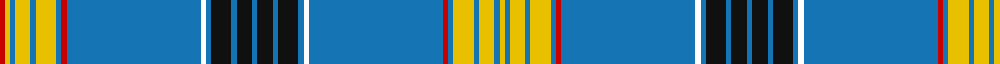

In pattern [RYBYBYBRBKBKBKBKBKBKBRBYBYBY](/patterns/rybybybrbkbkbkbkbkbkbrbybyby/).

This was sourced from house-of-tartan.  It is a [28 stripes tartan](/stripes/stripes28/).

Original link http://www.house-of-tartan.scotland.net/house/TartanViewjs.asp?colr=Def&tnam=6096

## Thread count
Ra/4 Y4 B4 Y12 B4 Y16 B4 Ra4 B104 W4 B4 K16 B4 K12 B4 K12 B4 K16 B4 W4 B104 Ra4 B4 Y16 B4 Y12 B4 Y/4

## Palette
Each colour and its ΔE from the base-6 reference it is a variant of.

| Colour | Shade | Base | ΔE (OKLab) |
|---|---|---|---|
| B | <code style="background-color:#1474B4;">#1474B4</code> `#1474B4` | B <code style="background-color:#2A418A;">#2A418A</code> | 0.15 |
| DG | <code style="background-color:#003820;">#003820</code> `#003820` | G <code style="background-color:#006100;">#006100</code> | 0.15 |
| DY | <code style="background-color:#D09000;">#D09000</code> `#D09000` | Y <code style="background-color:#F2BF00;">#F2BF00</code> | 0.13 |
| K | <code style="background-color:#101010;">#101010</code> `#101010` | K <code style="background-color:#000000;">#000000</code> | 0.17 |
| R | <code style="background-color:#B03000;">#B03000</code> `#B03000` | R <code style="background-color:#CC0000;">#CC0000</code> | 0.06 |
| Ra | <code style="background-color:#C80000;">#C80000</code> `#C80000` | R <code style="background-color:#CC0000;">#CC0000</code> | 0.01 |
| Y | <code style="background-color:#E8C000;">#E8C000</code> `#E8C000` | Y <code style="background-color:#F2BF00;">#F2BF00</code> | 0.02 |

## Nearest tartans

The nearest existing variants by ΔTartan distance.

1. [Made in Scotland](/setts/s23/w3k9b2k1b2k1b2k1b2k1b20y2b20k1b2k1b2k1b2k1b2k2ba2~b2888c4-ba9058d8-k101010-wfcfcfc-yd87c00~x2/) — ΔT 1.21
1. [Laing (Clan)](/setts/s15/b1k3b1k4b1w1b26r1b1y4b1y3b1y1r1~b1474b4-k101010-rc80000-wf8f8f8-ye8c000~x4/) — ΔT 1.28
1. [American Scottish Foundation](/setts/s22/w2r2w2r2b2w1b1w1b1w1b2ba4w1ba4b35g2k1g2r2g1r2w1~b003c64-ba2474e8-g285800-k101010-rdc0000-wffffff~x2/) — ΔT 1.68
1. [ASF Official (Corporate)](/setts/s22/w2r2w2r2b2w1b1w1b1w1b2ba4w1ba4b35g2k1g2r2g1r2w1~b003c64-ba2c2c80-g285800-k101010-rc80000-we0e0e0~x2/) — ΔT 1.87
1. [StammBar](/setts/s12/w4b8w4wa8w2wa2w4b42r1y2r1b2~b003c64-rc80000-wffffff-wa82cffd-yfccc00~x2/) — ΔT 2.00
1. [Scottish Foundation VA Highlands](/setts/s22/b5y2ya36ba3bb3y2b4ya3bc2bb3ba3bb3ba3bb3bc2ya3b4y2bb3ba3ya36y2~b780078-ba202060-bb2c2c80-bc5c8ca8-ye8c000-yaa0a0a0~x2/) — ΔT 2.00
1. [Reeves (2015)](/setts/s17/b36ba2b4ba3b4ba4w1r2g2w1k2g3k2b3k2r3w1~b2c4084-ba5c8ca8-g146400-k101010-rc80000-wffffff~x2/) — ΔT 2.05
1. [Fred Perry (Corporate)](/setts/s16/b36r4b3w3b36g6w1g2w1g10r1g10w1g2w1g6~b202060-g006818-rc80000-wfcfcfc~x2/) — ΔT 2.06
1. [O'Mahony, The](/setts/s18/g2r2g18ra6b40y1b1y4w2y4b1y1b40ra6g18r2g2w1~b202060-g289c18-rc80000-ra888888-we0e0e0-ybc8c00~x2/) — ΔT 2.08
1. [European Union District Tartan Tartan Number: 2486. Earliest known date: 1997/98 The tartan was designed by William Chalmers of Kilsyth in Scotland. The cloth is an authentic Scottish Tartan for all Europeans & originally registered with the the Scottish Tartans Society, the United Kingdom Patent Office, the President of the European Union and the Commissioners in Brussels. The Tartan Squares are worked round the twelve stars on the European Union Flag, designed by Mr Paul Levy, the Council of Europe?s Director of information in the early 1950s. The tartan is made up of the colours on the flag of the European Union, running through the tartan is a small red line, this commemorates the blood spilt on our Continent since recorded history, the white line is slightly larger and represents peace on the Continent of Europe and the world. Various items & cloth (wool worsted and poly-viscose) available from the designer at Tel: 01236 822299, or International 44-00-01236 822299, or Email: CChalmers@compuserve.com . See products available Copyright © Blair Urquhart, Comrie, 2015](/setts/s18/r2k1b10y18b10k1y2k1b32w4b32k1y2k1b10y18b10k1~b202060-k101010-r880000-we0e0e0-ye8c000~x2/) — ΔT 2.08

## Neighbour map

Every grey dot is one of 15726 variants placed by the first two principal components of the ΔTartan feature space (44% of its variance). Red is this tartan; blue dots are its nearest — click one to open its page.

<svg viewBox="0 0 640 380" role="img" style="max-width:100%;height:auto;border:1px solid #e0e0e0;border-radius:4px;display:block" xmlns="http://www.w3.org/2000/svg"><image href="/nn/cloud.v1.png" width="640" height="380"/><a href="/setts/s23/w3k9b2k1b2k1b2k1b2k1b20y2b20k1b2k1b2k1b2k1b2k2ba2~b2888c4-ba9058d8-k101010-wfcfcfc-yd87c00~x2/"><circle cx="376.3" cy="77.7" r="4" fill="#3465a4"><title>Made in Scotland</title></circle></a><a href="/setts/s15/b1k3b1k4b1w1b26r1b1y4b1y3b1y1r1~b1474b4-k101010-rc80000-wf8f8f8-ye8c000~x4/"><circle cx="368.6" cy="65.5" r="4" fill="#3465a4"><title>Laing (Clan)</title></circle></a><a href="/setts/s22/w2r2w2r2b2w1b1w1b1w1b2ba4w1ba4b35g2k1g2r2g1r2w1~b003c64-ba2474e8-g285800-k101010-rdc0000-wffffff~x2/"><circle cx="306.1" cy="14.0" r="4" fill="#3465a4"><title>American Scottish Foundation</title></circle></a><a href="/setts/s22/w2r2w2r2b2w1b1w1b1w1b2ba4w1ba4b35g2k1g2r2g1r2w1~b003c64-ba2c2c80-g285800-k101010-rc80000-we0e0e0~x2/"><circle cx="324.5" cy="17.3" r="4" fill="#3465a4"><title>ASF Official (Corporate)</title></circle></a><a href="/setts/s12/w4b8w4wa8w2wa2w4b42r1y2r1b2~b003c64-rc80000-wffffff-wa82cffd-yfccc00~x2/"><circle cx="372.9" cy="60.4" r="4" fill="#3465a4"><title>StammBar</title></circle></a><a href="/setts/s22/b5y2ya36ba3bb3y2b4ya3bc2bb3ba3bb3ba3bb3bc2ya3b4y2bb3ba3ya36y2~b780078-ba202060-bb2c2c80-bc5c8ca8-ye8c000-yaa0a0a0~x2/"><circle cx="309.3" cy="50.8" r="4" fill="#3465a4"><title>Scottish Foundation VA Highlands</title></circle></a><a href="/setts/s17/b36ba2b4ba3b4ba4w1r2g2w1k2g3k2b3k2r3w1~b2c4084-ba5c8ca8-g146400-k101010-rc80000-wffffff~x2/"><circle cx="376.5" cy="47.6" r="4" fill="#3465a4"><title>Reeves (2015)</title></circle></a><a href="/setts/s16/b36r4b3w3b36g6w1g2w1g10r1g10w1g2w1g6~b202060-g006818-rc80000-wfcfcfc~x2/"><circle cx="390.7" cy="95.9" r="4" fill="#3465a4"><title>Fred Perry (Corporate)</title></circle></a><a href="/setts/s18/g2r2g18ra6b40y1b1y4w2y4b1y1b40ra6g18r2g2w1~b202060-g289c18-rc80000-ra888888-we0e0e0-ybc8c00~x2/"><circle cx="295.3" cy="44.1" r="4" fill="#3465a4"><title>O'Mahony, The</title></circle></a><a href="/setts/s18/r2k1b10y18b10k1y2k1b32w4b32k1y2k1b10y18b10k1~b202060-k101010-r880000-we0e0e0-ye8c000~x2/"><circle cx="364.0" cy="81.2" r="4" fill="#3465a4"><title>European Union District Tartan Tartan Number: 2486. Earliest known date: 1997/98 The tartan was designed by William Chalmers of Kilsyth in Scotland. The cloth is an authentic Scottish Tartan for all Europeans &amp; originally registered with the the Scottish Tartans Society, the United Kingdom Patent Office, the President of the European Union and the Commissioners in Brussels. The Tartan Squares are worked round the twelve stars on the European Union Flag, designed by Mr Paul Levy, the Council of Europe?s Director of information in the early 1950s. The tartan is made up of the colours on the flag of the European Union, running through the tartan is a small red line, this commemorates the blood spilt on our Continent since recorded history, the white line is slightly larger and represents peace on the Continent of Europe and the world. Various items &amp; cloth (wool worsted and poly-viscose) available from the designer at Tel: 01236 822299, or International 44-00-01236 822299, or Email: CChalmers@compuserve.com . See products available Copyright © Blair Urquhart, Comrie, 2015</title></circle></a><circle cx="356.1" cy="40.9" r="5" fill="#c00000"/></svg>

ID: /setts/s28/r1y1b1y3b1y4b1r1b26k1b1ka4b1ka3b1ka3b1ka4b1k1b26r1b1y4b1y3b1y1~b1474b4-k000000-ka101010-rc80000-ye8c000~x4/
