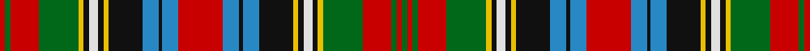

This page is one **sett** — a single exact thread-count. It belongs to the [tartan](/tartans/r3g3r16g22ya3k3ln5k3ya3k19b9k2b9r25b9k2b9k19ya3k3ln5k3ya3g22r16g3r3g3/)
(the same proportion at any scale), whose colour order is pattern [GRGRGYKWKYKBKBRBKBKYKWKYGRGR](/stripes/grgrgykwkykbkbrbkbkykwkygrgr/).

Sourced from register-of-tartans.  It is a [28 stripe tartan](/stripes/stripes28/).

Original link https://www.tartanregister.gov.uk/tartanDetails.aspx?ref=4717

## Register references

External register numbers recorded for this tartan.

- Scottish Register of Tartans: [4717](https://www.tartanregister.gov.uk/tartanDetails.aspx?ref=4717)
- Scottish Tartans Authority (ITI): 875
- Scottish Tartans World Register: 875

## Thread count
R/6 G6 R32 G44 Ya6 K6 LN10 K6 Ya6 K38 B18 K4 B18 R50 B18 K4 B18 K38 Ya6 K6 LN10 K6 Ya6 G44 R32 G6 R6 G/6

## Palette
Each colour and the base-6 reference it is a variant of.

| Colour | Shade | Base |
|---|---|---|
| B | <code style="background-color:#2888C4;">#2888C4</code> `oklch(60.1% 0.125 241.5)` <small>#2888C4</small> | B <code style="background-color:#2A418A;">#2A418A</code> |
| DG | <code style="background-color:#003820;">#003820</code> `oklch(30.0% 0.070 158.3)` <small>#003820</small> | G <code style="background-color:#006100;">#006100</code> |
| G | <code style="background-color:#006818;">#006818</code> `oklch(45.0% 0.142 145.0)` <small>#006818</small> | G <code style="background-color:#006100;">#006100</code> |
| K | <code style="background-color:#101010;">#101010</code> `oklch(17.3% 0.000 89.9)` <small>#101010</small> | K <code style="background-color:#000000;">#000000</code> |
| LN | <code style="background-color:#E0E0E0;">#E0E0E0</code> `oklch(90.7% 0.000 89.9)` <small>#E0E0E0</small> | W <code style="background-color:#F7F7F7;">#F7F7F7</code> |
| R | <code style="background-color:#C80000;">#C80000</code> `oklch(52.3% 0.215 29.2)` <small>#C80000</small> | R <code style="background-color:#CC0000;">#CC0000</code> |
| Y | <code style="background-color:#E8C000;">#E8C000</code> `oklch(81.9% 0.168 93.7)` <small>#E8C000</small> | Y <code style="background-color:#F2BF00;">#F2BF00</code> |
| Ya | <code style="background-color:#E8C000;">#E8C000</code> `oklch(81.9% 0.168 93.7)` <small>#E8C000</small> | Y <code style="background-color:#F2BF00;">#F2BF00</code> |

## Nearest tartans

The nearest existing variants by ΔTartan distance, with this tartan at the top so the swatches line up against it.

ΔTartan

Tartan

Sett

—

<a href="/ttd/edit/#slug=r3g3r16g22ly3k3w5k3ly3k19t9k2t9r25t9k2t9k19ly3k3w5k3ly3g22r16g3r3g3~x2">Wilson's No.181</a> <a class="nn-out" href="/setts/s28/r3g3r16g22ly3k3w5k3ly3k19t9k2t9r25t9k2t9k19ly3k3w5k3ly3g22r16g3r3g3~x2/" title="open its dictionary page">↗</a>

0.29

<a href="/ttd/edit/#slug=r5k4r13g25k3w5k3ly3k16t9k2t9r12k2g3k2r12t9k2t9k16ly3k3w5k3g25r13k4r5w3~x2">Wilson's No.152</a> <a class="nn-out" href="/setts/s30/r5k4r13g25k3w5k3ly3k16t9k2t9r12k2g3k2r12t9k2t9k16ly3k3w5k3g25r13k4r5w3~x2/" title="open its dictionary page">↗</a>

0.66

<a href="/ttd/edit/#slug=r6dg10r2k2r4k2r2dg10r4k9r2k9ly2k3ly2k4w6k6t27r2k2r2t10r6~x2">Anderson (MacGregor-Hastie #3)</a> <a class="nn-out" href="/setts/s24/r6dg10r2k2r4k2r2dg10r4k9r2k9ly2k3ly2k4w6k6t27r2k2r2t10r6~x2/" title="open its dictionary page">↗</a>

0.70

<a href="/ttd/edit/#slug=dg1r6g5r6dg1r1dg9o3dg3y3dg9r1dg1r6g5r6dg1r1w1r1w12g1w12r1w1r1~x4">Maple Leaf, dress</a> <a class="nn-out" href="/setts/s26/dg1r6g5r6dg1r1dg9o3dg3y3dg9r1dg1r6g5r6dg1r1w1r1w12g1w12r1w1r1~x4/" title="open its dictionary page">↗</a>

0.72

<a href="/setts/s26/r25w4k4g25lo3k15t13r5t5r15g4r5k2g3~x2/">Wilson's No.226</a>

0.84

<a href="/setts/s22/r18t13k16lo3k3lb5k3dg32k2r15t5r15~x2/">Wilson's No.090</a>

0.85

<a href="/ttd/edit/#slug=dg1m6g5m6dg1m1dg9dy3g3ly3dg9m1dg1m6g5m6dg1m1w1m1w12g1w12m1w1m1~x4">Maple Leaf Dress District Tartan Tartan Number: 2033. Earliest known date: pre 1992 In creating the Maple Leaf Tartan fabric, David Weiser captured the natural phenomena of these leaves turning from summer into autumn. (The Office of the High Commissioner for Canada.) This is a dress version of the Maple Leaf tartan. See products available Copyright © Blair Urquhart, Comrie, 2015</a> <a class="nn-out" href="/setts/s26/dg1m6g5m6dg1m1dg9dy3g3ly3dg9m1dg1m6g5m6dg1m1w1m1w12g1w12m1w1m1~x4/" title="open its dictionary page">↗</a>

0.90

<a href="/ttd/edit/#slug=k5w4r19t12k2t2k2t12k20ly3g26r19t5r20t5r19g26ly3k20t12k2t2k2t12r19w4k5r5~x2">Wilson's No.043</a> <a class="nn-out" href="/setts/s28/k5w4r19t12k2t2k2t12k20ly3g26r19t5r20t5r19g26ly3k20t12k2t2k2t12r19w4k5r5~x2/" title="open its dictionary page">↗</a>

0.91

<a href="/ttd/edit/#slug=r6g10r2k2r4k2r2g10r4k9r2k9ly2k3ly2k4w6k6t27r2k2r2t10r6~x2">Anderson 4</a> <a class="nn-out" href="/setts/s24/r6g10r2k2r4k2r2g10r4k9r2k9ly2k3ly2k4w6k6t27r2k2r2t10r6~x2/" title="open its dictionary page">↗</a>

0.97

<a href="/setts/s22/r32t10k16ly2k3w3k3g23r13k3r3w2~x2/">Wilson's No.073</a>

1.00

<a href="/ttd/edit/#slug=g5k5g5r12g3k15g3k2w1k2t7k2ly10k2t7k2w1k3r15k3~x2">Jones, Melnyk (Personal)</a> <a class="nn-out" href="/setts/s20/g5k5g5r12g3k15g3k2w1k2t7k2ly10k2t7k2w1k3r15k3~x2/" title="open its dictionary page">↗</a>

## Neighbour map

Every grey dot is one of 14299 variants placed by the first two principal components of the ΔTartan feature space (44% of its variance). Red is this tartan; blue dots are its nearest — click one to open its page.

<svg viewBox="0 0 640 380" role="img" style="max-width:100%;height:auto;border:1px solid #e0e0e0;border-radius:4px;display:block" xmlns="http://www.w3.org/2000/svg"><image href="/nn/cloud.v1.png" width="640" height="380"/><a href="/setts/s30/r5k4r13g25k3w5k3ly3k16t9k2t9r12k2g3k2r12t9k2t9k16ly3k3w5k3g25r13k4r5w3~x2/"><circle cx="59.6" cy="88.1" r="4" fill="#3465a4"><title>Wilson's No.152</title></circle></a><a href="/setts/s24/r6dg10r2k2r4k2r2dg10r4k9r2k9ly2k3ly2k4w6k6t27r2k2r2t10r6~x2/"><circle cx="81.0" cy="85.3" r="4" fill="#3465a4"><title>Anderson (MacGregor-Hastie #3)</title></circle></a><a href="/setts/s26/dg1r6g5r6dg1r1dg9o3dg3y3dg9r1dg1r6g5r6dg1r1w1r1w12g1w12r1w1r1~x4/"><circle cx="77.7" cy="80.0" r="4" fill="#3465a4"><title>Maple Leaf, dress</title></circle></a><a href="/setts/s26/r25w4k4g25lo3k15t13r5t5r15g4r5k2g3~x2/"><circle cx="101.2" cy="96.9" r="4" fill="#3465a4"><title>Wilson's No.226</title></circle></a><a href="/setts/s22/r18t13k16lo3k3lb5k3dg32k2r15t5r15~x2/"><circle cx="99.3" cy="96.6" r="4" fill="#3465a4"><title>Wilson's No.090</title></circle></a><a href="/setts/s26/dg1m6g5m6dg1m1dg9dy3g3ly3dg9m1dg1m6g5m6dg1m1w1m1w12g1w12m1w1m1~x4/"><circle cx="76.9" cy="78.4" r="4" fill="#3465a4"><title>Maple Leaf Dress District Tartan Tartan Number: 2033. Earliest known date: pre 1992 In creating the Maple Leaf Tartan fabric, David Weiser captured the natural phenomena of these leaves turning from summer into autumn. (The Office of the High Commissioner for Canada.) This is a dress version of the Maple Leaf tartan. See products available Copyright © Blair Urquhart, Comrie, 2015</title></circle></a><a href="/setts/s28/k5w4r19t12k2t2k2t12k20ly3g26r19t5r20t5r19g26ly3k20t12k2t2k2t12r19w4k5r5~x2/"><circle cx="102.7" cy="92.7" r="4" fill="#3465a4"><title>Wilson's No.043</title></circle></a><a href="/setts/s24/r6g10r2k2r4k2r2g10r4k9r2k9ly2k3ly2k4w6k6t27r2k2r2t10r6~x2/"><circle cx="65.5" cy="79.9" r="4" fill="#3465a4"><title>Anderson 4</title></circle></a><a href="/setts/s22/r32t10k16ly2k3w3k3g23r13k3r3w2~x2/"><circle cx="120.4" cy="81.3" r="4" fill="#3465a4"><title>Wilson's No.073</title></circle></a><a href="/setts/s20/g5k5g5r12g3k15g3k2w1k2t7k2ly10k2t7k2w1k3r15k3~x2/"><circle cx="99.5" cy="97.3" r="4" fill="#3465a4"><title>Jones, Melnyk (Personal)</title></circle></a><circle cx="66.0" cy="85.1" r="5" fill="#c00000"/></svg>

ID: /setts/s28/r3g3r16g22ly3k3w5k3ly3k19t9k2t9r25t9k2t9k19ly3k3w5k3ly3g22r16g3r3g3~x2/
