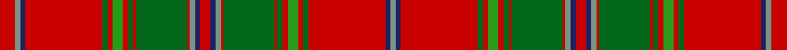

In pattern [GBRGRGRGRGRGBRBGRGRGRGRGRBGR](/stripes/gbrgrgrgrgrgbrbgrgrgrgrgrbgr/).

This was sourced from house-of-tartan.  It is a [28 stripe tartan](/stripes/stripes28/).

Original link http://www.house-of-tartan.scotland.net/house/TartanViewjs.asp?colr=Def&tnam=4067

## Also known as

This cloth is also recorded under:

- All Irish Red

## Thread count
R/12 LG4 DBa4 R60 G4 R4 Ga8 R4 G4 R2 G40 R2 LG4 DBa4 R8 DBa4 LG4 R2 G40 R2 G4 R4 Ga8 R4 G4 R60 DBa4 LG/4

## Palette
Each colour and the base-6 reference it is a variant of.

| Colour | Shade | Base |
|---|---|---|
| DB | <code style="background-color:#2C2C80;">#2C2C80</code> `oklch(35.0% 0.138 276.6)` <small>#2C2C80</small> | B <code style="background-color:#2A418A;">#2A418A</code> |
| DBa | <code style="background-color:#202060;">#202060</code> `oklch(28.9% 0.111 276.9)` <small>#202060</small> | B <code style="background-color:#2A418A;">#2A418A</code> |
| G | <code style="background-color:#006818;">#006818</code> `oklch(45.0% 0.142 145.0)` <small>#006818</small> | G <code style="background-color:#006100;">#006100</code> |
| Ga | <code style="background-color:#289C18;">#289C18</code> `oklch(60.6% 0.191 141.6)` <small>#289C18</small> | G <code style="background-color:#006100;">#006100</code> |
| Gb | <code style="background-color:#5C6428;">#5C6428</code> `oklch(48.3% 0.084 116.0)` <small>#5C6428</small> | G <code style="background-color:#006100;">#006100</code> |
| LB | <code style="background-color:#98C8E8;">#98C8E8</code> `oklch(81.0% 0.068 237.9)` <small>#98C8E8</small> | W <code style="background-color:#F7F7F7;">#F7F7F7</code> |
| LG | <code style="background-color:#789484;">#789484</code> `oklch(64.0% 0.040 160.0)` <small>#789484</small> | G <code style="background-color:#006100;">#006100</code> |
| R | <code style="background-color:#C80000;">#C80000</code> `oklch(52.3% 0.215 29.2)` <small>#C80000</small> | R <code style="background-color:#CC0000;">#CC0000</code> |

## Nearest tartans

The nearest existing variants by ΔTartan distance, with this tartan at the top so the swatches line up against it.

ΔTartan

Tartan

Sett

—

<a href="/ttd/edit/#slug=r6y2db2r30g2r2g4r2g2r1g20r1y2db2r4~x2">All Irish Red Irish District Tartan Tartan Number: 4067. Earliest known date: 1997 Part of a collection produced by Lochcarron in 1997 to acknowledge the early historical and cultural links between the Scots and Irish. Lochcarron sample. See products available Copyright © Blair Urquhart, Comrie, 2015</a> <a class="nn-out" href="/setts/s28/r6y2db2r30g2r2g4r2g2r1g20r1y2db2r4~x2/" title="open its dictionary page">↗</a>

0.73

<a href="/ttd/edit/#slug=r5g10r2db2r30p3r2w1r2p3r30db2r2g10r10g10p4r2p4db10r4g2r4g30r2p3w1~x2">MacDougall 9</a> <a class="nn-out" href="/setts/s27/r5g10r2db2r30p3r2w1r2p3r30db2r2g10r10g10p4r2p4db10r4g2r4g30r2p3w1~x2/" title="open its dictionary page">↗</a>

0.74

<a href="/ttd/edit/#slug=r5g10r2db2r30lr3r2w1r2lr3r30db2r2g10r10g10lr4r2lr4db10r4g2r4g30r2lr3w1~x2">MacDougall Clan Tartan Tartan Number: 1519. Earliest known date: 1815-16 The earliest reference to the MacDougall tartan is in the collection of the Highland Society of London where a sample exists, signed and sealed by the Clan Chief around 1815. The sett is a complex one and the nearest count to the present day day tartan comes from a sample in Paton's collection housed at the Scottish Tartans Museum, and dating to about 1830. The Highland Society also have a sample certified by the Chief MacDougall of MacDougall dated 1906, in their archives store at the Royal Caledonian School near London. See products available Copyright © Blair Urquhart, Comrie, 2015</a> <a class="nn-out" href="/setts/s27/r5g10r2db2r30lr3r2w1r2lr3r30db2r2g10r10g10lr4r2lr4db10r4g2r4g30r2lr3w1~x2/" title="open its dictionary page">↗</a>

0.89

<a href="/ttd/edit/#slug=r5g10r2db2r30dp3r2w1r2dp3r30db2r2g10r10g10dp4r2dp4db10r4g2r4g30r2dp3w1~x2">MacDougall - 1970 (H of E)</a> <a class="nn-out" href="/setts/s27/r5g10r2db2r30dp3r2w1r2dp3r30db2r2g10r10g10dp4r2dp4db10r4g2r4g30r2dp3w1~x2/" title="open its dictionary page">↗</a>

0.94

<a href="/ttd/edit/#slug=g10r2db2r30dp3r2w1r2dp3r30db2r2g10r10g10dp4r2dp4db10r4g2r4g30r2dp3w1~x2">MacDougal</a> <a class="nn-out" href="/setts/s26/g10r2db2r30dp3r2w1r2dp3r30db2r2g10r10g10dp4r2dp4db10r4g2r4g30r2dp3w1~x2/" title="open its dictionary page">↗</a>

1.04

<a href="/setts/s32/dg3lr3dg3r24dp1w1r3dp6r3w1dp1r3dg24r3dp1w1r24w1dp1r3dg24r3dp1w1r3dp6r3w1dp1r24dg3lr3~x4/">King George IV</a>

1.12

<a href="/ttd/edit/#slug=r24w1db2r4g32r4db2w1r4db6r4w1db2r32g2r3g6~x2">Dalziel</a> <a class="nn-out" href="/setts/s17/r24w1db2r4g32r4db2w1r4db6r4w1db2r32g2r3g6~x2/" title="open its dictionary page">↗</a>

1.19

<a href="/ttd/edit/#slug=r36ly2db1r3g41r3db1ly2r3db12r3ly2db1r36g3r3g4~x2">Munro (Clan)</a> <a class="nn-out" href="/setts/s17/r36ly2db1r3g41r3db1ly2r3db12r3ly2db1r36g3r3g4~x2/" title="open its dictionary page">↗</a>

1.21

<a href="/ttd/edit/#slug=r24w1db2r4g32r4db2w1r4db6r4w1db2r32g2m3g6~x2">Dalziel (Logan) Family Tartan Tartan Number: 969. Earliest known date: 1831 Dalziel or Dalzell tartan is similar to the Munro. The basic form of the design was used for a 'George IV' tartan produced in honour of the King's visit in 1822. The Barony of Dalzell in Lanarkshire is the origin of the name. In Old Scots it means 'I dare' and this is also the motto on the family coat of arms. A cadet branch of the family built the House of the Binns in West Lothian which is now owned by the National Trust for Scotland. See products available Copyright © Blair Urquhart, Comrie, 2015</a> <a class="nn-out" href="/setts/s17/r24w1db2r4g32r4db2w1r4db6r4w1db2r32g2m3g6~x2/" title="open its dictionary page">↗</a>

1.22

<a href="/ttd/edit/#slug=r36ly2db2r3g40r3db2ly2r3db12r3ly2db2r36g3dr3g4~x2">Lochiel, (Cameron)</a> <a class="nn-out" href="/setts/s17/r36ly2db2r3g40r3db2ly2r3db12r3ly2db2r36g3dr3g4~x2/" title="open its dictionary page">↗</a>

1.25

<a href="/ttd/edit/#slug=r2t1db2r24g2r2db8r2g2r4g24r2t1db2r3db2t1r2g24r4g2r2db8r2g2r24db2t1r2g2~x2">Stewart/Stuart of Appin #2</a> <a class="nn-out" href="/setts/s30/r2t1db2r24g2r2db8r2g2r4g24r2t1db2r3db2t1r2g24r4g2r2db8r2g2r24db2t1r2g2~x2/" title="open its dictionary page">↗</a>

## Neighbour map

Every grey dot is one of 14299 variants placed by the first two principal components of the ΔTartan feature space (44% of its variance). Red is this tartan; blue dots are its nearest — click one to open its page.

<svg viewBox="0 0 640 380" role="img" style="max-width:100%;height:auto;border:1px solid #e0e0e0;border-radius:4px;display:block" xmlns="http://www.w3.org/2000/svg"><image href="/nn/cloud.v1.png" width="640" height="380"/><a href="/setts/s27/r5g10r2db2r30p3r2w1r2p3r30db2r2g10r10g10p4r2p4db10r4g2r4g30r2p3w1~x2/"><circle cx="306.3" cy="62.2" r="4" fill="#3465a4"><title>MacDougall 9</title></circle></a><a href="/setts/s27/r5g10r2db2r30lr3r2w1r2lr3r30db2r2g10r10g10lr4r2lr4db10r4g2r4g30r2lr3w1~x2/"><circle cx="306.5" cy="61.5" r="4" fill="#3465a4"><title>MacDougall Clan Tartan Tartan Number: 1519. Earliest known date: 1815-16 The earliest reference to the MacDougall tartan is in the collection of the Highland Society of London where a sample exists, signed and sealed by the Clan Chief around 1815. The sett is a complex one and the nearest count to the present day day tartan comes from a sample in Paton's collection housed at the Scottish Tartans Museum, and dating to about 1830. The Highland Society also have a sample certified by the Chief MacDougall of MacDougall dated 1906, in their archives store at the Royal Caledonian School near London. See products available Copyright © Blair Urquhart, Comrie, 2015</title></circle></a><a href="/setts/s27/r5g10r2db2r30dp3r2w1r2dp3r30db2r2g10r10g10dp4r2dp4db10r4g2r4g30r2dp3w1~x2/"><circle cx="307.8" cy="62.4" r="4" fill="#3465a4"><title>MacDougall - 1970 (H of E)</title></circle></a><a href="/setts/s26/g10r2db2r30dp3r2w1r2dp3r30db2r2g10r10g10dp4r2dp4db10r4g2r4g30r2dp3w1~x2/"><circle cx="301.3" cy="63.5" r="4" fill="#3465a4"><title>MacDougal</title></circle></a><a href="/setts/s32/dg3lr3dg3r24dp1w1r3dp6r3w1dp1r3dg24r3dp1w1r24w1dp1r3dg24r3dp1w1r3dp6r3w1dp1r24dg3lr3~x4/"><circle cx="305.7" cy="45.4" r="4" fill="#3465a4"><title>King George IV</title></circle></a><a href="/setts/s17/r24w1db2r4g32r4db2w1r4db6r4w1db2r32g2r3g6~x2/"><circle cx="357.5" cy="73.4" r="4" fill="#3465a4"><title>Dalziel</title></circle></a><a href="/setts/s17/r36ly2db1r3g41r3db1ly2r3db12r3ly2db1r36g3r3g4~x2/"><circle cx="361.9" cy="57.6" r="4" fill="#3465a4"><title>Munro (Clan)</title></circle></a><a href="/setts/s17/r24w1db2r4g32r4db2w1r4db6r4w1db2r32g2m3g6~x2/"><circle cx="358.8" cy="72.8" r="4" fill="#3465a4"><title>Dalziel (Logan) Family Tartan Tartan Number: 969. Earliest known date: 1831 Dalziel or Dalzell tartan is similar to the Munro. The basic form of the design was used for a 'George IV' tartan produced in honour of the King's visit in 1822. The Barony of Dalzell in Lanarkshire is the origin of the name. In Old Scots it means 'I dare' and this is also the motto on the family coat of arms. A cadet branch of the family built the House of the Binns in West Lothian which is now owned by the National Trust for Scotland. See products available Copyright © Blair Urquhart, Comrie, 2015</title></circle></a><a href="/setts/s17/r36ly2db2r3g40r3db2ly2r3db12r3ly2db2r36g3dr3g4~x2/"><circle cx="324.5" cy="84.4" r="4" fill="#3465a4"><title>Lochiel, (Cameron)</title></circle></a><a href="/setts/s30/r2t1db2r24g2r2db8r2g2r4g24r2t1db2r3db2t1r2g24r4g2r2db8r2g2r24db2t1r2g2~x2/"><circle cx="310.7" cy="76.2" r="4" fill="#3465a4"><title>Stewart/Stuart of Appin #2</title></circle></a><circle cx="341.2" cy="50.4" r="5" fill="#c00000"/></svg>

ID: /setts/s28/r6y2db2r30g2r2g4r2g2r1g20r1y2db2r4~x2/
