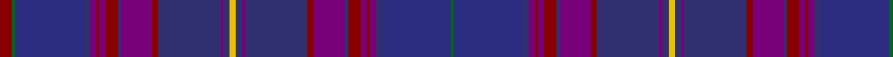

In pattern [GBBBRBRBBRBBBYBBBRBBRBRBBBGR](/patterns/gbbbrbrbbrbbbybbbrbbrbrbbbgr/).

This was sourced from register-of-tartans.  It is a [28 stripes tartan](/stripes/stripes28/).

Original link https://www.tartanregister.gov.uk/tartanDetails.aspx?ref=1707

## Thread count
DR/8 G2 DB44 DBa4 P4 DR2 P4 DR8 DBa2 P20 DR4 DBa40 P2 DBa4 Y4 DBa4 P2 DBa40 DR4 P20 DBa2 DR8 P4 DR2 P4 DBa4 DB44 G/2

## Palette
Each colour and its ΔE from the base-6 reference it is a variant of.

| Colour | Shade | Base | ΔE (OKLab) |
|---|---|---|---|
| DB | <code style="background-color:#2C2C80;">#2C2C80</code> `#2C2C80` | B <code style="background-color:#2A418A;">#2A418A</code> | 0.06 |
| DBa | <code style="background-color:#303070;">#303070</code> `#303070` | B <code style="background-color:#2A418A;">#2A418A</code> | 0.06 |
| DR | <code style="background-color:#880000;">#880000</code> `#880000` | R <code style="background-color:#CC0000;">#CC0000</code> | 0.15 |
| G | <code style="background-color:#006818;">#006818</code> `#006818` | G <code style="background-color:#006100;">#006100</code> | 0.02 |
| O | <code style="background-color:#E86000;">#E86000</code> `#E86000` | R <code style="background-color:#CC0000;">#CC0000</code> | 0.14 |
| P | <code style="background-color:#780078;">#780078</code> `#780078` | B <code style="background-color:#2A418A;">#2A418A</code> | 0.17 |
| Y | <code style="background-color:#E8C000;">#E8C000</code> `#E8C000` | Y <code style="background-color:#F2BF00;">#F2BF00</code> | 0.02 |

## Nearest tartans

The nearest existing variants by ΔTartan distance.

1. [Highland Cathedral (Fashion)](/setts/s15/r8g2b44ba4bb4r2bb4r8ba2bb20r4ba40bb2ba4y4-b2c2c80-ba303070-bb780078-g006818-r880000-ye8c000/) — ΔT 1.57
1. [Spirit of Alba](/setts/s16/b4g2ba48bb36g4bb4g2b38bc8b38g2bb4g4bb36ba48g2-b2c2c80-ba780078-bb202060-bc2888c4-g006818/) — ΔT 1.76
1. [Spirit of Bannockburn Fashion Tartan Tartan Number: 3445. Earliest known date: 2000 Designed by Lochcarron of Scotland for ACS Clothing of Glasgow (0141 766 2600). Original name was 'Scotland the Brave' but changed to Spirit of Bannockburn by Lochcarron. See products available Copyright © Blair Urquhart, Comrie, 2015](/setts/s24/b8ba8b6g40b10k8b6k14b6k6bb70w4bb70k6b6k14b6k8b10g40b6ba8b8k4-b482c4c-ba780078-bb202060-g00502c-k101010-wc0c0c0/) — ΔT 1.88
1. [Rendell, Charles](/setts/s17/k4g4ka2g4ka2g4ka2g24b8k6b6k6b6k6b8ba48r4-b1a2b47-ba3d2e60-g052f14-k1c1714-ka000000-ra20d22/) — ΔT 2.26
1. [LS Curling (Corporate)](/setts/s18/b4b8k4ba50k8ba4k8ba20b8ba4b8ba22k4ba4k48b8k4b4-b2c2c80-ba1c0070-k101010/) — ΔT 2.35
1. [Benedictus Blue (Personal)](/setts/s14/k16b6ba12bb4bc4bb4ba35bb40ba4bb4ba4bb6bc4r6-b2888c4-ba2c2c80-bb003c64-bc780078-k101010-r9c68a4/) — ΔT 2.40
1. [Newlands, Charlie (Personal)](/setts/s11/b12k4ba18w2ba18k4bb8k12bb48wa2b12-b202060-ba440044-bb14283c-k101010-w98c8e8-wae0e0e0/) — ΔT 2.50
1. [Passion of Scotland, Purple (Fashion](/setts/s15/b14w2k6ba6k6b6k26ba4k4ba4k4ba46bb6ba4r4-b1c1c50-ba54204c-bb1c0070-k101010-r9c68a4-we0e0e0/) — ΔT 2.54
1. [Monarch of the Glen Fashion Tartan Tartan Number: 4542. Earliest known date: 2002 Designed by Claire Donaldson of House of Edgar using the name of the popular television series. (2002) See products available Copyright © Blair Urquhart, Comrie, 2015](/setts/s22/b84ba6g2ba4bb2ba4b4k40ba2bb4ba6g2ba4bb2ba4b4g6ba2g4y2g4k4-b440044-ba202060-bb780078-g5c6428-k101010-ybc8c00/) — ΔT 2.59
1. [Rangers F. C. Corporate Tartan Tartan Number: 2170. Earliest known date: 1994 The original tartan was designed in 1989 by Tartan Sportswear. Chris Aitken, designer for Geoffrey (Tailor) Highland Crafts, Edinburgh, increased the size of the sett and changed the shade of blue to suit the Rangers team colours. See products available Copyright © Blair Urquhart, Comrie, 2015](/setts/s20/b28r6b28k24ba80k24b4k4b4k4b14r6b14k4b4k4b4k24ba80k24-b1c0070-ba2c2c80-k101010-rc8002c/) — ΔT 2.61

## Neighbour map

Every grey dot is one of 15726 variants placed by the first two principal components of the ΔTartan feature space (44% of its variance). Red is this tartan; blue dots are its nearest — click one to open its page.

<svg viewBox="0 0 640 380" role="img" style="max-width:100%;height:auto;border:1px solid #e0e0e0;border-radius:4px;display:block" xmlns="http://www.w3.org/2000/svg"><image href="/nn/cloud.v1.png" width="640" height="380"/><a href="/setts/s15/r8g2b44ba4bb4r2bb4r8ba2bb20r4ba40bb2ba4y4-b2c2c80-ba303070-bb780078-g006818-r880000-ye8c000/"><circle cx="259.2" cy="118.4" r="4" fill="#3465a4"><title>Highland Cathedral (Fashion)</title></circle></a><a href="/setts/s16/b4g2ba48bb36g4bb4g2b38bc8b38g2bb4g4bb36ba48g2-b2c2c80-ba780078-bb202060-bc2888c4-g006818/"><circle cx="294.9" cy="153.1" r="4" fill="#3465a4"><title>Spirit of Alba</title></circle></a><a href="/setts/s24/b8ba8b6g40b10k8b6k14b6k6bb70w4bb70k6b6k14b6k8b10g40b6ba8b8k4-b482c4c-ba780078-bb202060-g00502c-k101010-wc0c0c0/"><circle cx="255.4" cy="123.1" r="4" fill="#3465a4"><title>Spirit of Bannockburn Fashion Tartan Tartan Number: 3445. Earliest known date: 2000 Designed by Lochcarron of Scotland for ACS Clothing of Glasgow (0141 766 2600). Original name was 'Scotland the Brave' but changed to Spirit of Bannockburn by Lochcarron. See products available Copyright © Blair Urquhart, Comrie, 2015</title></circle></a><a href="/setts/s17/k4g4ka2g4ka2g4ka2g24b8k6b6k6b6k6b8ba48r4-b1a2b47-ba3d2e60-g052f14-k1c1714-ka000000-ra20d22/"><circle cx="293.4" cy="139.6" r="4" fill="#3465a4"><title>Rendell, Charles</title></circle></a><a href="/setts/s18/b4b8k4ba50k8ba4k8ba20b8ba4b8ba22k4ba4k48b8k4b4-b2c2c80-ba1c0070-k101010/"><circle cx="315.5" cy="193.6" r="4" fill="#3465a4"><title>LS Curling (Corporate)</title></circle></a><a href="/setts/s14/k16b6ba12bb4bc4bb4ba35bb40ba4bb4ba4bb6bc4r6-b2888c4-ba2c2c80-bb003c64-bc780078-k101010-r9c68a4/"><circle cx="272.5" cy="181.7" r="4" fill="#3465a4"><title>Benedictus Blue (Personal)</title></circle></a><a href="/setts/s11/b12k4ba18w2ba18k4bb8k12bb48wa2b12-b202060-ba440044-bb14283c-k101010-w98c8e8-wae0e0e0/"><circle cx="301.6" cy="170.3" r="4" fill="#3465a4"><title>Newlands, Charlie (Personal)</title></circle></a><a href="/setts/s15/b14w2k6ba6k6b6k26ba4k4ba4k4ba46bb6ba4r4-b1c1c50-ba54204c-bb1c0070-k101010-r9c68a4-we0e0e0/"><circle cx="318.7" cy="126.8" r="4" fill="#3465a4"><title>Passion of Scotland, Purple (Fashion</title></circle></a><a href="/setts/s22/b84ba6g2ba4bb2ba4b4k40ba2bb4ba6g2ba4bb2ba4b4g6ba2g4y2g4k4-b440044-ba202060-bb780078-g5c6428-k101010-ybc8c00/"><circle cx="372.7" cy="55.5" r="4" fill="#3465a4"><title>Monarch of the Glen Fashion Tartan Tartan Number: 4542. Earliest known date: 2002 Designed by Claire Donaldson of House of Edgar using the name of the popular television series. (2002) See products available Copyright © Blair Urquhart, Comrie, 2015</title></circle></a><a href="/setts/s20/b28r6b28k24ba80k24b4k4b4k4b14r6b14k4b4k4b4k24ba80k24-b1c0070-ba2c2c80-k101010-rc8002c/"><circle cx="336.5" cy="163.3" r="4" fill="#3465a4"><title>Rangers F. C. Corporate Tartan Tartan Number: 2170. Earliest known date: 1994 The original tartan was designed in 1989 by Tartan Sportswear. Chris Aitken, designer for Geoffrey (Tailor) Highland Crafts, Edinburgh, increased the size of the sett and changed the shade of blue to suit the Rangers team colours. See products available Copyright © Blair Urquhart, Comrie, 2015</title></circle></a><circle cx="279.0" cy="104.7" r="5" fill="#c00000"/></svg>

ID: /setts/s28/r8g2b44ba4bb4r2bb4r8ba2bb20r4ba40bb2ba4y4ba4bb2ba40r4bb20ba2r8bb4r2bb4ba4b44g2-b2c2c80-ba303070-bb780078-g006818-r880000-ye8c000/
