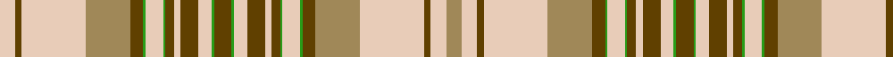

In pattern [WGWYGGWGGWGWGGGWGWGGWGGYWGWY](/patterns/wgwyggwggwgwgggwgwggwggywgwy/).

This was sourced from register-of-tartans.  It is a [28 stripes tartan](/stripes/stripes28/).

Original link https://www.tartanregister.gov.uk/tartanDetails.aspx?ref=1869

## Thread count
LR/14 T6 LR58 LT40 T12 Ga2 LR16 Ga2 T8 LR6 T16 LR12 Ga2 T16 Ga2 LR12 T16 LR6 T8 Ga2 LR16 Ga2 T12 LT40 LR58 T6 LR14 LT/14

## Palette
Each colour and its ΔE from the base-6 reference it is a variant of.

| Colour | Shade | Base | ΔE (OKLab) |
|---|---|---|---|
| G | <code style="background-color:#408060;">#408060</code> `#408060` | G <code style="background-color:#006100;">#006100</code> | 0.14 |
| Ga | <code style="background-color:#289C18;">#289C18</code> `#289C18` | G <code style="background-color:#006100;">#006100</code> | 0.19 |
| LR | <code style="background-color:#E8CCB8;">#E8CCB8</code> `#E8CCB8` | W <code style="background-color:#F7F7F7;">#F7F7F7</code> | 0.12 |
| LT | <code style="background-color:#A08858;">#A08858</code> `#A08858` | Y <code style="background-color:#F2BF00;">#F2BF00</code> | 0.21 |
| O | <code style="background-color:#DC943C;">#DC943C</code> `#DC943C` | Y <code style="background-color:#F2BF00;">#F2BF00</code> | 0.12 |
| T | <code style="background-color:#604000;">#604000</code> `#604000` | G <code style="background-color:#006100;">#006100</code> | 0.14 |
| Y | <code style="background-color:#D8B000;">#D8B000</code> `#D8B000` | Y <code style="background-color:#F2BF00;">#F2BF00</code> | 0.06 |

## Nearest tartans

The nearest existing variants by ΔTartan distance.

1. [Isle of Skye (Fashion)](/setts/s15/g8ga1w6g8w3g4ga1w8ga1g6y20w29g3w7y7~g604000-ga289c18-we8ccb8-ya08858~x2/) — ΔT 1.31
1. [Stewart/Stuart Royal (VS)](/setts/s20/w28k2w2k2w2g12r8k1r1w1r1k1r8g12w2k2w2k2w28r3~g006818-k101010-rc80000-we0e0e0~x2/) — ΔT 1.67
1. [Nike Golf Light (Corporate)](/setts/s17/r5w20ra1w2ra1w2ra2w2ra5b2ra2b2ra2b3ra2b10w3~b5c5c5c-rc80000-ra888888-wfcfcfc~x2/) — ΔT 1.91
1. [Miyuki #3 (Fashion)](/setts/s18/b12w14k3r6w10b28w10r6k3w8r10w8k3r6w40b6w6b6~b5c5c5c-k000000-rc80000-wc0c0c0/) — ΔT 1.93
1. [Scott Dress](/setts/s20/g4r2k1w30r10g14r4g5w2g5r4g5w2g5r4g14r10w30k1r2~g003820-k101010-rc80000-wfcfcfc~x2/) — ΔT 1.96
1. [Miyuki, House Check Grey, 1003A](/setts/s18/b12w14r3g6w10b28w10g6r3w8g10w8r3g6w40b6w6b6~b505050-g808080-rc00000-wc0c0c0/) — ΔT 1.97
1. [Agincourt (Fashion)](/setts/s17/b4y1b3y1b1y1y1y6b4y2y6b7y6y1y28b1b1~b003c64-yd09800~x4/) — ΔT 2.00
1. [Beck Dress (Personal)](/setts/s17/k4b2w15r6y12r6w25b2k4b2w15b4k2b4k2b4k1~b2888c4-k101010-rc80000-we0e0e0-ye8c000~x2/) — ΔT 2.01
1. [Oriflame](/setts/s24/w4wa6w6wa21w9b27w10wa1b1wa5b1wa1w10r1ra1r5ra1r1w10b1r1b5r1b1~b5c5c5c-ra00000-rac80000-wfcfcfc-wac0c0c0~x2/) — ΔT 2.05
1. [Espana](/setts/s17/w34b5w3k1y2r2y2r2y2r2y2r2y2k1w3r4y8~b1474b4-k101010-rc80000-we8ccb8-ye8c000~x2/) — ΔT 2.08

## Neighbour map

Every grey dot is one of 15726 variants placed by the first two principal components of the ΔTartan feature space (44% of its variance). Red is this tartan; blue dots are its nearest — click one to open its page.

<svg viewBox="0 0 640 380" role="img" style="max-width:100%;height:auto;border:1px solid #e0e0e0;border-radius:4px;display:block" xmlns="http://www.w3.org/2000/svg"><image href="/nn/cloud.v1.png" width="640" height="380"/><a href="/setts/s15/g8ga1w6g8w3g4ga1w8ga1g6y20w29g3w7y7~g604000-ga289c18-we8ccb8-ya08858~x2/"><circle cx="275.0" cy="107.0" r="4" fill="#3465a4"><title>Isle of Skye (Fashion)</title></circle></a><a href="/setts/s20/w28k2w2k2w2g12r8k1r1w1r1k1r8g12w2k2w2k2w28r3~g006818-k101010-rc80000-we0e0e0~x2/"><circle cx="284.1" cy="62.1" r="4" fill="#3465a4"><title>Stewart/Stuart Royal (VS)</title></circle></a><a href="/setts/s17/r5w20ra1w2ra1w2ra2w2ra5b2ra2b2ra2b3ra2b10w3~b5c5c5c-rc80000-ra888888-wfcfcfc~x2/"><circle cx="223.3" cy="90.4" r="4" fill="#3465a4"><title>Nike Golf Light (Corporate)</title></circle></a><a href="/setts/s18/b12w14k3r6w10b28w10r6k3w8r10w8k3r6w40b6w6b6~b5c5c5c-k000000-rc80000-wc0c0c0/"><circle cx="246.4" cy="131.1" r="4" fill="#3465a4"><title>Miyuki #3 (Fashion)</title></circle></a><a href="/setts/s20/g4r2k1w30r10g14r4g5w2g5r4g5w2g5r4g14r10w30k1r2~g003820-k101010-rc80000-wfcfcfc~x2/"><circle cx="213.9" cy="71.1" r="4" fill="#3465a4"><title>Scott Dress</title></circle></a><a href="/setts/s18/b12w14r3g6w10b28w10g6r3w8g10w8r3g6w40b6w6b6~b505050-g808080-rc00000-wc0c0c0/"><circle cx="274.0" cy="144.6" r="4" fill="#3465a4"><title>Miyuki, House Check Grey, 1003A</title></circle></a><a href="/setts/s17/b4y1b3y1b1y1y1y6b4y2y6b7y6y1y28b1b1~b003c64-yd09800~x4/"><circle cx="322.2" cy="100.6" r="4" fill="#3465a4"><title>Agincourt (Fashion)</title></circle></a><a href="/setts/s17/k4b2w15r6y12r6w25b2k4b2w15b4k2b4k2b4k1~b2888c4-k101010-rc80000-we0e0e0-ye8c000~x2/"><circle cx="210.7" cy="77.1" r="4" fill="#3465a4"><title>Beck Dress (Personal)</title></circle></a><a href="/setts/s24/w4wa6w6wa21w9b27w10wa1b1wa5b1wa1w10r1ra1r5ra1r1w10b1r1b5r1b1~b5c5c5c-ra00000-rac80000-wfcfcfc-wac0c0c0~x2/"><circle cx="185.1" cy="46.0" r="4" fill="#3465a4"><title>Oriflame</title></circle></a><a href="/setts/s17/w34b5w3k1y2r2y2r2y2r2y2r2y2k1w3r4y8~b1474b4-k101010-rc80000-we8ccb8-ye8c000~x2/"><circle cx="317.1" cy="38.7" r="4" fill="#3465a4"><title>Espana</title></circle></a><circle cx="281.6" cy="78.1" r="5" fill="#c00000"/></svg>

ID: /setts/s28/w7g3w29y20g6ga1w8ga1g4w3g8w6ga1g8ga1w6g8w3g4ga1w8ga1g6y20w29g3w7y7~g604000-ga289c18-we8ccb8-ya08858~x2/
