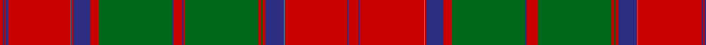

**Bands:** [RBRBRBRBRGRGRBRBRGRGRBRBRBRBR](/stripes/rbrbrbrbrgrgrbrbrgrgrbrbrbrbr/) · **Stripes:** [R DB R DB R T R DB R G R G R DB R DB R G R G R DB R T R DB R DB R](/stripes/stripes29/) R DB R DB R T R DB R G R G R DB R DB R G R G R DB R T R DB R DB R

This was sourced from logan-1831.  It is a [29 band tartan](/bands/bands29/).

Original link /posts/logans-scottish-gael/

## Provenance

James Logan recorded the **Grant** sett in 1831, on page 403 of the *Table of Clan Tartans* in *The Scottish Gaël* — the earliest systematic published collection of clan setts. Logan gives the stripe widths in eighths of an inch, measured across the cloth and reflected about each end (a half-sett):

> 1 red · ¼ blue · ½ red · ½ blue · 18 red · ¼ azure · ½ red · 5 blue · 1 red · ¼ green · 1 red · 21 green · ¼ red · ¼ blue · 2½ red · ½ blue · ¼ red · 21 green · 1 red · ¼ green · 1 red · 5 blue · ¼ red · ¼ azure · 18 red · ¼ blue · ¼ red · ¼ blue · 2½ red

In threads (at 8 to the eighth-inch) that is `R/8 B2 R4 B4 R144 A2 R4 B40 R8 G2 R8 G168 R2 B2 R20 B4 R2 G168 R8 G2 R8 B40 R2 A2 R144 B2 R2 B2 R/20`. Logan named his colours rather than dyeing to a standard, so the palette here is the Dictionary's modern reading of his names.

See [Logan's Scottish Gaël](/posts/logans-scottish-gael/) for the full table and method.

## Related setts

Later records of the **Grant** name adjusted Logan's counts: [Grant Hunting or Black Watch](/setts/s13/b11k1b1k1b1k8g8k1g8k8b8k1b1~b202060-g006818-k101010~x4/); [Grant](/setts/s15/r16k6r6g46r6g5r6k12r6b6r48k6r6k6r16~b3c82af-g005020-k101010-rdc0000/); [Grant, Piper to the Laird of](/setts/s12/r24k2g8k2r8k1g24b6k2r14g18k4~b000080-g777733-k101010-rb13e0f/); [Grant (Wilson's 1819 Key Pattern Book)](/setts/s11/b22k4b4k4b4k22g22r5g6k2y3~b1474b4-g006818-k101010-rc80000-ye8c000~x2/). Compare their thread counts with Logan's above.

## Thread count
R/8 DB2 R4 DB4 R144 B2 R4 DB40 R8 G2 R8 G168 R2 DB2 R20 DB4 R2 G168 R8 G2 R8 DB40 R2 B2 R144 DB2 R2 DB2 R/20

## Palette
Each colour and its ΔE from the base-6 reference it is a variant of.

| Colour | Shade | Base | ΔE (OKLab) |
|---|---|---|---|
| B | <code style="background-color:#5C8CA8;">#5C8CA8</code> `#5C8CA8` | B <code style="background-color:#2A418A;">#2A418A</code> | 0.23 |
| DB | <code style="background-color:#2C2C80;">#2C2C80</code> `#2C2C80` | B <code style="background-color:#2A418A;">#2A418A</code> | 0.06 |
| G | <code style="background-color:#006818;">#006818</code> `#006818` | G <code style="background-color:#006100;">#006100</code> | 0.02 |
| R | <code style="background-color:#C80000;">#C80000</code> `#C80000` | R <code style="background-color:#CC0000;">#CC0000</code> | 0.01 |

## Nearest tartans

The nearest existing variants by ΔTartan distance.

1. [Stewart/Stuart of Appin #2](/setts/s30/g2r2t1db2r24g2r2db8r2g2r4g24r2t1db2r3db2t1r2g24r4g2r2db8r2g2r24db2t1r2~x2/) — ΔT 1.39
1. [Bruce - 1819 (New)](/setts/s15/r15dp1r2dp2r78lt1r2dp21r3g2r3g89r2dp2r10/) — ΔT 1.44
1. [Unidentified Plaid 3](/setts/s23/n126r3ly16n20ly4n4ly4n4ly4n4ly4n4ly4n4ly4n4ly4n4ly4n4ly4dr130n10/) — ΔT 1.45
1. [All Irish Red Irish District Tartan Tartan Number: 4067. Earliest known date: 1997 Part of a collection produced by Lochcarron in 1997 to acknowledge the early historical and cultural links between the Scots and Irish. Lochcarron sample. See products available Copyright © Blair Urquhart, Comrie, 2015](/setts/s28/r6y2db2r30g2r2g4r2g2r1g20r1y2db2r4db2y2r1g20r1g2r2g4r2g2r30db2y2~x2/) — ΔT 1.46
1. [MacGillivray](/setts/s27/db2r8t1r8g36r4db28r2t2r72db2t1r8t1r8t1db1r72t1r2db28r4g36r8t1r8db2~x2/) — ΔT 1.52
1. [Not Specified](/setts/s26/r3g50r3g1r3t3r3t45r3t3r50t3r3t3r50t3r3t45r3t3r3g1r3g50r3t3~x2/) — ΔT 1.62
1. [Drummond of Megginch - 2023 BertieLexa](/setts/s15/r7db1r2db2r35lb2r2db10r2g2r2g37r3db2r6~x2/) — ΔT 1.66
1. [MacDougall](/setts/s22/r6g12r2db1r36r4r36db1r2g12r12g12r6r2r6db12r4g2r4g36r2r2~x4/) — ΔT 1.67
1. [Newfoundland (CIDD 28098)](/setts/s36/g50r16g8do8r1do1r1do1r1do1r1do1r1do1r1do1r20do40g12do24lo8r1lo1r1lo1r1lo1r1lo1r1lo1r1lo1r28lo6do4~x2/) — ΔT 1.67
1. [Stuart/Stewart of Ardshiel](/setts/s34/t4k2r2r12dg66r4k2t2r6k34r6t2k2r65k3r2r6dg14r6r2k3r65k2t2r6k34r6t2k2r4dg66r12r2k2/) — ΔT 1.68

## Neighbour map

Every grey dot is one of 14313 variants placed by the first two principal components of the ΔTartan feature space (44% of its variance). Red is this tartan; blue dots are its nearest — click one to open its page.

<svg viewBox="0 0 640 380" role="img" style="max-width:100%;height:auto;border:1px solid #e0e0e0;border-radius:4px;display:block" xmlns="http://www.w3.org/2000/svg"><image href="/nn/cloud.v1.png" width="640" height="380"/><a href="/setts/s30/g2r2t1db2r24g2r2db8r2g2r4g24r2t1db2r3db2t1r2g24r4g2r2db8r2g2r24db2t1r2~x2/"><circle cx="311.1" cy="76.2" r="4" fill="#3465a4"><title>Stewart/Stuart of Appin #2</title></circle></a><a href="/setts/s15/r15dp1r2dp2r78lt1r2dp21r3g2r3g89r2dp2r10/"><circle cx="386.9" cy="61.0" r="4" fill="#3465a4"><title>Bruce - 1819 (New)</title></circle></a><a href="/setts/s23/n126r3ly16n20ly4n4ly4n4ly4n4ly4n4ly4n4ly4n4ly4n4ly4n4ly4dr130n10/"><circle cx="365.9" cy="34.7" r="4" fill="#3465a4"><title>Unidentified Plaid 3</title></circle></a><a href="/setts/s28/r6y2db2r30g2r2g4r2g2r1g20r1y2db2r4db2y2r1g20r1g2r2g4r2g2r30db2y2~x2/"><circle cx="341.7" cy="50.3" r="4" fill="#3465a4"><title>All Irish Red Irish District Tartan Tartan Number: 4067. Earliest known date: 1997 Part of a collection produced by Lochcarron in 1997 to acknowledge the early historical and cultural links between the Scots and Irish. Lochcarron sample. See products available Copyright © Blair Urquhart, Comrie, 2015</title></circle></a><a href="/setts/s27/db2r8t1r8g36r4db28r2t2r72db2t1r8t1r8t1db1r72t1r2db28r4g36r8t1r8db2~x2/"><circle cx="412.0" cy="45.5" r="4" fill="#3465a4"><title>MacGillivray</title></circle></a><a href="/setts/s26/r3g50r3g1r3t3r3t45r3t3r50t3r3t3r50t3r3t45r3t3r3g1r3g50r3t3~x2/"><circle cx="327.7" cy="73.6" r="4" fill="#3465a4"><title>Not Specified</title></circle></a><a href="/setts/s15/r7db1r2db2r35lb2r2db10r2g2r2g37r3db2r6~x2/"><circle cx="382.9" cy="92.7" r="4" fill="#3465a4"><title>Drummond of Megginch - 2023 BertieLexa</title></circle></a><a href="/setts/s22/r6g12r2db1r36r4r36db1r2g12r12g12r6r2r6db12r4g2r4g36r2r2~x4/"><circle cx="350.7" cy="91.1" r="4" fill="#3465a4"><title>MacDougall</title></circle></a><a href="/setts/s36/g50r16g8do8r1do1r1do1r1do1r1do1r1do1r1do1r20do40g12do24lo8r1lo1r1lo1r1lo1r1lo1r1lo1r1lo1r28lo6do4~x2/"><circle cx="279.9" cy="32.7" r="4" fill="#3465a4"><title>Newfoundland (CIDD 28098)</title></circle></a><a href="/setts/s34/t4k2r2r12dg66r4k2t2r6k34r6t2k2r65k3r2r6dg14r6r2k3r65k2t2r6k34r6t2k2r4dg66r12r2k2/"><circle cx="271.0" cy="28.0" r="4" fill="#3465a4"><title>Stuart/Stewart of Ardshiel</title></circle></a><circle cx="370.2" cy="36.1" r="5" fill="#c00000"/></svg>

ID: /setts/s29/r10db1r1db1r72t1r1db20r4g1r4g84r1db2r10db1r1g84r4g1r4db20r2t1r72db2r2db1r4~x2/
