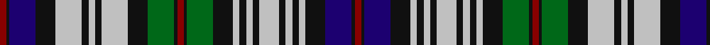

In pattern [RKBKWKWKWKGKRKGKWKWKWKWKWKBKR](/patterns/rkbkwkwkwkgkrkgkwkwkwkwkwkbkr/).

This was sourced from register-of-tartans.  It is a [29 stripes tartan](/stripes/stripes29/).

Original link https://www.tartanregister.gov.uk/tartanDetails.aspx?ref=2541

## Attestations

This cloth appears in 2 source records; the oldest owns this page.

- 01/01/2002 — MacKinlay Dress (register-of-tartans, [record](https://www.tartanregister.gov.uk/tartanDetails.aspx?ref=2541))
- pre 2002 — MacKinlay Dress (Clan?) (tartans-authority, [record](http://www.tartansauthority.com/tartan-ferret/display/4564/))

## Thread count
DR/4 K2 DB16 K12 N16 K4 N4 K4 N16 K12 G16 K2 DR4 K2 G16 K12 N4 K4 N4 K4 N12 K4 N4 K4 N4 K12 DB16 K2 DR/4

## Palette
Each colour and its ΔE from the base-6 reference it is a variant of.

| Colour | Shade | Base | ΔE (OKLab) |
|---|---|---|---|
| DB | <code style="background-color:#1C0070;">#1C0070</code> `#1C0070` | B <code style="background-color:#2A418A;">#2A418A</code> | 0.14 |
| DR | <code style="background-color:#880000;">#880000</code> `#880000` | R <code style="background-color:#CC0000;">#CC0000</code> | 0.15 |
| G | <code style="background-color:#006818;">#006818</code> `#006818` | G <code style="background-color:#006100;">#006100</code> | 0.02 |
| K | <code style="background-color:#101010;">#101010</code> `#101010` | K <code style="background-color:#000000;">#000000</code> | 0.17 |
| N | <code style="background-color:#C0C0C0;">#C0C0C0</code> `#C0C0C0` | W <code style="background-color:#F7F7F7;">#F7F7F7</code> | 0.17 |

## Nearest tartans

The nearest existing variants by ΔTartan distance.

1. [Campbell #2](/setts/s26/b11k3b11k11g15k2w3k2g15k11w5k5w19k2w5k2w19k5w5k11g15k2y3k2g15k11x2~b2c4084-g005020-k101010-we0e0e0-ye8c000/) — ΔT 0.75
1. [Scottish National Dress District Tartan Tartan Number: 2160. Earliest known date: 1994 In 1934 The National Association of Scottish Woollen Manufacturers designed a tartan they named 'National'. In 1994 Highland clothiers, McCalls of Aberdeen, designed and registered a tartan they called the 'National Dress' which appears to have retained some elements of the original design. The 'Dress' tartan was registered as a patented design, No. 601292, on 22nd March 1994. See products available Copyright © Blair Urquhart, Comrie, 2015](/setts/s26/b12w11r2w11b12g11k2g3k2g11k8b2r2b2w2b11w2b2r2b2k8g11k2g3k2g11x2~b1c0070-g003820-k101010-rc80000-we0e0e0/) — ΔT 0.88
1. [Campbell of Loch Neil Dress](/setts/s28/k20g14k2y4k2g14k10w6b6w18b3w4b3w18b6w6k10g14k2w4k2g14k12b12k2b6k2b12~b2c4084-g005020-k101010-we0e0e0-ye8c000/) — ΔT 0.90
1. [Campbell of Argyll Dress Trade Tartan Tartan Number: 1969. Earliest known date: pre 2003 Paton's version of the 'Red Campbell'. Not accepted by the present chief. See products available Copyright © Blair Urquhart, Comrie, 2015](/setts/s26/b11k3b11k11g15k2w3k2g15k11w5k5w19k2w5k2w19k5w5k11g15k2y3k2g15k11x2~b2c2c80-g006818-k101010-we0e0e0-ye8c000/) — ΔT 0.93
1. [Colquhoun Dress](/setts/s22/k15y2g14r2g14y2k15y3b3y19b2r2b2y18b3y3k15b10k2b2k2b10x2~b1c0070-g006818-k101010-r880000-yb8b8b8/) — ΔT 0.99
1. [Argyle Dress](/setts/s22/b4k3g17k17b15k3r4k3b15k17w3b4w25b3w6b3w25b4w3k17g17k3x2~b2c2c80-g006818-k101010-rc80000-we0e0e0/) — ΔT 1.01
1. [Campbell of Loch Neil Dress Clan Tartan Tartan Number: 1963. Earliest known date: pre 2003 Sample 1984 See products available Copyright © Blair Urquhart, Comrie, 2015](/setts/s26/b12k2b6k2b12k12g14k2w4k2g14k10w6b6w18b3w4b3w18b6w6k10g14k2y4k2~b2c2c80-g006818-k101010-we0e0e0-ye8c000/) — ΔT 1.02
1. [Black Watch, dress](/setts/s25/b10k2b2k2b10k10w3b4w15b2w4b2w15b4w3k10g11k3g11k9b10k2b2k2b10x2~b304080-g008000-k000000-we0e0e0/) — ΔT 1.09
1. [Colquhoun Dress Clan Tartan Tartan Number: 1960. Earliest known date: 1960 A more recent design and one of the very few asymmetrical setts. The actual thread count has been reduced by half for display. See products available Copyright © Blair Urquhart, Comrie, 2015](/setts/s22/k15w3b3w18b2r2b2w19b3w3k15w2g13r2g14w2k15b10k2b2k2b10~b2c2c80-g006818-k101010-rc80000-we0e0e0/) — ΔT 1.09
1. [MacDonell of Glengarry Dress](/setts/s22/b6r2b7r2b7r2k7g8r2g3r2g5w2g5r2g3r2g8k9w15k9r2x2~b2c2c80-g285800-k101010-rc80000-we0e0e0/) — ΔT 1.10

## Neighbour map

Every grey dot is one of 15726 variants placed by the first two principal components of the ΔTartan feature space (44% of its variance). Red is this tartan; blue dots are its nearest — click one to open its page.

<svg viewBox="0 0 640 380" role="img" style="max-width:100%;height:auto;border:1px solid #e0e0e0;border-radius:4px;display:block" xmlns="http://www.w3.org/2000/svg"><image href="/nn/cloud.v1.png" width="640" height="380"/><a href="/setts/s26/b11k3b11k11g15k2w3k2g15k11w5k5w19k2w5k2w19k5w5k11g15k2y3k2g15k11x2~b2c4084-g005020-k101010-we0e0e0-ye8c000/"><circle cx="70.2" cy="129.7" r="4" fill="#3465a4"><title>Campbell #2</title></circle></a><a href="/setts/s26/b12w11r2w11b12g11k2g3k2g11k8b2r2b2w2b11w2b2r2b2k8g11k2g3k2g11x2~b1c0070-g003820-k101010-rc80000-we0e0e0/"><circle cx="66.5" cy="147.6" r="4" fill="#3465a4"><title>Scottish National Dress District Tartan Tartan Number: 2160. Earliest known date: 1994 In 1934 The National Association of Scottish Woollen Manufacturers designed a tartan they named 'National'. In 1994 Highland clothiers, McCalls of Aberdeen, designed and registered a tartan they called the 'National Dress' which appears to have retained some elements of the original design. The 'Dress' tartan was registered as a patented design, No. 601292, on 22nd March 1994. See products available Copyright © Blair Urquhart, Comrie, 2015</title></circle></a><a href="/setts/s28/k20g14k2y4k2g14k10w6b6w18b3w4b3w18b6w6k10g14k2w4k2g14k12b12k2b6k2b12~b2c4084-g005020-k101010-we0e0e0-ye8c000/"><circle cx="46.4" cy="125.4" r="4" fill="#3465a4"><title>Campbell of Loch Neil Dress</title></circle></a><a href="/setts/s26/b11k3b11k11g15k2w3k2g15k11w5k5w19k2w5k2w19k5w5k11g15k2y3k2g15k11x2~b2c2c80-g006818-k101010-we0e0e0-ye8c000/"><circle cx="68.1" cy="128.7" r="4" fill="#3465a4"><title>Campbell of Argyll Dress Trade Tartan Tartan Number: 1969. Earliest known date: pre 2003 Paton's version of the 'Red Campbell'. Not accepted by the present chief. See products available Copyright © Blair Urquhart, Comrie, 2015</title></circle></a><a href="/setts/s22/k15y2g14r2g14y2k15y3b3y19b2r2b2y18b3y3k15b10k2b2k2b10x2~b1c0070-g006818-k101010-r880000-yb8b8b8/"><circle cx="82.8" cy="125.6" r="4" fill="#3465a4"><title>Colquhoun Dress</title></circle></a><a href="/setts/s22/b4k3g17k17b15k3r4k3b15k17w3b4w25b3w6b3w25b4w3k17g17k3x2~b2c2c80-g006818-k101010-rc80000-we0e0e0/"><circle cx="60.0" cy="128.2" r="4" fill="#3465a4"><title>Argyle Dress</title></circle></a><a href="/setts/s26/b12k2b6k2b12k12g14k2w4k2g14k10w6b6w18b3w4b3w18b6w6k10g14k2y4k2~b2c2c80-g006818-k101010-we0e0e0-ye8c000/"><circle cx="41.9" cy="128.1" r="4" fill="#3465a4"><title>Campbell of Loch Neil Dress Clan Tartan Tartan Number: 1963. Earliest known date: pre 2003 Sample 1984 See products available Copyright © Blair Urquhart, Comrie, 2015</title></circle></a><a href="/setts/s25/b10k2b2k2b10k10w3b4w15b2w4b2w15b4w3k10g11k3g11k9b10k2b2k2b10x2~b304080-g008000-k000000-we0e0e0/"><circle cx="81.0" cy="154.4" r="4" fill="#3465a4"><title>Black Watch, dress</title></circle></a><a href="/setts/s22/k15w3b3w18b2r2b2w19b3w3k15w2g13r2g14w2k15b10k2b2k2b10~b2c2c80-g006818-k101010-rc80000-we0e0e0/"><circle cx="72.1" cy="118.3" r="4" fill="#3465a4"><title>Colquhoun Dress Clan Tartan Tartan Number: 1960. Earliest known date: 1960 A more recent design and one of the very few asymmetrical setts. The actual thread count has been reduced by half for display. See products available Copyright © Blair Urquhart, Comrie, 2015</title></circle></a><a href="/setts/s22/b6r2b7r2b7r2k7g8r2g3r2g5w2g5r2g3r2g8k9w15k9r2x2~b2c2c80-g285800-k101010-rc80000-we0e0e0/"><circle cx="45.6" cy="146.5" r="4" fill="#3465a4"><title>MacDonell of Glengarry Dress</title></circle></a><circle cx="77.8" cy="132.2" r="5" fill="#c00000"/></svg>

ID: /setts/s29/r2k1b8k6w8k2w2k2w8k6g8k1r2k1g8k6w2k2w2k2w6k2w2k2w2k6b8k1r2x2~b1c0070-g006818-k101010-r880000-wc0c0c0/
