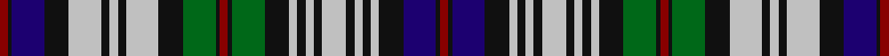

**Bands:** [RKBKWKWKWKGKRKGKWKWKWKWKWKBKR](/stripes/rkbkwkwkwkgkrkgkwkwkwkwkwkbkr/) · **Stripes:** [R K DB K LB K LB K LB K G K R K G K LB K LB K LB K LB K LB K DB K R](/stripes/stripes29/) R K DB K LB K LB K LB K G K R K G K LB K LB K LB K LB K LB K DB K R

This was sourced from register-of-tartans.  It is a [29 band tartan](/bands/bands29/).

Original link https://www.tartanregister.gov.uk/tartanDetails.aspx?ref=2541

## Attestations

This cloth appears in 2 source records; the oldest owns this page.

- 01/01/2002 — MacKinlay Dress (register-of-tartans, [record](https://www.tartanregister.gov.uk/tartanDetails.aspx?ref=2541))
- pre 2002 — MacKinlay Dress (Clan?) (tartans-authority, [record](http://www.tartansauthority.com/tartan-ferret/display/4564/))

## Register references

External register numbers recorded for this tartan.

- Scottish Register of Tartans: [2541](https://www.tartanregister.gov.uk/tartanDetails.aspx?ref=2541)
- Scottish Tartans Authority (ITI): 4564

## Thread count
DR/4 K2 DB16 K12 N16 K4 N4 K4 N16 K12 G16 K2 DR4 K2 G16 K12 N4 K4 N4 K4 N12 K4 N4 K4 N4 K12 DB16 K2 DR/4

## Palette
Each colour and its ΔE from the base-6 reference it is a variant of.

| Colour | Shade | Base | ΔE (OKLab) |
|---|---|---|---|
| DB | <code style="background-color:#1C0070;">#1C0070</code> `#1C0070` | B <code style="background-color:#2A418A;">#2A418A</code> | 0.14 |
| DR | <code style="background-color:#880000;">#880000</code> `#880000` | R <code style="background-color:#CC0000;">#CC0000</code> | 0.15 |
| G | <code style="background-color:#006818;">#006818</code> `#006818` | G <code style="background-color:#006100;">#006100</code> | 0.02 |
| K | <code style="background-color:#101010;">#101010</code> `#101010` | K <code style="background-color:#000000;">#000000</code> | 0.17 |
| N | <code style="background-color:#C0C0C0;">#C0C0C0</code> `#C0C0C0` | W <code style="background-color:#F7F7F7;">#F7F7F7</code> | 0.17 |

## Nearest tartans

The nearest existing variants by ΔTartan distance.

1. [Campbell #2](/setts/s26/k11dg15k2ly3k2dg15k11w5k5w19k2w5k2w19k5w5k11dg15k2w3k2dg15k11db11k3db11~x2/) — ΔT 0.76
1. [Scottish National Dress District Tartan Tartan Number: 2160. Earliest known date: 1994 In 1934 The National Association of Scottish Woollen Manufacturers designed a tartan they named 'National'. In 1994 Highland clothiers, McCalls of Aberdeen, designed and registered a tartan they called the 'National Dress' which appears to have retained some elements of the original design. The 'Dress' tartan was registered as a patented design, No. 601292, on 22nd March 1994. See products available Copyright © Blair Urquhart, Comrie, 2015](/setts/s26/db12w11r2w11db12dg11k2dg3k2dg11k8db2r2db2w2db11w2db2r2db2k8dg11k2dg3k2dg11~x2/) — ΔT 0.88
1. [Campbell of Loch Neil Dress](/setts/s28/k20dg14k2ly4k2dg14k10w6db6w18db3w4db3w18db6w6k10dg14k2w4k2dg14k12db12k2db6k2db12/) — ΔT 0.90
1. [Colquhoun Dress](/setts/s22/k15lr2g14r2g14lr2k15lr3db3lr19db2r2db2lr18db3lr3k15db10k2db2k2db10~x2/) — ΔT 0.99
1. [Argyle Dress](/setts/s22/db4k3g17k17db15k3r4k3db15k17w3db4w25db3w6db3w25db4w3k17g17k3~x2/) — ΔT 1.01
1. [Campbell of Loch Neil Dress Clan Tartan Tartan Number: 1963. Earliest known date: pre 2003 Sample 1984 See products available Copyright © Blair Urquhart, Comrie, 2015](/setts/s26/db12k2db6k2db12k12g14k2w4k2g14k10w6db6w18db3w4db3w18db6w6k10g14k2ly4k2/) — ΔT 1.02
1. [MacDonell of Glengarry Dress](/setts/s22/db6r2db7r2db7r2k7dg8r2dg3r2dg5w2dg5r2dg3r2dg8k9w15k9r2~x2/) — ΔT 1.10
1. [MacKenzie Dress #4](/setts/s20/db10k10dg9k2w2k2dg9k10w2db2w14db2w2db2w14db2w2k10db10r2~x2/) — ΔT 1.12
1. [Black Watch Dress (Asymmetrical)](/setts/s25/db10k2db2k2db10k10w3db4w15db2w4db2w15db4w3k10g11k3g11k9db10k2db2k2db10~x2/) — ΔT 1.12
1. [Campbell of Loch Neil, dress](/setts/s28/k20g14k2ly4k2g14k10w6db6w18db3w4db3w18db6w6k10g14k2w4k2g14k12db12k2db6k2db12/) — ΔT 1.12

## Neighbour map

Every grey dot is one of 14299 variants placed by the first two principal components of the ΔTartan feature space (44% of its variance). Red is this tartan; blue dots are its nearest — click one to open its page.

<svg viewBox="0 0 640 380" role="img" style="max-width:100%;height:auto;border:1px solid #e0e0e0;border-radius:4px;display:block" xmlns="http://www.w3.org/2000/svg"><image href="/nn/cloud.v1.png" width="640" height="380"/><a href="/setts/s26/k11dg15k2ly3k2dg15k11w5k5w19k2w5k2w19k5w5k11dg15k2w3k2dg15k11db11k3db11~x2/"><circle cx="74.0" cy="130.8" r="4" fill="#3465a4"><title>Campbell #2</title></circle></a><a href="/setts/s26/db12w11r2w11db12dg11k2dg3k2dg11k8db2r2db2w2db11w2db2r2db2k8dg11k2dg3k2dg11~x2/"><circle cx="70.5" cy="150.3" r="4" fill="#3465a4"><title>Scottish National Dress District Tartan Tartan Number: 2160. Earliest known date: 1994 In 1934 The National Association of Scottish Woollen Manufacturers designed a tartan they named 'National'. In 1994 Highland clothiers, McCalls of Aberdeen, designed and registered a tartan they called the 'National Dress' which appears to have retained some elements of the original design. The 'Dress' tartan was registered as a patented design, No. 601292, on 22nd March 1994. See products available Copyright © Blair Urquhart, Comrie, 2015</title></circle></a><a href="/setts/s28/k20dg14k2ly4k2dg14k10w6db6w18db3w4db3w18db6w6k10dg14k2w4k2dg14k12db12k2db6k2db12/"><circle cx="50.3" cy="127.6" r="4" fill="#3465a4"><title>Campbell of Loch Neil Dress</title></circle></a><a href="/setts/s22/k15lr2g14r2g14lr2k15lr3db3lr19db2r2db2lr18db3lr3k15db10k2db2k2db10~x2/"><circle cx="86.7" cy="127.6" r="4" fill="#3465a4"><title>Colquhoun Dress</title></circle></a><a href="/setts/s22/db4k3g17k17db15k3r4k3db15k17w3db4w25db3w6db3w25db4w3k17g17k3~x2/"><circle cx="63.8" cy="129.0" r="4" fill="#3465a4"><title>Argyle Dress</title></circle></a><a href="/setts/s26/db12k2db6k2db12k12g14k2w4k2g14k10w6db6w18db3w4db3w18db6w6k10g14k2ly4k2/"><circle cx="45.7" cy="129.5" r="4" fill="#3465a4"><title>Campbell of Loch Neil Dress Clan Tartan Tartan Number: 1963. Earliest known date: pre 2003 Sample 1984 See products available Copyright © Blair Urquhart, Comrie, 2015</title></circle></a><a href="/setts/s22/db6r2db7r2db7r2k7dg8r2dg3r2dg5w2dg5r2dg3r2dg8k9w15k9r2~x2/"><circle cx="48.8" cy="148.7" r="4" fill="#3465a4"><title>MacDonell of Glengarry Dress</title></circle></a><a href="/setts/s20/db10k10dg9k2w2k2dg9k10w2db2w14db2w2db2w14db2w2k10db10r2~x2/"><circle cx="59.4" cy="142.7" r="4" fill="#3465a4"><title>MacKenzie Dress #4</title></circle></a><a href="/setts/s25/db10k2db2k2db10k10w3db4w15db2w4db2w15db4w3k10g11k3g11k9db10k2db2k2db10~x2/"><circle cx="86.2" cy="152.5" r="4" fill="#3465a4"><title>Black Watch Dress (Asymmetrical)</title></circle></a><a href="/setts/s28/k20g14k2ly4k2g14k10w6db6w18db3w4db3w18db6w6k10g14k2w4k2g14k12db12k2db6k2db12/"><circle cx="38.4" cy="123.4" r="4" fill="#3465a4"><title>Campbell of Loch Neil, dress</title></circle></a><circle cx="81.3" cy="133.6" r="5" fill="#c00000"/></svg>

ID: /setts/s29/r2k1db8k6lb8k2lb2k2lb8k6g8k1r2k1g8k6lb2k2lb2k2lb6k2lb2k2lb2k6db8k1r2~x2/
