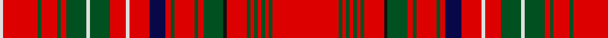

In pattern [RGRGRGRGRKGRGRGRBRWRGWGRGRGRW](/patterns/rgrgrgrgrkgrgrgrbrwrgwgrgrgrw/).

This was sourced from register-of-tartans.  It is a [29 stripes tartan](/stripes/stripes29/).

Original link https://www.tartanregister.gov.uk/tartanDetails.aspx?ref=2371

## Register references

External register numbers recorded for this tartan.

- Scottish Register of Tartans: [2371](https://www.tartanregister.gov.uk/tartanDetails.aspx?ref=2371)
- Scottish Tartans World Register: 1530

## Thread count
LN/2 R19 G2 R9 G2 R3 G11 LN2 G11 R9 LN2 R11 DB9 R3 G2 R11 G2 R3 G11 K2 R11 G2 R2 G2 R2 G2 R2 G2 R/37

## Palette
Each colour and its ΔE from the base-6 reference it is a variant of.

| Colour | Shade | Base | ΔE (OKLab) |
|---|---|---|---|
| DB | <code style="background-color:#080848;">#080848</code> `#080848` | B <code style="background-color:#2A418A;">#2A418A</code> | 0.20 |
| G | <code style="background-color:#005020;">#005020</code> `#005020` | G <code style="background-color:#006100;">#006100</code> | 0.07 |
| K | <code style="background-color:#101010;">#101010</code> `#101010` | K <code style="background-color:#000000;">#000000</code> | 0.17 |
| LN | <code style="background-color:#E0E0E0;">#E0E0E0</code> `#E0E0E0` | W <code style="background-color:#F7F7F7;">#F7F7F7</code> | 0.07 |
| R | <code style="background-color:#DC0000;">#DC0000</code> `#DC0000` | R <code style="background-color:#CC0000;">#CC0000</code> | 0.03 |

## Nearest tartans

The nearest existing variants by ΔTartan distance.

1. [MacDonald of Staffa 3](/setts/s29/r37g2r2g2r2g2r2g2r11k2g11r3g2r11g2r3b9r11w2r9g11w2g11r3g2r9g2r19w2~b000050-g008000-k000000-rc00000-we0e0e0/) — ΔT 0.59
1. [MacDonald of Staffa (Smith's)](/setts/s31/r16g1r1g1r1g1r1g1r6g1b1g6k1r1g1r4g1r1b4r4w1r4g4w1g4r1g1r6g1r8w1~b2c2c80-g006818-k101010-rc80000-wfcfcfc~x2/) — ΔT 0.62
1. [MacDonald of Staffa Clan Tartan Tartan Number: 1529. Earliest known date: 1850 This plate is taken from the manuscript of William and Andrew Smith's 'Authenticated Tartans of the Clans and Families of Scotland'. The Smith's sources included the findings of George Hunter, an Army clothier, who toured the Highlands in search of old tartans prior to 1822. See products available Copyright © Blair Urquhart, Comrie, 2015](/setts/s31/r16g1r1g1r1g1r1g1r6g1b1g6k1r1g1r4g1r1b4r4w1r4g4w1g4r1g1r6g1r8w1~b2c2c80-g006818-k101010-rc80000-we0e0e0~x2/) — ΔT 0.70
1. [MacDonald of Staffa 2](/setts/s31/r16g1r1g1r1g1r1g1r6g1b1g6k1r1g1r4g1r1b4r4w1r4g4w1g4r1g1r6g1r8w1~b304080-g008000-k000000-rc00000-we0e0e0~x2/) — ΔT 0.82
1. [MacDonald of Staffa #3](/setts/s31/r16g1r1g1r1g1r1g1r6g1b1g6b1r1g1r4g1r1b4r4w1r4g4w1g4r1g1r6g1r8w1~b2c4084-g005020-rdc0000-we0e0e0~x2/) — ΔT 0.95
1. [MacDonald of Staffa](/setts/s28/r15b1r1b1r1b1r1b1r3g3r1b1r4b1r1k2r3y1r3g2w1g2r1b1r3b1r6y1~b00004c-g004c00-k000000-rc80000-wd0d0d0-yffc800~x2/) — ΔT 1.13
1. [MacDonald of Staffa 1](/setts/s31/r16g1r1g1r1g1r1g1r6g1b1g6b1r1g1r4g1r1b4r4w1r4g4w1g4r1g1r6g1r8w1~b304080-g008000-rc00000-we0e0e0~x2/) — ΔT 1.23
1. [MacAlister (Gourlay Steele Collection)](/setts/s30/r12g3y1r2y1g3r3b3r6ba1r1g8r1ba1r12ba1r1g8r1ba1r6g2r1ba1r2ba1r1g3y1r4~b2c4084-ba3c82af-g005020-rdc0000-ye8c000~x4/) — ΔT 1.25
1. [MacAlister Modern (Lochcarron)](/setts/s25/r18b1r1g8r1b1r6w1r1ba4r1w1r2g3ga1r2ga1g3r3w1r1ba2r1w1r8~b2888c4-ba2c2c80-g006818-ga289c18-rc80000-we0e0e0~x2/) — ΔT 1.28
1. [MacDonald of Staffa](/setts/s28/r15b1r1b1r1b1r1b1r3g4r1b1r3b1r1k2r3y1r3g2ya1g2r1b1r3b1r6y1~b000052-g11450d-k000000-raa0000-yaaaa00-yaaaaaaa~x2/) — ΔT 1.35

## Neighbour map

Every grey dot is one of 15726 variants placed by the first two principal components of the ΔTartan feature space (44% of its variance). Red is this tartan; blue dots are its nearest — click one to open its page.

<svg viewBox="0 0 640 380" role="img" style="max-width:100%;height:auto;border:1px solid #e0e0e0;border-radius:4px;display:block" xmlns="http://www.w3.org/2000/svg"><image href="/nn/cloud.v1.png" width="640" height="380"/><a href="/setts/s29/r37g2r2g2r2g2r2g2r11k2g11r3g2r11g2r3b9r11w2r9g11w2g11r3g2r9g2r19w2~b000050-g008000-k000000-rc00000-we0e0e0/"><circle cx="367.0" cy="78.3" r="4" fill="#3465a4"><title>MacDonald of Staffa 3</title></circle></a><a href="/setts/s31/r16g1r1g1r1g1r1g1r6g1b1g6k1r1g1r4g1r1b4r4w1r4g4w1g4r1g1r6g1r8w1~b2c2c80-g006818-k101010-rc80000-wfcfcfc~x2/"><circle cx="350.3" cy="80.9" r="4" fill="#3465a4"><title>MacDonald of Staffa (Smith's)</title></circle></a><a href="/setts/s31/r16g1r1g1r1g1r1g1r6g1b1g6k1r1g1r4g1r1b4r4w1r4g4w1g4r1g1r6g1r8w1~b2c2c80-g006818-k101010-rc80000-we0e0e0~x2/"><circle cx="355.4" cy="82.9" r="4" fill="#3465a4"><title>MacDonald of Staffa Clan Tartan Tartan Number: 1529. Earliest known date: 1850 This plate is taken from the manuscript of William and Andrew Smith's 'Authenticated Tartans of the Clans and Families of Scotland'. The Smith's sources included the findings of George Hunter, an Army clothier, who toured the Highlands in search of old tartans prior to 1822. See products available Copyright © Blair Urquhart, Comrie, 2015</title></circle></a><a href="/setts/s31/r16g1r1g1r1g1r1g1r6g1b1g6k1r1g1r4g1r1b4r4w1r4g4w1g4r1g1r6g1r8w1~b304080-g008000-k000000-rc00000-we0e0e0~x2/"><circle cx="350.4" cy="82.1" r="4" fill="#3465a4"><title>MacDonald of Staffa 2</title></circle></a><a href="/setts/s31/r16g1r1g1r1g1r1g1r6g1b1g6b1r1g1r4g1r1b4r4w1r4g4w1g4r1g1r6g1r8w1~b2c4084-g005020-rdc0000-we0e0e0~x2/"><circle cx="368.2" cy="94.4" r="4" fill="#3465a4"><title>MacDonald of Staffa #3</title></circle></a><a href="/setts/s28/r15b1r1b1r1b1r1b1r3g3r1b1r4b1r1k2r3y1r3g2w1g2r1b1r3b1r6y1~b00004c-g004c00-k000000-rc80000-wd0d0d0-yffc800~x2/"><circle cx="352.5" cy="61.0" r="4" fill="#3465a4"><title>MacDonald of Staffa</title></circle></a><a href="/setts/s31/r16g1r1g1r1g1r1g1r6g1b1g6b1r1g1r4g1r1b4r4w1r4g4w1g4r1g1r6g1r8w1~b304080-g008000-rc00000-we0e0e0~x2/"><circle cx="372.7" cy="99.7" r="4" fill="#3465a4"><title>MacDonald of Staffa 1</title></circle></a><a href="/setts/s30/r12g3y1r2y1g3r3b3r6ba1r1g8r1ba1r12ba1r1g8r1ba1r6g2r1ba1r2ba1r1g3y1r4~b2c4084-ba3c82af-g005020-rdc0000-ye8c000~x4/"><circle cx="299.4" cy="97.5" r="4" fill="#3465a4"><title>MacAlister (Gourlay Steele Collection)</title></circle></a><a href="/setts/s25/r18b1r1g8r1b1r6w1r1ba4r1w1r2g3ga1r2ga1g3r3w1r1ba2r1w1r8~b2888c4-ba2c2c80-g006818-ga289c18-rc80000-we0e0e0~x2/"><circle cx="328.1" cy="58.9" r="4" fill="#3465a4"><title>MacAlister Modern (Lochcarron)</title></circle></a><a href="/setts/s28/r15b1r1b1r1b1r1b1r3g4r1b1r3b1r1k2r3y1r3g2ya1g2r1b1r3b1r6y1~b000052-g11450d-k000000-raa0000-yaaaa00-yaaaaaaa~x2/"><circle cx="356.5" cy="71.9" r="4" fill="#3465a4"><title>MacDonald of Staffa</title></circle></a><circle cx="368.2" cy="74.8" r="5" fill="#c00000"/></svg>

ID: /setts/s29/r37g2r2g2r2g2r2g2r11k2g11r3g2r11g2r3b9r11w2r9g11w2g11r3g2r9g2r19w2~b080848-g005020-k101010-rdc0000-we0e0e0/
