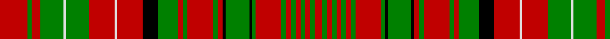

In pattern [RGRGRGRGRGKGKRGRGRGKRWRGWGRGR](/patterns/rgrgrgrgrgkgkrgrgrgkrwrgwgrgr/).

This was sourced from weddslist.  It is a [29 stripes tartan](/stripes/stripes29/).

Original link http://www.weddslist.com/cgi-bin/tartans/pg.pl?source=sts

## Thread count
R/58 G10 R18 G48 LN6 G48 R54 LN6 R54 K32 G42 R10 G10 R54 G10 R10 K6 G50 K6 G8 R54 G10 R10 G10 R10 G10 R10 G10 R/16

## Palette
Each colour and its ΔE from the base-6 reference it is a variant of.

| Colour | Shade | Base | ΔE (OKLab) |
|---|---|---|---|
| G | <code style="background-color:#008000;">#008000</code> `#008000` | G <code style="background-color:#006400;">#006400</code> | 0.09 |
| K | <code style="background-color:#000000;">#000000</code> `#000000` | K <code style="background-color:#000000;">#000000</code> | 0.00 |
| LN | <code style="background-color:#E0E0E0;">#E0E0E0</code> `#E0E0E0` | W <code style="background-color:#F4F4F0;">#F4F4F0</code> | 0.06 |
| R | <code style="background-color:#C00000;">#C00000</code> `#C00000` | R <code style="background-color:#C80000;">#C80000</code> | 0.02 |

## Nearest tartans

The nearest existing variants by ΔTartan distance.

1. [MacDonald of Staffa #2](/setts/s29/r37g6r11g32w4g18r27w3r27k16g21r5g5r27g5r5k3g25k3g4r27g5r5g5r5g5r5g5r8-g005020-k101010-rdc0000-we0e0e0/) — ΔT 0.89
1. [Bruce (VS) Clan Tartan Tartan Number: 1848. Earliest known date: 1842 The design comes from the Vestiarium Scoticum, and is approved by Lord Bruce, Earl of Elgin. Much doubt has been cast on the authority of the Vestiarium, but in this case Lord Bruce believes he has independant evidence of the tartan dating back to 1571. The original document was a chart of the weavers threadcount which is now lost. The chart included black 'guards' on the yellow and white stripes and Lord Bruce has adopted this variation as his personal tartan. Writing in 1967, Lord Bruce also states that the Elgin family also wear the Bruce of Kinnaird for 'undress' or day wear, a wholly different tartan similar to the Prince Charles Edward. See products available Copyright © Blair Urquhart, Comrie, 2015](/setts/s20/r32g8r8g24r4g24r8g8r32y4r32g8r8g24r4g24r8g8r32w4-g006818-rc80000-we0e0e0-ye8c000/) — ΔT 1.41
1. [MacDonald of Staffa 6](/setts/s40/r24b4r22g4r4g4r4g4r4g4r20g4r4k2g22k2r4g4r22g4r4b22r21w4r21g19w2g19r5g4r22g4r5g4k4r5b4r5b4r19-b304080-g008000-k000000-rc00000-we0e0e0/) — ΔT 1.50
1. [MacDougal 5](/setts/s19/k2r8g16r4g2r4b8r4w2r2w2r4g8r6g8r2k2r16w2-b304080-g008000-k000000-rc00000-we0e0e0/) — ΔT 1.50
1. [MacAlister](/setts/s30/r48g12y4r8y4g12r12b12r24ba4r4g32r4ba4r48ba4r4g32r4ba4r24g8r4ba4r8ba4r4g12y4r16-b304080-ba5480b0-g008000-rc00000-yf0c000/) — ΔT 1.54
1. [Lumsden](/setts/s39/g18r6g18r16g2r2g6r2g2r16g2r2g6r2g2r16w2r8b20r6b20r8w2r16g4r8g4r16g10r6g10r6g10y2g10r10g16w2g16-b000080-g007800-rc80000-wffffff-ye8c000/) — ΔT 1.54
1. [Lumsden Short Version](/setts/s30/r18b2r2b4r2b2r18w2r8b22r4b22r8w2r18g4r8g4r18g10r6g8r6g6y2g6r6g12w2g12-b304080-g008000-rc00000-we0e0e0-yf0c000/) — ΔT 1.55
1. [Lumsden Waistcoat](/setts/s39/g42w4g40r16g12y6g12r16g20r18g22r44g6r18g6r42w4r20b52r12b52r20w4r38g4r4g6r4g4r40g4r4g6r4g4r38g40r12g40-b304080-g008000-rc00000-we0e0e0-yf0c000/) — ΔT 1.55
1. [Scott](/setts/s18/r32g16r4g4w4g4r4g4w4g4r4g16r32k2r4g6r4k2-g008000-k000000-rc00000-we0e0e0/) — ΔT 1.56
1. [MacRae of Inverinate](/setts/s40/r46g4r6g4r6g4r10y10r10g4r6g4r6g4r46g46r10g30r10g46r46g4r6g4r6g4r10w10r10g4r6g4r6g4r46b30r10b30r10b30-b304080-g008000-rc00000-we0e0e0-yf0c000/) — ΔT 1.59

## Neighbour map

Every grey dot is one of 15726 variants placed by the first two principal components of the ΔTartan feature space (44% of its variance). Red is this tartan; blue dots are its nearest — click one to open its page.

<svg viewBox="0 0 640 380" role="img" style="max-width:100%;height:auto;border:1px solid #e0e0e0;border-radius:4px;display:block" xmlns="http://www.w3.org/2000/svg"><image href="/nn/cloud.v1.png" width="640" height="380"/><a href="/setts/s29/r37g6r11g32w4g18r27w3r27k16g21r5g5r27g5r5k3g25k3g4r27g5r5g5r5g5r5g5r8-g005020-k101010-rdc0000-we0e0e0/"><circle cx="288.2" cy="125.1" r="4" fill="#3465a4"><title>MacDonald of Staffa #2</title></circle></a><a href="/setts/s20/r32g8r8g24r4g24r8g8r32y4r32g8r8g24r4g24r8g8r32w4-g006818-rc80000-we0e0e0-ye8c000/"><circle cx="308.4" cy="179.0" r="4" fill="#3465a4"><title>Bruce (VS) Clan Tartan Tartan Number: 1848. Earliest known date: 1842 The design comes from the Vestiarium Scoticum, and is approved by Lord Bruce, Earl of Elgin. Much doubt has been cast on the authority of the Vestiarium, but in this case Lord Bruce believes he has independant evidence of the tartan dating back to 1571. The original document was a chart of the weavers threadcount which is now lost. The chart included black 'guards' on the yellow and white stripes and Lord Bruce has adopted this variation as his personal tartan. Writing in 1967, Lord Bruce also states that the Elgin family also wear the Bruce of Kinnaird for 'undress' or day wear, a wholly different tartan similar to the Prince Charles Edward. See products available Copyright © Blair Urquhart, Comrie, 2015</title></circle></a><a href="/setts/s40/r24b4r22g4r4g4r4g4r4g4r20g4r4k2g22k2r4g4r22g4r4b22r21w4r21g19w2g19r5g4r22g4r5g4k4r5b4r5b4r19-b304080-g008000-k000000-rc00000-we0e0e0/"><circle cx="288.4" cy="98.3" r="4" fill="#3465a4"><title>MacDonald of Staffa 6</title></circle></a><a href="/setts/s19/k2r8g16r4g2r4b8r4w2r2w2r4g8r6g8r2k2r16w2-b304080-g008000-k000000-rc00000-we0e0e0/"><circle cx="202.7" cy="142.8" r="4" fill="#3465a4"><title>MacDougal 5</title></circle></a><a href="/setts/s30/r48g12y4r8y4g12r12b12r24ba4r4g32r4ba4r48ba4r4g32r4ba4r24g8r4ba4r8ba4r4g12y4r16-b304080-ba5480b0-g008000-rc00000-yf0c000/"><circle cx="303.9" cy="102.6" r="4" fill="#3465a4"><title>MacAlister</title></circle></a><a href="/setts/s39/g18r6g18r16g2r2g6r2g2r16g2r2g6r2g2r16w2r8b20r6b20r8w2r16g4r8g4r16g10r6g10r6g10y2g10r10g16w2g16-b000080-g007800-rc80000-wffffff-ye8c000/"><circle cx="179.4" cy="116.9" r="4" fill="#3465a4"><title>Lumsden</title></circle></a><a href="/setts/s30/r18b2r2b4r2b2r18w2r8b22r4b22r8w2r18g4r8g4r18g10r6g8r6g6y2g6r6g12w2g12-b304080-g008000-rc00000-we0e0e0-yf0c000/"><circle cx="223.6" cy="121.6" r="4" fill="#3465a4"><title>Lumsden Short Version</title></circle></a><a href="/setts/s39/g42w4g40r16g12y6g12r16g20r18g22r44g6r18g6r42w4r20b52r12b52r20w4r38g4r4g6r4g4r40g4r4g6r4g4r38g40r12g40-b304080-g008000-rc00000-we0e0e0-yf0c000/"><circle cx="225.2" cy="101.9" r="4" fill="#3465a4"><title>Lumsden Waistcoat</title></circle></a><a href="/setts/s18/r32g16r4g4w4g4r4g4w4g4r4g16r32k2r4g6r4k2-g008000-k000000-rc00000-we0e0e0/"><circle cx="330.7" cy="117.0" r="4" fill="#3465a4"><title>Scott</title></circle></a><a href="/setts/s40/r46g4r6g4r6g4r10y10r10g4r6g4r6g4r46g46r10g30r10g46r46g4r6g4r6g4r10w10r10g4r6g4r6g4r46b30r10b30r10b30-b304080-g008000-rc00000-we0e0e0-yf0c000/"><circle cx="256.4" cy="89.9" r="4" fill="#3465a4"><title>MacRae of Inverinate</title></circle></a><circle cx="262.0" cy="135.4" r="5" fill="#c00000"/></svg>

ID: /setts/s29/r58g10r18g48w6g48r54w6r54k32g42r10g10r54g10r10k6g50k6g8r54g10r10g10r10g10r10g10r16-g008000-k000000-rc00000-we0e0e0/
