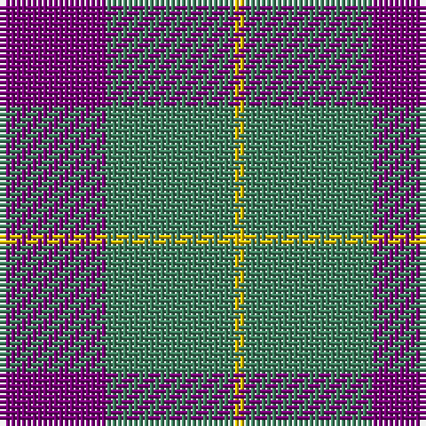

In pattern [BGY](/patterns/bgy/).

This was sourced from register-of-tartans.  It is a [3 stripes tartan](/stripes/stripes3/).

Original link https://www.tartanregister.gov.uk/tartanDetails.aspx?ref=4668

## Thread count
P/20 Ga24 Ya/2

## Palette
Each colour and its ΔE from the base-6 reference it is a variant of.

| Colour | Shade | Base | ΔE (OKLab) |
|---|---|---|---|
| DG | <code style="background-color:#003820;">#003820</code> `#003820` | G <code style="background-color:#006100;">#006100</code> | 0.15 |
| DP | <code style="background-color:#440044;">#440044</code> `#440044` | B <code style="background-color:#2A418A;">#2A418A</code> | 0.18 |
| G | <code style="background-color:#285800;">#285800</code> `#285800` | G <code style="background-color:#006100;">#006100</code> | 0.03 |
| Ga | <code style="background-color:#408060;">#408060</code> `#408060` | G <code style="background-color:#006100;">#006100</code> | 0.14 |
| P | <code style="background-color:#780078;">#780078</code> `#780078` | B <code style="background-color:#2A418A;">#2A418A</code> | 0.17 |
| Y | <code style="background-color:#D8B000;">#D8B000</code> `#D8B000` | Y <code style="background-color:#F2BF00;">#F2BF00</code> | 0.06 |
| Ya | <code style="background-color:#E8C000;">#E8C000</code> `#E8C000` | Y <code style="background-color:#F2BF00;">#F2BF00</code> | 0.02 |

# Sample pattern

## Nearest tartans

The nearest existing variants by ΔTartan distance.

1. [Sanix Large Muted](/setts/s4/b3y30b40r3x2~b304080-rc00000-yd08010/) — ΔT 1.26
1. [Wilson's, No 55](/setts/s3/g6b5ba1x4~b800080-ba5480b0-g008000/) — ΔT 1.50
1. [Hamilton, (Red)](/setts/s5/b6r1b6r9w1x2~b304080-rc00000-we0e0e0/) — ΔT 1.64
1. [Fraser of Boblainy, Hugh](/setts/s5/b1r14g7b7r1x4~b2c2c80-g006818-rc85858/) — ΔT 1.69
1. [Wcwm 9275-1394](/setts/s3/b19y1k19x8~b5c5c5c-k101010-yd09800/) — ΔT 1.74
1. [Baru](/setts/s5/b23g8b23g35w5x2~b780078-g003820-we0e0e0/) — ΔT 1.78
1. [Nebar (Corporate)](/setts/s4/r24ra11k6b4x4~b2c2c80-k101010-r888888-ra901c38/) — ΔT 1.79
1. [Ferguson - 1930 (Old)](/setts/s3/g17r2b15x2~b2c2c80-g006818-rc80000/) — ΔT 1.83
1. [Rob Roy (Film)](/setts/s6/b3g1b10g4r10b2x4~b708490-g003820-r800028/) — ΔT 1.84
1. [Wilson's No.055](/setts/s3/g6b5ba1x4~b440044-ba5c8ca8-g006818/) — ΔT 1.84

## Neighbour map

Every grey dot is one of 15726 variants placed by the first two principal components of the ΔTartan feature space (44% of its variance). Red is this tartan; blue dots are its nearest — click one to open its page.

<svg viewBox="0 0 640 380" role="img" style="max-width:100%;height:auto;border:1px solid #e0e0e0;border-radius:4px;display:block" xmlns="http://www.w3.org/2000/svg"><image href="/nn/cloud.v1.png" width="640" height="380"/><a href="/setts/s4/b3y30b40r3x2~b304080-rc00000-yd08010/"><circle cx="370.4" cy="233.2" r="4" fill="#3465a4"><title>Sanix Large Muted</title></circle></a><a href="/setts/s3/g6b5ba1x4~b800080-ba5480b0-g008000/"><circle cx="271.9" cy="306.9" r="4" fill="#3465a4"><title>Wilson's, No 55</title></circle></a><a href="/setts/s5/b6r1b6r9w1x2~b304080-rc00000-we0e0e0/"><circle cx="331.9" cy="253.5" r="4" fill="#3465a4"><title>Hamilton, (Red)</title></circle></a><a href="/setts/s5/b1r14g7b7r1x4~b2c2c80-g006818-rc85858/"><circle cx="316.5" cy="225.3" r="4" fill="#3465a4"><title>Fraser of Boblainy, Hugh</title></circle></a><a href="/setts/s3/b19y1k19x8~b5c5c5c-k101010-yd09800/"><circle cx="363.9" cy="271.6" r="4" fill="#3465a4"><title>Wcwm 9275-1394</title></circle></a><a href="/setts/s5/b23g8b23g35w5x2~b780078-g003820-we0e0e0/"><circle cx="291.5" cy="279.2" r="4" fill="#3465a4"><title>Baru</title></circle></a><a href="/setts/s4/r24ra11k6b4x4~b2c2c80-k101010-r888888-ra901c38/"><circle cx="267.2" cy="259.1" r="4" fill="#3465a4"><title>Nebar (Corporate)</title></circle></a><a href="/setts/s3/g17r2b15x2~b2c2c80-g006818-rc80000/"><circle cx="324.4" cy="311.0" r="4" fill="#3465a4"><title>Ferguson - 1930 (Old)</title></circle></a><a href="/setts/s6/b3g1b10g4r10b2x4~b708490-g003820-r800028/"><circle cx="313.2" cy="245.4" r="4" fill="#3465a4"><title>Rob Roy (Film)</title></circle></a><a href="/setts/s3/g6b5ba1x4~b440044-ba5c8ca8-g006818/"><circle cx="287.7" cy="319.2" r="4" fill="#3465a4"><title>Wilson's No.055</title></circle></a><circle cx="342.4" cy="276.8" r="5" fill="#c00000"/></svg>

ID: /setts/s3/b10g12y1x2~b780078-g408060-ye8c000/
