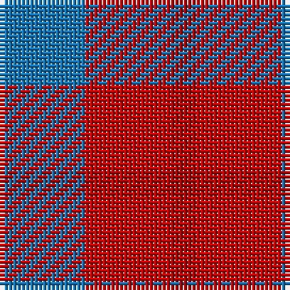

This page is one **sett** — a single exact thread-count. It belongs to the [tartan](/tartans/b10r10dr3/)
(the same proportion at any scale), whose colour order is pattern [BRR](/stripes/brr/).

Sourced from tartans-authority.  It is a [3 stripe tartan](/stripes/stripes3/).

Original link http://www.tartansauthority.com/tartan-ferret/display/7279/

## Thread count
B/20 R20 DR/6

## Palette
Each colour and the base-6 reference it is a variant of.

| Colour | Shade | Base |
|---|---|---|
| B | <code style="background-color:#1474B4;">#1474B4</code> `oklch(54.0% 0.129 245.1)` <small>#1474B4</small> | B <code style="background-color:#2A418A;">#2A418A</code> |
| DR | <code style="background-color:#AC0000;">#AC0000</code> `oklch(46.7% 0.192 29.2)` <small>#AC0000</small> | R <code style="background-color:#CC0000;">#CC0000</code> |
| R | <code style="background-color:#C80000;">#C80000</code> `oklch(52.3% 0.215 29.2)` <small>#C80000</small> | R <code style="background-color:#CC0000;">#CC0000</code> |

# Sample pattern

## Nearest tartans

The nearest existing variants by ΔTartan distance, with this tartan at the top so the swatches line up against it.

ΔTartan

Tartan

Sett

—

<a href="/ttd/edit/#slug=b10r10r3~x2">Masai Shuka 19 (Artefact)</a> <a class="nn-out" href="/setts/s3/b10r10r3~x2/" title="open its dictionary page">↗</a>

1.49

<a href="/setts/s4/dp3o1g2~x10/">Coleman, Sarah-Louise (Personal)</a>

1.74

<a href="/ttd/edit/#slug=r4db4r1g4r4~x6">MacGowan</a> <a class="nn-out" href="/setts/s5/r4db4r1g4r4~x6/" title="open its dictionary page">↗</a>

1.79

<a href="/ttd/edit/#slug=p5g4t2~x2">Wilson's, No 209</a> <a class="nn-out" href="/setts/s3/p5g4t2~x2/" title="open its dictionary page">↗</a>

1.82

<a href="/ttd/edit/#slug=r4dg4r1db4r4~x4">Gow</a> <a class="nn-out" href="/setts/s5/r4dg4r1db4r4~x4/" title="open its dictionary page">↗</a>

1.96

<a href="/ttd/edit/#slug=g2r4g2t1~x4">Wilson's No.188</a> <a class="nn-out" href="/setts/s4/g2r4g2t1~x4/" title="open its dictionary page">↗</a>

1.99

<a href="/ttd/edit/#slug=r4g2t1~x4">Wilson's, No 188</a> <a class="nn-out" href="/setts/s3/r4g2t1~x4/" title="open its dictionary page">↗</a>

2.00

<a href="/ttd/edit/#slug=r3dg3r1db3r3~x12">Gow (Portrait)</a> <a class="nn-out" href="/setts/s5/r3dg3r1db3r3~x12/" title="open its dictionary page">↗</a>

2.02

<a href="/ttd/edit/#slug=r10t5lb5dt4~x8">Haggis Hostels</a> <a class="nn-out" href="/setts/s4/r10t5lb5dt4~x8/" title="open its dictionary page">↗</a>

2.02

<a href="/ttd/edit/#slug=t2lo1r4t4w2~x10">Doohan (New South Wales), Andrew</a> <a class="nn-out" href="/setts/s5/t2lo1r4t4w2~x10/" title="open its dictionary page">↗</a>

2.03

<a href="/ttd/edit/#slug=r10t5o5n4~x8">Haggis Hostels</a> <a class="nn-out" href="/setts/s4/r10t5o5n4~x8/" title="open its dictionary page">↗</a>

## Neighbour map

Every grey dot is one of 14299 variants placed by the first two principal components of the ΔTartan feature space (44% of its variance). Red is this tartan; blue dots are its nearest — click one to open its page.

<svg viewBox="0 0 640 380" role="img" style="max-width:100%;height:auto;border:1px solid #e0e0e0;border-radius:4px;display:block" xmlns="http://www.w3.org/2000/svg"><image href="/nn/cloud.v1.png" width="640" height="380"/><a href="/setts/s4/dp3o1g2~x10/"><circle cx="195.5" cy="324.5" r="4" fill="#3465a4"><title>Coleman, Sarah-Louise (Personal)</title></circle></a><a href="/setts/s5/r4db4r1g4r4~x6/"><circle cx="239.2" cy="315.8" r="4" fill="#3465a4"><title>MacGowan</title></circle></a><a href="/setts/s3/p5g4t2~x2/"><circle cx="185.7" cy="361.2" r="4" fill="#3465a4"><title>Wilson's, No 209</title></circle></a><a href="/setts/s5/r4dg4r1db4r4~x4/"><circle cx="245.5" cy="320.3" r="4" fill="#3465a4"><title>Gow</title></circle></a><a href="/setts/s4/g2r4g2t1~x4/"><circle cx="240.3" cy="313.7" r="4" fill="#3465a4"><title>Wilson's No.188</title></circle></a><a href="/setts/s3/r4g2t1~x4/"><circle cx="308.6" cy="316.3" r="4" fill="#3465a4"><title>Wilson's, No 188</title></circle></a><a href="/setts/s5/r3dg3r1db3r3~x12/"><circle cx="240.9" cy="342.4" r="4" fill="#3465a4"><title>Gow (Portrait)</title></circle></a><a href="/setts/s4/r10t5lb5dt4~x8/"><circle cx="113.2" cy="304.5" r="4" fill="#3465a4"><title>Haggis Hostels</title></circle></a><a href="/setts/s5/t2lo1r4t4w2~x10/"><circle cx="176.0" cy="272.6" r="4" fill="#3465a4"><title>Doohan (New South Wales), Andrew</title></circle></a><a href="/setts/s4/r10t5o5n4~x8/"><circle cx="178.3" cy="344.1" r="4" fill="#3465a4"><title>Haggis Hostels</title></circle></a><circle cx="237.7" cy="338.1" r="5" fill="#c00000"/></svg>

ID: /setts/s3/b10r10r3~x2/
