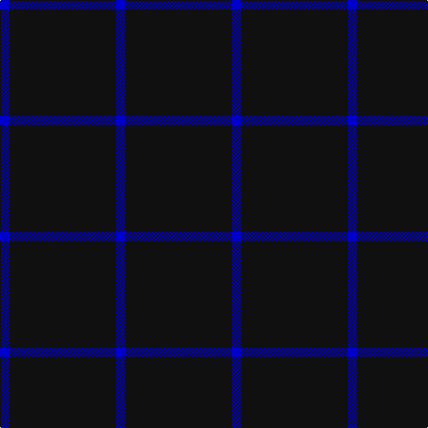

In pattern [BKB](/patterns/bkb/).

This was sourced from register-of-tartans.  It is a [3 stripes tartan](/stripes/stripes3/).

Original link https://www.tartanregister.gov.uk/tartanDetails.aspx?ref=10857

## Register references

External register numbers recorded for this tartan.

- Scottish Register of Tartans: [10857](https://www.tartanregister.gov.uk/tartanDetails.aspx?ref=10857)

## Thread count
B/10 K120 B/10

## Palette
Each colour and its ΔE from the base-6 reference it is a variant of.

| Colour | Shade | Base | ΔE (OKLab) |
|---|---|---|---|
| B | <code style="background-color:#0000CD;">#0000CD</code> `#0000CD` | B <code style="background-color:#2A418A;">#2A418A</code> | 0.14 |
| K | <code style="background-color:#101010;">#101010</code> `#101010` | K <code style="background-color:#000000;">#000000</code> | 0.17 |

# Sample pattern

## Nearest tartans

The nearest existing variants by ΔTartan distance.

1. [Loevenstein Castle 2 (Artefact)](/setts/s4/k20b1k4b3~b00008c-k000000~x4/) — ΔT 1.69
1. [Dunnotar (School)](/setts/s4/k72w3k11b9~b2c2c80-k101010-we0e0e0/) — ΔT 1.76
1. [Wallington (Corporate?)](/setts/s4/k60b3k9g7~b2888c4-g289c18-k101010/) — ΔT 2.07
1. [Freedom of Scotland](/setts/s6/k15b7k6b11k50b4~b5c5c5c-k101010~x2/) — ΔT 2.18
1. [Crombie House Check](/setts/s6/k4k12k3r7k26r3~k000030-r806050~x2/) — ΔT 2.22
1. [Elliott](/setts/s4/b16ba4b3r1~b000052-ba521510-raa0000~x2/) — ΔT 2.27
1. [Joy's Fancy, Allen (Personal)](/setts/s2/k15w1~k101010-wc0c0c0~x12/) — ΔT 2.34
1. [MacNathair Sgianach](/setts/s4/b1r1k12g1~b1c0070-g006818-k101010-rc80000~x4/) — ΔT 2.34
1. [Brooks Brothers Tattersall Blue](/setts/s5/r1b9y2b9y1~b202060-r880000-ya08858~x4/) — ΔT 2.41
1. [Gem](/setts/s4/b140r11b14y11~b202060-rc80000-ye8c000/) — ΔT 2.42

## Neighbour map

Every grey dot is one of 15726 variants placed by the first two principal components of the ΔTartan feature space (44% of its variance). Red is this tartan; blue dots are its nearest — click one to open its page.

<svg viewBox="0 0 640 380" role="img" style="max-width:100%;height:auto;border:1px solid #e0e0e0;border-radius:4px;display:block" xmlns="http://www.w3.org/2000/svg"><image href="/nn/cloud.v1.png" width="640" height="380"/><a href="/setts/s4/k20b1k4b3~b00008c-k000000~x4/"><circle cx="626.0" cy="280.3" r="4" fill="#3465a4"><title>Loevenstein Castle 2 (Artefact)</title></circle></a><a href="/setts/s4/k72w3k11b9~b2c2c80-k101010-we0e0e0/"><circle cx="626.0" cy="236.5" r="4" fill="#3465a4"><title>Dunnotar (School)</title></circle></a><a href="/setts/s4/k60b3k9g7~b2888c4-g289c18-k101010/"><circle cx="626.0" cy="236.5" r="4" fill="#3465a4"><title>Wallington (Corporate?)</title></circle></a><a href="/setts/s6/k15b7k6b11k50b4~b5c5c5c-k101010~x2/"><circle cx="563.7" cy="265.7" r="4" fill="#3465a4"><title>Freedom of Scotland</title></circle></a><a href="/setts/s6/k4k12k3r7k26r3~k000030-r806050~x2/"><circle cx="550.6" cy="283.6" r="4" fill="#3465a4"><title>Crombie House Check</title></circle></a><a href="/setts/s4/b16ba4b3r1~b000052-ba521510-raa0000~x2/"><circle cx="601.4" cy="276.1" r="4" fill="#3465a4"><title>Elliott</title></circle></a><a href="/setts/s2/k15w1~k101010-wc0c0c0~x12/"><circle cx="626.0" cy="317.6" r="4" fill="#3465a4"><title>Joy's Fancy, Allen (Personal)</title></circle></a><a href="/setts/s4/b1r1k12g1~b1c0070-g006818-k101010-rc80000~x4/"><circle cx="566.1" cy="237.7" r="4" fill="#3465a4"><title>MacNathair Sgianach</title></circle></a><a href="/setts/s5/r1b9y2b9y1~b202060-r880000-ya08858~x4/"><circle cx="542.4" cy="271.6" r="4" fill="#3465a4"><title>Brooks Brothers Tattersall Blue</title></circle></a><a href="/setts/s4/b140r11b14y11~b202060-rc80000-ye8c000/"><circle cx="614.4" cy="237.4" r="4" fill="#3465a4"><title>Gem</title></circle></a><circle cx="626.0" cy="301.6" r="5" fill="#c00000"/></svg>

ID: /setts/s3/b1k12b1~b0000cd-k101010~x10/
