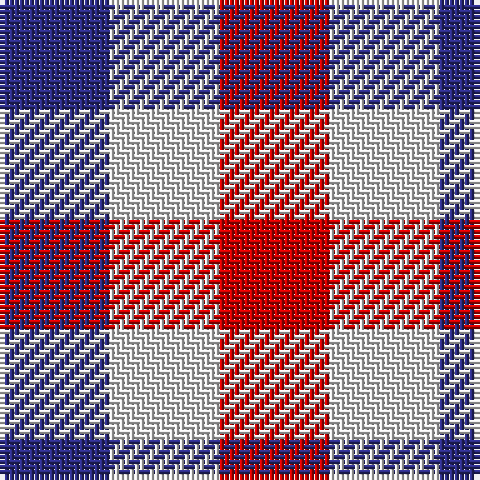

In pattern [BWR](/patterns/bwr/).

This was sourced from house-of-tartan.  It is a [3 stripes tartan](/stripes/stripes3/).

Original link http://www.house-of-tartan.scotland.net/house/TartanViewjs.asp?colr=Def&tnam=657

## Thread count
DB/22 LN22 R/22

## Palette
Each colour and its ΔE from the base-6 reference it is a variant of.

| Colour | Shade | Base | ΔE (OKLab) |
|---|---|---|---|
| DB | <code style="background-color:#2C2C80;">#2C2C80</code> `#2C2C80` | B <code style="background-color:#2A418A;">#2A418A</code> | 0.06 |
| LN | <code style="background-color:#E0E0E0;">#E0E0E0</code> `#E0E0E0` | W <code style="background-color:#F7F7F7;">#F7F7F7</code> | 0.07 |
| R | <code style="background-color:#C80000;">#C80000</code> `#C80000` | R <code style="background-color:#CC0000;">#CC0000</code> | 0.01 |

# Sample pattern

## Nearest tartans

The nearest existing variants by ΔTartan distance.

1. [Aquascutum](/setts/s3/b1w1r1~b304080-rc00000-we0e0e0~x22/) — ΔT 0.29
1. [Aquascutum](/setts/s3/b1w1r1~b2c2c80-rc80000-wfcfcfc~x22/) — ΔT 0.36
1. [Usa](/setts/s3/b1y1r1~b000052-raa0000-yaaaaaa~x4/) — ΔT 1.14
1. [Dacre Estate Check](/setts/s3/k1w1r1~k101010-r800028-wf0e0c4~x14/) — ΔT 1.27
1. [Mothers Pride](/setts/s3/r1b1y1~b304080-rc00000-yf0c000~x40/) — ΔT 1.40
1. [Coigach Tweed](/setts/s3/k1w1r1~k000000-ra43c14-wc8c8c8~x6/) — ΔT 1.73
1. [Algarve](/setts/s4/b1w1r1g1~b2c2c80-g285800-rc80000-we0e0e0~x20/) — ΔT 1.79
1. [Glen Moriston Estate Check](/setts/s3/b1w1wa1~b00243c-wd0d0d0-wad4dce0~x8/) — ΔT 1.83
1. [Hogg](/setts/s4/k1w1b1w1~b441800-k101010-we0e0e0~x8/) — ΔT 2.03
1. [Border Bell](/setts/s7/b1k1w1k1w1r1k1~b2c2c80-k101010-rc80000-wfcfcfc~x16/) — ΔT 2.48

## Neighbour map

Every grey dot is one of 15726 variants placed by the first two principal components of the ΔTartan feature space (44% of its variance). Red is this tartan; blue dots are its nearest — click one to open its page.

<svg viewBox="0 0 640 380" role="img" style="max-width:100%;height:auto;border:1px solid #e0e0e0;border-radius:4px;display:block" xmlns="http://www.w3.org/2000/svg"><image href="/nn/cloud.v1.png" width="640" height="380"/><a href="/setts/s3/b1w1r1~b304080-rc00000-we0e0e0~x22/"><circle cx="14.0" cy="366.0" r="4" fill="#3465a4"><title>Aquascutum</title></circle></a><a href="/setts/s3/b1w1r1~b2c2c80-rc80000-wfcfcfc~x22/"><circle cx="14.0" cy="366.0" r="4" fill="#3465a4"><title>Aquascutum</title></circle></a><a href="/setts/s3/b1y1r1~b000052-raa0000-yaaaaaa~x4/"><circle cx="14.0" cy="366.0" r="4" fill="#3465a4"><title>Usa</title></circle></a><a href="/setts/s3/k1w1r1~k101010-r800028-wf0e0c4~x14/"><circle cx="14.0" cy="366.0" r="4" fill="#3465a4"><title>Dacre Estate Check</title></circle></a><a href="/setts/s3/r1b1y1~b304080-rc00000-yf0c000~x40/"><circle cx="14.0" cy="366.0" r="4" fill="#3465a4"><title>Mothers Pride</title></circle></a><a href="/setts/s3/k1w1r1~k000000-ra43c14-wc8c8c8~x6/"><circle cx="14.0" cy="366.0" r="4" fill="#3465a4"><title>Coigach Tweed</title></circle></a><a href="/setts/s4/b1w1r1g1~b2c2c80-g285800-rc80000-we0e0e0~x20/"><circle cx="14.0" cy="366.0" r="4" fill="#3465a4"><title>Algarve</title></circle></a><a href="/setts/s3/b1w1wa1~b00243c-wd0d0d0-wad4dce0~x8/"><circle cx="14.0" cy="366.0" r="4" fill="#3465a4"><title>Glen Moriston Estate Check</title></circle></a><a href="/setts/s4/k1w1b1w1~b441800-k101010-we0e0e0~x8/"><circle cx="33.8" cy="366.0" r="4" fill="#3465a4"><title>Hogg</title></circle></a><a href="/setts/s7/b1k1w1k1w1r1k1~b2c2c80-k101010-rc80000-wfcfcfc~x16/"><circle cx="14.0" cy="366.0" r="4" fill="#3465a4"><title>Border Bell</title></circle></a><circle cx="14.0" cy="366.0" r="5" fill="#c00000"/></svg>

ID: /setts/s3/b1w1r1~b2c2c80-rc80000-we0e0e0~x22/
