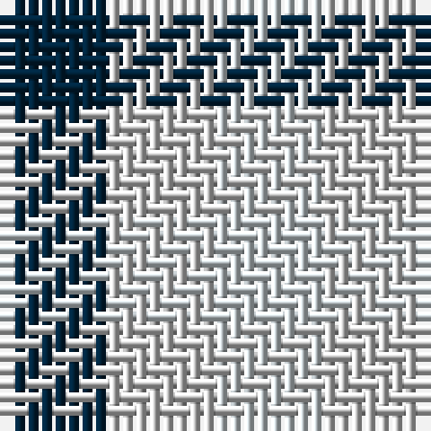

In pattern [BWW](/patterns/bww/).

This was sourced from register-of-tartans.  It is a [3 stripes tartan](/stripes/stripes3/).

Original link https://www.tartanregister.gov.uk/tartanDetails.aspx?ref=1386

## Attestations

This cloth appears in 2 source records; the oldest owns this page.

- 01/01/1840 — Glen Moriston Estate Check (register-of-tartans, [record](https://www.tartanregister.gov.uk/tartanDetails.aspx?ref=1386))
- 1840ish — Glen Moriston (Estate Check) (tartans-authority, [record](http://www.tartansauthority.com/tartan-ferret/display/7331/))

## Thread count
DN/8 N8 LN/8

## Palette
Each colour and its ΔE from the base-6 reference it is a variant of.

| Colour | Shade | Base | ΔE (OKLab) |
|---|---|---|---|
| DN | <code style="background-color:#00243C;">#00243C</code> `#00243C` | B <code style="background-color:#2A418A;">#2A418A</code> | 0.17 |
| LN | <code style="background-color:#D4DCE0;">#D4DCE0</code> `#D4DCE0` | W <code style="background-color:#F7F7F7;">#F7F7F7</code> | 0.09 |
| N | <code style="background-color:#D0D0D0;">#D0D0D0</code> `#D0D0D0` | W <code style="background-color:#F7F7F7;">#F7F7F7</code> | 0.12 |

# Sample pattern

## Nearest tartans

The nearest existing variants by ΔTartan distance.

1. [Aquascutum](/setts/s3/b1w1r1x22~b304080-rc00000-we0e0e0/) — ΔT 1.72
1. [Aquascutum](/setts/s3/b1w1r1x22~b2c2c80-rc80000-wfcfcfc/) — ΔT 1.76
1. [Aquascutum Trade Tartan Tartan Number: 657. Earliest known date: pre 2003 Named after the district in which it was found. See products available Copyright © Blair Urquhart, Comrie, 2015](/setts/s3/b1w1r1x22~b2c2c80-rc80000-we0e0e0/) — ΔT 1.83
1. [Hogg](/setts/s4/k1w1b1w1x8~b441800-k101010-we0e0e0/) — ΔT 1.95
1. [Algarve](/setts/s4/b1w1r1g1x20~b2c2c80-g285800-rc80000-we0e0e0/) — ΔT 2.10
1. [Usa](/setts/s3/b1y1r1x4~b000052-raa0000-yaaaaaa/) — ΔT 2.17
1. [Dacre Estate Check](/setts/s3/k1w1r1x14~k101010-r800028-wf0e0c4/) — ΔT 2.24
1. [Mothers Pride](/setts/s3/r1b1y1x40~b304080-rc00000-yf0c000/) — ΔT 2.37
1. [Coigach Tweed](/setts/s3/k1w1r1x6~k000000-ra43c14-wc8c8c8/) — ΔT 2.42
1. [Haig Check (Estate Check)](/setts/s8/b1w1k1w1k1w1k1w1x12~b1474b4-k101010-wfcfcfc/) — ΔT 2.55

## Neighbour map

Every grey dot is one of 15726 variants placed by the first two principal components of the ΔTartan feature space (44% of its variance). Red is this tartan; blue dots are its nearest — click one to open its page.

<svg viewBox="0 0 640 380" role="img" style="max-width:100%;height:auto;border:1px solid #e0e0e0;border-radius:4px;display:block" xmlns="http://www.w3.org/2000/svg"><image href="/nn/cloud.v1.png" width="640" height="380"/><a href="/setts/s3/b1w1r1x22~b304080-rc00000-we0e0e0/"><circle cx="14.0" cy="366.0" r="4" fill="#3465a4"><title>Aquascutum</title></circle></a><a href="/setts/s3/b1w1r1x22~b2c2c80-rc80000-wfcfcfc/"><circle cx="14.0" cy="366.0" r="4" fill="#3465a4"><title>Aquascutum</title></circle></a><a href="/setts/s3/b1w1r1x22~b2c2c80-rc80000-we0e0e0/"><circle cx="14.0" cy="366.0" r="4" fill="#3465a4"><title>Aquascutum Trade Tartan Tartan Number: 657. Earliest known date: pre 2003 Named after the district in which it was found. See products available Copyright © Blair Urquhart, Comrie, 2015</title></circle></a><a href="/setts/s4/k1w1b1w1x8~b441800-k101010-we0e0e0/"><circle cx="33.8" cy="366.0" r="4" fill="#3465a4"><title>Hogg</title></circle></a><a href="/setts/s4/b1w1r1g1x20~b2c2c80-g285800-rc80000-we0e0e0/"><circle cx="14.0" cy="366.0" r="4" fill="#3465a4"><title>Algarve</title></circle></a><a href="/setts/s3/b1y1r1x4~b000052-raa0000-yaaaaaa/"><circle cx="14.0" cy="366.0" r="4" fill="#3465a4"><title>Usa</title></circle></a><a href="/setts/s3/k1w1r1x14~k101010-r800028-wf0e0c4/"><circle cx="14.0" cy="366.0" r="4" fill="#3465a4"><title>Dacre Estate Check</title></circle></a><a href="/setts/s3/r1b1y1x40~b304080-rc00000-yf0c000/"><circle cx="14.0" cy="366.0" r="4" fill="#3465a4"><title>Mothers Pride</title></circle></a><a href="/setts/s3/k1w1r1x6~k000000-ra43c14-wc8c8c8/"><circle cx="14.0" cy="366.0" r="4" fill="#3465a4"><title>Coigach Tweed</title></circle></a><a href="/setts/s8/b1w1k1w1k1w1k1w1x12~b1474b4-k101010-wfcfcfc/"><circle cx="21.3" cy="366.0" r="4" fill="#3465a4"><title>Haig Check (Estate Check)</title></circle></a><circle cx="14.0" cy="366.0" r="5" fill="#c00000"/></svg>

ID: /setts/s3/b1w1wa1x8~b00243c-wd0d0d0-wad4dce0/
