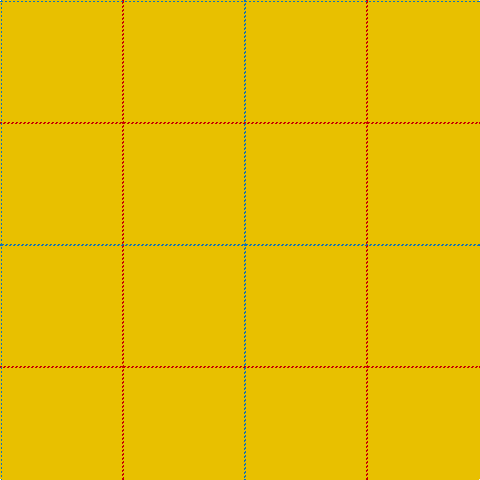

In pattern [BYR](/patterns/byr/).

This was sourced from register-of-tartans.  It is a [3 stripes tartan](/stripes/stripes3/).

Original link https://www.tartanregister.gov.uk/tartanDetails.aspx?ref=3207

## Attestations

This cloth appears in 2 source records; the oldest owns this page.

- 01/01/2006 — Nutwood (register-of-tartans, [record](https://www.tartanregister.gov.uk/tartanDetails.aspx?ref=3207))
- pre 2006 — Nutwood (District) (tartans-authority, [record](http://www.tartansauthority.com/tartan-ferret/display/7053/))

## Register references

External register numbers recorded for this tartan.

- Scottish Register of Tartans: [3207](https://www.tartanregister.gov.uk/tartanDetails.aspx?ref=3207)
- Scottish Tartans Authority (ITI): 7053

## Thread count
B/2 Y120 R/2

## Palette
Each colour and its ΔE from the base-6 reference it is a variant of.

| Colour | Shade | Base | ΔE (OKLab) |
|---|---|---|---|
| B | <code style="background-color:#1474B4;">#1474B4</code> `#1474B4` | B <code style="background-color:#2A418A;">#2A418A</code> | 0.15 |
| R | <code style="background-color:#C80000;">#C80000</code> `#C80000` | R <code style="background-color:#CC0000;">#CC0000</code> | 0.01 |
| Y | <code style="background-color:#E8C000;">#E8C000</code> `#E8C000` | Y <code style="background-color:#F2BF00;">#F2BF00</code> | 0.02 |

# Sample pattern

## Nearest tartans

The nearest existing variants by ΔTartan distance.

1. [Dutch Football (Corporate)](/setts/s4/y24r1w1b1~b003c64-rc80000-we0e0e0-ybc8c00~x11/) — ΔT 3.25
1. [Rabbie's Dram (Fashion)](/setts/s4/y60b3y4r3~b441800-ra00000-ya08858~x2/) — ΔT 3.38
1. [Manitoba District Tartan Tartan Number: 145. Earliest known date: 1962 A slight modification of the original sett. See products available Copyright © Blair Urquhart, Comrie, 2015](/setts/s8/y622r21g2ga6g41b2g2b6~b5c8ca8-g289c18-ga003820-rc80000-ye8c000/) — ΔT 3.88
1. [Kincardine Tweed](/setts/s4/r30ra1r15b4~b0000c8-r9b7a0b-rac80000/) — ΔT 4.10
1. [Dunbar of Pitgaveny](/setts/s4/r19w1r19ra1~r888888-raa00048-wfcfcfc~x2/) — ΔT 4.19
1. [Dunbar of Pitgaveny Family Tartan Tartan Number: 1634. Earliest known date: c.1815 In 1815, members of the Highland Society of London resolved to request of each of the Highland chiefs, a sample of their clan tartan. The swatches were to be signed and sealed in the chief's own hand. This sett is one of those delivered to the Society between 1815 and 1822. See products available Copyright © Blair Urquhart, Comrie, 2015](/setts/s3/r1ra19w1~ra00048-ra888888-we0e0e0~x2/) — ΔT 4.32
1. [Dunbar of Pitgaveny](/setts/s3/r1g19w1~g808080-r900030-we0e0e0~x2/) — ΔT 4.39
1. [Dunbar of Pitgaveny (Clan)](/setts/s3/r1ra19w1~ra00048-ra888888-wfcfcfc~x2/) — ΔT 4.42
1. [Lagrande](/setts/s5/g100y4g2ya3yb6~g285800-ya08858-yabc8c00-ybc4bc68~x2/) — ΔT 4.71
1. [Canadian Irish Regiment](/setts/s4/y100g26ga3r2~g604000-ga006818-rc80000-ybc8c00~x2/) — ΔT 4.81

## Neighbour map

Every grey dot is one of 15726 variants placed by the first two principal components of the ΔTartan feature space (44% of its variance). Red is this tartan; blue dots are its nearest — click one to open its page.

<svg viewBox="0 0 640 380" role="img" style="max-width:100%;height:auto;border:1px solid #e0e0e0;border-radius:4px;display:block" xmlns="http://www.w3.org/2000/svg"><image href="/nn/cloud.v1.png" width="640" height="380"/><a href="/setts/s4/y24r1w1b1~b003c64-rc80000-we0e0e0-ybc8c00~x11/"><circle cx="626.0" cy="191.1" r="4" fill="#3465a4"><title>Dutch Football (Corporate)</title></circle></a><a href="/setts/s4/y60b3y4r3~b441800-ra00000-ya08858~x2/"><circle cx="626.0" cy="228.8" r="4" fill="#3465a4"><title>Rabbie's Dram (Fashion)</title></circle></a><a href="/setts/s8/y622r21g2ga6g41b2g2b6~b5c8ca8-g289c18-ga003820-rc80000-ye8c000/"><circle cx="626.0" cy="83.9" r="4" fill="#3465a4"><title>Manitoba District Tartan Tartan Number: 145. Earliest known date: 1962 A slight modification of the original sett. See products available Copyright © Blair Urquhart, Comrie, 2015</title></circle></a><a href="/setts/s4/r30ra1r15b4~b0000c8-r9b7a0b-rac80000/"><circle cx="626.0" cy="229.2" r="4" fill="#3465a4"><title>Kincardine Tweed</title></circle></a><a href="/setts/s4/r19w1r19ra1~r888888-raa00048-wfcfcfc~x2/"><circle cx="626.0" cy="275.4" r="4" fill="#3465a4"><title>Dunbar of Pitgaveny</title></circle></a><a href="/setts/s3/r1ra19w1~ra00048-ra888888-we0e0e0~x2/"><circle cx="626.0" cy="259.9" r="4" fill="#3465a4"><title>Dunbar of Pitgaveny Family Tartan Tartan Number: 1634. Earliest known date: c.1815 In 1815, members of the Highland Society of London resolved to request of each of the Highland chiefs, a sample of their clan tartan. The swatches were to be signed and sealed in the chief's own hand. This sett is one of those delivered to the Society between 1815 and 1822. See products available Copyright © Blair Urquhart, Comrie, 2015</title></circle></a><a href="/setts/s3/r1g19w1~g808080-r900030-we0e0e0~x2/"><circle cx="626.0" cy="258.4" r="4" fill="#3465a4"><title>Dunbar of Pitgaveny</title></circle></a><a href="/setts/s3/r1ra19w1~ra00048-ra888888-wfcfcfc~x2/"><circle cx="626.0" cy="249.3" r="4" fill="#3465a4"><title>Dunbar of Pitgaveny (Clan)</title></circle></a><a href="/setts/s5/g100y4g2ya3yb6~g285800-ya08858-yabc8c00-ybc4bc68~x2/"><circle cx="626.0" cy="169.7" r="4" fill="#3465a4"><title>Lagrande</title></circle></a><a href="/setts/s4/y100g26ga3r2~g604000-ga006818-rc80000-ybc8c00~x2/"><circle cx="604.6" cy="170.6" r="4" fill="#3465a4"><title>Canadian Irish Regiment</title></circle></a><circle cx="626.0" cy="211.3" r="5" fill="#c00000"/></svg>

ID: /setts/s3/b1y60r1~b1474b4-rc80000-ye8c000~x2/
